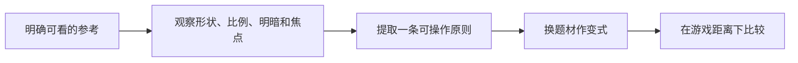

---
{
  "id": "A01",
  "prerequisites": [],
  "revisit": [],
  "memory": [
    "ART01",
    "ART02",
    "TH01"
  ],
  "labs": []
}
---
# A01｜美术对话：把唯美、卡通说具体

**今天做什么：** 写一张能指导AI和素材选择的五维风格卡。

**从哪里开始：** 从自己提供的参考中选一个可见特征，说出借鉴与不借鉴什么。

**现成材料：** 本课讨论，无需新建工程。

**材料边界：** 参考分析，无软件Lab门槛；没有图不捏造作品内容。

先观察或猜一猜，动手试一项，再说说为什么。完全陌生可以先看一个小示范；做完当前小步就可以暂停。

### 开始对话

```text
我在学A01《美术对话：把唯美、卡通说具体》，请按这份教案带我自学。
一次只推进一个有意义的小步，先用现成材料，不先替我作判断。
我可以查菜单/API、看示范或请AI实现；学到的因果关系要由我说明。
课程里的备用题按需选，不要全部变作业；伙伴分享一次就够了。
```

<details data-audience="reference">
<summary>需要时看：解释、对照与候选练习</summary>

## 学到这里就够了

**M｜需要会判断和应用：**
- `A01.M1` 用轮廓、比例、色彩、光照、表面五类词描述偏好。
- `A01.M2` 给出保留项、排除项和一个可检查的视觉目标。

**K｜知道用途，用到再查：**
- `A01.K1` Stylized、Painterly、Toon/Cel、Diorama是检索方向，不是互斥标准。

**停止线：** 不要求素描基础、艺术史和完整建模；不把艺术家名字当唯一提示词。

**前置：** 无

## 必要解释

唯美是感受，不是一个可直接复现的参数。可细化为圆润大形、略夸张比例、受控色盘、柔和暖光、少量手绘质感；同时说清不要写实毛孔、不要油亮塑料、不要拥挤小细节。

本课程把童趣绘本、柔软玩具、漫画明暗、低多边形微缩景作为比较方向，不声称它们是标准分类或所有孩子都喜欢。你提到的卡梅拉先保留为童趣绘本参考词，具体作品对应仍应由实际样图确认。

本项目默认面向固定或有限镜头的风格化3D小游戏：温暖、唯美、卡通、低写实、配色清楚。镜头是构图工具，不要求玩家持续自由环绕；美术生产以优质资产套装的选择、拼装、二开和统一为主，从零建模与原创复杂动画不是主线门槛。A01仍训练把个人偏好拆成可观察规则；默认风格只是本项目的起始方向，可被实际参考图修正。



这是因果／职责示意，不是实际运行截图；不能显示Mermaid时用等价方框图。

## 在现成实验里试

**初始条件：** 同一小屋的四张原创或有展示许可的风格卡；统一机位和物体摆放，只改表达方式。没有图片时用带明确示意标签的形状与色块，不伪称大师原作。
**可比较的条件：** 风格卡切换；轮廓圆/直、比例常规/夸张、色彩低/高饱和、明暗柔和/分块、细节少/多标签选择。

下面说明要比较的关系；实际从上面的现成文件与首步进入，不为匹配教学控件名重新搭建。

1. 先选最喜欢和最不喜欢的一张，每张给一个可见原因，不只说好看。
2. 把喜欢的一张拆成五维风格卡；再选一张反例写不要什么。
3. 把小屋换成路牌，用同一张卡说明哪些规则仍保持。

**观察：** 显示选择对应的可观察描述，不根据偏好打审美分。风格卡只约束目标，不自动保证生成质量。
**不符时先查：** 反例：提示词只有大师名+高质量+卡通，生成风格漂移；补可观察特征与排除项。
**恢复：** 清空标签选择但保留喜欢/不喜欢的理由；便于第二次比较。

只比较一个条件，恢复后再试下一个。课堂模拟应标清示意，真实软件行为需要实际观察；缺文件如实说明，不让学员临时重造系统。

### 软件入口与亲调

- 无必会软件操作；先会观察和写风格卡。
- 会定位：参考板、对照图片、缩略图。
- 按需查：风格词英文拼写和软件实现方法。

|选中哪里／参数|只改什么|看什么|
|---|---|---|
|参考板/风格卡（设计内容）|选一个圆润程度与一个比例原则|能否用它区分两种候选，而不只说更好看|
|色板和缩略预览（设计工具入口）|减少互相竞争的高对比颜色|星星与背景是否有清楚主次|

运行中临时改动不等于已保存；要留下设计选择，请在自己的副本中写回场景／资源，保存并重新打开检查。

## 我负责什么，AI帮什么

**我的判断：** 自己选参考中借鉴与不借鉴的特征，把感受译成可观察要求。
**可交给AI：** 把用户已提供参考拆成形状、比例、颜色、光照、表面候选描述，不猜未见图片。
**检查重点：** 检查AI是否臆测图像内容、复制独特角色，或把个人偏好说成所有孩子都喜欢。

结果不符：说清预期、实际与复现步骤；先提出一个可推翻的原因，再做最小验证。修改前留基线，不删需求或测试来消除报错。

## 怎样知道这一小步做到了

- 对同一小屋的两份示意方案指出可见差异，分别用五维词汇表达。
- 写两项保留、一项排除和一个观察目标，再把规则用于路牌。

**恢复后再检查：** 风格仍允许看清路径与拾取物，不用高复杂度效果作为入门前提。

有提示也是学习进展；没有实际观察就不宣称已经验证。一个对照和解释可以覆盖多个要点，不要求填写评分表。

## 候选问题

先自己判断，再按需看反馈。P是预测、D是诊断、T是迁移、K是用途；按本次需要选一题，不要求全部完成。教学情境不是实测日志。

### A01-P1

把所有材质变鲜艳就一定是卡通吗？

### A01-D2

【教学构造情境，不是真实测量或某模型故障统计】你要求柔和绘本小屋，AI给出圆润但油亮的玩具屋。当前只有这张实际结果图；参考图还没提供。你会让AI猜大师风格，还是补哪项可见差异？给一句保留/修改/不照搬的指令。

### A01-T3

同风格做一棵树，如何不依赖复制原角色？

### A01-K4

Painterly大致用于搜什么？

</details>

## 这一课要记在脑海里

- 感受要落到可见特征。
- 喜欢与不喜欢都要描述。
- 风格规则比堆艺术家名字更可执行。
- 本项目先固定“温暖、风格化、低写实”的方向，再用实际参考细化，不靠抽卡决定画风。

**记忆清单：** [ART01](../memory.md#art01) · [ART02](../memory.md#art02) · [TH01](../memory.md#th01)。先遮住解释，用自己的话说，再举例；不是照抄定义。

## 讲给爸爸听

在今天的关键地方或结束时，选一次和爸爸分享。用自己的话讲讲：轮廓、比例、视觉目标。

**给他演示：** 做小小美术导演：从已有参考选一项借鉴、一项不借鉴，并指给爸爸看。

**你们一起问：** 另一张图也很漂亮，为什么不一定适合我们的同一个世界？

爸爸还有问题就接着问，你也可以问爸爸。一起看、一起试，不必背稿、打分或填表。爸爸暂时不在就稍后分享，不影响继续自学。

<details data-purpose="project">
<summary>需要改自己的作品时再看</summary>

**生产阶段：** P0

**想得到的结果：** 一张能指导同一庭院制作的一页风格卡，而不是一串艺术家名字。
**必须保留：** 小型单机收集玩法、主要游戏观察距离和温暖卡通方向保持；不增加世界观。

先读取自己的工作副本。以下是可选局部实现，不是打开现成实验的前置，也不要求再做一整轮：

- 先把我给的参考或文字拆成形状、比例、色彩、光照、表面五栏；我先选一项喜欢与一项不要的特征，再完善风格卡，不生成整张场景。
- 用同一个庭院入口比较两种风格描述，只保留我选定的一个方向。

**采用依据：** 我能指出一条喜欢的可见特征和一条明确不要的特征。
**换一个场景想想：** 新来一张不同风格的参考，指出哪些原则可借鉴、哪些不适用庭院。

参考工程的通过结论不自动覆盖你改过的版本；相关路线实际走一遍，必要时恢复。

</details>

## 下次怎样想起来

前面已学过的复现入口：无，直接开始。
隔一段时间不看答案，再解释本课的一项关键关系；换一个对象或条件应用。记住词也要会用，API和菜单位置可以查。疑问笔记可选，没有笔记也仍有公共必记清单。

## 依据

- [Roman Klco / Polygon Runway：风格化3D作品与课程](https://polygonrunway.com/)
- [Grant Abbitt：Blender造型与图形设计](https://www.gabbitt.co.uk/)
- [The Walt Disney Family Museum：Mary Blair展览资料](https://www.waltdisney.org/mary-blair)
- [Godot运行检查与可见碰撞工具](https://docs.godotengine.org/en/stable/tutorials/scripting/debug/overview_of_debugging_tools.html)

技术来源支持概念边界；课程顺序与任务是本项目设计，不代表已经证明学习效果。
