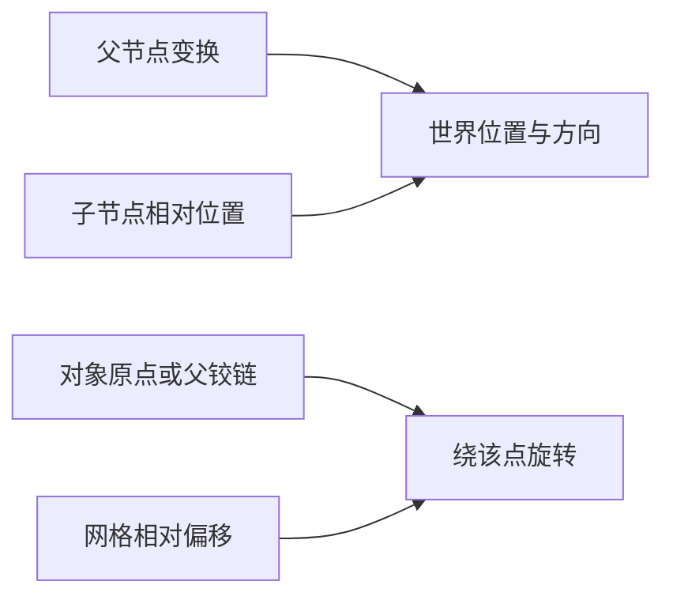

---
{
  "id": "A02",
  "prerequisites": [],
  "revisit": [],
  "memory": [
    "KN01",
    "KN02",
    "TH02"
  ],
  "labs": [
    "practice/godot/scenes/lab.tscn"
  ]
}
---
# A02｜空间入门：位置、旋转、缩放

**先从这里开始：** 你想让方块换个位置、转个方向，还是变个大小？先选一种变化，保留原样作比较。暂时不认识参数名也能开始。

**今天做什么：** 把一个方块改成三种指定状态，能说明改了哪类参数。

**从哪里开始：** 固定父空间，只改对象Position的一个轴，再恢复。

**现成材料：** [lab.tscn](../../practice/godot/scenes/lab.tscn)

**材料边界：** 空间子实验；不一次操作所有模式。

先试当前这一小步。可以说“给我线索”“示范一小步”或“直接解释”；也可以指认、画图或演示，不必长篇回答。可以暂停，不必先答对才求助。

### 开始对话

```text
我在学A02《空间入门：位置、旋转、缩放》，请按这份教案带我自学。
先用“先从这里开始”进入当前任务，一次只推进一小步；等我回应后再展开提示或解释。
我可以查菜单/API、看示范或请AI实现；学到的因果关系要由我说明。
课程里的备用题按需选，不要全部变作业；伙伴分享一次就够了。
```

<details data-audience="reference">
<summary>需要时看：解释、对照与候选练习</summary>

**带学提醒（按当前需要使用）：** 入口与轴向完全陌生时示范一种操作，再让学员选另一种。可以指着起点和终点表达，不把英文拼写、鼠标熟练程度当空间理解。

## 学到这里就够了

**M｜需要会判断和应用：**
- `A02.M1` 辨认世界坐标轴，区分屏幕方向和世界方向。
- `A02.M2` 选择Position/Rotation/Scale完成目标并恢复初值。

**K｜知道用途，用到再查：**
- `A02.K1` Gizmo是可视化操作柄；快捷键用时查。

**停止线：** 不教矩阵、四元数、任意角度坐标计算；父子空间留到A07。

**前置：** 无

## 必要解释

Position回答在哪里，Rotation回答朝哪里，Scale回答相对原模型放大多少。Scale=1不是宽1米；换一个原始尺寸不同的Mesh，实际大小仍会不同。

本课用Godot的Y向上约定。移动相机只改变你从哪里看，不改变世界轴。Blender的Z向上到资产课再对照，不要求此刻记住所有软件约定。



这是因果／职责示意，不是实际运行截图；不能显示Mermaid时用等价方框图。

## 在现成实验里试

**初始条件：** 世界轴带XYZ文字；非对称方块放在(0,1,0)，旋转0，缩放(1,1,1)；机位固定。
**可比较的条件：** 位置X/Z为-3到3、Y为0到3；绕Y角度-90到90度；单轴缩放0.5到2；观察相机按钮。

下面说明要比较的关系；实际从上面的现成文件与首步进入，不为匹配教学控件名重新搭建。

1. 先预测：只改Y位置会改变高度还是大小？写一句话再操作。
2. 只改位置，再恢复；只改旋转，再恢复；只改X缩放，比较宽度与位置。
3. 转动观察相机，再沿世界X移动；指出屏幕上的投影方向为什么变了。

**观察：** 同时显示参数和物体；保留初始轮廓作对照。位置变化不能偷偷改模型尺寸；旋转轴必须可见。
**不符时先查：** 故障卡：目标是升高方块，程序却增大Scale Y。学员只允许改一组参数修复。
**恢复：** 恢复物体全部变换和机位；第一次预测保留，实验状态清空。

只比较一个条件，恢复后再试下一个。课堂模拟应标清示意，真实软件行为需要实际观察；缺文件如实说明，不让学员临时重造系统。

### 软件入口与亲调

- Godot：选中节点、Inspector/Transform、3D视口的移动旋转缩放。
- 会定位：框选目标、重置属性。
- 按需查：快捷键、网格步长、坐标数学。

|选中哪里／参数|只改什么|看什么|
|---|---|---|
|Godot Inspector > Transform（内置）|先只改Position Y，再还原；然后单独改Scale X|物体相对地面的高度和宽度，而不是屏幕上的左右|
|Blender Item > Transform（内置）|核对本软件竖直轴；把位置与Dimensions/Scale分开看|Scale为1是否真的意味着目标尺寸|

运行中临时改动不等于已保存；要留下设计选择，请在自己的副本中写回场景／资源，保存并重新打开检查。

## 我负责什么，AI帮什么

**我的判断：** 先决定要改变位置、朝向还是大小，再选参数；不让AI自行重定义目标。
**可交给AI：** 准备带XYZ标记的台阶对照和可撤销变换；报告改的是相机还是物体。
**检查重点：** 检查AI是否把屏幕方向当世界方向、把Blender轴约定直接套到Godot。

结果不符时，先指出预期与实际的一处差别。有解释就试着验证；没有解释可请AI定位入口、给线索或示范。只改可恢复副本，不删需求或测试来掩盖错误。

## 怎样知道这一小步做到了

- 旋转观察视角后沿标记世界轴移动，指出世界方向未随屏幕改变。
- 让台阶升高且厚度不变，记录前后变换并恢复；不要求手算坐标。

**恢复后再检查：** 相机仍能看见地面，地面和其他对象未被误改。

有提示也是学习进展；没有实际观察就不宣称已经验证。一个对照和解释可以覆盖多个要点，不要求填写评分表。

## 候选问题

先自己判断，再按需看反馈。P是预测、D是诊断、T是迁移、K是用途；按本次需要选一题，不要求全部完成。教学情境不是实测日志。

### A02-P1

方块底部和顶部一起向上，厚度保持。只改位置、旋转、缩放中的哪类？给一个能与拉长区分的观察。

### A02-D2

【教学构造情境，不是真实测量或某模型故障统计】目标是台阶整体升高且厚度不变。AI给了新截图，看起来更高；记录显示位置未变、Y缩放由1变2。你保留还是撤回？只改哪类参数，怎样确认厚度和底部的位置？

### A02-T3

把宝箱放到高台上且尺寸不变，你改什么、检查什么？

### A02-K4

Gizmo解决什么问题？

<details>
<summary>可选补充题：替换本次练习，不叠加作业</summary>

### KN01-P｜预测

转动相机后，世界 +X 会跟着相机改变吗？

### KN01-T｜迁移

换一个观察角度后，还能直接把屏幕右方当成世界 +X 吗？怎样用一个动作验证？

### KN02-P｜预测

宽2的网格Scale X=3，在无父级缩放时宽多少？

</details>

</details>

## 这一课要记在脑海里

- 先问改位置、朝向还是大小。
- Scale是倍率，不是米数。
- 屏幕方向不等于世界方向。

**记忆清单：** [KN01](../memory.md#kn01) · [KN02](../memory.md#kn02) · [TH02](../memory.md#th02)。用到时先想一项；想不起可看例子，再换个条件。不要求逐字背诵。

## 讲给爸爸听

想分享时，可以先展示今天的一处选择、发现或仍没想通的问题，不要求完整讲课。用自己的话讲讲：位置、旋转、缩放。

**给他演示：** 做庭院搬家师：把一个方块放到指定位置，只改一个量，再恢复。

**你们一起问：** 镜头换方向后，屏幕右边还一定是世界的同一方向吗？怎样验证？

爸爸还有问题就接着问，你也可以问爸爸。一起看、一起试，不必背稿、打分或填表。爸爸暂时不在就稍后分享，不影响继续自学。

<details data-purpose="project">
<summary>需要改自己的作品时再看</summary>

**生产阶段：** P1

**想得到的结果：** 同一方块成为入口旁的低台阶，能指出改了位置、旋转还是尺寸。
**必须保留：** 地面、相机和坐标约定保持不变；对象变换不等于编辑网格。

先读取自己的工作副本。以下是可选局部实现，不是打开现成实验的前置，也不要求再做一整轮：

- 只提供一个方块、可观察的轴和相机；先让我改变位置，暂不加角色。
- 固定位置再分别改变旋转和尺度；让我区别观察视角与物体本身变化。

**采用依据：** 同一物体位置变化有数值与画面对照，且我能恢复。
**换一个场景想想：** 把台阶换成路牌，目标改为转朝玩家；解释为什么不应移动全部顶点。

参考工程的通过结论不自动覆盖你改过的版本；相关路线实际走一遍，必要时恢复。

</details>

## 下次怎样想起来

前面已学过的复现入口：无，直接开始。
下次碰到相似问题时，可先回想一项关系，再查需要的解释；想不起就补一个小例子，不重学整课。暂停时愿意就留“下次从哪里接着试”，没有笔记也能继续，API和菜单仍可查。

## 依据

- [Godot Node3D：变换与父空间](https://docs.godotengine.org/en/stable/classes/class_node3d.html)
- [Godot运行检查与可见碰撞工具](https://docs.godotengine.org/en/stable/tutorials/scripting/debug/overview_of_debugging_tools.html)

技术来源支持概念边界；课程顺序与任务是本项目设计，不代表已经证明学习效果。
