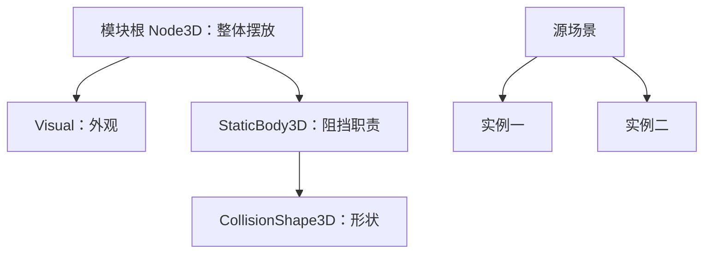

---
{
  "id": "A03",
  "prerequisites": [
    "A02"
  ],
  "revisit": [
    "A02"
  ],
  "memory": [
    "KN05",
    "KN20",
    "KN26",
    "TH02"
  ],
  "labs": [
    "practice/godot/labs/scene_nodes/starter.tscn",
    "practice/godot/labs/scene_nodes/broken.tscn"
  ]
}
---
# A03｜场景、节点与实例：先搭灰盒

**今天做什么：** 把两个模块放进灰盒，替换一个外观而不破坏其结构职责。

**从哪里开始：** 打开现成starter，选中模块整体和外观子节点分别观察；再另存副本改一项。

**现成材料：** [starter.tscn](../../practice/godot/labs/scene_nodes/starter.tscn)、[broken.tscn](../../practice/godot/labs/scene_nodes/broken.tscn)

**材料边界：** A03节点课程的真实起点和故障对照；先操作starter，再按需看reference，不从零搭场景。

先观察或猜一猜，动手试一项，再说说为什么。完全陌生可以先看一个小示范；做完当前小步就可以暂停。

### 开始对话

```text
我在学A03《场景、节点与实例：先搭灰盒》，请按这份教案带我自学。
一次只推进一个有意义的小步，先用现成材料，不先替我作判断。
请把“这次多看一层”融入当前任务，替换重复讲解或备用题，不新增一轮作业。
我可以查菜单/API、看示范或请AI实现；学到的因果关系要由我说明。
课程里的备用题按需选，不要全部变作业；伙伴分享一次就够了。
```

## 这次多看一层

**先感受分工，不先学架构名词。** 今天仍然只做原来的外观替换。动手前先说：“这次我希望什么变、什么不变？”试过以后，在实际场景树里指出外观和另一个功能部分，不只指着画面说“这里”。

把同一比较换到另一份实例：外形相似就代表内部职责相同吗？先预测，再只检查当前已经认识的节点和功能标记。物理能否通过留到A04实测，不把标记当碰撞证据。

**给AI的引导：** 初次可示范一个节点的职责，再让学习者判断另一个；不要让孩子凭空发明结构，不提前讲ECS、继承体系或内存。练后请孩子用自己的话说明一次“不该跟着变的东西”，再回到创作。本段复用本课M与原对照，不另计分；这份具体经验会在B08用于比较“外观改变”和“内部状态改变”。

<details data-audience="reference">
<summary>需要时看：解释、对照与候选练习</summary>

## 学到这里就够了

**M｜需要会判断和应用：**
- `A03.M1` 识别节点职责，区分场景资源与场景实例。
- `A03.M2` 选择整体或外观节点操作，并验收AI改动范围。

**K｜知道用途，用到再查：**
- `A03.K1` Grid/Snap用于对齐；目标平台限制后续画面选择。

**停止线：** 不建组件框架，不展开物理系统；碰撞此刻只认识为另一种职责。

**前置：** [A02](A02.md)

## 必要解释

Node是承担职责的对象；Scene保存一组节点及关系，Instance是使用它的一份实例。外观、碰撞、控制可以分属不同节点。

灰盒用简单体块验证空间，不是低质量成品。先确定一个桌面单机目标，保留能运行的基线；AI不应为了换外观删掉功能节点。



这是因果／职责示意，不是实际运行截图；不能显示Mermaid时用等价方框图。

## 在现成实验里试

**初始条件：** 树中有Module父节点、Visual子节点和只读功能标记；两份实例同屏；右侧显示选中节点。
**可比较的条件：** 选择父/子、移动X=-2到2、替换Box/Sphere外观、显示树、恢复。

下面说明要比较的关系；实际从上面的现成文件与首步进入，不为匹配教学控件名重新搭建。

1. 选父节点移动，看整组变化；恢复后只移动Visual，比较功能标记。
2. 在一份实例修改位置，检查另一份的位置；不在这一步展开共享材质。
3. 让AI提议换外观，学员先圈定允许改动的节点，再核对修改前后。

**观察：** 树节点和场景选中状态同步；父变换与外观偏移分别显示。Web结构标记不是实际碰撞测试。
**不符时先查：** 故障：外观被移动，功能标记留在原地；修复应恢复子偏移后移动整体，而不是删标记。
**恢复：** 整体与外观偏移都复位；保留修改清单供复盘。

只比较一个条件，恢复后再试下一个。课堂模拟应标清示意，真实软件行为需要实际观察；缺文件如实说明，不让学员临时重造系统。

### 软件入口与亲调

- Godot：Scene树、Inspector、实例添加、F5/F6的用途。
- 会定位：FileSystem与Remote树。
- 按需查：继承场景高级选项、所有节点类。

|选中哪里／参数|只改什么|看什么|
|---|---|---|
|Godot Scene树与Inspector（内置）|分别选模块根和Visual改Position|哪些子对象跟随，哪些没有跟随|
|Godot网格吸附（内置入口）|用统一间距摆两个实例|整体连接处是否错位，是否误改共享源|

运行中临时改动不等于已保存；要留下设计选择，请在自己的副本中写回场景／资源，保存并重新打开检查。

## 我负责什么，AI帮什么

**我的判断：** 圈定可改的Visual与不可删的功能节点，并选择整体移动还是外观偏移。
**可交给AI：** 实例化两个模块、显示层级、提供最小外观替换与差异清单。
**检查重点：** 检查AI是否删除整个实例来替换外观，或把所有实例误当独立资源副本。

结果不符：说清预期、实际与复现步骤；先提出一个可推翻的原因，再做最小验证。修改前留基线，不删需求或测试来消除报错。

## 怎样知道这一小步做到了

- 指出同一场景资源的两份实例，单独移动其中一份且另一份位置不变。
- 换一个外观并检查功能标记位置；发现只移动Visual时能恢复再移动模块根。

**恢复后再检查：** 原场景入口可打开；另一个实例和功能包装仍在。

有提示也是学习进展；没有实际观察就不宣称已经验证。一个对照和解释可以覆盖多个要点，不要求填写评分表。

## 候选问题

先自己判断，再按需看反馈。P是预测、D是诊断、T是迁移、K是用途；按本次需要选一题，不要求全部完成。教学情境不是实测日志。

### A03-P1

同一围栏场景有两份实例。只移动实例甲的根节点，甲的外观和功能标记以及乙的位置各应怎样变化？

### A03-D2

【教学构造情境，不是真实测量或某模型故障统计】AI把围栏Visual移到右边，功能标记留在原地。候选修法是移动整个模块、删除标记、继续移动Visual。怎样先恢复一个可比较基线，再得到整组右移？

### A03-T3

将路牌方块换成球体但保持交互位置，你会怎样组织？

### A03-K4

网格吸附有何用途？

<details>
<summary>可选补充题：替换本次练习，不叠加作业</summary>

### KN05-P｜预测

同一颗星星要复用5次，复制5份脚本还是实例化场景更适合？

### KN20-P｜预测

AI同时改了多个系统才不报错，你能直接认定问题修好吗？至少还看什么？

</details>

</details>

## 这一课要记在脑海里

- 换外观不等于换功能。
- 改AI代码前保留基线。
- 选对节点再调参数。

**记忆清单：** [KN05](../memory.md#kn05) · [KN20](../memory.md#kn20) · [KN26](../memory.md#kn26) · [TH02](../memory.md#th02)。先遮住解释，用自己的话说，再举例；不是照抄定义。

## 讲给爸爸听

在今天的关键地方或结束时，选一次和爸爸分享。用自己的话讲讲：节点职责、场景、实例。

**给他演示：** 做角色装配师：指出角色整体与外观，演示只改外观和移动整体的区别。

**你们一起问：** 换一个角色外观，哪些职责必须保持不变？

爸爸还有问题就接着问，你也可以问爸爸。一起看、一起试，不必背稿、打分或填表。爸爸暂时不在就稍后分享，不影响继续自学。

<details data-purpose="project">
<summary>需要改自己的作品时再看</summary>

**生产阶段：** P1

**想得到的结果：** 两份模块实例能独立摆放，换一个外观不删掉原功能。
**必须保留：** 原项目入口、其他场景与功能节点保持；只读懂职责，不先搭通用架构。

先读取自己的工作副本。以下是可选局部实现，不是打开现成实验的前置，也不要求再做一整轮：

- 只展示一个围栏模块的节点树和一份实例；让我指出应该选哪层移动整体。
- 放第二个实例，只改其位置，再做一次只换外观不删功能的检查。

**采用依据：** 我移动整体后外观与功能部分仍一起移动。
**换一个场景想想：** 用同一包装换成邮箱外观，判断应修改哪层。

参考工程的通过结论不自动覆盖你改过的版本；相关路线实际走一遍，必要时恢复。

</details>

## 下次怎样想起来

前面已学过的复现入口：[A02](A02.md)。
隔一段时间不看答案，再解释本课的一项关键关系；换一个对象或条件应用。记住词也要会用，API和菜单位置可以查。疑问笔记可选，没有笔记也仍有公共必记清单。

## 依据

- [Godot Node3D：变换与父空间](https://docs.godotengine.org/en/stable/classes/class_node3d.html)
- [Godot Resources：共享和引用](https://docs.godotengine.org/en/stable/tutorials/scripting/resources.html)
- [Godot运行检查与可见碰撞工具](https://docs.godotengine.org/en/stable/tutorials/scripting/debug/overview_of_debugging_tools.html)

技术来源支持概念边界；课程顺序与任务是本项目设计，不代表已经证明学习效果。
