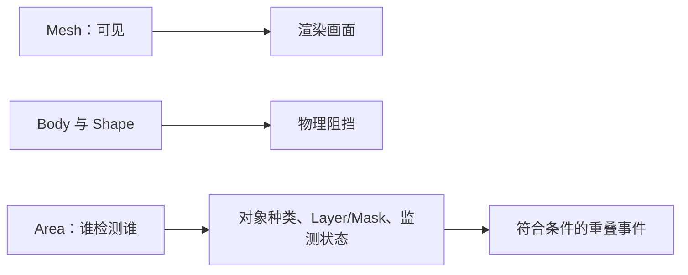

---
{
  "id": "A04",
  "prerequisites": [
    "A03"
  ],
  "revisit": [
    "A03"
  ],
  "memory": [
    "KN06",
    "KN07",
    "TH03"
  ],
  "labs": [
    "practice/godot/labs/collision_roles_lab.tscn"
  ]
}
---
# A04｜看得见、挡得住、能检测是三回事

**今天做什么：** 用三个开关找出穿墙或检测失败的原因，恢复最小正确配置。

**从哪里开始：** 把角色目标移到墙另一侧，分别切换外观和阻挡；复位后再切检测角色/装饰。

**现成材料：** [collision_roles_lab.tscn](../../practice/godot/labs/collision_roles_lab.tscn)

**材料边界：** 真实Area与物理；改Mask后让角色或白色装饰重新进入，分别验证谁被检测。不是只由M1替M2。

先观察或猜一猜，动手试一项，再说说为什么。完全陌生可以先看一个小示范；做完当前小步就可以暂停。

### 开始对话

```text
我在学A04《看得见、挡得住、能检测是三回事》，请按这份教案带我自学。
一次只推进一个有意义的小步，先用现成材料，不先替我作判断。
我可以查菜单/API、看示范或请AI实现；学到的因果关系要由我说明。
课程里的备用题按需选，不要全部变作业；伙伴分享一次就够了。
```

<details data-audience="reference">
<summary>需要时看：解释、对照与候选练习</summary>

## 学到这里就够了

**M｜需要会判断和应用：**
- `A04.M1` 区分Mesh、物理阻挡和Area重叠检测。
- `A04.M2` 按谁检测谁选择Layer/Mask和简单形状。

**K｜知道用途，用到再查：**
- `A04.K1` 凸/凹形状是不同物理近似，按用途查。

**停止线：** 不教碰撞算法和位运算；不考完整信号系统。

**前置：** [A03](A03.md)

## 必要解释

可见Mesh决定样子；碰撞形状决定物理系统使用的边界。隐藏外观不会自动禁用碰撞。Area用于检测重叠，不是实体墙。

Layer说明对象属于哪些类，Mask说明本次检测关注哪些类。例：玩家在第2层，星星Mask勾第2层。界面层号与脚本位值不能混说，初级不考换算。



这是因果／职责示意，不是实际运行截图；不能显示Mermaid时用等价方框图。

## 在现成实验里试

**初始条件：** 有外观墙、简单方盒碰撞、可穿过的星星检测区；玩家属于第2层；测试记录只显示进入是否发生。
**可比较的条件：** 墙外观开关、墙Shape开关、星星检测层第1/2层；每次只开放一种错误。

下面说明要比较的关系；实际从上面的现成文件与首步进入，不为匹配教学控件名重新搭建。

1. 先预测隐藏墙后能否通过；隐藏、移动、恢复。
2. 保持外观只禁用Shape，再移动、恢复。
3. 把星星Mask从第2层改第1层，比较检测日志，再恢复正确对象过滤。

**观察：** 三列显示可见/被阻挡/检测事件；不可把HTML中预设答案冒充真实物理检测。
**不符时先查：** 只注入一个错误：Mask遗漏玩家层。学员应指明检测者，而不是把所有层全部勾上。
**恢复：** 还原外观、Shape、Mask和对象位置；清空事件日志防止旧记录误读。

只比较一个条件，恢复后再试下一个。课堂模拟应标清示意，真实软件行为需要实际观察；缺文件如实说明，不让学员临时重造系统。

### 软件入口与亲调

- Godot：CollisionShape3D的Shape/Disabled、Collision Layer/Mask。
- 会定位：运行时可见碰撞形状、Area Monitoring。
- 按需查：复杂网格碰撞生成、物理服务器细节。

|选中哪里／参数|只改什么|看什么|
|---|---|---|
|CollisionShape3D > Disabled（内置）|恢复基线后只切换一次Disabled|阻挡消失与隐藏Mesh的结果是否不同|
|Area3D > Collision Mask（内置）|按玩家实际所属层勾选，不背位掩码数字|玩家进入和错误对象进入是否得到不同结果|

运行中临时改动不等于已保存；要留下设计选择，请在自己的副本中写回场景／资源，保存并重新打开检查。

## 我负责什么，AI帮什么

**我的判断：** 明确谁检测谁、哪些对象应该被排除，只改一个检测条件。
**可交给AI：** 准备可见形状、对象层说明和原始重叠记录，不把所有层全打开。
**检查重点：** 检查AI是否用外观代替物理形状、误解Layer/Mask或扩大检测范围掩盖问题。

结果不符：说清预期、实际与复现步骤；先提出一个可推翻的原因，再做最小验证。修改前留基线，不删需求或测试来消除报错。

## 怎样知道这一小步做到了

- 分别隐藏墙外观与禁用墙形状，预测和验证阻挡差异并恢复。
- 只让玩家触发区域，装饰球不触发；用界面层名解释，不要求位运算。

**恢复后再检查：** 恢复后墙继续阻挡；检测区不变成实体障碍。

有提示也是学习进展；没有实际观察就不宣称已经验证。一个对照和解释可以覆盖多个要点，不要求填写评分表。

## 候选问题

先自己判断，再按需看反馈。P是预测、D是诊断、T是迁移、K是用途；按本次需要选一题，不要求全部完成。教学情境不是实测日志。

### A04-P1

先只隐藏墙Visual、形状保留；恢复后只禁用墙形状、Visual保留。两次看到什么、能否通过？区分观察与阻挡。

### A04-D2

【教学构造情境，不是真实测量或某模型故障统计】玩家在第2层，装饰球在第3层。星星区域两者都能穿过，只有装饰球产生记录；形状、monitoring已确认正常。AI建议把区域变成实体墙。你先核对谁的Mask，如何同时验证该触发和不该触发的对象？

### A04-T3

树叶需要和每片叶子同样复杂的碰撞吗？

### A04-K4

复杂凸形状什么时候值得查？

<details>
<summary>可选补充题：替换本次练习，不叠加作业</summary>

### KN06-P｜预测

隐藏墙Mesh，保留碰撞体，人能通过吗？

### KN06-T｜迁移

做树叶时是否每片叶子都要精确碰撞？按玩法说明。

### KN07-P｜预测

玩家在第2层；Area想检测它，至少该在Mask勾哪层？

</details>

</details>

## 这一课要记在脑海里

- 外观、阻挡、检测分别检查。
- Mask按检测方向配置。
- 简单形状先满足玩法。

**记忆清单：** [KN06](../memory.md#kn06) · [KN07](../memory.md#kn07) · [TH03](../memory.md#th03)。先遮住解释，用自己的话说，再举例；不是照抄定义。

## 讲给爸爸听

在今天的关键地方或结束时，选一次和爸爸分享。用自己的话讲讲：外观、阻挡、检测。

**给他演示：** 做隐形墙侦探：分别预测并测试只隐藏外观、只关闭阻挡，再说明谁检测谁。

**你们一起问：** 透明门和发光的收集圈，为什么不能只看外观判断它们会不会挡住角色？

爸爸还有问题就接着问，你也可以问爸爸。一起看、一起试，不必背稿、打分或填表。爸爸暂时不在就稍后分享，不影响继续自学。

<details data-purpose="project">
<summary>需要改自己的作品时再看</summary>

**生产阶段：** P1/P2

**想得到的结果：** 墙负责阻挡，区域只负责检测；仅选定对象触发。
**必须保留：** 玩家控制器与墙位置固定；不能通过全选所有层或删除碰撞需求修复。

先读取自己的工作副本。以下是可选局部实现，不是打开现成实验的前置，也不要求再做一整轮：

- 先只用一堵墙和一个可碰撞测试角色，准备外观Visible与Shape禁用两个独立入口。
- 再加入只检测的区域，故意错设一个Mask并按谁检测谁修复。

**采用依据：** 隐藏外观仍挡住，禁用碰撞后可通过，我能恢复。
**换一个场景想想：** 换成树：决定树干和树冠是否要碰撞，按玩法给理由。

参考工程的通过结论不自动覆盖你改过的版本；相关路线实际走一遍，必要时恢复。

</details>

## 下次怎样想起来

前面已学过的复现入口：[A03](A03.md)。
隔一段时间不看答案，再解释本课的一项关键关系；换一个对象或条件应用。记住词也要会用，API和菜单位置可以查。疑问笔记可选，没有笔记也仍有公共必记清单。

## 依据

- [Godot Area3D：重叠检测与信号](https://docs.godotengine.org/en/stable/classes/class_area3d.html)
- [Godot CharacterBody3D：速度、落地与移动](https://docs.godotengine.org/en/stable/classes/class_characterbody3d.html)
- [Godot运行检查与可见碰撞工具](https://docs.godotengine.org/en/stable/tutorials/scripting/debug/overview_of_debugging_tools.html)

技术来源支持概念边界；课程顺序与任务是本项目设计，不代表已经证明学习效果。
