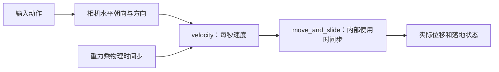

---
{
  "id": "A05",
  "prerequisites": [
    "A04"
  ],
  "revisit": [
    "A03"
  ],
  "memory": [
    "KN08",
    "TH03"
  ],
  "labs": [
    "practice/godot/labs/motion_lab.tscn",
    "practice/godot/scenes/main.tscn"
  ]
}
---
# A05｜走与跑：输入、速度和时间

**今天做什么：** 获得稳定的走跑速度，并用相同时长验证而不是靠感觉猜。

**从哪里开始：** 在现成运动Lab只改速度，比较相同时间位移；再在主游戏检查直走/斜走。

**现成材料：** [motion_lab.tscn](../../practice/godot/labs/motion_lab.tscn)、[main.tscn](../../practice/godot/scenes/main.tscn)

**材料边界：** Lab是简化运动模型；真实控制器、帧率差异与碰撞在提供的主游戏副本和实际运行条件中检查。

先观察或猜一猜，动手试一项，再说说为什么。完全陌生可以先看一个小示范；做完当前小步就可以暂停。

### 开始对话

```text
我在学A05《走与跑：输入、速度和时间》，请按这份教案带我自学。
一次只推进一个有意义的小步，先用现成材料，不先替我作判断。
我可以查菜单/API、看示范或请AI实现；学到的因果关系要由我说明。
课程里的备用题按需选，不要全部变作业；伙伴分享一次就够了。
```

<details data-audience="reference">
<summary>需要时看：解释、对照与候选练习</summary>

## 学到这里就够了

**M｜需要会判断和应用：**
- `A05.M1` 用输入动作表达意图，选择走跑参数。
- `A05.M2` 区分速度与位移，检查时间步误用和斜向增速。

**K｜知道用途，用到再查：**
- `A05.K1` 渲染帧率和物理tick不是同一个量。

**停止线：** 不背for语法、不推积分；不自己编写测试框架。

**前置：** [A04](A04.md)

## 必要解释

速度表示每秒移动多少，位移表示已经移动多少。直接累计位置时要正确考虑时间；Godot4的move_and_slide使用velocity并内部处理物理时间，不能再随手给速度乘一次delta。

WASD只是输入绑定，动作名称才表达意图。比较直走和斜走时固定时长，避免同时按两个方向导致斜向无意加速。



这是因果／职责示意，不是实际运行截图；不能显示Mermaid时用等价方框图。

## 在现成实验里试

**初始条件：** 直线标尺、方向键、walk=4、run=7，固定2秒测试；示意模拟标明不是Godot执行。
**可比较的条件：** 走速2到6、跑速6到10；直走/斜走；30/60物理采样演示；错误时间开关仅教师控制。

下面说明要比较的关系；实际从上面的现成文件与首步进入，不为匹配教学控件名重新搭建。

1. 先估计2秒走路与跑步谁更远；点击计时测试。
2. 只改变模拟采样频率，不改速度，比较距离。
3. 用相同时长比较直走和斜走，再读取归一化开关的效果。

**观察：** 显示时长、目标速度、实际距离和误差；示意计算与真实引擎测试明确分开。
**不符时先查：** 故障卡：velocity先乘delta再送move_and_slide。给定前后距离记录，要求识别重复时间处理，不要求重写脚本。
**恢复：** 速度、位置、计时和错误开关复位；不改变输入绑定。

只比较一个条件，恢复后再试下一个。课堂模拟应标清示意，真实软件行为需要实际观察；缺文件如实说明，不让学员临时重造系统。

### 软件入口与亲调

- Godot：Input Map动作、Inspector暴露的walk_speed/run_speed。
- 会定位：物理处理函数和输出日志。
- 按需查：按键事件API、计时测试代码。

|选中哪里／参数|只改什么|看什么|
|---|---|---|
|玩家脚本导出变量（自定义）|walk_speed从记录基线略调，再固定路线试走|到目标所需时间和转向控制感|
|玩家脚本导出变量（自定义）|单独调run_speed，不同时改相机FOV|跑步是否确实更快且不会越过目标|

运行中临时改动不等于已保存；要留下设计选择，请在自己的副本中写回场景／资源，保存并重新打开检查。

## 我负责什么，AI帮什么

**我的判断：** 选择走跑目标并判断测量能否归因，不接受未经解释的乘60补偿。
**可交给AI：** 提供Input Map最小绑定和同时间距离测试，暴露速度而不是要求背循环。
**检查重点：** 检查API版本、重复delta、斜向加速；这些是要测试的风险，不是某模型必然失败。

结果不符：说清预期、实际与复现步骤；先提出一个可推翻的原因，再做最小验证。修改前留基线，不删需求或测试来消除报错。

## 怎样知道这一小步做到了

- 修改一个输入绑定并分别试走与跑，选择速度且保存原值。
- 同一路径相同时长比较直向/斜向及两种物理采样条件，解释允许的离散误差。

**恢复后再检查：** 墙仍阻挡玩家；停止输入后行为符合本课设定；其他对象未移动。

有提示也是学习进展；没有实际观察就不宣称已经验证。一个对照和解释可以覆盖多个要点，不要求填写评分表。

## 候选问题

先自己判断，再按需看反馈。P是预测、D是诊断、T是迁移、K是用途；按本次需要选一题，不要求全部完成。教学情境不是实测日志。

### A05-P1

在无遮挡平面、无加速的教学条件下，走速4、跑速7，同测2秒。预期谁更远？为什么改物理采样次数不应让总距离直接翻倍？

### A05-D2

【教学构造情境，不是真实测量或某模型故障统计】教学记录：目标4单位/秒，无遮挡平面走2秒；30次/秒物理更新得到约0.27单位，60次/秒约0.13单位。AI建议统一把速度乘60。你提出一个假设和一项检查；怎样避免只在一个频率下碰巧正确？

### A05-T3

给手柄加移动，什么要保持一致？

### A05-K4

高FPS是否保证物理tick同样高？

<details>
<summary>可选补充题：替换本次练习，不叠加作业</summary>

### KN08-P｜预测

speed=4时写velocity.x=4*delta再move_and_slide，哪里可能错？可以查文档后解释。

### KN08-T｜迁移

一个无碰撞的装饰物要匀速漂移，直接每帧加同一段位移能否保证每秒同样远？怎样验证？

</details>

</details>

## 这一课要记在脑海里

- 先看每秒还是每帧。
- 不要无条件到处乘delta。
- 测同一时长再比速度。

**记忆清单：** [KN08](../memory.md#kn08) · [TH03](../memory.md#th03)。先遮住解释，用自己的话说，再举例；不是照抄定义。

## 讲给爸爸听

在今天的关键地方或结束时，选一次和爸爸分享。用自己的话讲讲：输入意图、速度、位移。

**给他演示：** 做公平赛跑裁判：相同时间比较走和跑的距离，并检查斜走有没有额外变快。

**你们一起问：** 两台设备画面帧率不同，怎样判断角色移动仍然公平？

爸爸还有问题就接着问，你也可以问爸爸。一起看、一起试，不必背稿、打分或填表。爸爸暂时不在就稍后分享，不影响继续自学。

<details data-purpose="project">
<summary>需要改自己的作品时再看</summary>

**生产阶段：** P2

**想得到的结果：** 走与跑有可感知差异，斜向没有不合理加速；调整速度不改变关卡尺寸。
**必须保留：** 地面碰撞、相机、出生点和场景比例保持；不增加体力条或动画状态机。

先读取自己的工作副本。以下是可选局部实现，不是打开现成实验的前置，也不要求再做一整轮：

- 沿用已可碰撞的场地，先只接四向走路并暴露walk_speed；别同时加动画与跑步。
- 再加入跑步输入和run_speed，保持角色/场地尺度不变做对照。

**采用依据：** 固定测试时段和路线得到位移记录，斜向不无故更快。
**换一个场景想想：** 把直线目标换成绕两根柱子，重新判断速度是否舒服。

参考工程的通过结论不自动覆盖你改过的版本；相关路线实际走一遍，必要时恢复。

</details>

## 下次怎样想起来

前面已学过的复现入口：[A03](A03.md)。
隔一段时间不看答案，再解释本课的一项关键关系；换一个对象或条件应用。记住词也要会用，API和菜单位置可以查。疑问笔记可选，没有笔记也仍有公共必记清单。

## 依据

- [Godot CharacterBody3D：速度、落地与移动](https://docs.godotengine.org/en/stable/classes/class_characterbody3d.html)
- [Godot运行检查与可见碰撞工具](https://docs.godotengine.org/en/stable/tutorials/scripting/debug/overview_of_debugging_tools.html)
- [Godot CharacterBody3D：velocity与物理delta](https://docs.godotengine.org/en/stable/classes/class_characterbody3d.html)

技术来源支持概念边界；课程顺序与任务是本项目设计，不代表已经证明学习效果。
