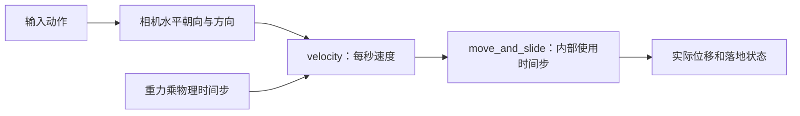

---
{
  "id": "A06",
  "prerequisites": [
    "A05"
  ],
  "revisit": [
    "A05",
    "A04"
  ],
  "memory": [
    "KN09",
    "TH03"
  ],
  "labs": [
    "practice/godot/labs/motion_lab.tscn",
    "practice/godot/scenes/main.tscn"
  ]
}
---
# A06｜跳跃：调手感而不是背公式

**今天做什么：** 调出能上目标平台的跳跃，并排除空中无限起跳。

**从哪里开始：** 固定重力只改起跳速度，按跳跃观察；用“仅回到起点”重播对照。

**现成材料：** [motion_lab.tscn](../../practice/godot/labs/motion_lab.tscn)、[main.tscn](../../practice/godot/scenes/main.tscn)

**材料边界：** 恢复全部初值会复位参数和控件，重播保留参数；边缘/墙边真实落地仍在主游戏检查。

先观察或猜一猜，动手试一项，再说说为什么。完全陌生可以先看一个小示范；做完当前小步就可以暂停。

### 开始对话

```text
我在学A06《跳跃：调手感而不是背公式》，请按这份教案带我自学。
一次只推进一个有意义的小步，先用现成材料，不先替我作判断。
我可以查菜单/API、看示范或请AI实现；学到的因果关系要由我说明。
课程里的备用题按需选，不要全部变作业；伙伴分享一次就够了。
```

<details data-audience="reference">
<summary>需要时看：解释、对照与候选练习</summary>

## 学到这里就够了

**M｜需要会判断和应用：**
- `A06.M1` 固定一项参数比较起跳速度、重力对轨迹的影响。
- `A06.M2` 用落地条件限制跳跃，验收落地、边缘和重复输入。

**K｜知道用途，用到再查：**
- `A06.K1` 容错跳跃、贴地、台阶处理是额外方案。

**停止线：** 不做通用爬楼梯，不要求抛物线推导和物理求解器。

**前置：** [A05](A05.md)

## 必要解释

在简化恒定重力模型中，提高起跳速度通常使最高点更高；固定起跳速度而增大重力，会更快落回且最高点更低。先一次改一个量，别同时把两项乱调。

Grounded是物理移动得到的状态，不是肉眼看到脚靠近地面。台阶和斜坡是不同需求，角色能跳不代表自动会爬台阶。



这是因果／职责示意，不是实际运行截图；不能显示Mermaid时用等价方框图。

## 在现成实验里试

**初始条件：** 胶囊、地面、0.8高平台；参考起跳8、重力24；实时标记Grounded。
**可比较的条件：** 起跳6到10、重力16到32、跳跃按钮、重复按键；平台高度只在迁移时改。

下面说明要比较的关系；实际从上面的现成文件与首步进入，不为匹配教学控件名重新搭建。

1. 预测增大重力后轨迹；测试并记录最高点和时间。
2. 恢复重力只改起跳，比较平台可达性。
3. 空中连续按跳跃、边缘落下再按，观察起跳条件。

**观察：** 显示离地、最高点、落地标记；模拟结果只用于因果学习，真实碰撞仍需引擎验证。
**不符时先查：** 故障卡：取消Grounded判断。不得通过禁用跳跃功能修复；应恢复条件。
**恢复：** 恢复平台、速度、重力、位置和落地状态；清空轨迹。

只比较一个条件，恢复后再试下一个。课堂模拟应标清示意，真实软件行为需要实际观察；缺文件如实说明，不让学员临时重造系统。

### 软件入口与亲调

- Godot：暴露的jump_velocity/gravity；测试按钮。
- 会定位：is_on_floor使用位置、floor相关属性。
- 按需查：coyote time、floor_snap和台阶方案。

|选中哪里／参数|只改什么|看什么|
|---|---|---|
|玩家导出jump_velocity（自定义）|固定gravity，只调整起跳初速度|是否越过平台边缘、最高点和落地点|
|玩家导出gravity（自定义）|恢复起跳值，再单独调重力|滞空时间、落地节奏；本课不求公式|

运行中临时改动不等于已保存；要留下设计选择，请在自己的副本中写回场景／资源，保存并重新打开检查。

## 我负责什么，AI帮什么

**我的判断：** 先区分规则错误和手感偏好；只改变起跳或重力中的一项。
**可交给AI：** 生成最高点/落地状态记录和重复输入测试，不强加爬楼梯系统。
**检查重点：** 检查AI是否把脚接近地面误当已落地、无限重设竖直速度或偷偷移动平台。

结果不符：说清预期、实际与复现步骤；先提出一个可推翻的原因，再做最小验证。修改前留基线，不删需求或测试来消除报错。

## 怎样知道这一小步做到了

- 固定起跳改重力，再恢复；比较轨迹与平台可达性，不背公式。
- 离地后重复按跳跃及落地后再跳，解释允许条件并保持功能。

**恢复后再检查：** 走跑和墙碰撞未退化；坠落恢复策略保持。

有提示也是学习进展；没有实际观察就不宣称已经验证。一个对照和解释可以覆盖多个要点，不要求填写评分表。

## 候选问题

先自己判断，再按需看反馈。P是预测、D是诊断、T是迁移、K是用途；按本次需要选一题，不要求全部完成。教学情境不是实测日志。

### A06-P1

使用恒定重力参考跳跃，起跳速度不变。只增大向下重力时，最高点和回落时间怎样变化？说明一个需保持的比较条件。

### A06-D2

【教学构造情境，不是真实测量或某模型故障统计】单次跳跃高度合适，空中再次按键会重新向上冲；AI建议重力翻倍让角色更快落地。你先修什么规则？用哪两次输入检验修复没有取消正常跳跃？

### A06-T3

平台变高后怎样调且避免过头？

### A06-K4

容错跳跃是什么需求？

<details>
<summary>可选补充题：替换本次练习，不叠加作业</summary>

### KN09-P｜预测

重力变大而起跳速度不变，理想情况下跳得更高还是更低？

### KN09-T｜迁移

斜坡能走而台阶卡住，为什么不能直接断言引擎已自动支持爬楼梯？需要另做什么验收？

</details>

</details>

## 这一课要记在脑海里

- 一次只改一项手感参数。
- 接近地面不等于已经落地。
- 不靠删除功能来排错。

**记忆清单：** [KN09](../memory.md#kn09) · [TH03](../memory.md#th03)。先遮住解释，用自己的话说，再举例；不是照抄定义。

## 讲给爸爸听

在今天的关键地方或结束时，选一次和爸爸分享。用自己的话讲讲：起跳速度、重力、落地条件。

**给他演示：** 做跳跃设计师：固定一个参数比较轨迹，再试落地前重复按跳跃。

**你们一起问：** 想跳得更高与想在空中更久，是不是同一个目标？怎样分别比较？

爸爸还有问题就接着问，你也可以问爸爸。一起看、一起试，不必背稿、打分或填表。爸爸暂时不在就稍后分享，不影响继续自学。

<details data-purpose="project">
<summary>需要改自己的作品时再看</summary>

**生产阶段：** P2

**想得到的结果：** 低平台可到达；跳跃高度与滞空可调，落地规则稳定。
**必须保留：** walk_speed、平台尺寸、相机不变；不做通用爬楼梯、二段跳或复杂容错系统。

先读取自己的工作副本。以下是可选局部实现，不是打开现成实验的前置，也不要求再做一整轮：

- 沿用走跑，先只允许落地时起跳，暴露起跳速度与重力；不加入二段跳。
- 固定一个参数只改另一个，对同一低平台比较最高点和滞空。

**采用依据：** 起跳、落地与空中再次按键行为符合限定规则。
**换一个场景想想：** 同高度平台改为更远，区分该改横向速度、起跳还是布局。

参考工程的通过结论不自动覆盖你改过的版本；相关路线实际走一遍，必要时恢复。

</details>

## 下次怎样想起来

前面已学过的复现入口：[A05](A05.md)、[A04](A04.md)。
隔一段时间不看答案，再解释本课的一项关键关系；换一个对象或条件应用。记住词也要会用，API和菜单位置可以查。疑问笔记可选，没有笔记也仍有公共必记清单。

## 依据

- [Godot CharacterBody3D：速度、落地与移动](https://docs.godotengine.org/en/stable/classes/class_characterbody3d.html)
- [Godot运行检查与可见碰撞工具](https://docs.godotengine.org/en/stable/tutorials/scripting/debug/overview_of_debugging_tools.html)

技术来源支持概念边界；课程顺序与任务是本项目设计，不代表已经证明学习效果。
