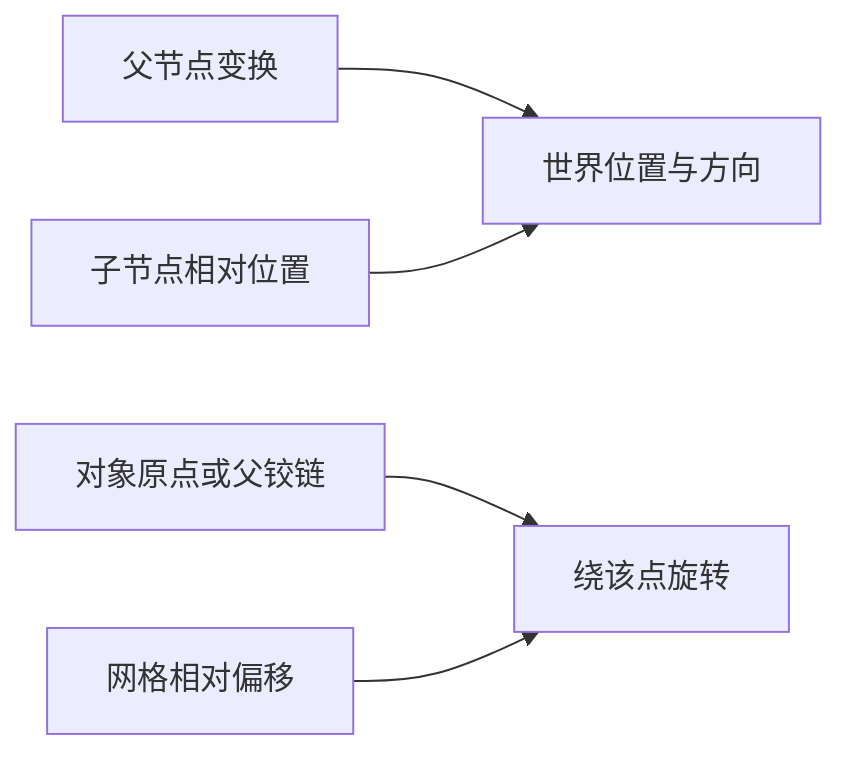

---
{
  "id": "A07",
  "prerequisites": [
    "A02",
    "A03"
  ],
  "revisit": [
    "A02"
  ],
  "memory": [
    "KN03",
    "KN04",
    "TH02"
  ],
  "labs": [
    "practice/godot/scenes/lab.tscn",
    "practice/blender/transform_origin_lab.blend"
  ]
}
---
# A07｜相对谁：父空间、自身方向和门轴

**今天做什么：** 预测三个移动方向，并把门的旋转中心改到铰链。

**从哪里开始：** 任选门轴实验，闭门位置相同，再分别观察中心/侧边旋转。

**现成材料：** [lab.tscn](../../practice/godot/scenes/lab.tscn)、[transform_origin_lab.blend](../../practice/blender/transform_origin_lab.blend)

**材料边界：** Godot与Blender坐标轴不同，按文件实际轴观察，不背同一个轴名。

先观察或猜一猜，动手试一项，再说说为什么。完全陌生可以先看一个小示范；做完当前小步就可以暂停。

### 开始对话

```text
我在学A07《相对谁：父空间、自身方向和门轴》，请按这份教案带我自学。
一次只推进一个有意义的小步，先用现成材料，不先替我作判断。
我可以查菜单/API、看示范或请AI实现；学到的因果关系要由我说明。
课程里的备用题按需选，不要全部变作业；伙伴分享一次就够了。
```

<details data-audience="reference">
<summary>需要时看：解释、对照与候选练习</summary>

## 学到这里就够了

**M｜需要会判断和应用：**
- `A07.M1` 区分父相对位置、物体自身方向和世界方向。
- `A07.M2` 保持关闭时门板位置不变，只改变支点比较旋转。

**K｜知道用途，用到再查：**
- `A07.K1` Origin是对象原点；工具Pivot可临时选择别处，二者不必一致。

**停止线：** 不手算旋转矩阵，不讲骨骼绑定；不把Local一词笼统当成所有局部含义。

**前置：** [A02](A02.md)、[A03](A03.md)

## 必要解释

Godot的position相对父节点；物体自身轴由自己的朝向决定。改position.x与沿自己车头移动不一定相同。global_position描述世界位置。

门板围绕父Node3D转动时，父节点可充当铰链，门板相对它偏移。Blender改工具Pivot并不必然改变导出资产的Origin。



这是因果／职责示意，不是实际运行截图；不能显示Mermaid时用等价方框图。

## 在现成实验里试

**初始条件：** 父节点绕Y转90度，子物体再转45度；三组轴标World/Parent/Object。门板宽2、高2.5，初始角0。
**可比较的条件：** 三种移动按钮每次一步；父角度0/90、子角度0/45；门角0/45/90；中心轴/侧边轴。

下面说明要比较的关系；实际从上面的现成文件与首步进入，不为匹配教学控件名重新搭建。

1. 先用轴箭头预测World、Parent、Object +X各往哪里；各从同一起点测试。
2. 先把父角度归零，再恢复90度，观察哪些方向跟着变。
3. 让两扇门在关闭时重合，只换轴，打开到90度并标记固定的边。

**观察：** 显示父相对与世界坐标；说明移动步长采用世界单位还是父单位，方向实验固定Scale=1。门轴切换不得混入门板起始位置变化。
**不符时先查：** 故障：门绕中心转；保持门板关闭时外观位置，调整父支点和子偏移。
**恢复：** 恢复角度、位置和门板关闭状态；轴标签保留。

只比较一个条件，恢复后再试下一个。课堂模拟应标清示意，真实软件行为需要实际观察；缺文件如实说明，不让学员临时重造系统。

### 软件入口与亲调

- Godot：场景树选父/子，Transform与局部/全局操作柄。
- Blender会定位：Object Origin、Transform Pivot Point。
- 按需查：改变原点的方法、Basis/Quaternion API。

|选中哪里／参数|只改什么|看什么|
|---|---|---|
|Godot Node3D父子Transform（内置）|改支点位置，同时调整门板相对位置|关门外观是否不变、开门时铰链侧是否固定|
|Blender Origin与工具Pivot（概念/入口）|分别确认对象原点与本次操作支点|是否只改变工具操作方式，却没有改变导出后的门轴|

运行中临时改动不等于已保存；要留下设计选择，请在自己的副本中写回场景／资源，保存并重新打开检查。

## 我负责什么，AI帮什么

**我的判断：** 指定参照空间与应固定的门边，不把临时工具Pivot当资产原点。
**可交给AI：** 搭好中心轴和侧轴的同位置门板，并画父子关系；不要求学员推矩阵。
**检查重点：** 检查AI是否把Inspector的局部position说成物体自身轴，或把临时Pivot等同导出原点。

结果不符：说清预期、实际与复现步骤；先提出一个可推翻的原因，再做最小验证。修改前留基线，不删需求或测试来消除报错。

## 怎样知道这一小步做到了

- 在单位缩放、不同父子朝向下分别试世界、父、自身方向，说明区别。
- 两门关闭时重合，打开后标出铰链边保持不动，并解释原点与工具支点的区别。

**恢复后再检查：** 门框没有移动；原有相机和场景整体变换不受影响。

有提示也是学习进展；没有实际观察就不宣称已经验证。一个对照和解释可以覆盖多个要点，不要求填写评分表。

## 候选问题

先自己判断，再按需看反馈。P是预测、D是诊断、T是迁移、K是用途；按本次需要选一题，不要求全部完成。教学情境不是实测日志。

### A07-P1

父节点先转90度，子物体有非零偏移，自身又转45度且缩放为1。沿世界、父、自身的+X操作时方向应全相同吗？只用轴箭头预测，不计算坐标。

### A07-D2

【教学构造情境，不是真实测量或某模型故障统计】Blender中用3D光标作旋转支点，预览开门正确；导出后仍绕中心。AI建议换灯光让偏差不明显。你首先要核对工具支点、对象Origin还是光线？怎样用关门和开门两个状态验证？

### A07-T3

把门换成风车，支点还放侧边吗？

### A07-K4

改变工具Pivot与改变对象Origin，哪个直接描述保存在对象中的原点？一句话区分即可。

<details>
<summary>可选补充题：替换本次练习，不叠加作业</summary>

### KN03-P｜预测

父节点只平移到(5,0,0)，子节点position=(2,0,0)，世界位置是多少？

### KN03-T｜迁移

父节点再旋转90°后，还能逐项相加位置吗？说出检查办法，不要求算出完整坐标。

### KN04-P｜预测

门绕中心打转，优先改动画角度还是轴与网格的相对位置？

</details>

</details>

## 这一课要记在脑海里

- 位置先说明相对谁。
- 临时Pivot不等于资产Origin。
- 判断支点看哪个点该固定。

**记忆清单：** [KN03](../memory.md#kn03) · [KN04](../memory.md#kn04) · [TH02](../memory.md#th02)。先遮住解释，用自己的话说，再举例；不是照抄定义。

## 讲给爸爸听

在今天的关键地方或结束时，选一次和爸爸分享。用自己的话讲讲：父空间、世界方向、支点。

**给他演示：** 做小门工程师：保持关门位置不变，只换支点，让爸爸预测门怎样打开。

**你们一起问：** 把整座小屋转向后，门的本地方向和世界方向还一样吗？

爸爸还有问题就接着问，你也可以问爸爸。一起看、一起试，不必背稿、打分或填表。爸爸暂时不在就稍后分享，不影响继续自学。

<details data-purpose="project">
<summary>需要改自己的作品时再看</summary>

**生产阶段：** P1

**想得到的结果：** 门围绕侧边开合；能区分父相对位置、自身方向、世界方向。
**必须保留：** 门板大小、关门位置和开门角相同；不引入角色绑定。

先读取自己的工作副本。以下是可选局部实现，不是打开现成实验的前置，也不要求再做一整轮：

- 先只比较一块门板在中心轴和侧边轴旋转，关闭时门板位置保持一致。
- 再引入有朝向的物体和旋转父节点，分别比较世界、父相对与自身方向。

**采用依据：** 我能指出侧边铰链固定在哪里，不用手算矩阵。
**换一个场景想想：** 把门换成风车，选择中心轴，并说明门的侧轴为什么不适用。

参考工程的通过结论不自动覆盖你改过的版本；相关路线实际走一遍，必要时恢复。

</details>

## 下次怎样想起来

前面已学过的复现入口：[A02](A02.md)。
隔一段时间不看答案，再解释本课的一项关键关系；换一个对象或条件应用。记住词也要会用，API和菜单位置可以查。疑问笔记可选，没有笔记也仍有公共必记清单。

## 依据

- [Godot Node3D：变换与父空间](https://docs.godotengine.org/en/stable/classes/class_node3d.html)
- [Blender glTF 2.0管线参考（4.0文档，具体新版选项另查）](https://docs.blender.org/manual/en/4.0/addons/import_export/scene_gltf2.html)
- [Godot运行检查与可见碰撞工具](https://docs.godotengine.org/en/stable/tutorials/scripting/debug/overview_of_debugging_tools.html)

技术来源支持概念边界；课程顺序与任务是本项目设计，不代表已经证明学习效果。
