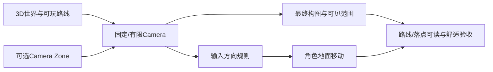

---
{
  "id": "A08",
  "prerequisites": [
    "A06",
    "A07"
  ],
  "revisit": [
    "A07",
    "A05"
  ],
  "memory": [
    "KN03",
    "KN04",
    "KN10",
    "TH03"
  ],
  "labs": [
    "practice/godot/labs/camera_lab.tscn",
    "practice/godot/scenes/main.tscn"
  ]
}
---
# A08｜固定/有限镜头：构图舒服，移动清楚

**今天做什么：** 确定一个稳定的固定或有限镜头基线，让角色移动方向、落点和画面构图都清楚。

**从哪里开始：** 在镜头Lab保持其他条件，只切透视/正交，分别比较FOV/Size；再试向右移动。

**现成材料：** [camera_lab.tscn](../../practice/godot/labs/camera_lab.tscn)、[main.tscn](../../practice/godot/scenes/main.tscn)

**材料边界：** 真实Camera3D投影和地面方向；没有完整分区切镜或事件镜头，未选这些增强不增加作业。

先观察或猜一猜，动手试一项，再说说为什么。完全陌生可以先看一个小示范；做完当前小步就可以暂停。

### 开始对话

```text
我在学A08《固定/有限镜头：构图舒服，移动清楚》，请按这份教案带我自学。
一次只推进一个有意义的小步，先用现成材料，不先替我作判断。
我可以查菜单/API、看示范或请AI实现；学到的因果关系要由我说明。
课程里的备用题按需选，不要全部变作业；伙伴分享一次就够了。
```

<details data-audience="reference">
<summary>需要时看：解释、对照与候选练习</summary>

## 学到这里就够了

**M｜需要会判断和应用：**
- `A08.M1` 选择固定镜头的位置、角度与投影/视野基线，并用实际玩家画面说明取舍。
- `A08.M2` 让地面移动在固定镜头下方向一致；需要分区切镜时检查进入、退出和边界稳定。

**K｜知道用途，用到再查：**
- `A08.K1` Perspective/Orthographic是两种投影选择；FOV（Field of View，视野角）只用于透视镜头，正交镜头主要调Size。
- `A08.K2` Camera Zone、短促Camera impulse/Shake、轻微Dynamic FOV或Size Pulse都是按需镜头语言；先懂用途，再决定是否使用。

**停止线：** 不推投影矩阵，不要求自由环绕镜头或复杂相机框架。动态FOV、镜头冲击、震屏不是禁用，但只作为短促可选强调：先小幅、短时、可恢复，并提供降低/关闭镜头运动的方案；舒适度必须真人复核。

**前置：** [A06](A06.md)、[A07](A07.md)

## 必要解释

固定镜头不是“少做一个功能”，而是先决定最终画面再制作世界。角色仍在3D空间移动，但玩家不必持续转相机。透视镜头可用位置/角度/FOV组织画面；正交镜头可用Orthographic Size组织范围。两者都要在实际角色尺度下比较。

移动必须明确参考：固定三分之四镜头下，屏幕上方/下方、左/右与世界轴不一定相同。课程只要求建立一种一致规则并实走验证。若地图分为多个镜头区域，切换点要可预测，避免边界反复切换；默认不把强震动、头部晃动、频繁动态FOV和运动模糊当必要效果。

FOV是Field of View，中文可理解为“相机一次能看多宽”。在Godot的透视Camera3D里它是角度：更大通常看得更宽、透视感也更强；更小看得更窄、视觉上更像拉近。正交镜头不靠FOV控制范围，而主要用Size。所谓Dynamic FOV，就是事件发生时短暂改变FOV后再恢复，例如冲刺或重击强调；固定视角同样能用，只是不应让它持续漂移。

固定视角的“镜头不自由转”不等于“镜头完全不动”。可在强事件上使用很短的Camera impulse、轻微位移/旋转、透视FOV Pulse，或正交Size Pulse；普通拾取、走路不必每次震屏。对容易晕3D的玩家，低运动模式应能关闭或显著降低Shake、FOV/Size Pulse、运动模糊和频繁切镜，同时保留闪光、粒子、声音和目标反应等非镜头反馈。



这是因果／职责示意，不是实际运行截图；不能显示Mermaid时用等价方框图。

## 在现成实验里试

**初始条件：** 能走跳的角色、一个低平台与墙角；固定三分之四机位A，备用机位B只用于切镜对照。默认无需鼠标持续转镜头。
**可比较的条件：** 镜头高度/俯角、Perspective FOV或Orthographic Size二选一、屏幕相对移动示意、机位A/B切换；不同时开放所有参数。

下面说明要比较的关系；实际从上面的现成文件与首步进入，不为匹配教学控件名重新搭建。

1. 先锁定机位A，固定角色尺度，只调整一项镜头角度或视野/尺寸，观察路线、角色和落点。
2. 在同一机位测试四向移动和跳跃，确认输入不会因镜头俯角混入竖直移动。
3. 只在确有第二构图需求时加入机位B；从两个方向跨过切换边界，检查不抖动、不连续反转。

**观察：** 始终显示当前机位、投影方式/视野参数和角色地面方向；镜头美术选择与移动正确性分别记录。
**不符时先查：** 故障：AI自动加自由Orbit、头部晃动或频繁切镜来“更3D”，却破坏固定构图或舒适基线；恢复项目镜头约束，只保留有证据的变化。
**恢复：** 恢复机位A、角色起点、移动映射和切镜状态；不通过改角色速度掩盖构图或方向问题。

只比较一个条件，恢复后再试下一个。课堂模拟应标清示意，真实软件行为需要实际观察；缺文件如实说明，不让学员临时重造系统。

### 软件入口与亲调

- Godot常用：Camera3D Transform、Projection、FOV或Size；只亲调项目实际采用的一组。
- 会定位：当前Camera3D、区域切镜触发和运行时相机状态。
- 按需查：SpringArm/RayCast、复杂平滑和电影相机系统；自由Orbit不是本项目基础门槛。

|选中哪里／参数|只改什么|看什么|
|---|---|---|
|Camera3D Transform（内置）|固定其他条件，只小幅改高度或俯角|角色、主路、落点和遮挡是否更清楚|
|Camera3D FOV或Orthographic Size（内置，二选一）|只调项目采用的投影参数|画面范围、角色大小和空间层次是否符合目标|

运行中临时改动不等于已保存；要留下设计选择，请在自己的副本中写回场景／资源，保存并重新打开检查。

## 我负责什么，AI帮什么

**我的判断：** 先锁定玩家实际看到的构图，选择机位/投影并定义一致移动规则；只在地图确有需要时加切镜。
**可交给AI：** 搭固定机位A/B、显示移动参考和切换状态；不自动加入Orbit、头晃、动态FOV或震屏。
**检查重点：** 检查AI是否把局部强调做成持续镜头漂移、频繁动态FOV、强烈震屏或头晃；同时避免另一极端——误以为固定视角绝不能有任何镜头反馈。

结果不符：说清预期、实际与复现步骤；先提出一个可推翻的原因，再做最小验证。修改前留基线，不删需求或测试来消除报错。

## 怎样知道这一小步做到了

- 固定角色和场景，选择一组机位与投影/视野参数，说明路线、角色和落点为何清楚。
- 四向实走并双向穿过一个可选切镜边界，移动方向稳定且切镜不反复；无第二机位需求时说明不做。

**恢复后再检查：** 走跑跳、碰撞和目标可达保持；镜头变化不能靠改角色速度补偿。

有提示也是学习进展；没有实际观察就不宣称已经验证。一个对照和解释可以覆盖多个要点，不要求填写评分表。

## 候选问题

先自己判断，再按需看反馈。P是预测、D是诊断、T是迁移、K是用途；按本次需要选一题，不要求全部完成。教学情境不是实测日志。

### A08-P1

固定视角游戏是否必须再加鼠标自由转镜头，才算真正3D？

### A08-D2

【教学构造情境，不是真实测量或某模型故障统计】角色跨入第二机位时方向正常，但站在边界附近会不断A/B切换，输入方向也来回改变。AI建议降低角色速度。你先检查什么设计条件，怎样验证不是速度问题？

### A08-T3

把室外庭院改成室内小房间，应该直接沿用原机位吗？

### A08-K4

正交与透视现在要掌握到什么程度？

<details>
<summary>可选补充题：替换本次练习，不叠加作业</summary>

### KN04-T｜迁移

风车正确转动但门不正确，能否认定所有中心Pivot都错？

### KN10-P｜预测

镜头变广角后，角色实际碰撞体会变小吗？

### KN10-T｜迁移

相机绕玩家旋转后，W仍沿原世界方向，优先查哪里？

</details>

</details>

## 这一课要记在脑海里

- Camera先决定玩家实际会看到什么。
- 固定镜头仍要实走验证移动方向与落点。
- 不把“更会动的相机”自动当成更高级。

**记忆清单：** [KN03](../memory.md#kn03) · [KN04](../memory.md#kn04) · [KN10](../memory.md#kn10) · [TH03](../memory.md#th03)。先遮住解释，用自己的话说，再举例；不是照抄定义。

## 讲给爸爸听

在今天的关键地方或结束时，选一次和爸爸分享。用自己的话讲讲：固定机位、视野、移动方向。

**给他演示：** 做庭院摄影师：固定玩家镜头，选能看清角色和路的视野，检查移动方向。

**你们一起问：** 景物都装进画面了，但角色变得很小，这个方案怎样取舍？

爸爸还有问题就接着问，你也可以问爸爸。一起看、一起试，不必背稿、打分或填表。爸爸暂时不在就稍后分享，不影响继续自学。

<details data-purpose="project">
<summary>需要改自己的作品时再看</summary>

**生产阶段：** P1

**想得到的结果：** 固定/有限机位下路线、角色和落点清楚；移动方向稳定，必要切镜不抖动。
**必须保留：** 角色速度、跳跃、碰撞与关卡尺度保持；先建立静态镜头基线。事件型FOV/Size Pulse或Shake若后续采用，必须短促、能恢复且不能改变输入/碰撞规则。

先读取自己的工作副本。以下是可选局部实现，不是打开现成实验的前置，也不要求再做一整轮：

- 先锁定一个三分之四固定机位，只暴露高度/俯角和项目采用的FOV或Size；不加入鼠标Orbit。
- 只有第二构图确有价值时再加机位B，双向跨界检查切换与方向；没价值就保留单机位。

**采用依据：** 我能在主机位看清路线、角色和低平台落点，且四向移动稳定。
**换一个场景想想：** 换一个更窄的室内区域，保留输入规则但重新选构图；可以得出“单机位已够，不新增切镜”。

参考工程的通过结论不自动覆盖你改过的版本；相关路线实际走一遍，必要时恢复。

</details>

## 下次怎样想起来

前面已学过的复现入口：[A07](A07.md)、[A05](A05.md)。
隔一段时间不看答案，再解释本课的一项关键关系；换一个对象或条件应用。记住词也要会用，API和菜单位置可以查。疑问笔记可选，没有笔记也仍有公共必记清单。

## 依据

- [Godot Node3D：变换与父空间](https://docs.godotengine.org/en/stable/classes/class_node3d.html)
- [Godot CharacterBody3D：速度、落地与移动](https://docs.godotengine.org/en/stable/classes/class_characterbody3d.html)
- [Godot运行检查与可见碰撞工具](https://docs.godotengine.org/en/stable/tutorials/scripting/debug/overview_of_debugging_tools.html)
- [Godot Camera3D：投影、FOV与相机属性](https://docs.godotengine.org/en/stable/classes/class_camera3d.html)

技术来源支持概念边界；课程顺序与任务是本项目设计，不代表已经证明学习效果。
