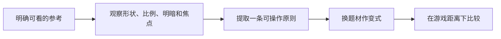

---
{
  "id": "B01",
  "prerequisites": [
    "A01",
    "A02"
  ],
  "revisit": [
    "A01"
  ],
  "memory": [
    "ART02",
    "ART03",
    "TH03"
  ],
  "labs": [
    "practice/blender/kitbash_style_lab.blend"
  ]
}
---
# B01｜训练眼睛一：剪影、比例和细节层级

**先从这里开始：** 把一个道具缩到游戏里常见的大小，看看你还认不认得。你先选轮廓或大比例中的一处改动，不需要把细节全部做完。

**今天做什么：** 在游戏大小的缩略图里，让一个道具一眼可辨。

**从哪里开始：** 固定视图先比较Base与Variant大形，不先画纹理。

**现成材料：** [kitbash_style_lab.blend](../../practice/blender/kitbash_style_lab.blend)

**材料边界：** 小屋比例示例，不是商业品质标杆。

先试当前这一小步。可以说“给我线索”“示范一小步”或“直接解释”；也可以指认、画图或演示，不必长篇回答。可以暂停，不必先答对才求助。

### 开始对话

```text
我在学B01《训练眼睛一：剪影、比例和细节层级》，请按这份教案带我自学。
先用“先从这里开始”进入当前任务，一次只推进一小步；等我回应后再展开提示或解释。
我可以查菜单/API、看示范或请AI实现；学到的因果关系要由我说明。
课程里的备用题按需选，不要全部变作业；伙伴分享一次就够了。
```

<details data-audience="reference">
<summary>需要时看：解释、对照与候选练习</summary>

**带学提醒（按当前需要使用）：** 先允许指出“这里看不清”，再给轮廓和比例的词。比较同距离的变化，不用专业作品压低孩子的草稿，也不把细节多当认真。

## 学到这里就够了

**M｜需要会判断和应用：**
- `B01.M1` 只看剪影判断造型识别度。
- `B01.M2` 先调大比例，再分配主次细节，不把噪声当丰富。

**K｜知道用途，用到再查：**
- `B01.K1` Primary/Secondary/Tertiary是主形、辅助形、小细节的组织思路。

**停止线：** 不讲解剖学和复杂雕刻；不要求完整临摹人物。

**前置：** [A01](A01.md)、[A02](A02.md)

## 必要解释

剪影是外部轮廓：先涂黑或缩小看看还能否辨认。一个水壶若壶嘴和把手融在一起，加花纹也不一定解决识别。

先调大形比例，再放中等结构，最后决定小细节是否值得。卡通不是随意拉大所有部位，而是用一致的夸张规则服务角色或用途。



这是因果／职责示意，不是实际运行截图；不能显示Mermaid时用等价方框图。

## 在现成实验里试

**初始条件：** 同一水壶三种比例；纯色背景、黑色剪影、统一尺寸；目标显示宽约160像素。
**可比较的条件：** 壶身宽高比0.7到1.4、把手间隙、壶嘴长度、黑色/表面切换、缩略/近景。

下面说明要比较的关系；实际从上面的现成文件与首步进入，不为匹配教学控件名重新搭建。

1. 先隐藏材质比较能否识别用途。
2. 只改一个比例或间隙，记录识别改善而非随机拖动。
3. 在游戏尺寸检查装饰小纹理是否仍有价值，删掉一组无用细节再比较。

**观察：** 参数改变要改轮廓，不能只替换标签。展示近远两种视图，允许不同但有依据的审美选择。
**不符时先查：** 反例：把大量雕花当质量，缩小后道具只是黑团；优先修大形和负形。
**恢复：** 恢复统一物体尺寸、比例、剪影模式和观察距离。

只比较一个条件，恢复后再试下一个。课堂模拟应标清示意，真实软件行为需要实际观察；缺文件如实说明，不让学员临时重造系统。

### 软件入口与亲调

- Blender后续常用：对象/编辑模式缩放、正交观察、Solid视图。
- 会定位：相机视图和尺寸参照。
- 按需查：复杂雕刻笔刷、重拓扑。

|选中哪里／参数|只改什么|看什么|
|---|---|---|
|对象Dimensions/Scale或轮廓草图（内置/设计）|只改一个比例，例如树冠与树干关系|缩略尺寸下能否区分物体|
|视口缩略/单色预览（观察入口）|隐藏表面细节再观察|轮廓是否仍读得出，细节是否只是噪声|

运行中临时改动不等于已保存；要留下设计选择，请在自己的副本中写回场景／资源，保存并重新打开检查。

## 我负责什么，AI帮什么

**我的判断：** 先按玩家距离判断大形/负形，再决定小细节是否值得。
**可交给AI：** 准备同尺寸剪影与近远对照，只改一个比例或结构间隙。
**检查重点：** 检查AI是否用更多装饰掩盖轮廓问题，或只展示近景精细截图。

结果不符时，先指出预期与实际的一处差别。有解释就试着验证；没有解释可请AI定位入口、给线索或示范。只改可恢复副本，不删需求或测试来掩盖错误。

## 怎样知道这一小步做到了

- 隐藏表面细节后辨认道具用途，并指出轮廓上的证据。
- 只改一处比例/间隙，在游戏大小复核识别，不靠添加纹理补救。

**恢复后再检查：** 选定大形不堵住原通路；交互目标仍与装饰可区分。

有提示也是学习进展；没有实际观察就不宣称已经验证。一个对照和解释可以覆盖多个要点，不要求填写评分表。

## 候选问题

先自己判断，再按需看反馈。P是预测、D是诊断、T是迁移、K是用途；按本次需要选一题，不要求全部完成。教学情境不是实测日志。

### B01-P1

加更多纹理能保证剪影更清楚吗？

### B01-D2

【教学构造情境，不是真实测量或某模型故障统计】160像素宽的水壶缩略图里把手和壶身黏成黑团；AI添加花纹，近景好看但黑色剪影没变。先要改哪个层次，如何对照而不同时改变机位和大小？

### B01-T3

把水壶换成游戏宝箱，怎样安排细节？

### B01-K4

三级形体的用途是什么？

</details>

## 这一课要记在脑海里

- 先看剪影，再看材质。
- 先大形，再小细节。
- 质量按游戏距离验收。

**记忆清单：** [ART02](../memory.md#art02) · [ART03](../memory.md#art03) · [TH03](../memory.md#th03)。用到时先想一项；想不起可看例子，再换个条件。不要求逐字背诵。

## 讲给爸爸听

想分享时，可以先展示今天的一处选择、发现或仍没想通的问题，不要求完整讲课。用自己的话讲讲：剪影、大比例、细节主次。

**给他演示：** 做造型侦探：缩小两座小屋的画面，先比较大形，再决定一处比例变化。

**你们一起问：** 多加十个装饰会让形状更好认，还是可能更难认？用玩家距离说明。

爸爸还有问题就接着问，你也可以问爸爸。一起看、一起试，不必背稿、打分或填表。爸爸暂时不在就稍后分享，不影响继续自学。

<details data-purpose="project">
<summary>需要改自己的作品时再看</summary>

**生产阶段：** P4/P6

**想得到的结果：** 用剪影、比例和主次确定可辨认的大形，之后才加细节。
**必须保留：** 机位、显示尺寸、背景固定；不一开始雕刻复杂模型。

先读取自己的工作副本。以下是可选局部实现，不是打开现成实验的前置，也不要求再做一整轮：

- 只把现有星星、树和石头变成缩略剪影对照，不先生成精细纹理。
- 仅改变一处比例或间隙，重新缩小比较，不以细节数量评分。

**采用依据：** 我能说出游戏距离下哪个轮廓更容易辨认及理由。
**换一个场景想想：** 将星星换成钥匙形道具，先在单色下检验，不靠颜色救识别。

参考工程的通过结论不自动覆盖你改过的版本；相关路线实际走一遍，必要时恢复。

</details>

## 下次怎样想起来

前面已学过的复现入口：[A01](A01.md)。
下次碰到相似问题时，可先回想一项关系，再查需要的解释；想不起就补一个小例子，不重学整课。暂停时愿意就留“下次从哪里接着试”，没有笔记也能继续，API和菜单仍可查。

## 依据

- [Roman Klco / Polygon Runway：风格化3D作品与课程](https://polygonrunway.com/)
- [Grant Abbitt：Blender造型与图形设计](https://www.gabbitt.co.uk/)
- [Godot运行检查与可见碰撞工具](https://docs.godotengine.org/en/stable/tutorials/scripting/debug/overview_of_debugging_tools.html)

技术来源支持概念边界；课程顺序与任务是本项目设计，不代表已经证明学习效果。
