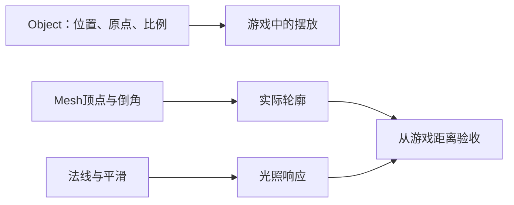

---
{
  "id": "B02",
  "prerequisites": [
    "A08",
    "B01"
  ],
  "revisit": [
    "A02",
    "A03"
  ],
  "memory": [
    "KN02",
    "KN11",
    "KN26",
    "TH03"
  ],
  "labs": [
    "practice/blender/transform_origin_lab.blend",
    "practice/blender/kitbash_style_lab.blend"
  ]
}
---
# B02｜Blender静态资产：先会验收，再谈从零造型

**先从这里开始：** 选一个现成小屋部件，在副本里试一个你想要的轮廓变化。今天不比建模速度，先看游戏距离下是否值得改。

**今天做什么：** 为一件静态道具做尺寸、轮廓、原点和法线检查。

**从哪里开始：** 直接打开现成静态样本，在副本中比较对象变换与网格编辑；再选小屋轮廓。

**现成材料：** [transform_origin_lab.blend](../../practice/blender/transform_origin_lab.blend)、[kitbash_style_lab.blend](../../practice/blender/kitbash_style_lab.blend)

**材料边界：** 原点/缩放样本已给；平滑/倒角局部对照可在副本用现有方块作一次设置，不要求从零搭模型。

先试当前这一小步。可以说“给我线索”“示范一小步”或“直接解释”；也可以指认、画图或演示，不必长篇回答。可以暂停，不必先答对才求助。

### 开始对话

```text
我在学B02《Blender静态资产：先会验收，再谈从零造型》，请按这份教案带我自学。
先用“先从这里开始”进入当前任务，一次只推进一小步；等我回应后再展开提示或解释。
我可以查菜单/API、看示范或请AI实现；学到的因果关系要由我说明。
课程里的备用题按需选，不要全部变作业；伙伴分享一次就够了。
```

<details data-audience="reference">
<summary>需要时看：解释、对照与候选练习</summary>

**带学提醒（按当前需要使用）：** 先辨认对象与网格所在位置；入口困难可代操作。只比较平滑或倒角的一个效果，再回到轮廓，不把全套检查一起当开场考试。

## 学到这里就够了

**M｜需要会判断和应用：**
- `B02.M1` 区分对象变换与网格编辑，判断修正应该发生在哪里。
- `B02.M2` 分清平滑着色与真实倒角，检查游戏距离的轮廓。

**K｜知道用途，用到再查：**
- `B02.K1` 拓扑、面数、修改器是按需求使用的工具；复杂雕刻暂不学。

**停止线：** 不要求手工搭完整人物，不刷所有快捷键，不用建模速度评分。

**前置：** [A08](A08.md)、[B01](B01.md)

## 必要解释

Object Mode改变对象在场景里的变换；Edit Mode修改对象内部几何，可能改变可见形状与原点的关系。静态道具也要留原文件，不在唯一副本上试错。

Shade Smooth改变表面着色表现，不会自动把轮廓变圆。Bevel改变边缘几何。先判断目标游戏镜头能否看见差异，再决定是否增加面。



这是因果／职责示意，不是实际运行截图；不能显示Mermaid时用等价方框图。

## 在现成实验里试

**初始条件：** 一件有授权的简单箱子或程序生成星星；白色中性光；固定近景和游戏距离两个机位。
**可比较的条件：** 对象/几何演示切换、平滑开关、倒角0到0.06模型单位、近/远机位、法线示意。

下面说明要比较的关系；实际从上面的现成文件与首步进入，不为匹配教学控件名重新搭建。

1. 用对象移动和移动全部顶点做A/B，观察原点及Transform。
2. 只开平滑看轮廓；恢复后加小倒角看轮廓和高光。
3. 切到游戏距离，选择保留的变化，填写尺寸与来源。

**观察：** 把外轮廓、高光和原点分别标出；示意倒角不得只改亮度冒充几何。
**不符时先查：** 故障：模型尺寸靠极端缩放补偿，或者原点远离道具；先查来源尺度，再修静态资产。
**恢复：** 还原原始副本和固定机位；不覆盖源文件。

只比较一个条件，恢复后再试下一个。课堂模拟应标清示意，真实软件行为需要实际观察；缺文件如实说明，不让学员临时重造系统。

### 软件入口与亲调

- Blender：视口导航、Outliner选择、Object/Edit Mode、Item/Dimensions。
- 会定位：Bevel修改器、面朝向、Set Origin；Apply仅在理解静态对象影响后使用。
- 按需查：倒角全部选项、重拓扑、绑定对象的变换处理。

|选中哪里／参数|只改什么|看什么|
|---|---|---|
|Blender Item > Dimensions/Scale（内置）|与约定的参照物比较真实尺寸|不是只看Scale是否为1|
|Blender Bevel修改器（内置）|先少量调宽度，再选择必要段数|游戏距离下轮廓收益和明显变形，不追求面数|

运行中临时改动不等于已保存；要留下设计选择，请在自己的副本中写回场景／资源，保存并重新打开检查。

## 我负责什么，AI帮什么

**我的判断：** 决定改对象还是几何；在玩家距离评估倒角是否有收益。
**可交给AI：** 准备同尺度基底、平滑/倒角可撤销对照及来源清单。
**检查重点：** 检查AI是否破坏源文件、过度细分，或把Shade Smooth说成自动圆角。

结果不符时，先指出预期与实际的一处差别。有解释就试着验证；没有解释可请AI定位入口、给线索或示范。只改可恢复副本，不删需求或测试来掩盖错误。

## 怎样知道这一小步做到了

- 分别试对象移动与局部几何变化，指出原点和对象变换受影响的区别。
- 固定机位比较平滑与倒角的剪影/高光，再在游戏距离保留有收益的一项。

**恢复后再检查：** 导出副本不覆盖原始资产；后续功能仍由游戏包装负责。

有提示也是学习进展；没有实际观察就不宣称已经验证。一个对照和解释可以覆盖多个要点，不要求填写评分表。

## 候选问题

先自己判断，再按需看反馈。P是预测、D是诊断、T是迁移、K是用途；按本次需要选一题，不要求全部完成。教学情境不是实测日志。

### B02-P1

同一箱子只开平滑着色，外轮廓仍方；改为真实小倒角后，哪类变化才可能出现在剪影上？如何保持比较公平？

### B02-D2

【教学构造情境，不是真实测量或某模型故障统计】AI声称已把箱子做圆润，只开启Shade Smooth；高光变顺，但黑色剪影四角仍直。你要改灯还是几何？怎样避免为了远景道具盲目增加大量面？

### B02-T3

远处路灯不需要特写，是否仍要把每个螺丝建出来？

### B02-K4

拓扑需要现在完整学吗？

<details>
<summary>可选补充题：替换本次练习，不叠加作业</summary>

### KN02-T｜迁移

门的可见几何移动了，但Origin留在原处，可能做了哪种操作？如何对照？

### KN05-T｜迁移

只想换角色外形，先替换哪个部分？哪些功能应保持并复测？

### KN11-P｜预测

平滑着色后立方体轮廓仍尖，为什么？

### KN11-T｜迁移

模型背面看不见，能否不检查原因就一律开双面材质？

### KN26-P｜预测

资源写着free就可以把它的源文件公开放进仓库吗？你要确认什么？

</details>

</details>

## 这一课要记在脑海里

- 先修大形和尺度。
- 平滑不是倒角。
- 资产要有来源和源文件。

**记忆清单：** [KN02](../memory.md#kn02) · [KN11](../memory.md#kn11) · [KN26](../memory.md#kn26) · [TH03](../memory.md#th03)。用到时先想一项；想不起可看例子，再换个条件。不要求逐字背诵。

## 讲给爸爸听

想分享时，可以先展示今天的一处选择、发现或仍没想通的问题，不要求完整讲课。用自己的话讲讲：对象变换、网格、轮廓。

**给他演示：** 做模型修理员：在副本比较整体缩放与改网格，并从游戏距离看边缘。

**你们一起问：** 表面看着更光滑，就一定真的改变了轮廓吗？怎样观察？

爸爸还有问题就接着问，你也可以问爸爸。一起看、一起试，不必背稿、打分或填表。爸爸暂时不在就稍后分享，不影响继续自学。

<details data-purpose="project">
<summary>需要改自己的作品时再看</summary>

**生产阶段：** P4

**想得到的结果：** 一件尺度和原点可用的道具外观，带来源记录。
**必须保留：** 只操作静态对象，不对绑定角色套用同样Apply流程；不覆盖唯一源文件。

先读取自己的工作副本。以下是可选局部实现，不是打开现成实验的前置，也不要求再做一整轮：

- 只检查一件已提供的静态道具：尺寸、原点、朝向和来源；不从零重做。
- 只修该问题，再比较平滑着色与真正倒角对轮廓的区别。

**采用依据：** 我能指出一个实际质量问题或说明无需修改。
**换一个场景想想：** 把星星基底换成邮箱，按新的用途选择原点和细节。

参考工程的通过结论不自动覆盖你改过的版本；相关路线实际走一遍，必要时恢复。

</details>

## 下次怎样想起来

前面已学过的复现入口：[A02](A02.md)、[A03](A03.md)。
下次碰到相似问题时，可先回想一项关系，再查需要的解释；想不起就补一个小例子，不重学整课。暂停时愿意就留“下次从哪里接着试”，没有笔记也能继续，API和菜单仍可查。

## 依据

- [Blender官方手册：按实际版本查询工具](https://docs.blender.org/manual/en/latest/)
- [Blender glTF 2.0管线参考（4.0文档，具体新版选项另查）](https://docs.blender.org/manual/en/4.0/addons/import_export/scene_gltf2.html)
- [Godot运行检查与可见碰撞工具](https://docs.godotengine.org/en/stable/tutorials/scripting/debug/overview_of_debugging_tools.html)

技术来源支持概念边界；课程顺序与任务是本项目设计，不代表已经证明学习效果。
