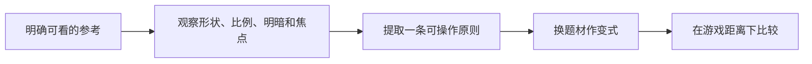

---
{
  "id": "B03",
  "prerequisites": [
    "B01"
  ],
  "revisit": [
    "A01",
    "B01"
  ],
  "memory": [
    "ART04",
    "ART05",
    "TH03"
  ],
  "labs": [
    "practice/blender/kitbash_style_lab.blend"
  ]
}
---
# B03｜训练眼睛二：明度、色相、饱和度与焦点

**先从这里开始：** 你希望玩家第一眼注意到哪里？先指一个目标，再试一种颜色关系。你可以保留自己的配色，不需要猜老师喜欢哪一套。

**今天做什么：** 用受控色盘和明暗层次，使拾取目标从背景中可辨。

**从哪里开始：** 固定机位光照，只调整变体一处颜色，先看焦点和大色块。

**现成材料：** [kitbash_style_lab.blend](../../practice/blender/kitbash_style_lab.blend)

**材料边界：** 原生材质参数练习，不自带自动色彩评分器。

先试当前这一小步。可以说“给我线索”“示范一小步”或“直接解释”；也可以指认、画图或演示，不必长篇回答。可以暂停，不必先答对才求助。

### 开始对话

```text
我在学B03《训练眼睛二：明度、色相、饱和度与焦点》，请按这份教案带我自学。
先用“先从这里开始”进入当前任务，一次只推进一小步；等我回应后再展开提示或解释。
我可以查菜单/API、看示范或请AI实现；学到的因果关系要由我说明。
课程里的备用题按需选，不要全部变作业；伙伴分享一次就够了。
```

<details data-audience="reference">
<summary>需要时看：解释、对照与候选练习</summary>

**带学提醒（按当前需要使用）：** 区分个人偏好与目标是否可辨。先说第一眼所见再提供色彩词；灰度只是一个观察工具，不把它或任何色盘当审美总分。

## 学到这里就够了

**M｜需要会判断和应用：**
- `B03.M1` 区分色相、饱和度、明度，并一次只改一种关系。
- `B03.M2` 在保持风格前提下组织焦点，做灰度与缩略图对照。

**K｜知道用途，用到再查：**
- `B03.K1` 冷暖和互补等术语用来描述关系，不当固定配方。

**停止线：** 不背色彩空间数学；不规定某个色盘就是儿童最爱。

**前置：** [B01](B01.md)

## 必要解释

色相可理解为偏哪种颜色，饱和度是颜色的鲜明程度，明度关注明暗。不同系统数值定义不尽相同，本课通过观察关系而非死记换算。

唯美不等于所有地方一样淡，卡通也不等于全场高饱和。主要目标、次要道具和背景要有主次。灰度帮助检查明暗，但不自动替代色彩审美。



这是因果／职责示意，不是实际运行截图；不能显示Mermaid时用等价方框图。

## 在现成实验里试

**初始条件：** 暖色小屋、草地和拾取物，三个候选色盘；机位、轮廓、灯光固定。
**可比较的条件：** 主体与背景的明暗对比、饱和度低/中/高、两组色相、灰度开关、缩略图。

下面说明要比较的关系；实际从上面的现成文件与首步进入，不为匹配教学控件名重新搭建。

1. 先指出第一眼看到哪里。
2. 保持色相，只改变背景明暗；恢复后只调目标饱和度。
3. 挑一套色盘并说明为什么目标可辨，而不只是自己喜欢。

**观察：** A/B保持相同布局；任何自动灰度转换说明仅为观察工具；不声称代替色觉可访问性测试。
**不符时先查：** 反例：所有对象都高饱和高对比，没有焦点；减少背景竞争再比较。
**恢复：** 恢复原色盘、光照与观察尺寸；保留选定风格卡。

只比较一个条件，恢复后再试下一个。课堂模拟应标清示意，真实软件行为需要实际观察；缺文件如实说明，不让学员临时重造系统。

### 软件入口与亲调

- 后续常用：基础颜色拾色器与固定相机A/B。
- 会定位：色相/饱和度/明度类控件，注意软件命名差异。
- 按需查：色彩管理和转换公式。

|选中哪里／参数|只改什么|看什么|
|---|---|---|
|材质基础色/设计色板（内置/设计）|先只降低背景饱和度，再回到基线|目标是否更突出而背景仍可读|
|灰度对照和目标明暗（观察/内容）|观察后只改目标或邻近背景之一|明度差来自哪处，而非只看色相不同|

运行中临时改动不等于已保存；要留下设计选择，请在自己的副本中写回场景／资源，保存并重新打开检查。

## 我负责什么，AI帮什么

**我的判断：** 选择目标与背景的相对关系，不让AI替你宣布某色盘所有儿童都喜欢。
**可交给AI：** 给固定布局光照的两版配色及灰度/缩略对照，明确哪些数值属教学控件。
**检查重点：** 检查AI是否同时改照明和材质却称单变量比较，或默认高饱和等于儿童友好。

结果不符时，先指出预期与实际的一处差别。有解释就试着验证；没有解释可请AI定位入口、给线索或示范。只改可恢复副本，不删需求或测试来掩盖错误。

## 怎样知道这一小步做到了

- 固定其他条件只改变色相、饱和或明暗中的一类，说明差异。
- 按风格卡选焦点并在彩色/灰度/缩略中比较，说明工具的局限。

**恢复后再检查：** 路径提示与其他可交互对象不被新的色板混淆；静音仍可辨成功。

有提示也是学习进展；没有实际观察就不宣称已经验证。一个对照和解释可以覆盖多个要点，不要求填写评分表。

## 候选问题

先自己判断，再按需看反馈。P是预测、D是诊断、T是迁移、K是用途；按本次需要选一题，不要求全部完成。教学情境不是实测日志。

### B03-P1

全场饱和度拉满一定让星星更显眼吗？

### B03-D2

【教学构造情境，不是真实测量或某模型故障统计】星星和黄墙都很鲜艳；AI同时提高全场饱和度，仍难找到星星。保持温暖主题，你先改变哪一个局部关系？用什么观察证明目标改善而不是仅图更鲜艳？

### B03-T3

夜晚关卡沿用日间色盘，应重新检查什么？

### B03-K4

冷暖有什么沟通价值？

</details>

## 这一课要记在脑海里

- 焦点依赖相对关系。
- 不是所有东西都要鲜艳。
- 灰度与缩略图用来检查，不负责替你审美。

**记忆清单：** [ART04](../memory.md#art04) · [ART05](../memory.md#art05) · [TH03](../memory.md#th03)。用到时先想一项；想不起可看例子，再换个条件。不要求逐字背诵。

## 讲给爸爸听

想分享时，可以先展示今天的一处选择、发现或仍没想通的问题，不要求完整讲课。用自己的话讲讲：色相、饱和度、明度。

**给他演示：** 做颜色导演：固定机位和光照，只改一类颜色关系，让爸爸找第一眼焦点。

**你们一起问：** 只让所有东西更鲜艳，会不会让主路更清楚？怎样对照？

爸爸还有问题就接着问，你也可以问爸爸。一起看、一起试，不必背稿、打分或填表。爸爸暂时不在就稍后分享，不影响继续自学。

<details data-purpose="project">
<summary>需要改自己的作品时再看</summary>

**生产阶段：** P4/P8

**想得到的结果：** 能用明暗、色相和饱和度分配主次，而非全场加亮。
**必须保留：** 轮廓、相机、光照与目标位置保持。

先读取自己的工作副本。以下是可选局部实现，不是打开现成实验的前置，也不要求再做一整轮：

- 先固定一张原创场景的构图，切换彩色与灰度，只找第一眼的焦点。
- 只改一个目标或背景色块，让焦点明确后恢复比较。

**采用依据：** 能指出是明度、色相还是饱和度在起主要作用。
**换一个场景想想：** 目标换到相似明度背景上，重新选择局部调整而不是沿用旧色值。

参考工程的通过结论不自动覆盖你改过的版本；相关路线实际走一遍，必要时恢复。

</details>

## 下次怎样想起来

前面已学过的复现入口：[A01](A01.md)、[B01](B01.md)。
下次碰到相似问题时，可先回想一项关系，再查需要的解释；想不起就补一个小例子，不重学整课。暂停时愿意就留“下次从哪里接着试”，没有笔记也能继续，API和菜单仍可查。

## 依据

- [The Walt Disney Family Museum：Mary Blair展览资料](https://www.waltdisney.org/mary-blair)
- [Eyvind Earle官方作品入口（仅链接，保留版权）](https://eyvindearle.com/)
- [Roman Klco / Polygon Runway：风格化3D作品与课程](https://polygonrunway.com/)
- [Godot运行检查与可见碰撞工具](https://docs.godotengine.org/en/stable/tutorials/scripting/debug/overview_of_debugging_tools.html)

技术来源支持概念边界；课程顺序与任务是本项目设计，不代表已经证明学习效果。
