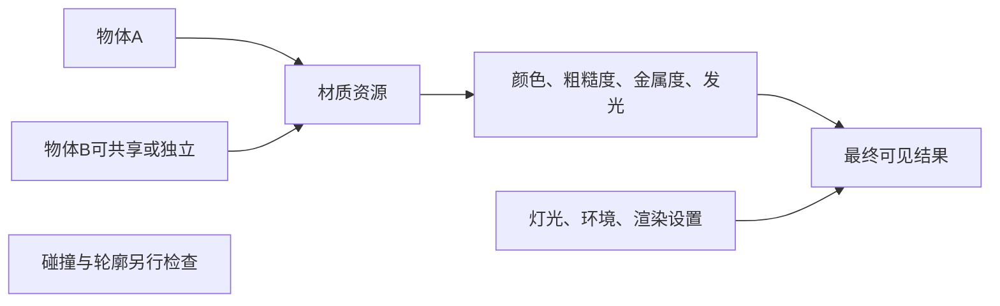

---
{
  "id": "B04",
  "prerequisites": [
    "B02",
    "B03"
  ],
  "revisit": [
    "B02"
  ],
  "memory": [
    "KN12",
    "KN13",
    "KN17",
    "TH03"
  ],
  "labs": [
    "practice/godot/labs/material_lab.tscn",
    "practice/blender/uv_material_lab.blend"
  ]
}
---
# B04｜材质四个判断：颜色、粗糙、金属、共享

**今天做什么：** 在固定光照下调出两个不同材质，并只修改目标对象。

**从哪里开始：** 保持灯光不动，先只改左球粗糙度；复位后切换共享材质，再改一次。

**现成材料：** [material_lab.tscn](../../practice/godot/labs/material_lab.tscn)、[uv_material_lab.blend](../../practice/blender/uv_material_lab.blend)

**材料边界：** 双球可切真实共享/独立资源，自发光与实际光源可分开；不把自发光球当环境照明或Glow已实现。

先观察或猜一猜，动手试一项，再说说为什么。完全陌生可以先看一个小示范；做完当前小步就可以暂停。

### 开始对话

```text
我在学B04《材质四个判断：颜色、粗糙、金属、共享》，请按这份教案带我自学。
一次只推进一个有意义的小步，先用现成材料，不先替我作判断。
我可以查菜单/API、看示范或请AI实现；学到的因果关系要由我说明。
课程里的备用题按需选，不要全部变作业；伙伴分享一次就够了。
```

<details data-audience="reference">
<summary>需要时看：解释、对照与候选练习</summary>

## 学到这里就够了

**M｜需要会判断和应用：**
- `B04.M1` 用基础色、粗糙度、金属度做可解释的A/B。
- `B04.M2` 区分自发光与照明，并检查共享材质的影响范围。

**K｜知道用途，用到再查：**
- `B04.K1` PBR/Normal Map是材质体系和表面细节手段；不学推导。

**停止线：** 不推BRDF，不要求手绘复杂贴图，不把金属度当亮度旋钮。

**前置：** [B02](B02.md)、[B03](B03.md)

## 必要解释

Base Color给基础颜色，Roughness控制反射粗糙程度，Metallic控制金属与非金属响应。看起来亮或暗还受灯光和环境影响，比较前要固定它们。

Emission让表面有发亮贡献，但光晕和照亮邻物需要相应渲染设置或光源。本课默认无GI/Glow。两个对象可以共用材质，改一处可能同时变；只改一个时要确认独立资源。



这是因果／职责示意，不是实际运行截图；不能显示Mermaid时用等价方框图。

## 在现成实验里试

**初始条件：** 两个同尺寸且初始独立材质的球、灰箱、固定灯光相机；第二小实验再切为共享，结束时恢复独立。无GI/Glow。
**可比较的条件：** Roughness0.1到0.9、Metallic0/1、Emission0到3、独立光源开关、共享/独立切换。

下面说明要比较的关系；实际从上面的现成文件与首步进入，不为匹配教学控件名重新搭建。

1. 固定右球，只调左球一项材质并作对照。
2. 切到共享修改范围实验：共享时两球一起变；分离后才恢复右球基线。
3. 恢复独立材质，分别比较Emission与独立光源对灰箱的影响。

**观察：** 共享实验阶段，两球应随共享材质同步变化；进入材质A/B前先独立化，此时右球才固定为基线。显示共享标记与实际影响范围，不承诺网页PBR与Godot逐像素一致。
**不符时先查：** 故障：只想改左球却两个一起变；先确认材质共享，再最小分离，不复制整个项目。
**恢复：** 恢复材质、共享关系、灯光和相机；清空比较记录以外的运行状态。

只比较一个条件，恢复后再试下一个。课堂模拟应标清示意，真实软件行为需要实际观察；缺文件如实说明，不让学员临时重造系统。

### 软件入口与亲调

- Blender Principled BSDF/Godot StandardMaterial3D：基础色、粗糙度、金属度、自发光。
- 会定位：材质槽、Make Unique或等效独立化、灯光能量。
- 按需查：高级节点、GI/Glow开关和渲染器支持。

|选中哪里／参数|只改什么|看什么|
|---|---|---|
|Principled BSDF / StandardMaterial3D（内置）|固定环境，粗糙度做低/高对照再选中间值|高光和反射，不把Metallic当通用亮度|
|材质资源与独立化入口（内置）|确认当前共享范围，再只改目标基础色|另一对象是否意外变化，外观变化来自哪个资源|

运行中临时改动不等于已保存；要留下设计选择，请在自己的副本中写回场景／资源，保存并重新打开检查。

## 我负责什么，AI帮什么

**我的判断：** 固定环境选质感，限定修改对象，再区分表面亮、光晕和照明目标。
**可交给AI：** 准备初始独立的双球、共享切换与独立灯开关，暴露少量参数。
**检查重点：** 检查共享引用和渲染条件；不能用不同曝光的图片假装同条件材质对比。

结果不符：说清预期、实际与复现步骤；先提出一个可推翻的原因，再做最小验证。修改前留基线，不删需求或测试来消除报错。

## 怎样知道这一小步做到了

- 同机位同灯光只改变一个材质参数，说明高光/颜色响应的变化。
- 共享时识别两球同变，独立后只变目标球；分别验证Emission与独立灯对邻物的影响。

**恢复后再检查：** 星星仍可辨认；重导入和拾取包装未被修改。

有提示也是学习进展；没有实际观察就不宣称已经验证。一个对照和解释可以覆盖多个要点，不要求填写评分表。

## 候选问题

先自己判断，再按需看反馈。P是预测、D是诊断、T是迁移、K是用途；按本次需要选一题，不要求全部完成。教学情境不是实测日志。

### B04-P1

两球初始材质独立。右球保留基线，左球只提高粗糙度。在相同灯光下你主要观察什么？能不能预言所有像素都变暗？

### B04-D2

【教学构造情境，不是真实测量或某模型故障统计】两个实例位置独立。你只调左球粗糙度，右球也改变；AI建议重做右球网格。当前应先检查哪个资源引用？修后用什么A/B证明只改左球，且没有偷偷改变灯光？

### B04-T3

做发亮蘑菇还要照亮地面，你如何拆需求？

### B04-K4

Normal Map主要有什么用？

<details>
<summary>可选补充题：替换本次练习，不叠加作业</summary>

### KN12-P｜预测

塑料很亮，应该一定把Metallic调到1吗？

### KN12-T｜迁移

旧铁剑的裸金属与锈斑，应怎样分别考虑材质响应？

### KN13-P｜预测

星星亮了但地板没亮，一定是程序错吗？

### KN17-P｜预测

只改一个球的材质，另一个也变了，优先怀疑什么？怎样只改目标球？

### K02｜用途

表面细小凹凸但轮廓不变，Normal Map是可考虑的工具吗？

### K03｜用途

为了选塑料球的粗糙程度，现在需要推导BRDF吗？你先做什么对照？

</details>

</details>

## 这一课要记在脑海里

- 固定环境再比较材质。
- Emission、光晕、照明分开验收。
- 调前确认共享范围。

**记忆清单：** [KN12](../memory.md#kn12) · [KN13](../memory.md#kn13) · [KN17](../memory.md#kn17) · [TH03](../memory.md#th03)。先遮住解释，用自己的话说，再举例；不是照抄定义。

## 讲给爸爸听

在今天的关键地方或结束时，选一次和爸爸分享。用自己的话讲讲：基础色、粗糙度、共享材质。

**给他演示：** 做表面侦探：两球固定光照比较一项材质参数，再另做共享与独立样本。

**你们一起问：** 为什么改一棵树的材质可能让另一棵也改变？怎样只改其中一棵？

爸爸还有问题就接着问，你也可以问爸爸。一起看、一起试，不必背稿、打分或填表。爸爸暂时不在就稍后分享，不影响继续自学。

<details data-purpose="project">
<summary>需要改自己的作品时再看</summary>

**生产阶段：** P4/P6

**想得到的结果：** 星星和围栏有清楚的不同质感，修改影响范围可控。
**必须保留：** 镜头、曝光和几何不变；独立光源不能随Emission暗中自动开。

先读取自己的工作副本。以下是可选局部实现，不是打开现成实验的前置，也不要求再做一整轮：

- 先在固定相机灯光下提供两个独立球，只调左球Roughness；别同时改所有材质。
- 再单独演示共享材质影响范围，之后区分Emission与实际光源。

**采用依据：** 右球基线不变，我能解释左球高光变化而非简单说变暗。
**换一个场景想想：** 把发亮星星换成夜间蘑菇，分别提出表面与照地面的需求。

参考工程的通过结论不自动覆盖你改过的版本；相关路线实际走一遍，必要时恢复。

</details>

## 下次怎样想起来

前面已学过的复现入口：[B02](B02.md)。
隔一段时间不看答案，再解释本课的一项关键关系；换一个对象或条件应用。记住词也要会用，API和菜单位置可以查。疑问笔记可选，没有笔记也仍有公共必记清单。

## 依据

- [Blender Principled BSDF：当前手册入口](https://docs.blender.org/manual/en/latest/render/shader_nodes/shader/principled.html)
- [Godot Resources：共享和引用](https://docs.godotengine.org/en/stable/tutorials/scripting/resources.html)
- [Godot运行检查与可见碰撞工具](https://docs.godotengine.org/en/stable/tutorials/scripting/debug/overview_of_debugging_tools.html)
- [Godot Resources：实例与共享引用](https://docs.godotengine.org/en/stable/tutorials/scripting/resources.html)

技术来源支持概念边界；课程顺序与任务是本项目设计，不代表已经证明学习效果。
