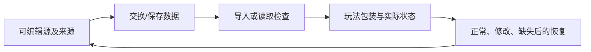

---
{
  "id": "B05",
  "prerequisites": [
    "B04"
  ],
  "revisit": [
    "B02",
    "B04"
  ],
  "memory": [
    "KN14",
    "KN15",
    "TH05"
  ],
  "labs": [
    "practice/blender/kitbash_style_lab.blend",
    "practice/godot/scenes/main.tscn"
  ]
}
---
# B05｜资产往返：源文件改了，游戏别被改坏

**先从这里开始：** 把一件道具的一处小改变带进游戏，再改第二次看看。今天的成果是“下次也能改”，不是一次做出最终模型。

**今天做什么：** 画出静态资产的来源、导出、导入和包装关系，并排查一次重导入问题。

**从哪里开始：** 在副本中选一个静态部件导出，再接到自己的游戏视觉包装。

**现成材料：** [kitbash_style_lab.blend](../../practice/blender/kitbash_style_lab.blend)、[main.tscn](../../practice/godot/scenes/main.tscn)

**材料边界：** 给出源样本与参考工程；学员GLB往返、原点与功能保持仍须实际做。

先试当前这一小步。可以说“给我线索”“示范一小步”或“直接解释”；也可以指认、画图或演示，不必长篇回答。可以暂停，不必先答对才求助。

### 开始对话

```text
我在学B05《资产往返：源文件改了，游戏别被改坏》，请按这份教案带我自学。
先用“先从这里开始”进入当前任务，一次只推进一小步；等我回应后再展开提示或解释。
我可以查菜单/API、看示范或请AI实现；学到的因果关系要由我说明。
课程里的备用题按需选，不要全部变作业；伙伴分享一次就够了。
```

<details data-audience="reference">
<summary>需要时看：解释、对照与候选练习</summary>

**带学提醒（按当前需要使用）：** 先完成一个正常往返，再检查第二次修改。导入报错先定位文件和入口，不让孩子猜所有格式；模型源文件始终另存。

## 学到这里就够了

**M｜需要会判断和应用：**
- `B05.M1` 区分源文件、交换文件、引擎导入数据和游戏包装场景。
- `B05.M2` 修改静态资产后检查尺寸、材质与功能是否保留。

**K｜知道用途，用到再查：**
- `B05.K1` UV映射、glTF/GLB是按需理解的资源概念。

**停止线：** 不背glTF JSON，不强制复杂UV展开，不处理绑定角色的变换烘焙。

**前置：** [B04](B04.md)

## 必要解释

Blender源文件是制作依据，glTF/GLB用于交换；引擎生成的导入数据不应是唯一编辑来源。游戏的碰撞、脚本和交互最好与易被重导入的视觉资产分清。

Blender中复杂节点材质并非都能无损进入引擎。先用简单可交换材质验证，再决定烘焙贴图或在引擎重建。



这是因果／职责示意，不是实际运行截图；不能显示Mermaid时用等价方框图。

## 在现成实验里试

**初始条件：** 四张可连线卡：source.blend、export.glb、imported visual、游戏包装；功能节点在包装层。
**可比较的条件：** 修改源颜色/几何、模拟重导入、包装/导入层放置功能、查看变化清单。

下面说明要比较的关系；实际从上面的现成文件与首步进入，不为匹配教学控件名重新搭建。

1. 先预测重新导入会替换哪部分；给四张卡排序。
2. 修改源静态资产颜色并重导入，检查视觉更新和功能保留。
3. 把脚本错误地放在易覆盖的生成层，观察模拟重导入的差异。

**观察：** 明确这是流程模拟，不声称网页实际运行Blender导出。用前后清单显示保留/变化/丢失。
**不符时先查：** 故障：重导后碰撞不见了；检查编辑归属，而不是反复重新建碰撞却不留正确来源。
**恢复：** 还原四层关系和模拟资产版本；保存一次错误解释。

只比较一个条件，恢复后再试下一个。课堂模拟应标清示意，真实软件行为需要实际观察；缺文件如实说明，不让学员临时重造系统。

### 软件入口与亲调

- Blender：保存副本、选择导出；Godot：导入预览与包装场景。
- 会定位：Import面板、Reimport、导出Selected Objects。
- 按需查：具体导出扩展、动画选项、贴图烘焙。

|选中哪里／参数|只改什么|看什么|
|---|---|---|
|Blender导出所选对象（入口）|核对所选静态对象与尺寸基线|是否误导出整场景或漏掉目标|
|Godot Import/包装实例（入口）|重导入后核对视觉资源引用和朝向|功能节点是否仍属于包装而非可覆盖缓存|

运行中临时改动不等于已保存；要留下设计选择，请在自己的副本中写回场景／资源，保存并重新打开检查。

## 我负责什么，AI帮什么

**我的判断：** 确定可编辑源与导入边界，只验当前已存在的包装和空间职责。
**可交给AI：** 列源文件、交换文件、导入视觉和包装关系，做一次可恢复重导入。
**检查重点：** 检查AI是否在缓存文件上修复，或把不支持的复杂材质当作可原样导出。

结果不符时，先指出预期与实际的一处差别。有解释就试着验证；没有解释可请AI定位入口、给线索或示范。只改可恢复副本，不删需求或测试来掩盖错误。

## 怎样知道这一小步做到了

- 给出四层来源关系，指出视觉源与游戏包装各自的编辑入口。
- 修改源颜色/形状并重导入，检查尺寸、材质、已有形状和包装未丢；后面再接拾取回归。

**恢复后再检查：** 重导入前后核对当前已有外观、尺寸、包装和形状；到B06/B08再补拾取/重开回归。

有提示也是学习进展；没有实际观察就不宣称已经验证。一个对照和解释可以覆盖多个要点，不要求填写评分表。

## 候选问题

先自己判断，再按需看反馈。P是预测、D是诊断、T是迁移、K是用途；按本次需要选一题，不要求全部完成。教学情境不是实测日志。

### B05-P1

只改引擎自动生成数据，下一次重导入一定保留吗？

### B05-D2

【教学构造情境，不是真实测量或某模型故障统计】模型改色重导入后，刚手加在导入视觉层的功能标记不见了；另存的游戏包装仍在。AI建议每次导入后重新添加标记。怎样调整编辑归属，下一次改模型时用什么检查证明没有再次丢失？

### B05-T3

下一次把箱子换成路牌外观，当前只有可见模型、已有形状和包装标记，还没制作拾取计数。怎样做一次重导入迁移，并界定现在不需验证什么？

### B05-K4

GLB和UV各属于哪一类概念？

<details>
<summary>可选补充题：替换本次练习，不叠加作业</summary>

### KN15-P｜预测

重导入后手工改的材质丢失，首先应检查修改发生在哪里吗？

### KN15-T｜迁移

换一个静态拾取物外形，重新导入后要保留原碰撞与拾取逻辑。你怎样安排编辑位置并验收？

### K01｜用途

棋盘贴图被拉成长条，UV还是增加图片分辨率更值得先检查？

</details>

</details>

## 这一课要记在脑海里

- 源文件不能丢。
- 重导入会覆盖哪里要清楚。
- Blender效果不自动等于引擎效果。

**记忆清单：** [KN14](../memory.md#kn14) · [KN15](../memory.md#kn15) · [TH05](../memory.md#th05)。用到时先想一项；想不起可看例子，再换个条件。不要求逐字背诵。

## 讲给爸爸听

想分享时，可以先展示今天的一处选择、发现或仍没想通的问题，不要求完整讲课。用自己的话讲讲：源文件、导出、游戏包装。

**给他演示：** 做资产快递员：在副本导出一件静态部件，接进游戏后检查尺寸、原点和旧功能。

**你们一起问：** 模型导入成功，但角色碰撞坏了，能算交付成功吗？还缺什么证据？

爸爸还有问题就接着问，你也可以问爸爸。一起看、一起试，不必背稿、打分或填表。爸爸暂时不在就稍后分享，不影响继续自学。

<details data-purpose="project">
<summary>需要改自己的作品时再看</summary>

**生产阶段：** P4/P7

**想得到的结果：** 源资产可反复导出，游戏功能包装稳定保留。
**必须保留：** 已有尺度、包装层、形状与标记保留；未实现的拾取/计数/重开不属于本次验收。

先读取自己的工作副本。以下是可选局部实现，不是打开现成实验的前置，也不要求再做一整轮：

- 先列出源模型、交换文件、Godot导入资产和玩法包装各自职责，不马上修改缓存。
- 只改源资产一个外观细节再重导，核对已有包装、形状和标记仍保留；拾取和重开到相应课实现后再测。

**采用依据：** 我知道下一次美术修改应保存在哪里。
**换一个场景想想：** 把箱子视觉换成路牌，保留当前包装和形状并再次重导入；不要求尚未学习的计数系统。

参考工程的通过结论不自动覆盖你改过的版本；相关路线实际走一遍，必要时恢复。

</details>

## 下次怎样想起来

前面已学过的复现入口：[B02](B02.md)、[B04](B04.md)。
下次碰到相似问题时，可先回想一项关系，再查需要的解释；想不起就补一个小例子，不重学整课。暂停时愿意就留“下次从哪里接着试”，没有笔记也能继续，API和菜单仍可查。

## 依据

- [Blender glTF 2.0管线参考（4.0文档，具体新版选项另查）](https://docs.blender.org/manual/en/4.0/addons/import_export/scene_gltf2.html)
- [Godot Resources：共享和引用](https://docs.godotengine.org/en/stable/tutorials/scripting/resources.html)
- [Godot运行检查与可见碰撞工具](https://docs.godotengine.org/en/stable/tutorials/scripting/debug/overview_of_debugging_tools.html)

技术来源支持概念边界；课程顺序与任务是本项目设计，不代表已经证明学习效果。
