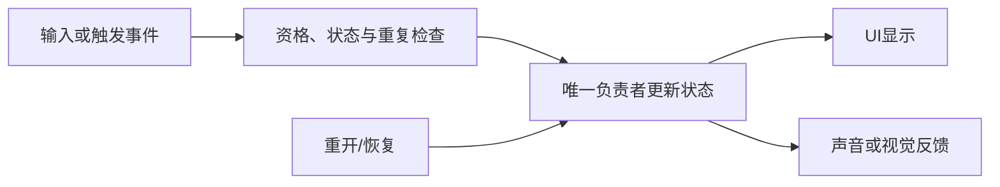

---
{
  "id": "B06",
  "prerequisites": ["B05", "A04"],
  "revisit": ["A04", "A03", "A05"],
  "memory": ["KN16", "KN06", "KN07", "TH04"],
  "labs": ["practice/godot/labs/event_lab.tscn", "practice/godot/scenes/main.tscn"]
}
---
# B06｜拾取只算一次：事件、条件与状态

**先从这里开始：** 两次领取请求看起来一样，结果为什么可能不同？保留默认设置先正常领取一次，再选择你想查的一件事；内部记录需要时再展开。

**今天做什么：** 解释从进入检测区到计数变化的因果链，并抵抗重复触发。

**从哪里开始：** 打开事件Lab，先保留默认设置。做一次正常请求，再选择一个自己想确认的条件；内部记录可以在预测后展开。

**现成材料：** [event_lab.tscn](../../practice/godot/labs/event_lab.tscn)、[main.tscn](../../practice/godot/scenes/main.tscn)

**材料边界：** 事件Lab只有一枚物品，按钮明确注入请求，不是Area碰撞。提供隐藏外观、隐藏计数、关闭反馈、内部记录和一层防重故障；另一件物品与真实接近在主游戏检查。没有同步重入或第二层防重开关，不把题目构造当成本实验已实现的控件。

先试当前这一小步。可以说“给我线索”“示范一小步”或“直接解释”；也可以指认、画图或演示，不必长篇回答。可以暂停，不必先答对才求助。

### 开始对话

```text
我在学B06《拾取只算一次：事件、条件与状态》，请按这份教案带我自学。
先用“先从这里开始”进入当前任务，一次只推进一小步；等我回应后再展开提示或解释。
请把“这次多看一层”融入当前任务，替换重复讲解或备用题，不新增一轮作业。
先听我的预测或疑问，再按需要给线索；我完全不熟悉时可以先看小示范。
我可以查菜单/API、看示范或请AI实现；学到的因果关系要由我说明。
课程里的备用题按需选，不要全部变作业；伙伴分享一次就够了。
```

<details data-audience="reference">
<summary>需要时看：解释、对照与候选练习</summary>

**带学提醒（按当前需要使用）：** 已有解释时让学员选择验证，不先报字段名。只缺按钮位置就指出；仍困惑则用一次真实前后记录示范，帮助后不要求假装独立发现。

## 这次多看一层

**先留一个问题：** “两次请求看起来一样，游戏凭什么决定第二次能不能领取？”先按原规则正常领取一次，再说你准备看什么来解释第二次的结果。暂不展开内部记录，不要求猜字段名。

**你来选一个验证：** 先说自己的解释。想分清“看不见”与“已经领过”，可以恢复全部初值，只切“暂时隐藏物品外观”，在发请求前后分别观察；也可以选择原来的一次／重复请求对照。只做其中一条，不把所有按钮点一遍当作推理。请先说两种解释会对你选的操作作出什么不同预测；提不出时由AI示范一个对照。

**试过再解释：** 按需展开“查看内部记录与故障对照”，把自己刚才那次请求的前后记录与画面对应。记录来自这次运行，不是参考答案。再沿[event_lab.gd](../../practice/godot/labs/event_lab.gd)中的`request_collect`看一次条件、状态变化和刷新，不要求手写整个函数。

**把发现带走：** 回到原收集游戏，用同一颗的重复接近与另一颗的首次接近检验刚才的解释。没有实际运行就只保留预测。最后可以说一句“我原先认为……，这次证据让我改成……”；原先就猜对，则说什么证据让你更有把握。不强求改口或惊讶。

**给AI的引导：** 初次未知先示范；已知条件下先听解释，再让学员选择能区分原因的操作，不能替他编造预测。猜错不制造羞耻，猜对不制造假故障。按需使用原P1或D2，不追加题；D2的同步重入是明示构造情境。解释后再联系A03外观职责和A05时间变化，为B08保留一个真实例子。比较“本局同一件”与“另一件／新一局”，不要总结成所有事件只能发生一次。

## 学到这里就够了

**M｜需要会判断和应用：**
- `B06.M1` 区分事件发生、条件过滤和状态归属。
- `B06.M2` 验证正确对象只计一次，错误对象不计。

**K｜知道用途，用到再查：**
- `B06.K1` 延迟释放表示对象不会在调用那一瞬间完全消失。

**停止线：** 不做通用事件总线、背包、网络同步；只讲一条清晰事件链。

**前置：** [B05](B05.md)、[A04](A04.md)

## 必要解释

事件告诉别人发生了什么；状态保存目前是什么。星星负责检测和防重复，关卡拥有总进度，UI读取它。看得见消失并不等于奖励处理正确。

先确认对象合法，再同步锁定已消耗状态，再通知计数。实际参考工程可能有两层防重；删掉一层未必马上重计。故障实验必须注明观察的是哪层，不能伪造结果。



这是因果／职责示意，不是实际运行截图；不能显示Mermaid时用等价方框图。初次先做一个小例子，需要解释时再用图。

## 在现成实验里试

**初始条件：** 一枚物品，计数0，一次性保护开启；计数可见，内部记录与故障项默认收起。没有隐藏的自动出题或学习评分。
**可比较的条件：** 角色请求、装饰球请求、连续两次请求；另选隐藏物品外观、计数显示或反馈中的一个。内部记录显示每次请求的对象、接受／拒绝及前后状态，最多保留最近12条。

复用“这次多看一层”选出的对照，不另做完整一轮。原规则仍要覆盖正确对象、错误对象和重复请求，可复用已经观察到的证据。

**观察：** 先看现象，再按需看同一次请求的记录。内部记录的`count`、`taken`来自实验真实状态；它们不是主游戏的字段命名保证。
**不符时先查：** 展开内部记录后可关闭一层保护，再发请求复现重复奖励；这不是D2的通知重入模型。主游戏若有第二层防重，应读实际实现，不保证删一层必然重计。
**恢复：** “重开这局”清空本局状态和请求记录，保留开关；“恢复本实验全部初值”连故障、隐藏和记录开关一起恢复。故障不带到作品。

只比较一个条件，恢复后再试下一个。课堂模拟应标清示意，真实软件行为需要实际观察；缺文件如实说明，不让学员临时重造系统。

### 软件入口与亲调

- Godot：Area检测对象、信号连接、Inspector中的调试状态。
- 会定位：事件Lab内部记录、`request_collect`；主游戏的关卡计数拥有者由AI读工程后指出。
- 按需查：signal连接语法、queue_free生命周期细节。

|选中哪里／参数|只改什么|看什么|
|---|---|---|
|Area3D形状资源（主游戏）|只调检测半径，先记录基线|接近多近触发，是否远处意外拾取|
|事件Lab外观／内部记录开关|一次只改变一个条件|请求前后状态与画面是否按预测变化|

运行中临时改动不等于已保存；要留下设计选择，请在自己的副本中写回场景／资源，保存并重新打开检查。

## 我负责什么，AI帮什么

**我的判断：** 定义正确对象、状态拥有者及一次性奖励；提出一个解释并选择怎样检查，不从星星消失推断计数正确。
**可交给AI：** 定位实际状态与关键代码，解释看不懂的一步；只复用已有请求与记录控件。
**检查重点：** 检查AI是否先发事件再锁定、只隐藏对象未限制奖励，或混淆实验与主游戏的防重层次。

结果不符时，先指出预期与实际的一处差别。有解释就试着验证；没有解释可请AI定位入口、给线索或示范。只改可恢复副本，不删需求或测试来掩盖错误。

## 怎样知道这一小步做到了

- 用自己的话说明检测、过滤、防重、通知和显示；能对应到一条真实记录，而不只背顺序。
- 正确对象只加一次、错误对象不加；重复请求的实际状态符合规则，换另一件物品或重开后还能解释。

**恢复后再检查：** 墙还挡人；第二颗仍可拾取；不要用最大显示数量掩盖重复状态。

有提示也是学习进展；没有实际观察就不宣称已经验证。一个对照和解释可以覆盖多个要点，不要求填写评分表。

## 候选问题

先自己判断，再按需看反馈。P是预测、D是诊断、T是迁移、K是用途；按本次需要选一题，不要求全部完成。教学情境不是实测日志。

### B06-P1

一条收到请求日志和一条星星消失记录，能证明只奖励一次吗？还要比较哪个状态或接受/拒绝记录？

### B06-D2

【教学构造情境，不是真实测量或某模型故障统计】本题仅一层防重：检查未消费→发通知→标消费。通知的一个监听者会同步再次请求同一星星。日志出现两次加分。AI把Label限制在10以内。你怎样修顺序并验证实际状态，不只修显示？

### B06-T3

把星星改成加能量的果实，应复用与改动哪些部分？

### B06-K4

延迟释放为什么值得认识？

<details>
<summary>可选补充题：替换本次练习，不叠加作业</summary>

### KN07-T｜迁移

Mask正确但没收到拾取事件，选择一个下一步检查项，并说如何验证；不要求背完整排错清单。

### KN16-P｜预测

把UI文字当作星星数量的唯一存储合理吗？同一物体重复触发应改变几次状态？

</details>

</details>

## 这一课要记在脑海里

- 事件不等于状态。
- 消失不等于只计一次。
- 先锁状态，再发通知。

**记忆清单：** [KN16](../memory.md#kn16) · [KN06](../memory.md#kn06) · [KN07](../memory.md#kn07) · [TH04](../memory.md#th04)。用到时先想一项；想不起可看例子，再换个条件。不要求逐字背诵。

## 讲给爸爸听

想分享时，可以先展示今天的一处选择、发现或仍没想通的问题，不要求完整讲课。用自己的话讲讲：事件、状态、一次性规则。

**给他演示：** 选你刚才验证的一次变化，请爸爸先猜，再展示真实记录；不用背课件结论。

**你们一起问：** 你原来的解释得到了支持还是需要修改？换成另一件物品，怎样检查它还适用？

爸爸还有问题就接着问，你也可以问爸爸。一起看、一起试，不必背稿、打分或填表。爸爸暂时不在就稍后分享，不影响继续自学。

<details data-purpose="project">
<summary>需要改自己的作品时再看</summary>

**生产阶段：** P2

**想得到的结果：** 符合条件的玩家触发一次事件，状态拥有者只记录一次。
**必须保留：** 移动、镜头、模型和总目标数量不变；不新增背包或全局事件总线。

先读取自己的工作副本。以下是可选局部实现，不是打开现成实验的前置，也不要求再做一整轮：

- 先只连接一颗星的正确玩家检测与计数，显示事件日志，不先堆特效。
- 测试同次重复调用与第二颗独立拾取；分清物体防重和关卡去重的两层作用。

**采用依据：** 正确对象计一次、错误对象不计，有日志或演示。
**换一个场景想想：** 把奖励从星数改为能量，只改变相应状态和显示，不改整个输入系统。

参考工程的通过结论不自动覆盖你改过的版本；相关路线实际走一遍，必要时恢复。

</details>

## 下次怎样想起来

前面已学过的复现入口：[A04](A04.md)、[A03](A03.md)、[A05](A05.md)。
下次碰到相似问题时，可先回想一项关系，再查需要的解释；想不起就补一个小例子，不重学整课。暂停时愿意就留“下次从哪里接着试”，没有笔记也能继续，API和菜单仍可查。

## 依据

- [Godot Area3D：重叠检测与信号](https://docs.godotengine.org/en/stable/classes/class_area3d.html)
- [Godot Resources：共享和引用](https://docs.godotengine.org/en/stable/tutorials/scripting/resources.html)
- [Godot运行检查与可见碰撞工具](https://docs.godotengine.org/en/stable/tutorials/scripting/debug/overview_of_debugging_tools.html)

技术来源支持概念边界；课程顺序与任务是本项目设计，不代表已经证明学习效果。
