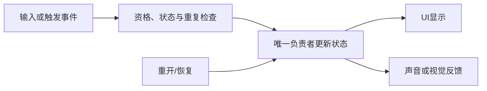

---
{
  "id": "B06",
  "prerequisites": [
    "B05",
    "A04"
  ],
  "revisit": [
    "A04",
    "A03",
    "A05"
  ],
  "memory": [
    "KN16",
    "KN06",
    "KN07",
    "TH04"
  ],
  "labs": [
    "practice/godot/labs/event_lab.tscn",
    "practice/godot/scenes/main.tscn"
  ]
}
---
# B06｜拾取只算一次：事件、条件与状态

**今天做什么：** 解释从进入检测区到计数变化的因果链，并抵抗重复触发。

**从哪里开始：** 在事件Lab先发一次正确对象请求，再发错误对象和同帧双请求，比较计数。

**现成材料：** [event_lab.tscn](../../practice/godot/labs/event_lab.tscn)、[main.tscn](../../practice/godot/scenes/main.tscn)

**材料边界：** 按钮注入事件用于时序与状态实验，不伪称鼠标点击就是Area碰撞；真实拾取在主游戏，故障开关不带到成品。

先观察或猜一猜，动手试一项，再说说为什么。完全陌生可以先看一个小示范；做完当前小步就可以暂停。

### 开始对话

```text
我在学B06《拾取只算一次：事件、条件与状态》，请按这份教案带我自学。
一次只推进一个有意义的小步，先用现成材料，不先替我作判断。
请把“这次多看一层”融入当前任务，替换重复讲解或备用题，不新增一轮作业。
我可以查菜单/API、看示范或请AI实现；学到的因果关系要由我说明。
课程里的备用题按需选，不要全部变作业；伙伴分享一次就够了。
```

## 这次多看一层

**从画面结果追到世界记住了什么。** 先做原来的一次拾取，不额外建工程。发送第二次请求前，先预测它应不应该成功；然后对照同一个对象的消耗标记、关卡数量和接受／拒绝日志。只看星星消失不作为结论。

比较同一颗重复请求与另一颗首次请求：二者画面很像，为什么预期可能不同？请指出记录分别属于哪件物品、哪一局。恢复后再试一次，把“本局只领一次”的边界说清，而不是把所有事件都当成只能发生一次。

**给AI的引导：** 先用正确小例子，再按需给一个可恢复的重复故障；本段复用P1或D2，不追加题目。联系A03的外观职责，再与A05的时间更新比较，但只追踪本课这一条事件链。学习者卡住时明确示范一次状态前后变化，再换对象试，不靠连续猜谜等待顿悟。为B08保留这次真实观察，记录一句发现即可。

<details data-audience="reference">
<summary>需要时看：解释、对照与候选练习</summary>

## 学到这里就够了

**M｜需要会判断和应用：**
- `B06.M1` 区分事件发生、条件过滤和状态归属。
- `B06.M2` 验证正确对象只计一次，错误对象不计。

**K｜知道用途，用到再查：**
- `B06.K1` 延迟释放表示对象不会在调用那一瞬间完全消失。

**停止线：** 不做通用事件总线、背包、网络同步；只讲一条清晰事件链。

**前置：** [B05](B05.md)、[A04](A04.md)

## 必要解释

事件告诉别人发生了什么；状态保存目前是什么。星星负责检测和防重复，关卡拥有总进度，UI读取它。看得见消失并不等于奖励处理正确。

先确认对象合法，再同步锁定已消耗状态，再通知计数。实际参考工程可能有两层防重；删掉一层未必马上重计。故障实验必须注明观察的是哪层，不能伪造结果。



这是因果／职责示意，不是实际运行截图；不能显示Mermaid时用等价方框图。

## 在现成实验里试

**初始条件：** 玩家/装饰球二选一进入星星；事件日志、consumed和计数同屏；课堂只启用一层可见防重。
**可比较的条件：** 进入按钮、同帧两次按钮、合法对象切换、consumed防重开关；教师可选双层对照。

下面说明要比较的关系；实际从上面的现成文件与首步进入，不为匹配教学控件名重新搭建。

1. 先画检测→过滤→防重→通知→显示五张卡顺序。
2. 测试错误对象、正确对象、同帧重复请求。
3. 开启第二层防重，说明某一层关闭为什么仍可能不多加。

**观察：** 每条日志显示接受或拒绝原因；计数来自状态，不从粒子或消失效果推断。
**不符时先查：** 教学故障明确为通知监听者同步重入，唯一防重写在通知之后；普通顺序调用两次不一定重现。多层防重时分别观察接受/拒绝记录，不捏造重计结果。
**恢复：** 星星、计数、消耗标记和日志全复位，不只重画星星。

只比较一个条件，恢复后再试下一个。课堂模拟应标清示意，真实软件行为需要实际观察；缺文件如实说明，不让学员临时重造系统。

### 软件入口与亲调

- Godot：Area检测对象、信号连接、Inspector中的调试状态。
- 会定位：关卡计数拥有者、输出日志。
- 按需查：signal连接语法、queue_free生命周期细节。

|选中哪里／参数|只改什么|看什么|
|---|---|---|
|Area3D形状资源（内置）|只调检测半径，先记录基线|接近多近触发，是否远处意外拾取|
|节点信号/运行日志（入口）|观察一次与重复请求，不靠改UI数字修正|事件次数、状态变化与对象释放之间的区别|

运行中临时改动不等于已保存；要留下设计选择，请在自己的副本中写回场景／资源，保存并重新打开检查。

## 我负责什么，AI帮什么

**我的判断：** 定义正确对象、状态拥有者及一次性奖励；不从星星消失推断计数正确。
**可交给AI：** 提供逐事件日志和可控同步重入/重复请求工具，标出是否有第二层去重。
**检查重点：** 检查AI是否先发事件再锁定、只隐藏对象未限制奖励，或混淆两层防重。

结果不符：说清预期、实际与复现步骤；先提出一个可推翻的原因，再做最小验证。修改前留基线，不删需求或测试来消除报错。

## 怎样知道这一小步做到了

- 用自己的话说明检测、过滤、防重、通知和显示；计数归关卡而非特效。
- 正确对象只加一次、错误对象不加；用已说明的重入或重复测试复核，而不是只看消失。

**恢复后再检查：** 墙还挡人；第二颗仍可拾取；不要用最大显示数量掩盖重复状态。

有提示也是学习进展；没有实际观察就不宣称已经验证。一个对照和解释可以覆盖多个要点，不要求填写评分表。

## 候选问题

先自己判断，再按需看反馈。P是预测、D是诊断、T是迁移、K是用途；按本次需要选一题，不要求全部完成。教学情境不是实测日志。

### B06-P1

一条收到请求日志和一条星星消失记录，能证明只奖励一次吗？还要比较哪个状态或接受/拒绝记录？

### B06-D2

【教学构造情境，不是真实测量或某模型故障统计】本题仅一层防重：检查未消费→发通知→标消费。通知的一个监听者会同步再次请求同一星星。日志出现两次加分。AI把Label限制在10以内。你怎样修顺序并验证实际状态，不只修显示？

### B06-T3

把星星改成加能量的果实，应复用与改动哪些部分？

### B06-K4

延迟释放为什么值得认识？

<details>
<summary>可选补充题：替换本次练习，不叠加作业</summary>

### KN07-T｜迁移

Mask正确但没收到拾取事件，选择一个下一步检查项，并说如何验证；不要求背完整排错清单。

### KN16-P｜预测

把UI文字当作星星数量的唯一存储合理吗？同一物体重复触发应改变几次状态？

</details>

</details>

## 这一课要记在脑海里

- 事件不等于状态。
- 消失不等于只计一次。
- 先锁状态，再发通知。

**记忆清单：** [KN16](../memory.md#kn16) · [KN06](../memory.md#kn06) · [KN07](../memory.md#kn07) · [TH04](../memory.md#th04)。先遮住解释，用自己的话说，再举例；不是照抄定义。

## 讲给爸爸听

在今天的关键地方或结束时，选一次和爸爸分享。用自己的话讲讲：事件、状态、一次性规则。

**给他演示：** 做收集规则裁判：先预测重复触发会怎样，再验证同一个物品不会重复计数。

**你们一起问：** 同一时刻来了两次请求，只把星星藏起来就一定够了吗？

爸爸还有问题就接着问，你也可以问爸爸。一起看、一起试，不必背稿、打分或填表。爸爸暂时不在就稍后分享，不影响继续自学。

<details data-purpose="project">
<summary>需要改自己的作品时再看</summary>

**生产阶段：** P2

**想得到的结果：** 符合条件的玩家触发一次事件，状态拥有者只记录一次。
**必须保留：** 移动、镜头、模型和总目标数量不变；不新增背包或全局事件总线。

先读取自己的工作副本。以下是可选局部实现，不是打开现成实验的前置，也不要求再做一整轮：

- 先只连接一颗星的正确玩家检测与计数，显示事件日志，不先堆特效。
- 测试同次重复调用与第二颗独立拾取；分清物体防重和关卡去重的两层作用。

**采用依据：** 正确对象计一次、错误对象不计，有日志或演示。
**换一个场景想想：** 把奖励从星数改为能量，只改变相应状态和显示，不改整个输入系统。

参考工程的通过结论不自动覆盖你改过的版本；相关路线实际走一遍，必要时恢复。

</details>

## 下次怎样想起来

前面已学过的复现入口：[A04](A04.md)、[A03](A03.md)、[A05](A05.md)。
隔一段时间不看答案，再解释本课的一项关键关系；换一个对象或条件应用。记住词也要会用，API和菜单位置可以查。疑问笔记可选，没有笔记也仍有公共必记清单。

## 依据

- [Godot Area3D：重叠检测与信号](https://docs.godotengine.org/en/stable/classes/class_area3d.html)
- [Godot Resources：共享和引用](https://docs.godotengine.org/en/stable/tutorials/scripting/resources.html)
- [Godot运行检查与可见碰撞工具](https://docs.godotengine.org/en/stable/tutorials/scripting/debug/overview_of_debugging_tools.html)

技术来源支持概念边界；课程顺序与任务是本项目设计，不代表已经证明学习效果。
