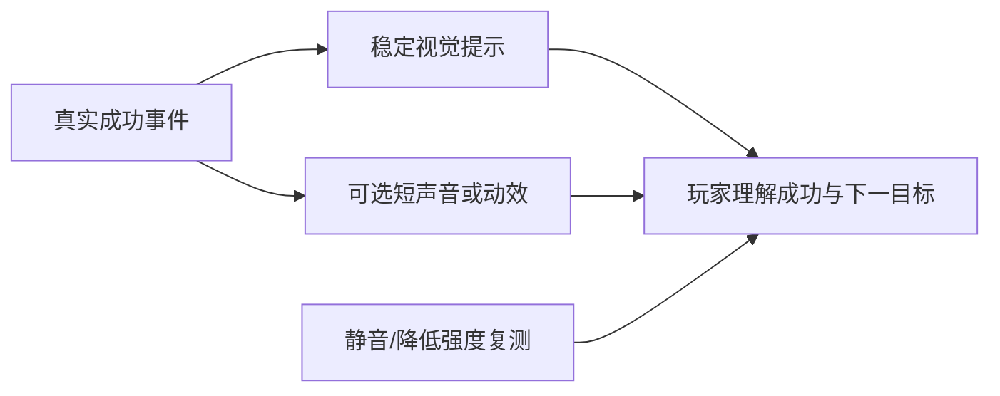

---
{
  "id": "B07",
  "prerequisites": [
    "B06"
  ],
  "revisit": [
    "B06",
    "B03"
  ],
  "memory": [
    "KN18",
    "TH03"
  ],
  "labs": [
    "practice/godot/labs/event_lab.tscn",
    "practice/godot/scenes/main.tscn"
  ]
}
---
# B07｜反馈：让玩家知道刚才成功了

**先从这里开始：** 不靠声音，你怎样知道刚才领取成功了？选一处你愿意保留的视觉反馈，和关闭它时比较，不必把所有特效都加上。

**今天做什么：** 设计静音也能辨认的拾取反馈，不靠过亮和大粒子堆效果。

**从哪里开始：** 在事件Lab切换可见反馈，比较成功计数和显示；再观察主游戏真实拾取。

**现成材料：** [event_lab.tscn](../../practice/godot/labs/event_lab.tscn)、[main.tscn](../../practice/godot/scenes/main.tscn)

**材料边界：** 现成反馈与规则分离；本Lab未提供完整音频/粒子/打击感库，不以反馈关掉判规则失败。

先试当前这一小步。可以说“给我线索”“示范一小步”或“直接解释”；也可以指认、画图或演示，不必长篇回答。可以暂停，不必先答对才求助。

### 开始对话

```text
我在学B07《反馈：让玩家知道刚才成功了》，请按这份教案带我自学。
先用“先从这里开始”进入当前任务，一次只推进一小步；等我回应后再展开提示或解释。
我可以查菜单/API、看示范或请AI实现；学到的因果关系要由我说明。
课程里的备用题按需选，不要全部变作业；伙伴分享一次就够了。
```

<details data-audience="reference">
<summary>需要时看：解释、对照与候选练习</summary>

**带学提醒（按当前需要使用）：** 反馈强弱由可读性和舒适度决定。没有声音素材也能开始；不要用突然强闪或震屏制造惊喜，不把喜欢安静当参与不足。

## 学到这里就够了

**M｜需要会判断和应用：**
- `B07.M1` 把成功状态与视觉反馈明确对应。
- `B07.M2` 比较反馈强度，检查不遮挡目标且静音可辨。

**K｜知道用途，用到再查：**
- `B07.K1` Tween、粒子、空间音效是可选表现工具。
- `B07.K2` 短促Camera impulse、轻微FOV/Size Pulse属于可选强调；静音与低镜头运动时仍应能读懂结果。

**停止线：** 不学整套音频工程和特效节点；不把华丽程度当评分依据。

**前置：** [B06](B06.md)

## 必要解释

反馈服务于玩家识别：我碰到了吗、拿到了吗、还剩什么。稳定计数、短动效和声音可以互补；只有声音时静音玩家可能错过。

先做一项短反馈，再调持续时间和强度。持续闪烁、过强光晕或全屏效果可能遮住下一目标；偏好必须通过实际观察而不是口头说更刺激。

固定视角特别适合“局部效果清楚、镜头效果克制”的反馈分层：先有目标本身的缩放/闪光/消失，再加少量粒子与声音；重要事件才考虑一次很短的镜头冲击。镜头效果是加分层，不是成功状态本身。



这是因果／职责示意，不是实际运行截图；不能显示Mermaid时用等价方框图。

## 在现成实验里试

**初始条件：** 已有计数的拾取场景示意；一颗星；视觉提示持续0.3秒；声音默认关闭。
**可比较的条件：** 提示开关、持续0.1到0.8秒、强度低/中/高、静音、减少动态效果。

下面说明要比较的关系；实际从上面的现成文件与首步进入，不为匹配教学控件名重新搭建。

1. 先预测只靠声音时静音会漏掉什么。
2. 保持计数不变，比较三档反馈强度，指出遮挡。
3. 低动态模式下用稳定图标和文字继续表达成功。

**观察：** 反馈必须由成功事件触发；失败接触不得播放成功效果。提供无音频替代而非自动播放声音。
**不符时先查：** 故障：错误对象碰星也显示成功；修触发条件，不能仅换颜色掩盖。
**恢复：** 清空短效果、恢复未拾取状态、保留用户静音设置。

只比较一个条件，恢复后再试下一个。课堂模拟应标清示意，真实软件行为需要实际观察；缺文件如实说明，不让学员临时重造系统。

### 软件入口与亲调

- Godot：动画时长、透明度/缩放等暴露参数、音量。
- 会定位：AnimationPlayer/Tween入口、Audio Bus。
- 按需查：粒子材质、空间衰减与混音技术。

|选中哪里／参数|只改什么|看什么|
|---|---|---|
|反馈时长（项目自定义）|先短再稍长，固定位置和其他强度|是否可察觉、是否挡住下一目标|
|声音音量/静音与视觉提示（内置/入口）|先静音走一次，再调合适音量|没有声音是否还能判断；不以音量越大越好|

运行中临时改动不等于已保存；要留下设计选择，请在自己的副本中写回场景／资源，保存并重新打开检查。

## 我负责什么，AI帮什么

**我的判断：** 规定玩家应感知的成功信息及强度，不把播放特效等同于奖励成功。
**可交给AI：** 把反馈接在已确认的成功结果后，给出静音与弱效果选项。
**检查重点：** 检查AI是否把反馈加入每帧逻辑、用高强度闪烁，或随星星释放提前结束声音。

结果不符时，先指出预期与实际的一处差别。有解释就试着验证；没有解释可请AI定位入口、给线索或示范。只改可恢复副本，不删需求或测试来掩盖错误。

## 怎样知道这一小步做到了

- 在成功和拒绝两种情境核对反馈，静音时仍能辨认结果。
- 在实际游戏机位调一次强度/时长，保证目标和路径不被遮挡。

**恢复后再检查：** 一次拾取只加一次；连拾两颗不会长时间遮挡界面。

有提示也是学习进展；没有实际观察就不宣称已经验证。一个对照和解释可以覆盖多个要点，不要求填写评分表。

## 候选问题

先自己判断，再按需看反馈。P是预测、D是诊断、T是迁移、K是用途；按本次需要选一题，不要求全部完成。教学情境不是实测日志。

### B07-P1

合法拾取和被拒绝接触都播放成功声，但只有前者计数。你认为什么反馈应保留、什么应取消？静音还需要什么？

### B07-D2

【教学构造情境，不是真实测量或某模型故障统计】成功拾取和错误对象进入都会播放庆祝粒子，但只有前者增加计数。AI建议把粒子做得更亮帮助判断。你应核对哪个触发条件，如何同时验证成功、拒绝和静音？

### B07-T3

无声环境中如何保留拾取信息？

### B07-K4

Tween适合什么？

<details>
<summary>可选补充题：替换本次练习，不叠加作业</summary>

### KN18-P｜预测

静音后完全不知道是否拾取，缺什么？

### KN18-T｜迁移

用户不适应强闪烁时，如何减少刺激而保留清楚的成功反馈？

</details>

</details>

## 这一课要记在脑海里

- 反馈要对应真实成功。
- 静音也能辨认。
- 少量清楚胜过大量遮挡。

**记忆清单：** [KN18](../memory.md#kn18) · [TH03](../memory.md#th03)。用到时先想一项；想不起可看例子，再换个条件。不要求逐字背诵。

## 讲给爸爸听

想分享时，可以先展示今天的一处选择、发现或仍没想通的问题，不要求完整讲课。用自己的话讲讲：成功规则、状态、反馈。

**给他演示：** 做反馈设计师：展示一次真实收集，把规则变化与声音、画面反馈分开讲。

**你们一起问：** 动画很好看，但没有真正收集成功，该先修哪一部分？

爸爸还有问题就接着问，你也可以问爸爸。一起看、一起试，不必背稿、打分或填表。爸爸暂时不在就稍后分享，不影响继续自学。

<details data-purpose="project">
<summary>需要改自己的作品时再看</summary>

**生产阶段：** P2/P9

**想得到的结果：** 短动效或声音配合稳定视觉提示，静音时仍能判断成功。
**必须保留：** 奖励次数、检测距离和游戏状态不变，效果不能决定计数。

先读取自己的工作副本。以下是可选局部实现，不是打开现成实验的前置，也不要求再做一整轮：

- 只在已有成功拾取事件后加一个稳定视觉反馈，不先加声音粒子全套。
- 再选择一种短动作或声音，调强度并复查是否遮挡下个目标。

**采用依据：** 静音也能判断是否成功，反馈不先于真实事件。
**换一个场景想想：** 给开门成功设计不同反馈，避免与拾取提示混淆。

参考工程的通过结论不自动覆盖你改过的版本；相关路线实际走一遍，必要时恢复。

</details>

## 下次怎样想起来

前面已学过的复现入口：[B06](B06.md)、[B03](B03.md)。
下次碰到相似问题时，可先回想一项关系，再查需要的解释；想不起就补一个小例子，不重学整课。暂停时愿意就留“下次从哪里接着试”，没有笔记也能继续，API和菜单仍可查。

## 依据

- [Godot AnimationTree：动画组织](https://docs.godotengine.org/en/stable/tutorials/animation/animation_tree.html)
- [Godot运行检查与可见碰撞工具](https://docs.godotengine.org/en/stable/tutorials/scripting/debug/overview_of_debugging_tools.html)

技术来源支持概念边界；课程顺序与任务是本项目设计，不代表已经证明学习效果。
