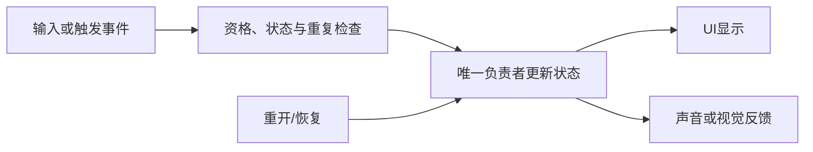

---
{
  "id": "B08",
  "prerequisites": ["B07"],
  "revisit": ["B06", "B07", "A03", "A05"],
  "memory": ["KN16", "KN18", "TH04"],
  "labs": ["practice/godot/labs/event_lab.tscn", "practice/godot/scenes/main.tscn"]
}
---
# B08｜UI、完成和重开：状态只有一个来源

**先从这里开始：** 先想一想：把计数藏起来，领取一次，再让计数出现，你会看到什么？你可以先试或要一条线索，不急着给完整解释。

**今天做什么：** 验证计数、完成和重开一致，并在窗口变化后仍可读。

**从哪里开始：** 在事件Lab先预测“隐藏计数再领取会怎样”，只切“显示计数”作对照；完整十星、完成、重开及窗口布局回到主游戏检查。

**现成材料：** [event_lab.tscn](../../practice/godot/labs/event_lab.tscn)、[main.tscn](../../practice/godot/scenes/main.tscn)

**材料边界：** 事件Lab只有一枚物品，可隐藏计数、保留真实状态并重开；它没有0/1/3目标选择器，也不替代十星完成循环。改变目标数量属于明示课堂推演或自己的作品副本，不伪称现成控件。

先试当前这一小步。可以说“给我线索”“示范一小步”或“直接解释”；也可以指认、画图或演示，不必长篇回答。可以暂停，不必先答对才求助。

### 开始对话

```text
我在学B08《UI、完成和重开：状态只有一个来源》，请按这份教案带我自学。
先用“先从这里开始”进入当前任务，一次只推进一小步；等我回应后再展开提示或解释。
请把“这次多看一层”融入当前任务，替换重复讲解或备用题，不新增一轮作业。
先听我的预测或疑问，再按需要给线索；我完全不熟悉时可以先看小示范。
我可以查菜单/API、看示范或请AI实现；学到的因果关系要由我说明。
课程里的备用题按需选，不要全部变作业；伙伴分享一次就够了。
```

<details data-audience="reference">
<summary>需要时看：解释、对照与候选练习</summary>

**带学提醒（按当前需要使用）：** 先听一个预期，再运行；两种显示都可打开检查，不设答对才解锁。提炼共同关系之前，让学员先联系一个确实做过的旧例子。

## 这次多看一层

**先留一个问题：** “把计数藏起来，再发出领取请求，然后让计数重新出现，你预计看到什么？”保持默认保护开启，暂不展开内部记录。先说自己的预期，也可以直接说暂时不知道。

**你来选一个验证：** 你打算怎样区分“没显示”和“没有发生”？先自行选步骤；需要入口提示时才定位“显示计数”开关。实验前后保留同一局、同一对象，别同时重开和关闭保护。已经做过等价对照就复用，不再演一遍。

**试过再解释：** 按需展开真实内部记录，找出自己那次请求前后的变化。再回看A03换外观、A05移动和B06拾取中实际做过的两个例子：哪些关系相似，哪些不同？先让学员提出联系，再由AI明确帮助把[TH04的原因链](../memory.md#th04)整理出来；不期待孩子凭空发明理论。

**把发现带走：** 让学员自己选一个已学的小变化作下一次预测，例如只改变反馈或窗口，不先告诉结论。能用刚才的关系说清“哪些应该变化、哪些保持”，再用原任务验证。解释不符就修正；发现共同关系后立即用回游戏，不停在背一串箭头。

**给AI的引导：** B08是有引导的提炼，不冒充独立迁移。初始只给上面的问题和必要操作入口，不把图、记忆答案和归因结论一屏放出。若学员已经准确解释，就进入一个尚未试过的变式，不故意让他猜错。最多先给一条具体线索；仍无从判断就示范一小步。没有做过的旧例子只作补例，不凭课号推定经历。保留主游戏完成／重开和窗口检查，不预演B13答案，也不要求每个人都产生“顿悟”。

## 学到这里就够了

**M｜需要会判断和应用：**
- `B08.M1` 区分状态与显示，检查最后一次拾取和重开。
- `B08.M2` 检查基本UI布局与信息层级。

**K｜知道用途，用到再查：**
- `B08.K1` Anchors/Containers是布局手段，具体选项用时查。

**停止线：** 不做通用UI框架、复杂菜单系统或数据库。

**前置：** [B07](B07.md)

## 必要解释

UI显示进度，不应成为另一个独立真相。关卡状态改变后通知显示；藏起计数不应让完成条件失效。

结尾边界比中间更容易暴露问题：零目标、一目标、最后一个、重开。小窗口也要能找到进度和重开，不要求学习全部Control节点。零目标采用哪种规则要事先约定，不把一种项目选择当作引擎定律。



这是因果／职责示意，不是实际运行截图；不能显示Mermaid时用等价方框图。先联系具体经历，再明确解释关系。

## 在现成实验里试

**初始条件：** 事件Lab计数0，计数显示开启，内部记录收起；真实主游戏有十星循环。
**可比较的条件：** Lab的“显示计数”、领取、重复请求和重开；主游戏的最后一个、再次开局与实际窗口宽度。

复用“这次多看一层”的显示对照。然后在主游戏走完原来的完成与重开，缩窄窗口观察进度和按钮；一次只检查一个关系，不把Lab说成完整关卡。

**观察：** 关闭计数显示时仍可发请求，重新显示或主动展开记录后核对真实状态。查看记录本身不是游戏操作，不改变计数。
**不符时先查：** B08-D2的“只重画不重置”属于教学构造，现成Lab不故意执行该坏重开；可以用其正常状态作为比较，不编造故障按钮。
**恢复：** Lab“重开这局”恢复本局状态并清记录，保留开关；“恢复本实验全部初值”同时恢复显示等设置。主游戏另按自己的重开流程验证。

只比较一个条件，恢复后再试下一个。课堂模拟应标清示意，真实软件行为需要实际观察；缺文件如实说明，不让学员临时重造系统。

### 软件入口与亲调

- Godot：Label文本、基本容器布局、运行窗口尺寸。
- 会定位：事件Lab的显示开关与内部记录；主游戏的状态更新连接。
- 按需查：复杂响应式布局、完整UI主题系统。

|选中哪里／参数|只改什么|看什么|
|---|---|---|
|Control/Container布局（内置入口）|改变窗口大小，检查边距和可见性|计数和重开按钮是否被裁掉|
|Label字号与提示文案（内置/内容）|一次只改字号或文案|能否快速看懂，不靠华丽度评分|

运行中临时改动不等于已保存；要留下设计选择，请在自己的副本中写回场景／资源，保存并重新打开检查。

## 我负责什么，AI帮什么

**我的判断：** 提出怎样分清显示与状态的变化，指出进度来源与重开应恢复的状态，决定显示如何随窗口变化。
**可交给AI：** 定位实际状态和UI连接，按我的选择实现局部调整，不另建UI计数器。
**检查重点：** 检查AI是否用字符串当唯一状态、显示归零但物品未恢复，或写死总数。

结果不符时，先指出预期与实际的一处差别。有解释就试着验证；没有解释可请AI定位入口、给线索或示范。只改可恢复副本，不删需求或测试来掩盖错误。

## 怎样知道这一小步做到了

- 用显示对照解释真实状态；在主游戏收齐后重开并再次拾取，状态为1/10且未完成，而不是只改文字。
- 缩窄窗口后进度与重开按钮仍可见、可操作，选择布局调整并保存后重新运行。

**恢复后再检查：** 重开后星星可再次拾取，镜头和输入正常；总数从场景状态核对。

有提示也是学习进展；没有实际观察就不宣称已经验证。一个对照和解释可以覆盖多个要点，不要求填写评分表。

## 候选问题

先自己判断，再按需看反馈。P是预测、D是诊断、T是迁移、K是用途；按本次需要选一题，不要求全部完成。教学情境不是实测日志。

### B08-P1

隐藏计数Label应不应该停止计分？

### B08-D2

【教学构造情境，不是真实测量或某模型故障统计】一局收齐后点击重开，UI显示0/10，但第一颗星拾取后立即显示完成。AI建议把完成提示延迟两秒。需要对照哪几类状态，怎样验证不是只重置了文字？

### B08-T3

总目标临时改为1且窗口变窄。怎样复用已有循环，分别检验完成/重开与进度/按钮可见性？

### B08-K4

容器布局解决什么？

<details>
<summary>可选补充题：替换本次练习，不叠加作业</summary>

### KN16-T｜迁移

新道具改为加能量，哪些触发步骤可复用，哪个状态需要换？谁更新UI？

</details>

</details>

## 这一课要记在脑海里

- UI不是另一个计数器。
- 最后一个和重开一定测。
- 功能对了还要看得见。

**记忆清单：** [KN16](../memory.md#kn16) · [KN18](../memory.md#kn18) · [TH04](../memory.md#th04)。用到时先想一项；想不起可看例子，再换个条件。不要求逐字背诵。

## 讲给爸爸听

想分享时，可以先展示今天的一处选择、发现或仍没想通的问题，不要求完整讲课。用自己的话讲讲：界面状态、布局、重开。

**给他演示：** 选一次你自己想明白的显示／状态变化，再演示完成和重开中与它有关的一步，不另做发布会。

**你们一起问：** 这件事让你想起之前哪个例子？能用刚才的发现预测一个还没试过的变化吗？

爸爸还有问题就接着问，你也可以问爸爸。一起看、一起试，不必背稿、打分或填表。爸爸暂时不在就稍后分享，不影响继续自学。

<details data-purpose="project">
<summary>需要改自己的作品时再看</summary>

**生产阶段：** P2/P3

**想得到的结果：** 可从开始走到完成再重开，UI始终读同一状态来源。
**必须保留：** 拾取判定、奖励来源和角色参数保持。

先读取自己的工作副本。以下是可选局部实现，不是打开现成实验的前置，也不要求再做一整轮：

- 先只让HUD读取现有关卡状态，不让UI自己保存另一份权威计数。
- 再测完成和重开，改窗口尺寸检查提示不被裁掉。

**采用依据：** 显示与关卡数量一致，包括最后一颗星。
**换一个场景想想：** 把目标数改为较少数量，不修改多处硬编码UI来凑对。

参考工程的通过结论不自动覆盖你改过的版本；相关路线实际走一遍，必要时恢复。

</details>

## 下次怎样想起来

前面已学过的复现入口：[B06](B06.md)、[B07](B07.md)、[A03](A03.md)、[A05](A05.md)。
下次碰到相似问题时，可先回想一项关系，再查需要的解释；想不起就补一个小例子，不重学整课。暂停时愿意就留“下次从哪里接着试”，没有笔记也能继续，API和菜单仍可查。

## 依据

- [Godot Resources：共享和引用](https://docs.godotengine.org/en/stable/tutorials/scripting/resources.html)
- [Godot AnimationTree：动画组织](https://docs.godotengine.org/en/stable/tutorials/animation/animation_tree.html)
- [Godot运行检查与可见碰撞工具](https://docs.godotengine.org/en/stable/tutorials/scripting/debug/overview_of_debugging_tools.html)

技术来源支持概念边界；课程顺序与任务是本项目设计，不代表已经证明学习效果。
