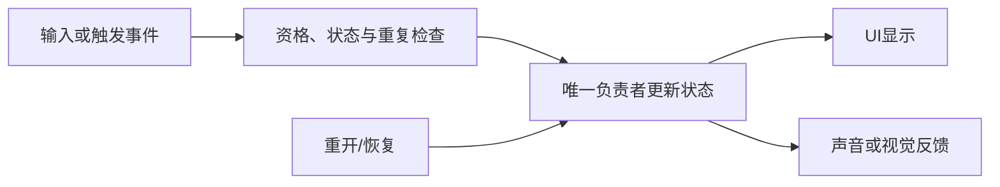

---
{
  "id": "B08",
  "prerequisites": [
    "B07"
  ],
  "revisit": [
    "B06",
    "B07",
    "A03",
    "A05"
  ],
  "memory": [
    "KN16",
    "KN18",
    "TH04"
  ],
  "labs": [
    "practice/godot/labs/event_lab.tscn",
    "practice/godot/scenes/main.tscn"
  ]
}
---
# B08｜UI、完成和重开：状态只有一个来源

**今天做什么：** 验证计数、完成和重开一致，并在窗口变化后仍可读。

**从哪里开始：** 先在事件Lab完成、重开并再次请求，再在主游戏改变窗口检查布局。

**现成材料：** [event_lab.tscn](../../practice/godot/labs/event_lab.tscn)、[main.tscn](../../practice/godot/scenes/main.tscn)

**材料边界：** 事件Lab有独立状态和显示、可重复重开；主游戏的完整十星与窗口布局仍分别实测。

先观察或猜一猜，动手试一项，再说说为什么。完全陌生可以先看一个小示范；做完当前小步就可以暂停。

### 开始对话

```text
我在学B08《UI、完成和重开：状态只有一个来源》，请按这份教案带我自学。
一次只推进一个有意义的小步，先用现成材料，不先替我作判断。
请把“这次多看一层”融入当前任务，替换重复讲解或备用题，不新增一轮作业。
我可以查菜单/API、看示范或请AI实现；学到的因果关系要由我说明。
课程里的备用题按需选，不要全部变作业；伙伴分享一次就够了。
```

## 这次多看一层

**第一次把具体经验拎成共同关系。** 先完成本课隐藏显示／重开的对照，再回看A03换外观、A05移动、B06拾取中已经实际做过的例子。没有做过的只作简短补例，不凭课号假定掌握。

先用自己的话比较：“哪些只是显示变化？哪些改变了游戏真正记住的东西？什么让变化发生？”随后请AI明确帮助整理，而不是等你自己猜出全部理论：把[TH04的原因链](../memory.md#th04)分别对应到位置更新和拾取计数；时间与事件怎样推进变化，按A05、B06的已学条件解释，不把所有变化都说成鼠标点击。

**马上用回本课：** 复用B08-T3，总目标换成1、窗口变窄。你先指出自己预计哪些内部事实改变、哪些只影响显示，再运行核对。允许口述或画几个方框，不要求填完整数据表。能复述链条但无法对应到实际状态时，回到同一段运行查清，不增加理论。

**给AI的引导：** 本段是有引导的提炼，不冒充独立迁移。先比较，后点明，再应用；共享概念仍查记忆清单，不新增术语考试。帮助学习者指出实际状态来源与更新入口；后续B13再用未揭示的任务看是否会主动想到，不在这里预演B13答案。

<details data-audience="reference">
<summary>需要时看：解释、对照与候选练习</summary>

## 学到这里就够了

**M｜需要会判断和应用：**
- `B08.M1` 区分状态与显示，检查最后一次拾取和重开。
- `B08.M2` 检查基本UI布局与信息层级。

**K｜知道用途，用到再查：**
- `B08.K1` Anchors/Containers是布局手段，具体选项用时查。

**停止线：** 不做通用UI框架、复杂菜单系统或数据库。

**前置：** [B07](B07.md)

## 必要解释

UI显示进度，不应成为另一个独立真相。关卡状态改变后通知显示；藏起计数不应让完成条件失效。

结尾边界比中间更容易暴露问题：零目标、一目标、最后一个、重开。小窗口也要能找到进度和重开，不要求学习全部Control节点。



这是因果／职责示意，不是实际运行截图；不能显示Mermaid时用等价方框图。

## 在现成实验里试

**初始条件：** 任务总数3，状态0/3；显示计数、完成标记与重开按钮。
**可比较的条件：** 合法拾取、重复事件、隐藏计数、重开、窗口宽1280/640、总数0/1/3。

下面说明要比较的关系；实际从上面的现成文件与首步进入，不为匹配教学控件名重新搭建。

1. 先预测隐藏UI后是否还能完成。
2. 按顺序拿到最后一个，重复触发，再重开两次。
3. 缩窄窗口，查是否遮挡、裁切或不能操作。

**观察：** 独立显示内部状态供教师核对，初始对学生隐藏；总数0采用明确约定而不算普遍引擎规则。
**不符时先查：** 故障：重开只重画星星，不清空计数；学员解释需要重置哪些状态。
**恢复：** 目标列表、计数、完成标记和UI一致；不能只改显示字符串。

只比较一个条件，恢复后再试下一个。课堂模拟应标清示意，真实软件行为需要实际观察；缺文件如实说明，不让学员临时重造系统。

### 软件入口与亲调

- Godot：Label文本、基本容器布局、运行窗口尺寸。
- 会定位：Control锚点、状态更新连接。
- 按需查：复杂响应式布局、完整UI主题系统。

|选中哪里／参数|只改什么|看什么|
|---|---|---|
|Control/Container布局（内置入口）|改变窗口大小，检查边距和可见性|计数和重开按钮是否被裁掉|
|Label字号与提示文案（内置/内容）|一次只改字号或文案|能否快速看懂，不靠华丽度评分|

运行中临时改动不等于已保存；要留下设计选择，请在自己的副本中写回场景／资源，保存并重新打开检查。

## 我负责什么，AI帮什么

**我的判断：** 指出唯一进度来源与重开应恢复的状态，决定显示如何随窗口变化。
**可交给AI：** 提供状态/显示并排记录和0/1/正常总数测试，不另建UI计数器。
**检查重点：** 检查AI是否用字符串当唯一状态、显示归零但物品未恢复，或写死总数。

结果不符：说清预期、实际与复现步骤；先提出一个可推翻的原因，再做最小验证。修改前留基线，不删需求或测试来消除报错。

## 怎样知道这一小步做到了

- 隐藏UI仍更新权威进度；收齐后重开并再次拾取，实际状态为1/10且未完成。
- 缩窄窗口后进度与重开按钮仍可见、可操作，选择布局调整并保存后重新运行。

**恢复后再检查：** 重开后星星可再次拾取，镜头和输入正常；总数从场景状态核对。

有提示也是学习进展；没有实际观察就不宣称已经验证。一个对照和解释可以覆盖多个要点，不要求填写评分表。

## 候选问题

先自己判断，再按需看反馈。P是预测、D是诊断、T是迁移、K是用途；按本次需要选一题，不要求全部完成。教学情境不是实测日志。

### B08-P1

隐藏计数Label应不应该停止计分？

### B08-D2

【教学构造情境，不是真实测量或某模型故障统计】一局收齐后点击重开，UI显示0/10，但第一颗星拾取后立即显示完成。AI建议把完成提示延迟两秒。需要对照哪几类状态，怎样验证不是只重置了文字？

### B08-T3

总目标临时改为1且窗口变窄。怎样复用已有循环，分别检验完成/重开与进度/按钮可见性？

### B08-K4

容器布局解决什么？

<details>
<summary>可选补充题：替换本次练习，不叠加作业</summary>

### KN16-T｜迁移

新道具改为加能量，哪些触发步骤可复用，哪个状态需要换？谁更新UI？

</details>

</details>

## 这一课要记在脑海里

- UI不是另一个计数器。
- 最后一个和重开一定测。
- 功能对了还要看得见。

**记忆清单：** [KN16](../memory.md#kn16) · [KN18](../memory.md#kn18) · [TH04](../memory.md#th04)。先遮住解释，用自己的话说，再举例；不是照抄定义。

## 讲给爸爸听

在今天的关键地方或结束时，选一次和爸爸分享。用自己的话讲讲：界面状态、布局、重开。

**给他演示：** 做试玩主持人：改变窗口后检查界面，再重开并拾取第一颗星星。

**你们一起问：** 标题显示重新开始，但计数没有复位，怎样发现和描述这个问题？

爸爸还有问题就接着问，你也可以问爸爸。一起看、一起试，不必背稿、打分或填表。爸爸暂时不在就稍后分享，不影响继续自学。

<details data-purpose="project">
<summary>需要改自己的作品时再看</summary>

**生产阶段：** P2/P3

**想得到的结果：** 可从开始走到完成再重开，UI始终读同一状态来源。
**必须保留：** 拾取判定、奖励来源和角色参数保持。

先读取自己的工作副本。以下是可选局部实现，不是打开现成实验的前置，也不要求再做一整轮：

- 先只让HUD读取现有关卡状态，不让UI自己保存另一份权威计数。
- 再测完成和重开，改窗口尺寸检查提示不被裁掉。

**采用依据：** 显示与关卡数量一致，包括最后一颗星。
**换一个场景想想：** 把目标数改为较少数量，不修改多处硬编码UI来凑对。

参考工程的通过结论不自动覆盖你改过的版本；相关路线实际走一遍，必要时恢复。

</details>

## 下次怎样想起来

前面已学过的复现入口：[B06](B06.md)、[B07](B07.md)、[A03](A03.md)、[A05](A05.md)。
隔一段时间不看答案，再解释本课的一项关键关系；换一个对象或条件应用。记住词也要会用，API和菜单位置可以查。疑问笔记可选，没有笔记也仍有公共必记清单。

## 依据

- [Godot Resources：共享和引用](https://docs.godotengine.org/en/stable/tutorials/scripting/resources.html)
- [Godot AnimationTree：动画组织](https://docs.godotengine.org/en/stable/tutorials/animation/animation_tree.html)
- [Godot运行检查与可见碰撞工具](https://docs.godotengine.org/en/stable/tutorials/scripting/debug/overview_of_debugging_tools.html)

技术来源支持概念边界；课程顺序与任务是本项目设计，不代表已经证明学习效果。
