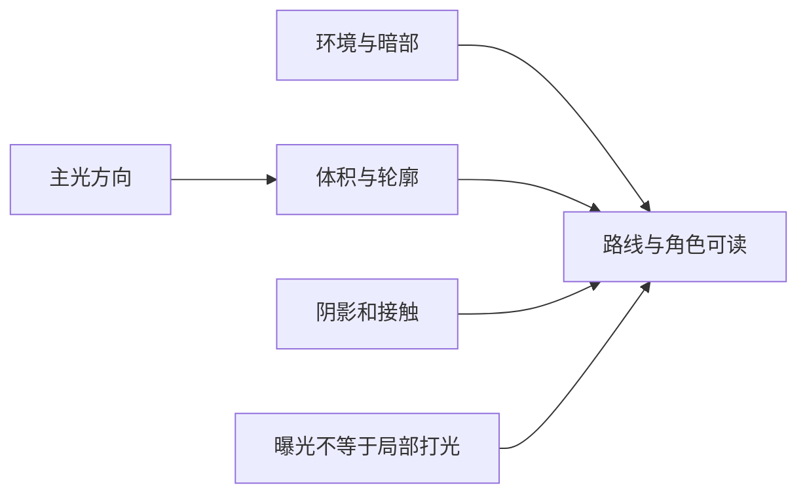

---
{
  "id": "B09",
  "prerequisites": [
    "B08",
    "B03"
  ],
  "revisit": [
    "B04",
    "B03"
  ],
  "memory": [
    "KN13",
    "KN25",
    "TH03"
  ],
  "labs": [
    "practice/godot/scenes/visual_lab.tscn"
  ]
}
---
# B09｜柔和光照：先让目标被看见

**今天做什么：** 在同一机位做两版光照，说明哪版更符合温暖卡通目标。

**从哪里开始：** 固定FOV，只改主光强度，对照亮面、暗部和目标。

**现成材料：** [visual_lab.tscn](../../practice/godot/scenes/visual_lab.tscn)

**材料边界：** 光强样例，不包含所有环境光/阴影配置。

先观察或猜一猜，动手试一项，再说说为什么。完全陌生可以先看一个小示范；做完当前小步就可以暂停。

### 开始对话

```text
我在学B09《柔和光照：先让目标被看见》，请按这份教案带我自学。
一次只推进一个有意义的小步，先用现成材料，不先替我作判断。
我可以查菜单/API、看示范或请AI实现；学到的因果关系要由我说明。
课程里的备用题按需选，不要全部变作业；伙伴分享一次就够了。
```

<details data-audience="reference">
<summary>需要时看：解释、对照与候选练习</summary>

## 学到这里就够了

**M｜需要会判断和应用：**
- `B09.M1` 区分主光、环境与阴影，一次只调一项。
- `B09.M2` 用主体可辨性而非越亮越好来验收。

**K｜知道用途，用到再查：**
- `B09.K1` 曝光、色调映射、GI与烘焙解决不同问题。

**停止线：** 不要求全部GI方案，不把Blender最终渲染等同于游戏效果。

**前置：** [B08](B08.md)、[B03](B03.md)

## 必要解释

主光帮助读体积，环境影响暗部，阴影帮助读接触关系。全局提亮可能让背景和角色一起失去层次，不等于解决主体不清楚。

卡通或绘本可以有柔和暖色，但可玩目标仍须从背景中区分。用同机位同材质对照，才能知道光照修改带来的作用。



这是因果／职责示意，不是实际运行截图；不能显示Mermaid时用等价方框图。

## 在现成实验里试

**初始条件：** 小屋、角色与星星；固定材质、相机和渲染模式；一盏方向光及环境填充。
**可比较的条件：** 主光能量0.5到2、方向两档、环境弱/中、阴影开关；曝光作为观察项不强制操作。

下面说明要比较的关系；实际从上面的现成文件与首步进入，不为匹配教学控件名重新搭建。

1. 先指出第一眼看到什么，再选一项目标：更柔和或更清晰。
2. 只改光方向观察体积；恢复后只改环境观察暗部。
3. 切到简化灰度对比，检查星星与背景是否仍区分。

**观察：** A/B同机位切换，记录光参数；灰度只是明暗检查手段，不自动判审美。
**不符时先查：** 故障：为照亮角色把所有灯都加亮，目标融入背景；要求局部与对比方案，不无脑加灯。
**恢复：** 恢复材质、灯光、环境与机位；保留选定风格目标。

只比较一个条件，恢复后再试下一个。课堂模拟应标清示意，真实软件行为需要实际观察；缺文件如实说明，不让学员临时重造系统。

### 软件入口与亲调

- Godot：DirectionalLight3D能量/方向、WorldEnvironment基本环境、阴影。
- 会定位：渲染器名称、曝光和色调映射。
- 按需查：GI类型、反射探针、烘焙参数。

|选中哪里／参数|只改什么|看什么|
|---|---|---|
|DirectionalLight3D > Energy/light_energy（内置）|先从记录原值小幅增减，其他项不动|星星、路线与暗角，而不是全图越亮越好|
|光源Rotation（内置）|固定能量，只改入射方向|是否更能读出门框、平台边缘和主体轮廓|

运行中临时改动不等于已保存；要留下设计选择，请在自己的副本中写回场景／资源，保存并重新打开检查。

## 我负责什么，AI帮什么

**我的判断：** 选择温暖与清晰的取舍，在相同机位先亲调一个可见参数。
**可交给AI：** 按已提供参考标注借鉴特征，提供只改主光的可撤销初稿。
**检查重点：** 检查AI是否通过曝光或全部Emission补偿、未经确认切换渲染器，或声称参考图参数能一比一还原。

结果不符：说清预期、实际与复现步骤；先提出一个可推翻的原因，再做最小验证。修改前留基线，不删需求或测试来消除报错。

## 怎样知道这一小步做到了

- 一次只改主光方向/强度或环境，记录固定条件与观察差异。
- 入口、路口和回望机位检查星星/路线可辨，并解释风格取舍。

**恢复后再检查：** 收集、完成、重开、镜头都正常；有性能基线后再复测相同路线。

有提示也是学习进展；没有实际观察就不宣称已经验证。一个对照和解释可以覆盖多个要点，不要求填写评分表。

## 候选问题

先自己判断，再按需看反馈。P是预测、D是诊断、T是迁移、K是用途；按本次需要选一题，不要求全部完成。教学情境不是实测日志。

### B09-P1

黄星与黄墙都很亮，再增加全局亮度能保证找到星星更快吗？提出一个不改变全场风格的局部比较。

### B09-D2

【教学构造情境，不是真实测量或某模型故障统计】AI的傍晚图更亮，但同时改了曝光、星星材质和灯光；原目标仅改变主光。你能把改善归因于灯吗？如何回到可比较状态，再决定先拖哪一个滑杆？

### B09-T3

温暖黄昏场景中黄色星星融入背景，怎样保留风格又能识别？

### B09-K4

烘焙与实时光照为什么要区分？

<details>
<summary>可选补充题：替换本次练习，不叠加作业</summary>

### KN13-T｜迁移

换了渲染器后同样参数画面不同，应该先确认哪些条件，而不是立即重写材质？

### KN25-P｜预测

角色很暗，应该同时改所有材质、灯光和曝光吗？你先固定哪些条件？

### K06｜用途

一个效果在演示里有、本机没有，是否值得先核对渲染器和功能条件？

</details>

</details>

## 这一课要记在脑海里

- 先辨主体，再加气氛。
- 同机位做A/B。
- 发亮与照明分别验收。

**记忆清单：** [KN13](../memory.md#kn13) · [KN25](../memory.md#kn25) · [TH03](../memory.md#th03)。先遮住解释，用自己的话说，再举例；不是照抄定义。

## 讲给爸爸听

在今天的关键地方或结束时，选一次和爸爸分享。用自己的话讲讲：主光、暗部、目标可读性。

**给他演示：** 做灯光师：固定机位和材质，只改主光一项，比较角色、主路和阴影。

**你们一起问：** 画面整体更亮了，就一定更容易找到目标吗？

爸爸还有问题就接着问，你也可以问爸爸。一起看、一起试，不必背稿、打分或填表。爸爸暂时不在就稍后分享，不影响继续自学。

<details data-purpose="project">
<summary>需要改自己的作品时再看</summary>

**生产阶段：** P4/P9

**想得到的结果：** 柔和主光下路线可读，目标与背景有足够区分。
**必须保留：** 相机FOV、曝光基线、材质、碰撞、拾取和UI保持；需要改它们时先说明原因。

先读取自己的工作副本。以下是可选局部实现，不是打开现成实验的前置，也不要求再做一整轮：

- 先记录固定机位、主光、环境与曝光原值，只按我标出的参考特征给主光初稿。
- 再微调暗部或阴影一项，不用全场Emission来掩盖问题。

**采用依据：** 我能用同机位对照说明路线和星星是否更清楚。
**换一个场景想想：** 把星星放到另一个阴影角落，不全场加光，而先定位影响来源。

参考工程的通过结论不自动覆盖你改过的版本；相关路线实际走一遍，必要时恢复。

</details>

## 下次怎样想起来

前面已学过的复现入口：[B04](B04.md)、[B03](B03.md)。
隔一段时间不看答案，再解释本课的一项关键关系；换一个对象或条件应用。记住词也要会用，API和菜单位置可以查。疑问笔记可选，没有笔记也仍有公共必记清单。

## 依据

- [Blender Principled BSDF：当前手册入口](https://docs.blender.org/manual/en/latest/render/shader_nodes/shader/principled.html)
- [Godot General optimization：测量与取舍](https://docs.godotengine.org/en/stable/tutorials/performance/general_optimization.html)
- [Godot运行检查与可见碰撞工具](https://docs.godotengine.org/en/stable/tutorials/scripting/debug/overview_of_debugging_tools.html)

技术来源支持概念边界；课程顺序与任务是本项目设计，不代表已经证明学习效果。
