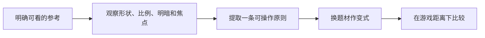

---
{
  "id": "B10",
  "prerequisites": [
    "B03",
    "B09"
  ],
  "revisit": [
    "B01",
    "B03"
  ],
  "memory": [
    "ART06",
    "ART05",
    "TH01"
  ],
  "labs": [
    "practice/godot/scenes/visual_lab.tscn"
  ]
}
---
# B10｜看大师不只收藏：从参考到观察再到变式

**今天做什么：** 完成一次有观察问题、有取舍、有变式的作品研习。

**从哪里开始：** 将一条参考规则用于同机位对照，解释为什么不继续加细节。

**现成材料：** [visual_lab.tscn](../../practice/godot/scenes/visual_lab.tscn)

**材料边界：** 参考来源由学员提供；Lab是原创示意，不是假大师截图。

先观察或猜一猜，动手试一项，再说说为什么。完全陌生可以先看一个小示范；做完当前小步就可以暂停。

### 开始对话

```text
我在学B10《看大师不只收藏：从参考到观察再到变式》，请按这份教案带我自学。
一次只推进一个有意义的小步，先用现成材料，不先替我作判断。
我可以查菜单/API、看示范或请AI实现；学到的因果关系要由我说明。
课程里的备用题按需选，不要全部变作业；伙伴分享一次就够了。
```

<details data-audience="reference">
<summary>需要时看：解释、对照与候选练习</summary>

## 学到这里就够了

**M｜需要会判断和应用：**
- `B10.M1` 看作品时定位焦点、轮廓、色块、光线和细节层级。
- `B10.M2` 提取一条原则，在新主题里复用，不把复制具体形象当原创。

**K｜知道用途，用到再查：**
- `B10.K1` Moodboard、Thumbnail、Study分别服务参考整理、缩略构图和局部研习。

**停止线：** 不要求完整复刻大师作品；没有授权不把原图打包进公开仓库或课件。

**前置：** [B03](B03.md)、[B09](B09.md)

## 必要解释

收藏很多图不自动提高判断。每次只选一张、只问一个问题：主体为何突出，树为何有节奏，暗部为什么不脏。先写观察，再用少量色块或体块验证。

研习可以只研究构图或冷暖关系。对第三方作品的具体复制、公开展示、训练输入和商业使用要分别核对许可。最稳妥的公共示例用自己制作或许可明确的图，不承诺临摹天然可发布。



这是因果／职责示意，不是实际运行截图；不能显示Mermaid时用等价方框图。

## 在现成实验里试

**初始条件：** 由教师从本文件“依据与观看入口”列出的原作者/机构页面选择可查看作品；与一张原创简化练习图并排。缺素材时保留链接，使用原创构图示意，禁止编造大师图。
**可比较的条件：** 30秒观察、缩略视图、重点区域标注、最多五色概括、隐藏参考、换主题卡。

下面说明要比较的关系；实际从上面的现成文件与首步进入，不为匹配教学控件名重新搭建。

1. 30秒只写第一焦点与理由；再找两处支持它的形状或明暗。
2. 只提取一个原则，用五个体块/色块作观察练习；不要求画得像原作。
3. 隐藏参考，把森林换成小屋场景，使用同一原则并说明哪些形象没复制。

**观察：** 记录观察→假设→尝试→比较，不按相似度单独评分。原作品来源和权利状态始终可追溯。
**不符时先查：** 反例：收藏30张图却说不出一条能执行的规则；缩到一张一问题，做一个变式。
**恢复：** 保留观察笔记，清空临时标注；不自动下载原图。

只比较一个条件，恢复后再试下一个。课堂模拟应标清示意，真实软件行为需要实际观察；缺文件如实说明，不让学员临时重造系统。

### 软件入口与亲调

- 常用：参考板、缩略图、标注与对比。
- 会定位：原作者页面和作品信息。
- 按需查：绘画软件具体工具；不强制学新的大型软件。

|选中哪里／参数|只改什么|看什么|
|---|---|---|
|构图块面草图（设计内容）|只移动主体或一组陪衬形状|视线是否更容易到入口|
|参考与自作对照（观察入口）|同大小看一条原则，不一次学整幅作品|能否解释借鉴的是关系而不是表面图案|

运行中临时改动不等于已保存；要留下设计选择，请在自己的副本中写回场景／资源，保存并重新打开检查。

## 我负责什么，AI帮什么

**我的判断：** 选择一条可见原则和可用参考，区分灵感、具体复制及分发条件。
**可交给AI：** 根据已提供作品协助标注焦点与色块，只做局部研习建议，不编原作来源。
**检查重点：** 检查AI是否虚构作者、把推测当创作意图，或把多收藏当审美进步证据。

结果不符：说清预期、实际与复现步骤；先提出一个可推翻的原因，再做最小验证。修改前留基线，不删需求或测试来消除报错。

## 怎样知道这一小步做到了

- 在实际可见作品中指出焦点及两条支持证据，不以收藏数量计分。
- 隐藏参考后在不同题材使用一条原则，解释保留规则与未照搬形象。

**恢复后再检查：** 入口和星星路线仍实际可用；不为了截图构图封掉道路。

有提示也是学习进展；没有实际观察就不宣称已经验证。一个对照和解释可以覆盖多个要点，不要求填写评分表。

## 候选问题

先自己判断，再按需看反馈。P是预测、D是诊断、T是迁移、K是用途；按本次需要选一题，不要求全部完成。教学情境不是实测日志。

### B10-P1

临摹得越像是否就证明能独立设计？

### B10-D2

【教学构造情境，不是真实测量或某模型故障统计】你收藏了30张森林图。AI据艺术家名字直接替你生成一条街，并称完成临摹训练；没有问你观察到了什么。怎样把练习缩成一图一问题，并检验原则能迁移到街道？

### B10-T3

学习森林构图后设计房屋街道，能迁移什么？

### B10-K4

Moodboard有什么用途？

</details>

## 这一课要记在脑海里

- 每次看图只带一个问题。
- 提取原则后换题材。
- 参考来源和使用许可分别记录。

**记忆清单：** [ART06](../memory.md#art06) · [ART05](../memory.md#art05) · [TH01](../memory.md#th01)。先遮住解释，用自己的话说，再举例；不是照抄定义。

## 讲给爸爸听

在今天的关键地方或结束时，选一次和爸爸分享。用自己的话讲讲：参考规则、取舍、同机位对照。

**给他演示：** 做美术提案人：把一条参考规则用在自己的庭院，说明为什么保留某些空白。

**你们一起问：** 参考作品中的细节全部搬过来，会不会破坏我们的小地图？

爸爸还有问题就接着问，你也可以问爸爸。一起看、一起试，不必背稿、打分或填表。爸爸暂时不在就稍后分享，不影响继续自学。

<details data-purpose="project">
<summary>需要改自己的作品时再看</summary>

**生产阶段：** P4/P8

**想得到的结果：** 一份来源清楚、观察具体的研习卡，以及换题材后的布局选择。
**必须保留：** 现有庭院玩法和风格卡保持；参考观看不自动意味着能公开分发源图。

先读取自己的工作副本。以下是可选局部实现，不是打开现成实验的前置，也不要求再做一整轮：

- 先阅读我提供的一张作品或可访问原作者页面，仅描述看到的证据，缺图就说明。
- 用不同题材和简单块面做原则变式，不复制独特角色或未许可原图。

**采用依据：** 我能提取一条构图或明暗原则，而非只写好看。
**换一个场景想想：** 再看一张主次相反的作品，解释是否适合当前目标。

参考工程的通过结论不自动覆盖你改过的版本；相关路线实际走一遍，必要时恢复。

</details>

## 下次怎样想起来

前面已学过的复现入口：[B01](B01.md)、[B03](B03.md)。
隔一段时间不看答案，再解释本课的一项关键关系；换一个对象或条件应用。记住词也要会用，API和菜单位置可以查。疑问笔记可选，没有笔记也仍有公共必记清单。

## 依据

- [The Walt Disney Family Museum：Mary Blair展览资料](https://www.waltdisney.org/mary-blair)
- [Eyvind Earle官方作品入口（仅链接，保留版权）](https://eyvindearle.com/)
- [Roman Klco / Polygon Runway：风格化3D作品与课程](https://polygonrunway.com/)
- [Grant Abbitt：Blender造型与图形设计](https://www.gabbitt.co.uk/)
- [Godot运行检查与可见碰撞工具](https://docs.godotengine.org/en/stable/tutorials/scripting/debug/overview_of_debugging_tools.html)

技术来源支持概念边界；课程顺序与任务是本项目设计，不代表已经证明学习效果。
