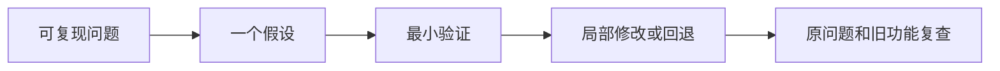

---
{
  "id": "B12",
  "prerequisites": [
    "B11"
  ],
  "revisit": [
    "A03",
    "B04",
    "B06"
  ],
  "memory": [
    "KN20",
    "TH05"
  ],
  "labs": [
    "practice/godot/labs/scene_nodes/broken.tscn",
    "practice/godot/labs/event_lab.tscn",
    "practice/godot/scenes/main.tscn"
  ]
}
---
# B12｜验收AI改动：小假设、小修改、可回退

**先从这里开始：** 选一个能复现的小问题，看看哪一处改动值得先查。你可以请求解释差异，不需要独自修好整份AI代码才算参与。

**今天做什么：** 对一次有缺陷的AI修改提出最小修复与回归方案。

**从哪里开始：** 先在现成故障副本说明实际现象，再提出一个可能原因和最小验证，不先读答案。

**现成材料：** [broken.tscn](../../practice/godot/labs/scene_nodes/broken.tscn)、[event_lab.tscn](../../practice/godot/labs/event_lab.tscn)、[main.tscn](../../practice/godot/scenes/main.tscn)

**材料边界：** 可用A03故障或事件防重故障练排查；工程diff/版本恢复仍用自己的修改记录，不能自动判会。

先试当前这一小步。可以说“给我线索”“示范一小步”或“直接解释”；也可以指认、画图或演示，不必长篇回答。可以暂停，不必先答对才求助。

### 开始对话

```text
我在学B12《验收AI改动：小假设、小修改、可回退》，请按这份教案带我自学。
先用“先从这里开始”进入当前任务，一次只推进一小步；等我回应后再展开提示或解释。
我可以查菜单/API、看示范或请AI实现；学到的因果关系要由我说明。
课程里的备用题按需选，不要全部变作业；伙伴分享一次就够了。
```

<details data-audience="reference">
<summary>需要时看：解释、对照与候选练习</summary>

**带学提醒（按当前需要使用）：** 先确认现象与副本能恢复。学员说“看不懂”时，只读当前相关几行；AI写错应承认并修正，不把排错负担全推给孩子。

## 学到这里就够了

**M｜需要会判断和应用：**
- `B12.M1` 给出复现步骤，限定一个待验证假设。
- `B12.M2` 核对diff与需求，拒绝删除功能式修复。

**K｜知道用途，用到再查：**
- `B12.K1` 自动测试、分支、日志是辅助工具，不是需要背的理论。

**停止线：** 不背Git对象模型，不重构整个项目，不以代码行数评价完成。

**前置：** [B11](B11.md)

## 必要解释

有效报错包含预期、实际、复现、版本和最近改动。先判断所属系统，再让AI提出可证伪的假设；一次改十个地方会让因果消失。

绿色测试也只证明测试覆盖的行为。AI如果删掉碰撞或关掉测试来消除报错，需求仍然失败。提交前核对改动范围和关键回归。



这是因果／职责示意，不是实际运行截图；不能显示Mermaid时用等价方框图。

## 在现成实验里试

**初始条件：** 案例：换外观后玩家穿墙；三张修改卡分别是删碰撞、改错层、纯颜色；只一张引入故障。
**可比较的条件：** 选择假设、查看diff、运行示意回归、回退单次修改；不用真实仓库权限。

下面说明要比较的关系；实际从上面的现成文件与首步进入，不为匹配教学控件名重新搭建。

1. 写预期/实际/最短复现。
2. 选择一个假设与一个测试，先预测结果再看日志。
3. 检查AI修复是否改变原需求，列两个受影响功能回归。

**观察：** 必须把修改卡与症状关联；没有提供日志时标待验证，不让AI声称运行成功。
**不符时先查：** 故障：AI让角色穿过所有墙从而不再卡住；需要恢复阻挡并定位真正卡住原因。
**恢复：** 退回已知正确版本；保存诊断记录但不保存个人账号或密钥。

只比较一个条件，恢复后再试下一个。课堂模拟应标清示意，真实软件行为需要实际观察；缺文件如实说明，不让学员临时重造系统。

### 软件入口与亲调

- 编辑器：错误面板、输出、修改前后对照、回退。
- 会定位：Git提交历史、测试结果。
- 按需查：Git命令、高级调试器和重构模式。

|选中哪里／参数|只改什么|看什么|
|---|---|---|
|Git差异与Godot Output/Debugger（入口）|核对改了哪些文件和首个相关报错|改动是否真的对应假设|
|单一故障字段（内置或自定义，以当前文件为准）|仅恢复目标字段，再重复原步骤|症状是否消失且没有靠扩大范围掩盖|

运行中临时改动不等于已保存；要留下设计选择，请在自己的副本中写回场景／资源，保存并重新打开检查。

## 我负责什么，AI帮什么

**我的判断：** 提出可被否定的一个假设并审阅影响范围，拒绝无证据的全局修复。
**可交给AI：** 读最小复现和最近差异，给局部实验/补丁及实际执行状态。
**检查重点：** 检查AI是否把异常描述当执行证据、重写过多文件或把测试删掉使结果变绿。

结果不符时，先指出预期与实际的一处差别。有解释就试着验证；没有解释可请AI定位入口、给线索或示范。只改可恢复副本，不删需求或测试来掩盖错误。

## 怎样知道这一小步做到了

- 写预期、实际、最短复现及可区分原因的一项验证。
- 比较修改前后差异和相关旧功能，决定保留/回退并说明未知。

**恢复后再检查：** 原失败步骤加至少一条此前成功路径，不要求重测所有无关功能。

有提示也是学习进展；没有实际观察就不宣称已经验证。一个对照和解释可以覆盖多个要点，不要求填写评分表。

## 候选问题

先自己判断，再按需看反馈。P是预测、D是诊断、T是迁移、K是用途；按本次需要选一题，不要求全部完成。教学情境不是实测日志。

### B12-P1

AI报告已修复且没有红字，只附一张画面。原问题是第二次重开后重复计数。现有证据支持什么、尚不能支持什么？

### B12-D2

【教学构造情境，不是真实测量或某模型故障统计】改模型后玩家在同一窄门卡住。差异包含外观变宽、胶囊半径变大两项。AI提议缩小整关卡。你如何用一次可撤销试验区分视觉遮挡与实际碰撞变宽，不删掉门？

### B12-T3

材质突然影响整片森林，你先提供什么信息？

### B12-K4

版本回退的用途是什么？

<details>
<summary>可选补充题：替换本次练习，不叠加作业</summary>

### KN20-T｜迁移

AI用关闭碰撞解决了卡墙。为何不能算完成原需求？你如何回退并重新验证？

</details>

</details>

## 这一课要记在脑海里

- 报错消失不等于功能正确。
- 一次验证一个假设。
- AI没运行就不能说通过。

**记忆清单：** [KN20](../memory.md#kn20) · [TH05](../memory.md#th05)。用到时先想一项；想不起可看例子，再换个条件。不要求逐字背诵。

## 讲给爸爸听

想分享时，可以先展示今天的一处选择、发现或仍没想通的问题，不要求完整讲课。用自己的话讲讲：假设、局部修改、回退。

**给他演示：** 做故障侦探：先说可能原因，只查一处，保存修改前后的证据和恢复点。

**你们一起问：** AI同时改了三个系统后故障消失，为什么仍然不好判断原因？

爸爸还有问题就接着问，你也可以问爸爸。一起看、一起试，不必背稿、打分或填表。爸爸暂时不在就稍后分享，不影响继续自学。

<details data-purpose="project">
<summary>需要改自己的作品时再看</summary>

**生产阶段：** P3

**想得到的结果：** 可以复现、定位一个假设、检查最小改动并恢复基线。
**必须保留：** 不相关场景、资源与已通过功能保持；未经授权不运行破坏性操作。

先读取自己的工作副本。以下是可选局部实现，不是打开现成实验的前置，也不要求再做一整轮：

- 先只复现我提供的一处错误，列出一个假设和保持不变的功能，不直接重写文件。
- 做一处可撤销修复并跑相关旧功能；无改善就恢复原值而非叠加补丁。

**采用依据：** 我能说明怎样触发，以及本次最小对照能排除什么。
**换一个场景想想：** 换一种资源引用故障，使用同样方法而不是背这次答案。

参考工程的通过结论不自动覆盖你改过的版本；相关路线实际走一遍，必要时恢复。

</details>

## 下次怎样想起来

前面已学过的复现入口：[A03](A03.md)、[B04](B04.md)、[B06](B06.md)。
下次碰到相似问题时，可先回想一项关系，再查需要的解释；想不起就补一个小例子，不重学整课。暂停时愿意就留“下次从哪里接着试”，没有笔记也能继续，API和菜单仍可查。

## 依据

- [Godot General optimization：测量与取舍](https://docs.godotengine.org/en/stable/tutorials/performance/general_optimization.html)
- [Godot Resources：共享和引用](https://docs.godotengine.org/en/stable/tutorials/scripting/resources.html)
- [Godot运行检查与可见碰撞工具](https://docs.godotengine.org/en/stable/tutorials/scripting/debug/overview_of_debugging_tools.html)

技术来源支持概念边界；课程顺序与任务是本项目设计，不代表已经证明学习效果。
