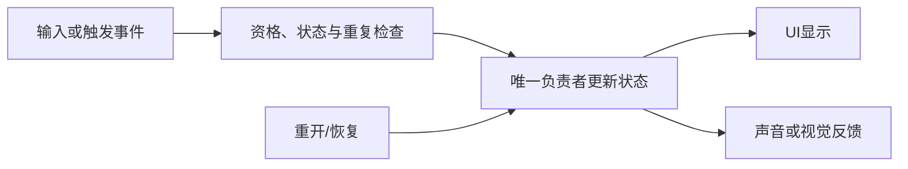

---
{
  "id": "B13",
  "prerequisites": ["B12"],
  "revisit": ["A04", "B04", "B06", "B12", "B08"],
  "memory": ["KN05", "KN06", "KN07", "KN12", "KN16", "KN18", "KN20", "TH01"],
  "labs": ["practice/godot/scenes/main.tscn"]
}
---
# B13｜初级结业：把星星换成另一种可用物品

**今天做什么：** 用已学知识完成一种新拾取物，并证明关键条件没有被破坏。

**从哪里开始：** 先由你选择想做的拾取物，说出最想弄清的一件事；从自己的工作副本开始，不先抄参考方案。

**现成材料：** [main.tscn](../../practice/godot/scenes/main.tscn)

**材料边界：** 完整参考用于比较；检查使用自己的快照和未揭示变式。作品沿用十件收集目标，不因为果实或能量球的外观就新增能量条、货币或背包。

先观察或猜一猜，动手试一项，再说说为什么。完全陌生可以先看一个小示范；做完当前小步就可以暂停。

### 开始对话

```text
我在学B13《初级结业：把星星换成另一种可用物品》，请按这份教案带我自学。
一次只推进一个有意义的小步，先用现成材料，不先替我作判断。
请把“这次多看一层”融入当前任务，替换重复讲解或备用题，不新增一轮作业。
先让我提出第一步；本课的框图、字段提示和参考方案请在我尝试后再用。
我可以查菜单/API、看示范或请AI实现；学到的因果关系要由我说明。
课程里的备用题按需选，不要全部变作业；伙伴分享一次就够了。
```

## 这次多看一层

**先留一个问题：** “你想把其中一件收集物做成什么？为了让它按你的想法工作，你最想先弄清哪件事？”只给目标、已有材料和不做范围，不先列出正确问题清单。问题小到能够试一次即可。

**你来选一个验证：** 在动手或请AI实现前，说说预计会看到什么，以及什么现象会让你重新考虑。可以指着工程说，不必画模型或填表。AI帮助缩小过大的问题，但不替你预先选原因、参数与结论。

**试过再解释：** 用自己的改动前后版本检查预测。选择一次能说明原因的对照，读相关对象的真实状态或关键代码；仅有截图变好看，不能证明内部机制已经理解。若结果与预期不同，先复现，再改一处，不把AI连续尝试当作你的推理。

**把发现带走：** 在已学范围内，自己选一个还没试过的摆放、观察距离或反馈条件，提出新的预测再检查。也可以把这一问题留给下一次，不强制当日完成。愿意时给爸爸演示你的问题和证据，不必说“我顿悟了”。这是原迁移任务中的一个变式，不叠加考试。

**给AI的引导：** 首次回应前，不在初始学生页面展示下方框图、状态字段、逐项检查答案或记忆解释；先让我提出第一步。学员提问不必命中教师预设，但应与目标有关且可验证。完全不会时给一条入口提示；仍无从着手则明确示范一小步，不无限追问。反馈后再联系B08的原因链。刚被示范过的相同做法属于练习，不能算独立发现；下一次换一个未预演条件再观察。不用框架名、代码量或情绪反应判断能力。

<details data-audience="reference">
<summary>需要时看：解释、对照与候选练习</summary>

## 学到这里就够了

**M｜需要会判断和应用：**
- `B13.M1` 迁移外观、检测、一次性状态和反馈。
- `B13.M2` 对AI修改做功能回归并解释结果。

**K｜知道用途，用到再查：**
- `B13.K1` 只抽本阶段已经介绍的用途词，不增加新术语。

**停止线：** 不突然加入敌人、背包、绑定、多人；不要求做完整跨阶段题库。

**前置：** [B12](B12.md)

## 必要解释

迁移不是逐步抄原星星：新道具可能更小、颜色更接近背景，检测与反馈要随用途核对。实现可以由AI完成，选择、预测和验收由学员承担。

用原任务中的正常操作和一次关键异常说明选择、改动范围与结果；已有可靠证据不重做。隔次需要确认时再换一个条件，不强制次日提交或额外填表。不会某项就补对应实验，不重看全部课程。



这是反馈时使用的因果／职责示意，不是实际运行截图；不能显示Mermaid时用等价方框图。先听学员的第一步，不在开场展示完整解法。

## 在现成实验里试

**初始条件：** 已有检测和十件收集流程；果实／能量球可作外观选择，不预先给目标参数。
**可比较的条件：** 外观尺寸、材质、检测范围或反馈；按当前问题选择一项，原有正确／错误对象、重复／重开也要保持。

先使用“这次多看一层”提出的问题与对照。需要帮助时才回到原来的实例和解释；不强制先列完所有状态再创作。

**观察：** 一次真实改动中能说明自己的选择、预测和依据。不按美术复杂度或代码数量判理解，没观察到的写待验证。
**不符时先查：** 有真实问题就从它入手；需要教学故障才明确使用一个可恢复副本，不暗中制造Mask、共享材质和重置三种故障让学员猜。
**恢复：** 保留原星星版本和新方案的可恢复副本，不覆盖参考资产。

只比较一个条件，恢复后再试下一个。课堂模拟应标清示意，真实软件行为需要实际观察；缺文件如实说明，不让学员临时重造系统。

### 软件入口与亲调

- 复用初级已学的Inspector、场景树、材质和检测参数。
- 会定位：日志与版本差异。
- 按需查：语法、菜单路径，不增加新工具。

|选中哪里／参数|只改什么|看什么|
|---|---|---|
|新物品视觉材质与尺寸（内置）|固定机位调整可辨性|与星星是否分得清，实际尺寸是否合理|
|检测形状与原奖励规则|只调检测范围，不同时改外观|接近体验是否符合目标，仍然只计一次|

运行中临时改动不等于已保存；要留下设计选择，请在自己的副本中写回场景／资源，保存并重新打开检查。

## 我负责什么，AI帮什么

**我的判断：** 选择新拾取物的目标、外观与检测范围，提出一个要验证的问题，用证据决定AI修改是否可合入。
**可交给AI：** 只替换视觉／明确配置并准备既有事件回归，不新增背包或角色系统。
**检查重点：** 检查AI是否直接替换全部星星需求，或用两个显示计数掩盖状态耦合。

结果不符：说清预期、实际与复现步骤；先提出一个可推翻的原因，再做最小验证。修改前留基线，不删需求或测试来消除报错。

## 怎样知道这一小步做到了

- 新道具在游戏距离可辨，检测／一次性状态和反馈按需求工作；能把一项选择对应到自己观察的因果关系。
- 比对差异，完成正反对象、重复请求和重开；隔次换另一物体再查关键薄弱点，不把有提示完成当作独立迁移。

**恢复后再检查：** 收齐原星星并重开；重复碰新物品不重复奖励。

有提示也是学习进展；没有实际观察就不宣称已经验证。一个对照和解释可以覆盖多个要点，不要求填写评分表。

## 候选问题

先自己判断，再按需看反馈。P是预测、D是诊断、T是迁移、K是用途；按本次需要选一题，不要求全部完成。教学情境不是实测日志。

### B13-P1

把大星星换成小果实，但检测半径不变。计数逻辑正确是否足够？预测可能的接近体验并说明你要实测哪段过程。

### B13-D2

【教学构造情境，不是真实测量或某模型故障统计】星星换成果实后远处就能拾取；UI和防重正常。AI说计数测试全绿所以完成。已知视觉缩小但检测形状未改。你接受哪些已证实部分，还缺哪一个实走证据？

### B13-T3

换成更小果实但保持容易拾取，怎样取舍？

### B13-K4

本阶段哪些实现可以交AI？

<details data-purpose="project">
<summary>S1｜把一种新物品放回原收集游戏</summary>

前置：B13已完成。只使用已存在的十星循环，在安全副本把其中一件外观换成你选的新物品，外形大小与背景关系不同；总目标仍为十件，不新增能量条、背包或货币。

先由你决定改动范围，再让AI协助。要求玩家能够辨认、到达、取得它；一次成功只计一次；其余物品与原有完成／重开保持。用一句话解释哪项选择由你作出，以及哪条证据支持它。与当前任务相同的操作直接复用，不另做一轮。

下一次可换一处摆放环境或观察距离，判断上次的选择是否仍适用。没有可运行副本时可交方案，实际应用保持待验证。

</details>

</details>

## 这一课要记在脑海里

- 换对象仍会用才算迁移。
- 只补失败的关键能力。
- 代码可外包，验收不能。

**记忆清单：** [KN05](../memory.md#kn05) · [KN06](../memory.md#kn06) · [KN07](../memory.md#kn07) · [KN12](../memory.md#kn12) · [KN16](../memory.md#kn16) · [KN18](../memory.md#kn18) · [KN20](../memory.md#kn20) · [TH01](../memory.md#th01)。先遮住解释，用自己的话说，再举例；不是照抄定义。

## 讲给爸爸听

在今天的关键地方或结束时，选一次和爸爸分享。用自己的话讲讲：需求边界、旧功能、验收。

**给他演示：** 展示你自己选的一处变化，说说原先的预测与后来找到的依据；也可以请爸爸试你提出的小问题。

**你们一起问：** 哪条发现以后还用得上？换一种情境时，什么可能不能照搬？

爸爸还有问题就接着问，你也可以问爸爸。一起看、一起试，不必背稿、打分或填表。爸爸暂时不在就稍后分享，不影响继续自学。

<details data-purpose="project">
<summary>需要改自己的作品时再看</summary>

**生产阶段：** P3

**想得到的结果：** 同庭院出现一种新拾取物，原星星循环保持，修改职责清楚。
**必须保留：** 原星星计数、完成条件、重开、移动和镜头保持。

先读取自己的工作副本。以下是可选局部实现，不是打开现成实验的前置，也不要求再做一整轮：

- 先让我自己提出一种新计数拾取物，说明哪些职责复用；只检查范围，不给完整解。
- 按我的选择协助实现一个版本，换一种情境复测关键理解。

**采用依据：** 我能将外观、检测和计数职责说清，并选出最小修改。
**换一个场景想想：** 隔次换成另一种不改变完成条件的收集物，只抽一个关键判断再验。

参考工程的通过结论不自动覆盖你改过的版本；相关路线实际走一遍，必要时恢复。

</details>

## 下次怎样想起来

前面已学过的复现入口：[A04](A04.md)、[B04](B04.md)、[B06](B06.md)、[B12](B12.md)、[B08](B08.md)。
隔一段时间不看答案，再解释本课的一项关键关系；换一个对象或条件应用。记住词也要会用，API和菜单位置可以查。疑问笔记可选，没有笔记也仍有公共必记清单。

## 依据

- [Godot Area3D：重叠检测与信号](https://docs.godotengine.org/en/stable/classes/class_area3d.html)
- [Godot Resources：共享和引用](https://docs.godotengine.org/en/stable/tutorials/scripting/resources.html)
- [Godot General optimization：测量与取舍](https://docs.godotengine.org/en/stable/tutorials/performance/general_optimization.html)
- [Godot运行检查与可见碰撞工具](https://docs.godotengine.org/en/stable/tutorials/scripting/debug/overview_of_debugging_tools.html)

技术来源支持概念边界；课程顺序与任务是本项目设计，不代表已经证明学习效果。
