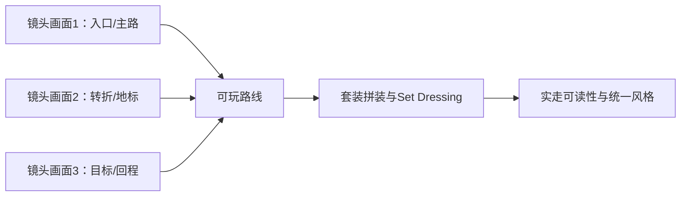

---
{
  "id": "C01",
  "prerequisites": [
    "B13"
  ],
  "revisit": [
    "A03",
    "A04",
    "A08",
    "B11"
  ],
  "memory": [
    "KN01",
    "KN02",
    "KN06",
    "KN10",
    "KN18",
    "KN19",
    "KN22",
    "TH03"
  ],
  "labs": [
    "practice/godot/world/exploration.tscn"
  ]
}
---
# C01｜小地图扩展：用固定镜头串起可探索路线

**今天做什么：** 保留原庭院，增加林间路和观景台；按固定/有限镜头把入口、地标、落点和回程串成小路线。

**从哪里开始：** 先运行三段路线，指出主路、找钥匙的支路和回程；另存副本只改变一个路口。

**现成材料：** [exploration.tscn](../../practice/godot/world/exploration.tscn)

**材料边界：** 三段参考已实现，不等于自己的地图已通过；新路线仍要实走与陌生玩家检验。

先观察或猜一猜，动手试一项，再说说为什么。完全陌生可以先看一个小示范；做完当前小步就可以暂停。

### 开始对话

```text
我在学C01《小地图扩展：用固定镜头串起可探索路线》，请按这份教案带我自学。
一次只推进一个有意义的小步，先用现成材料，不先替我作判断。
我可以查菜单/API、看示范或请AI实现；学到的因果关系要由我说明。
课程里的备用题按需选，不要全部变作业；伙伴分享一次就够了。
```

<details data-audience="reference">
<summary>需要时看：解释、对照与候选练习</summary>

## 学到这里就够了

**M｜需要会判断和应用：**
- `C01.M1` 用地标、通道和回路组织可达路线，不靠单纯放大地面。
- `C01.M2` 在玩家视角验收所有星星、落点和回程，记录一处路线修改的效果。

**K｜知道用途，用到再查：**
- `C01.K1` Blockout、Landmark、Sightline用于灰盒、地标与视线沟通。
- `C01.K2` Camera Zone只在不同区域确有构图需求时使用，不为技术展示而增加。

**停止线：** 不制作开放世界、流送、自由相机或程序化大地图；不靠提高移动速度掩盖空跑。

**前置：** [B13](B13.md)

## 必要解释

地图扩大先问体验，而不是米数。保留庭院作为起点与终点，只增加林间路和观景台；先用方块、坡面和一个清楚地标表达连接。主路应能到达目标，可选支路应知道怎样回主路。第三人称实际视线比俯视草图更能暴露遮挡与落点问题。

初稿维持十颗星，示例分配为庭院3、林路4、观景台3；数字是本课程设计选择。不要把全场景或角色整体Scale放大。先固定原走跑跳与相机基线，再比较通道宽度、拐弯和地标位置。地图具体尺寸应由实走节奏决定，不存在通用正确面积。

先给一个已有参考控制器供试走，不要求这时写新控制器。每次只改变一段路径，记录从哪个观察点开始迷路或空跑；把一次明确的路线修正留下，比制作十条未经试走的支路更有价值。

本项目扩图按“镜头画面”而不是“开放世界面积”思考。每个区域先确认玩家机位、入口、出口和一个主要地标；看不到也到不了的区域不需要同等制作成本。



这是因果／职责示意，不是实际运行截图；不能显示Mermaid时用等价方框图。

## 在现成实验里试

**初始条件：** 三块原创俯视区域卡：庭院、林间路、观景台。主路、可选支路、十颗星和返回点可见；提供俯视与示意玩家视角切换。
**可比较的条件：** 拖动地标和星星、调整一段通道、主路/回程高亮、玩家标记沿路线移动、恢复。均是教学控件。

下面说明要比较的关系；实际从上面的现成文件与首步进入，不为匹配教学控件名重新搭建。

1. 先画主路和返回路径，预测从入口能看见哪个地标；只连接三块区域。
2. 用示意玩家视角检查路口和落点，移开一个遮挡或缩短一段无目的空路。
3. 逐个标记十颗星的到达和返回路线；记录一个还需Godot真机验证的位置。

**观察：** 显示修改前后的路线和迷失点，不把图上的连线视为物理可达证明；真机时以角色实际走到为证。
**不符时先查：** 反例：只把地面扩大十倍，星星仍挤在原处；或放置桥的视觉模型却没有可走路径。
**恢复：** 还原布局与地标，保持控制器和原庭院基线；保存修改方案不覆盖原路线。

只比较一个条件，恢复后再试下一个。课堂模拟应标清示意，真实软件行为需要实际观察；缺文件如实说明，不让学员临时重造系统。

### 软件入口与亲调

- 常用亲调：Godot模块根节点Position、Rotation；块体实际尺寸与简单Shape尺寸分别核对。
- 会定位：当前Camera3D、可见碰撞形状、关卡星星实例及来源。
- 按需查：地形插件、GridMap、导航烘焙；本课不用即不安装。

|选中哪里／参数|只改什么|看什么|
|---|---|---|
|模块根节点Position / 简单几何尺寸（内置）|只调整一个路口的宽度或转向|从玩家高度能否看到下一个地标和落点|
|地标与星星位置（内置Transform）|固定跑速，只移动一个引导点|迷路/空跑是否改善，十星是否都可达|

运行中临时改动不等于已保存；要留下设计选择，请在自己的副本中写回场景／资源，保存并重新打开检查。

## 我负责什么，AI帮什么

**我的判断：** 选择一处路线修正，保持控制器基线，用玩家观察点评估收益。
**可交给AI：** 连接庭院、林路、观景台的最小灰盒和十星清单，不安装大地形系统。
**检查重点：** 检查AI是否只放大地面、增加无目的支路，或为了扩图擅自恢复自由相机。

结果不符：说清预期、实际与复现步骤；先提出一个可推翻的原因，再做最小验证。修改前留基线，不删需求或测试来消除报错。

## 怎样知道这一小步做到了

- 用地标与回路解释路线和回程，避免只有扩大地面。
- 实走十星与返回路；记录一处修改前后迷路/落点/通过性的变化。

**恢复后再检查：** 原庭院的墙碰撞、走跑跳、镜头、拾取计数和重开仍通过。

有提示也是学习进展；没有实际观察就不宣称已经验证。一个对照和解释可以覆盖多个要点，不要求填写评分表。

## 候选问题

先自己判断，再按需看反馈。P是预测、D是诊断、T是迁移、K是用途；按本次需要选一题，不要求全部完成。教学情境不是实测日志。

### C01-P1

地图扩大两倍就一定更好玩吗？

### C01-D2

【教学构造情境，不是真实测量或某模型故障统计】俯视图能从林路到观景台；玩家视角桥入口被大石遮住，镜头也看不到桥面。AI要把跑速翻倍减少空跑。先用哪一个位置的观察，怎样做不改控制器的最小对照？

### C01-T3

把地标换到树林后方，怎样判断还能引导？

### C01-K4

灰盒阶段为什么不用先做高精度树？

</details>

## 这一课要记在脑海里

- 先路线后面积。
- 俯视图连通不等于玩家走得通。
- 扩图不顺便改控制器基线。

**记忆清单：** [KN01](../memory.md#kn01) · [KN02](../memory.md#kn02) · [KN06](../memory.md#kn06) · [KN10](../memory.md#kn10) · [KN18](../memory.md#kn18) · [KN19](../memory.md#kn19) · [KN22](../memory.md#kn22) · [TH03](../memory.md#th03)。先遮住解释，用自己的话说，再举例；不是照抄定义。

## 讲给爸爸听

在今天的关键地方或结束时，选一次和爸爸分享。用自己的话讲讲：主路、返回路径、空间节奏。

**给他演示：** 做地图设计师：先画路，再用代理块扩一个区域，让爸爸实际找路回来。

**你们一起问：** 地图更大了，但玩家不知道往哪里走，应该先补路标还是堆装饰？怎样检验？

爸爸还有问题就接着问，你也可以问爸爸。一起看、一起试，不必背稿、打分或填表。爸爸暂时不在就稍后分享，不影响继续自学。

<details data-purpose="project">
<summary>需要改自己的作品时再看</summary>

**生产阶段：** P1/P7

**想得到的结果：** 三段连续小地图有一个清楚主路与回程，十颗星实际可达。
**必须保留：** 原走跑跳、固定镜头输入规则、十星总数和庭院基线保持。

先读取自己的工作副本。以下是可选局部实现，不是打开现成实验的前置，也不要求再做一整轮：

- 先只为庭院、林路、观景台标三个玩家机位和入口/出口，再连接一条主路；不先做装饰。
- 再移开一个遮挡或调整一个地标；只有跨区确有必要才加入稳定切镜。

**采用依据：** 我能从实际玩家画面说清下一步去哪里并走通主路/回程。
**换一个场景想想：** 换一个地标位置，保留移动基线重新判断路线，不能自动生成更多区域。

参考工程的通过结论不自动覆盖你改过的版本；相关路线实际走一遍，必要时恢复。

</details>

## 下次怎样想起来

前面已学过的复现入口：[A03](A03.md)、[A04](A04.md)、[A08](A08.md)、[B11](B11.md)。
隔一段时间不看答案，再解释本课的一项关键关系；换一个对象或条件应用。记住词也要会用，API和菜单位置可以查。疑问笔记可选，没有笔记也仍有公共必记清单。

## 依据

- [Godot三维性能：先测量，关注透明和绘制成本](https://docs.godotengine.org/en/stable/tutorials/performance/optimizing_3d_performance.html)
- [Godot运行检查与可见碰撞工具](https://docs.godotengine.org/en/stable/tutorials/scripting/debug/overview_of_debugging_tools.html)

技术来源支持概念边界；课程顺序与任务是本项目设计，不代表已经证明学习效果。
