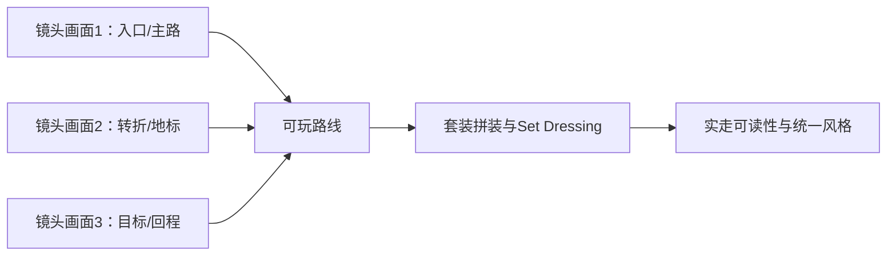

---
{
  "id": "C02",
  "prerequisites": [
    "C01",
    "B10",
    "B09"
  ],
  "revisit": [
    "B01",
    "B03",
    "B04",
    "B09",
    "C01"
  ],
  "memory": [
    "ART01",
    "ART02",
    "ART03",
    "KN12",
    "KN17",
    "KN18",
    "KN25",
    "KN26",
    "TH03"
  ],
  "labs": [
    "practice/godot/scenes/visual_lab.tscn",
    "practice/godot/world/exploration.tscn"
  ]
}
---
# C02｜世界美化：镜头决定世界，套装统一风格

**今天做什么：** 从一个样板转角开始，用资产套装、配色、材质和留白统一三段固定视角小世界，同时保持路线可读。

**从哪里开始：** 先在疏密实验作对照，再用实际玩家镜头检查庭院、林路、观景台的焦点。

**现成材料：** [visual_lab.tscn](../../practice/godot/scenes/visual_lab.tscn)、[exploration.tscn](../../practice/godot/world/exploration.tscn)

**材料边界：** 原生实验与原创资产参考都已备好；视觉选择由真人验收，未冒称商业品质。

先观察或猜一猜，动手试一项，再说说为什么。完全陌生可以先看一个小示范；做完当前小步就可以暂停。

### 开始对话

```text
我在学C02《世界美化：镜头决定世界，套装统一风格》，请按这份教案带我自学。
一次只推进一个有意义的小步，先用现成材料，不先替我作判断。
我可以查菜单/API、看示范或请AI实现；学到的因果关系要由我说明。
课程里的备用题按需选，不要全部变作业；伙伴分享一次就够了。
```

<details data-audience="reference">
<summary>需要时看：解释、对照与候选练习</summary>

## 学到这里就够了

**M｜需要会判断和应用：**
- `C02.M1` 按大形、色彩光照、局部细节的顺序打磨整张地图，明确哪里留空。
- `C02.M2` 用同机位对照及完整实走检查风格、可读性和装饰成本，而非只交一张美图。

**K｜知道用途，用到再查：**
- `C02.K1` Set dressing、Focal point、Negative space用于场景布置、焦点与留白。
- `C02.K2` Facade/Shell、Billboard、Forced Perspective、Parallax（视差）与Atmospheric Perspective（空气透视）是固定视角常用的深度/背景手段；玩家可达处仍按玩法验收。

**停止线：** 不追写实和360度完整世界；不把所有背面、远景都做成Hero精度，也不让装饰破坏玩法。

**前置：** [C01](C01.md)、[B10](B10.md)、[B09](B09.md)

## 必要解释

世界美化不是把每个物体做漂亮后堆满。先确定三块区域共同的形状语言和有限色盘；每区只保留一个清楚地标。前中后景服务玩家能看懂的路线，草木和石头为边界、转折与焦点提供帮助，而不是遮住路和平台边缘。

把替换工作分三遍：第一遍只换大体块与比例；第二遍固定相机调整色彩、主光与暗部；第三遍只在入口、地标和近处加入少量细节。先做好一处转角作为样板，再让AI按相同约束辅助扩展。平静区域留空可以衬托重点。

每次美化前后都走同一路线。远处好看的剪影、中近处清楚的目标和贴墙镜头都要检查。渲染器、光照与材质固定后比较，透明草片、阴影灯和大量材质的成本用实际设备测量，不假设某个技术必然更快。

固定镜头允许“Camera决定World”：先做好一个玩家真的会看到的转角样板，再扩到其他区域。背景不可达建筑可以只认真做可见面，远树可用低成本表现，远景比例可为构图服务；一旦玩家能接近、切镜会看到或阴影/反射会暴露，就不能按背景规则偷懒。

资产分Hero、Gameplay、Background三档投入。Hero做明显二开形成身份；Gameplay优先套装复用并保证碰撞/交互；Background以目标镜头成立为准。视觉Mesh和Collision分开，简化碰撞不能改变路线、落点和命中。

固定视角常见的视觉方向可以先认识而不要求全做：①温暖绘本/童话Storybook；②柔和Low Poly；③玩具/黏土/微缩Diorama；④Toon/Cel Shading卡通渲染；⑤Hand-painted手绘感低写实；⑥Paper-craft/Cutout纸艺剪贴感；⑦Pastel/Cozy柔和粉彩；⑧Stylized Fantasy风格化幻想。风格不是滤镜名字，仍要落到比例、剪影、色盘、材质、边缘、光影与细节密度。

Parallax（视差）就是观察位置变化时，近处和远处在画面里的相对位移不同，从而增强深度。透视3D在相机平移/移动时天然更容易出现这种深度差；纯正交镜头不会靠远近自动缩小物体，因此若想要明显层次，常通过前景/中景/背景分层、人工不同速度偏移、遮挡、阴影、雾与色彩层次来“设计视差”。固定镜头完全不移动时，不要为了视差强行晃相机，仍可用遮挡、透视比例、空气透视和前中后景建立深度。

常用固定视角构图手段还包括：Foreground framing前景框景、Silhouette层次、Landmark地标、Forced Perspective强制透视、远景Facade/Shell、Billboard/Cross-plane植被、局部DOF营造微缩感，以及不可达背景的夸张比例。每一种都以玩家实际机位“不穿帮、不挡玩法”为验收。



这是因果／职责示意，不是实际运行截图；不能显示Mermaid时用等价方框图。

## 在现成实验里试

**初始条件：** 使用原创简化庭院、林路、观景台；主路和十颗星明确；三个固定观察点；两套色盘和两档装饰密度。
**可比较的条件：** 同机位A/B、色盘选择、指定装饰组显隐、主光方向/能量、灰度预览；不随机重生成整张地图。

下面说明要比较的关系；实际从上面的现成文件与首步进入，不为匹配教学控件名重新搭建。

1. 先选择三条风格规则，在一个入口转角替换大形，保留路径净空。
2. 固定机位只改一组色彩或光线，对照星星和背景；说明喜欢的是哪项变化。
3. 打开或关闭一组装饰，走主路和回程；保留有收益的部分，撤销遮挡或噪声。

**观察：** 保留灰盒、样板、扩展后的对照；显示变化只属于哪组对象；不能以截图的漂亮程度自动给出美术满分。
**不符时先查：** 反例：所有物体都高饱和发光；树遮住跳台；为了视觉统一复制并独立化所有大材质造成无意义重复。
**恢复：** 还原到美化前保存的对象/材质/灯光基线；不清除已通过的关卡布局。

只比较一个条件，恢复后再试下一个。课堂模拟应标清示意，真实软件行为需要实际观察；缺文件如实说明，不让学员临时重造系统。

### 软件入口与亲调

- 常用亲调：模块位置/比例、材质Base Color/Roughness、主光方向和Energy；每次选一项。
- 会定位：装饰组、资源共享范围、WorldEnvironment、固定Camera3D与性能监视器。
- 按需查：MultiMesh、LOD、雾与GI；有证据后再决定是否采用。

|选中哪里／参数|只改什么|看什么|
|---|---|---|
|装饰组Transform/Visible（内置）|只移动或隐藏一组树石|目标、路口、落点有没有被遮住|
|材质色彩和主光Energy（内置）|固定机位只比较一项色彩或能量|主次与体积是否更清楚，不只比较亮度|

运行中临时改动不等于已保存；要留下设计选择，请在自己的副本中写回场景／资源，保存并重新打开检查。

## 我负责什么，AI帮什么

**我的判断：** 决定共同风格和留白，保留路线净空，只推广已验证样板。
**可交给AI：** 按允许清单替换一组环境资产，记录引用与范围，不自动铺满全图。
**检查重点：** 检查AI是否混用多个互不相干的风格包、全场高饱和发光，或为了360度完整性浪费不可见区域成本。

结果不符：说清预期、实际与复现步骤；先提出一个可推翻的原因，再做最小验证。修改前留基线，不删需求或测试来消除报错。

## 怎样知道这一小步做到了

- 同一转角按大形→光色→细节制作有理由的样板并说明留空位置。
- 固定三机位A/B后实走整圈，检查装饰遮挡、碰撞与已约定成本。

**恢复后再检查：** 美化前的十星路线、镜头边界、完成、重开和同条件测量保留。

有提示也是学习进展；没有实际观察就不宣称已经验证。一个对照和解释可以覆盖多个要点，不要求填写评分表。

## 候选问题

先自己判断，再按需看反馈。P是预测、D是诊断、T是迁移、K是用途；按本次需要选一题，不要求全部完成。教学情境不是实测日志。

### C02-P1

每个角落都增加细节，会更容易找到星星吗？

### C02-D2

【教学构造情境，不是真实测量或某模型故障统计】美化后观景台跳跃经常失败；关卡几何和控制参数未改，新树叶挡住落点。AI要提高jump_velocity。你先如何检验视线问题？若树枝还有意外碰撞又如何区分？

### C02-T3

把林路换成花园，哪些规则应保留？

### C02-K4

场景布置Set dressing主要解决什么？

<details data-purpose="project">
<summary>S2｜新的转角看不清，怎样改得值得</summary>

前置：C02已完成。庭院中选一个转角，换一个地标位置或装饰组合。新的参考要求仍是温暖卡通，但现在落点不容易辨认。保持原角色速度、跳跃能力、目标总数和其余已验路线。

请自己提出一个可推翻的解释，选一个可恢复对照，判断应改布局、视觉还是其他已学设置。允许最后选择恢复原方案；不按“比原来更像大师作品”评分。

交付只需一个对照、一次相关路段实走和理由。题干没有规定唯一根因；不要替案例编造运行日志。若由老师准备故障，必须在副本记录实际注入内容，但首次不揭示。

</details>

</details>

## 这一课要记在脑海里

- 先大形，再光色，最后细节。
- 美化不能破坏可玩性。
- 先一处样板，再扩成整张地图。

**记忆清单：** [ART01](../memory.md#art01) · [ART02](../memory.md#art02) · [ART03](../memory.md#art03) · [KN12](../memory.md#kn12) · [KN17](../memory.md#kn17) · [KN18](../memory.md#kn18) · [KN25](../memory.md#kn25) · [KN26](../memory.md#kn26) · [TH03](../memory.md#th03)。先遮住解释，用自己的话说，再举例；不是照抄定义。

## 讲给爸爸听

在今天的关键地方或结束时，选一次和爸爸分享。用自己的话讲讲：焦点、层次、留白。

**给他演示：** 做世界整理师：固定镜头，对照疏密和前后层，删去一簇抢眼装饰。

**你们一起问：** 删掉一些植物后画面更好读，这算不算美化？用实际路线说明。

爸爸还有问题就接着问，你也可以问爸爸。一起看、一起试，不必背稿、打分或填表。爸爸暂时不在就稍后分享，不影响继续自学。

<details data-purpose="project">
<summary>需要改自己的作品时再看</summary>

**生产阶段：** P4/P8

**想得到的结果：** 先一个转角美化样板，再整图一致；路线、星星与落点仍清楚。
**必须保留：** 已验证路线、固定镜头、十星可达和交互净空保持；背景作弊不得进入玩家可达/关键阴影范围造成穿帮。

先读取自己的工作副本。以下是可选局部实现，不是打开现成实验的前置，也不要求再做一整轮：

- 先固定入口玩家机位，用主资产套装只做一个样板转角：统一比例、色盘和一种表面规则，不铺满地图。
- 再把规则扩到另一区域；背景不可达部分按目标镜头简化，玩家可达部分继续按玩法验收。

**采用依据：** 同机位下样板像同一个世界，主路/星星/落点仍一眼可读。
**换一个场景想想：** 把一个区域换成花园题材，保留比例/色盘/路径净空，说明何处可以不同。

参考工程的通过结论不自动覆盖你改过的版本；相关路线实际走一遍，必要时恢复。

</details>

## 下次怎样想起来

前面已学过的复现入口：[B01](B01.md)、[B03](B03.md)、[B04](B04.md)、[B09](B09.md)、[C01](C01.md)。
隔一段时间不看答案，再解释本课的一项关键关系；换一个对象或条件应用。记住词也要会用，API和菜单位置可以查。疑问笔记可选，没有笔记也仍有公共必记清单。

## 依据

- [Godot环境与后处理：效果及渲染器边界](https://docs.godotengine.org/en/stable/tutorials/3d/environment_and_post_processing.html)
- [Godot三维性能：先测量，关注透明和绘制成本](https://docs.godotengine.org/en/stable/tutorials/performance/optimizing_3d_performance.html)
- [Blender Link与Append：引用和本地副本](https://docs.blender.org/manual/en/latest/files/linked_libraries/link_append.html)
- [Godot运行检查与可见碰撞工具](https://docs.godotengine.org/en/stable/tutorials/scripting/debug/overview_of_debugging_tools.html)
- [Godot Environment 与后处理](https://docs.godotengine.org/en/stable/tutorials/3d/environment_and_post_processing.html)

技术来源支持概念边界；课程顺序与任务是本项目设计，不代表已经证明学习效果。
