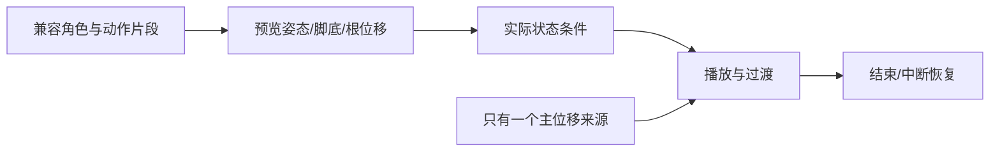

---
{
  "id": "C03",
  "prerequisites": [
    "B13"
  ],
  "revisit": [
    "B02",
    "B05"
  ],
  "memory": [
    "KN21",
    "KN15",
    "KN26",
    "TH03"
  ],
  "labs": [
    "practice/godot/labs/animation_lab.tscn",
    "practice/blender/animation_fixture.blend",
    "practice/godot/scenes/main.tscn"
  ]
}
---
# C03｜接入现成角色：会选、会替换、会验收

**今天做什么：** 判断两份角色资产哪份更适合当前原型，并制定替换验收单。

**从哪里开始：** 先打开原创动作样本查看骨架、蒙皮、三段片段，再比较角色大小与控制器职责。

**现成材料：** [animation_lab.tscn](../../practice/godot/labs/animation_lab.tscn)、[animation_fixture.blend](../../practice/blender/animation_fixture.blend)、[main.tscn](../../practice/godot/scenes/main.tscn)

**材料边界：** 原创教学角色与实际动画现成可用；不是正式美术选型或通用骨架兼容保证，替换自己的角色还需验证。

先观察或猜一猜，动手试一项，再说说为什么。完全陌生可以先看一个小示范；做完当前小步就可以暂停。

### 开始对话

```text
我在学C03《接入现成角色：会选、会替换、会验收》，请按这份教案带我自学。
一次只推进一个有意义的小步，先用现成材料，不先替我作判断。
我可以查菜单/API、看示范或请AI实现；学到的因果关系要由我说明。
课程里的备用题按需选，不要全部变作业；伙伴分享一次就够了。
```

<details data-audience="reference">
<summary>需要时看：解释、对照与候选练习</summary>

## 学到这里就够了

**M｜需要会判断和应用：**
- `C03.M1` 核对比例、朝向、骨骼与动作兼容，选择可用资产。
- `C03.M2` 替换视觉角色而保持控制与碰撞职责。

**K｜知道用途，用到再查：**
- `C03.K1` Armature/Skeleton、Skin/Weights分别是骨架、蒙皮与影响权重。

**停止线：** 不从零绑定和全面刷权重；复杂坏资产允许合理弃用。

**前置：** [B13](B13.md)

## 必要解释

角色文件看起来完整，不代表包含可用动画或符合现有骨架。先试一小段待机和行走，再决定是否值得整套导入。

碰撞胶囊、移动根节点与视觉角色分开，可避免为了角色身高误改所有物理参数。角色极端比例可能让自动绑定或重定向不适用。

本项目优先接入来源清楚、风格接近的现成角色；角色“原创性”不靠从零建模证明，而靠选择、配色/材质、比例校准、动画与整个世界的统一。



这是因果／职责示意，不是实际运行截图；不能显示Mermaid时用等价方框图。

## 在现成实验里试

**初始条件：** 两份教学资产卡：A比例合适且有骨架/待机，B高细节但无骨架；预览用简化人物，真实资产未附时不冒充导入成功。
**可比较的条件：** 显示包内容、比例0.8到1.2、前向箭头、待机/行走预览、碰撞可视化。

下面说明要比较的关系；实际从上面的现成文件与首步进入，不为匹配教学控件名重新搭建。

1. 按用途列选择条件，不先按面数或精细度选。
2. 只替换视觉并核对脚底、胶囊和前向。
3. 播放两段动作，发现问题后选择小修还是换资产。

**观察：** 展示来源、授权状态、骨骼和动作信息；教学卡数据标示意。
**不符时先查：** 故障：为了缩小人物把控制根节点整体缩放，碰撞也变形；恢复职责后只修正确资产层。
**恢复：** 恢复胶囊占位人与原控制参数，替换资产保留副本。

只比较一个条件，恢复后再试下一个。课堂模拟应标清示意，真实软件行为需要实际观察；缺文件如实说明，不让学员临时重造系统。

### 软件入口与亲调

- 常用：角色视觉Transform、动画预览、碰撞可见性。
- 会定位：导入骨架、动画列表和源文件信息。
- 按需查：重定向映射、蒙皮修复；不是必背工具。

|选中哪里／参数|只改什么|看什么|
|---|---|---|
|视觉包装Node3D Transform（内置）|只在独立视觉包装校准位置/朝向与比例|脚是否落地、脸是否朝向运动；不缩放物理根来救外观|
|Godot动画列表/预览（入口）|先只播放一段待机|骨架是否变形、是否异常位移|

运行中临时改动不等于已保存；要留下设计选择，请在自己的副本中写回场景／资源，保存并重新打开检查。

## 我负责什么，AI帮什么

**我的判断：** 按用途、许可、兼容和修复成本选角色，决定哪些视觉变化可接受。
**可交给AI：** 列包内容和兼容风险，先接入一段已授权动画，只改视觉包装。
**检查重点：** 检查AI是否缩放整个控制器、修改绑定姿态或把缺失动画误报为兼容。

结果不符：说清预期、实际与复现步骤；先提出一个可推翻的原因，再做最小验证。修改前留基线，不删需求或测试来消除报错。

## 怎样知道这一小步做到了

- 比较两份资产的比例、朝向、骨架和最小片段，说明选择或淘汰理由。
- 校准视觉脚底与前向，原控制/碰撞/镜头及拾取保持。

**恢复后再检查：** 原走跑跳与拾取路径继续通过；材质替换不改变奖励逻辑。

有提示也是学习进展；没有实际观察就不宣称已经验证。一个对照和解释可以覆盖多个要点，不要求填写评分表。

## 候选问题

先自己判断，再按需看反馈。P是预测、D是诊断、T是迁移、K是用途；按本次需要选一题，不要求全部完成。教学情境不是实测日志。

### C03-P1

一个漂亮模型没有骨架，是否一定更适合先做走路角色？

### C03-D2

【教学构造情境，不是真实测量或某模型故障统计】新角色脚悬空但胶囊仍正确落地，AI建议把重力加倍。视觉包装Y偏移与旧角色不同。你怎样先区分视觉错位和物理悬空？哪一层允许修改？

### C03-T3

换成头更大的卡通人物，哪些检查不能省？

### C03-K4

Weights是什么用途？

<details>
<summary>可选补充题：替换本次练习，不叠加作业</summary>

### K07｜用途

角色关节附近变形异常，骨骼/蒙皮是应检查的方向吗？现在必须自己刷全部权重吗？

</details>

</details>

## 这一课要记在脑海里

- 先试最小动作再批量导入。
- 视觉与碰撞职责分开。
- 资产不合适可以换，不必硬修。

**记忆清单：** [KN21](../memory.md#kn21) · [KN15](../memory.md#kn15) · [KN26](../memory.md#kn26) · [TH03](../memory.md#th03)。先遮住解释，用自己的话说，再举例；不是照抄定义。

## 讲给爸爸听

在今天的关键地方或结束时，选一次和爸爸分享。用自己的话讲讲：角色尺寸、骨架、动作兼容。

**给他演示：** 做角色选型员：先核对许可与尺寸、骨架，只试一个动作片段。

**你们一起问：** 角色外观合适，但已有动作不能正常使用，这时应先扩大导入吗？

爸爸还有问题就接着问，你也可以问爸爸。一起看、一起试，不必背稿、打分或填表。爸爸暂时不在就稍后分享，不影响继续自学。

<details data-purpose="project">
<summary>需要改自己的作品时再看</summary>

**生产阶段：** P4/P10

**想得到的结果：** 新角色可用，原碰撞和控制保持；不合适资源有明确淘汰理由。
**必须保留：** 角色控制根、碰撞形状、相机和原输入保持；不要求手工重绑。

先读取自己的工作副本。以下是可选局部实现，不是打开现成实验的前置，也不要求再做一整轮：

- 先核对一个角色资源的来源、尺度和动画兼容，只在副本替换Visual，不动控制器。
- 预览待机和走路，检查脚底/比例/朝向；复杂坏资产允许更换。

**采用依据：** 新角色能显示，原角色碰撞和走跑跳没有被替换掉。
**换一个场景想想：** 第二个风格相似角色重复验收，不能仅因预览漂亮就采用。

参考工程的通过结论不自动覆盖你改过的版本；相关路线实际走一遍，必要时恢复。

</details>

## 下次怎样想起来

前面已学过的复现入口：[B02](B02.md)、[B05](B05.md)。
隔一段时间不看答案，再解释本课的一项关键关系；换一个对象或条件应用。记住词也要会用，API和菜单位置可以查。疑问笔记可选，没有笔记也仍有公共必记清单。

## 依据

- [Godot Retargeting 3D Skeletons](https://docs.godotengine.org/en/stable/tutorials/assets_pipeline/retargeting_3d_skeletons.html)
- [Adobe Mixamo FAQ：角色、动作及使用条件](https://helpx.adobe.com/creative-cloud/faq/mixamo-faq.html)
- [Godot运行检查与可见碰撞工具](https://docs.godotengine.org/en/stable/tutorials/scripting/debug/overview_of_debugging_tools.html)

技术来源支持概念边界；课程顺序与任务是本项目设计，不代表已经证明学习效果。
