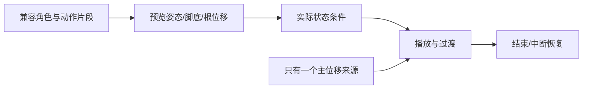

---
{
  "id": "C04",
  "prerequisites": [
    "C03"
  ],
  "revisit": [
    "B06",
    "A06"
  ],
  "memory": [
    "KN21",
    "KN16",
    "TH03"
  ],
  "labs": [
    "practice/godot/labs/animation_lab.tscn",
    "practice/blender/animation_fixture.blend"
  ]
}
---
# C04｜动画状态：动作片段如何接起来

**先从这里开始：** 看角色从站着到走动的一小段，你希望衔接更快还是更柔和？选一个变化再试，不用一次安排全部动作。

**今天做什么：** 设计待机、走跑、跳落地的切换条件，排除抖动与错切。

**从哪里开始：** 在动作Lab只调待机到行走的融合值和过渡时间，观察肢体而非读源码。

**现成材料：** [animation_lab.tscn](../../practice/godot/labs/animation_lab.tscn)、[animation_fixture.blend](../../practice/blender/animation_fixture.blend)

**材料边界：** 真实AnimationTree与导入片段；Walk原地播放，主游戏移动/动画同步和脚滑验收仍需接到自己的控制器。

先试当前这一小步。可以说“给我线索”“示范一小步”或“直接解释”；也可以指认、画图或演示，不必长篇回答。可以暂停，不必先答对才求助。

### 开始对话

```text
我在学C04《动画状态：动作片段如何接起来》，请按这份教案带我自学。
先用“先从这里开始”进入当前任务，一次只推进一小步；等我回应后再展开提示或解释。
我可以查菜单/API、看示范或请AI实现；学到的因果关系要由我说明。
课程里的备用题按需选，不要全部变作业；伙伴分享一次就够了。
```

<details data-audience="reference">
<summary>需要时看：解释、对照与候选练习</summary>

**带学提醒（按当前需要使用）：** 先观察肢体和实际位移，再给状态或融合词。允许暂停看单段动作；重复调参无进展时明确示范一个条件，不靠追问让孩子猜算法。

## 学到这里就够了

**M｜需要会判断和应用：**
- `C04.M1` 用状态和条件选择片段，区分动画表现与角色运动。
- `C04.M2` 调过渡时间并检查连续动作。

**K｜知道用途，用到再查：**
- `C04.K1` Root Motion/IK/Blend分别是位移来源、局部约束和混合思路。

**停止线：** 不推动画混合算法，不强制Root Motion实现。

**前置：** [C03](C03.md)

## 必要解释

AnimationPlayer保存片段，AnimationTree可组织混合和状态切换。脚本控制器与动作片段可能都含位移，要明确谁控制根移动。

状态条件优先于过渡好看：落地才回到移动，速度接近零时避免在待机和走之间抖动。短过渡不必越长越柔和。

动画同样采用资源包思路：先验证待机/走跑/跳等最小片段，再组合状态；复杂原创武打不是主线。



这是因果／职责示意，不是实际运行截图；不能显示Mermaid时用等价方框图。

## 在现成实验里试

**初始条件：** 待机/走/跑/跳四卡，speed=0、grounded=true；用简化骨架或时间条，不伪称真实动画素材。
**可比较的条件：** 速度0到7、grounded开关、过渡0到0.4秒、连续输入测试。

下面说明要比较的关系；实际从上面的现成文件与首步进入，不为匹配教学控件名重新搭建。

1. 写三个切换条件后再连线。
2. 连续启停和跳落地，读状态日志。
3. 只改变过渡时长，看过长过渡是否让动作迟钝。

**观察：** 当前状态、条件与片段时间同时显示；动画与位置分别显示。
**不符时先查：** 故障：空中speed=0时错误回Idle；应纳入落地条件。
**恢复：** 清空状态机回到站立初态，恢复速度和过渡。

只比较一个条件，恢复后再试下一个。课堂模拟应标清示意，真实软件行为需要实际观察；缺文件如实说明，不让学员临时重造系统。

### 软件入口与亲调

- 常用：片段预览、状态条件、过渡时间。
- 会定位：AnimationPlayer/AnimationTree与参数面板。
- 按需查：BlendSpace、Root Motion提取、IK算法。

|选中哪里／参数|只改什么|看什么|
|---|---|---|
|AnimationTree过渡时间（内置入口）|记录基线，少量调整同一组过渡|突然切换是否减轻，不能用超长混合遮掉错误状态|
|AnimationPlayer播放速度（内置）|在同一路线比较小幅调速|脚滑与身体速度的对应，不改变实际走速蒙混|

运行中临时改动不等于已保存；要留下设计选择，请在自己的副本中写回场景／资源，保存并重新打开检查。

## 我负责什么，AI帮什么

**我的判断：** 决定动作切换条件与可接受脚滑，先修条件再调过渡。
**可交给AI：** 提供速度、落地状态、当前片段并排日志与可控过渡参数。
**检查重点：** 检查AI是否把动画视觉状态当落地物理事实，或让根位移与控制器双重驱动。

结果不符时，先指出预期与实际的一处差别。有解释就试着验证；没有解释可请AI定位入口、给线索或示范。只改可恢复副本，不删需求或测试来掩盖错误。

## 怎样知道这一小步做到了

- 用条件表解释起停、空中松键及落地时选择的片段。
- 条件正确后小幅调过渡并连续测试，确认没有双重位移和视觉迟滞。

**恢复后再检查：** 站立、移动、跳跃的物理结果保持；重复切换不累积异常偏移。

有提示也是学习进展；没有实际观察就不宣称已经验证。一个对照和解释可以覆盖多个要点，不要求填写评分表。

## 候选问题

先自己判断，再按需看反馈。P是预测、D是诊断、T是迁移、K是用途；按本次需要选一题，不要求全部完成。教学情境不是实测日志。

### C04-P1

空中水平速度为零就应待机吗？

### C04-D2

【教学构造情境，不是真实测量或某模型故障统计】空中松开方向键后播放Idle；日志speed=0、grounded=false。AI建议把过渡从0.1秒改成1秒。先改条件还是混合时长？怎样同时检验正常站立和空中停水平运动？

### C04-T3

新增慢走片段，怎样验证没有破坏跳跃？

### C04-K4

Root Motion大概指什么？

<details>
<summary>可选补充题：替换本次练习，不叠加作业</summary>

### KN21-P｜预测

角色站着却播放跑步，先查动画状态条件还是立刻重做蒙皮？

### KN21-T｜迁移

换一套动画后按键松开仍在跑，如何区分输入状态未清与动画切换条件有误？提出一次对照。

### K08｜用途

角色动作里可能自带前进位移，检查Root Motion与脚本是否重复驱动有意义吗？

</details>

</details>

## 这一课要记在脑海里

- 先对条件，再调过渡。
- 动作播放不等于移动正确。
- 避免双重根位移。

**记忆清单：** [KN21](../memory.md#kn21) · [KN16](../memory.md#kn16) · [TH03](../memory.md#th03)。用到时先想一项；想不起可看例子，再换个条件。不要求逐字背诵。

## 讲给爸爸听

想分享时，可以先展示今天的一处选择、发现或仍没想通的问题，不要求完整讲课。用自己的话讲讲：动作状态、切换、融合。

**给他演示：** 做动作导演：使用兼容角色，只比较待机与走路的切换，检查开始与停止。

**你们一起问：** 站着时脚还在滑动，怎样把移动问题与动画问题分开检查？

爸爸还有问题就接着问，你也可以问爸爸。一起看、一起试，不必背稿、打分或填表。爸爸暂时不在就稍后分享，不影响继续自学。

<details data-purpose="project">
<summary>需要改自己的作品时再看</summary>

**生产阶段：** P10

**想得到的结果：** 待机、走跑、起跳和落地按实际条件切换，异常可定位。
**必须保留：** 移动速度、物理位置来源、相机和碰撞不变。

先读取自己的工作副本。以下是可选局部实现，不是打开现成实验的前置，也不要求再做一整轮：

- 先只连接Idle与Walk，明确速度是谁提供，别同时搭全套状态。
- 再加Run与Jump/Land条件，连做启动、停止、跳落地检查过渡。

**采用依据：** 起步与停止时状态符合条件，不靠两套系统互抢播放。
**换一个场景想想：** 把走路片段换成同骨架新片段，重新调过渡而不复用旧结论。

参考工程的通过结论不自动覆盖你改过的版本；相关路线实际走一遍，必要时恢复。

</details>

## 下次怎样想起来

前面已学过的复现入口：[B06](B06.md)、[A06](A06.md)。
下次碰到相似问题时，可先回想一项关系，再查需要的解释；想不起就补一个小例子，不重学整课。暂停时愿意就留“下次从哪里接着试”，没有笔记也能继续，API和菜单仍可查。

## 依据

- [Godot AnimationTree：动画组织](https://docs.godotengine.org/en/stable/tutorials/animation/animation_tree.html)
- [Godot Retargeting 3D Skeletons](https://docs.godotengine.org/en/stable/tutorials/assets_pipeline/retargeting_3d_skeletons.html)
- [Godot运行检查与可见碰撞工具](https://docs.godotengine.org/en/stable/tutorials/scripting/debug/overview_of_debugging_tools.html)

技术来源支持概念边界；课程顺序与任务是本项目设计，不代表已经证明学习效果。
