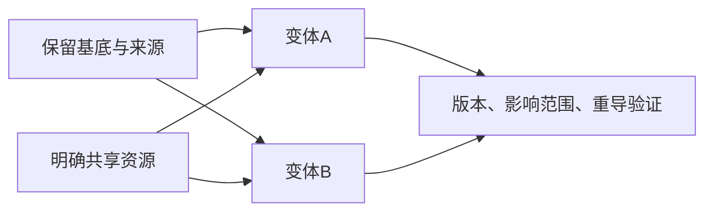

---
{
  "id": "C05",
  "prerequisites": [
    "C04"
  ],
  "revisit": [
    "B04",
    "B06",
    "B08"
  ],
  "memory": [
    "KN05",
    "KN17",
    "TH03",
    "TH04"
  ],
  "labs": [
    "practice/godot/labs/material_lab.tscn",
    "practice/blender/uv_material_lab.blend",
    "practice/godot/labs/scene_nodes/starter.tscn",
    "practice/godot/scenes/main.tscn"
  ]
}
---
# C05｜复用与资源：共享什么、独立什么

**今天做什么：** 给三个同类物体制定共享资源和独立状态方案。

**从哪里开始：** 先切Godot材质共享/独立，再按需在Blender看数据引用；用主游戏两颗星核对独立运行状态，不把同一练习做三遍。

**现成材料：** [material_lab.tscn](../../practice/godot/labs/material_lab.tscn)、[uv_material_lab.blend](../../practice/blender/uv_material_lab.blend)、[starter.tscn](../../practice/godot/labs/scene_nodes/starter.tscn)、[main.tscn](../../practice/godot/scenes/main.tscn)

**材料边界：** 材质Lab和Blender文件提供真实资源共享对照；主游戏提供不同物品独立拾取、计数和重开的运行对照。动画引用另验；静态资源实验不能单独证明已理解个体运行状态。

先观察或猜一猜，动手试一项，再说说为什么。完全陌生可以先看一个小示范；做完当前小步就可以暂停。

### 开始对话

```text
我在学C05《复用与资源：共享什么、独立什么》，请按这份教案带我自学。
一次只推进一个有意义的小步，先用现成材料，不先替我作判断。
请把“这次多看一层”融入当前任务，替换重复讲解或备用题，不新增一轮作业。
我可以查菜单/API、看示范或请AI实现；学到的因果关系要由我说明。
课程里的备用题按需选，不要全部变作业；伙伴分享一次就够了。
```

## 这次多看一层

**从一条变化链，进一步追问数据属于谁。** 接着B08的原因链，这次先选一个真实目标：“让所有同类对象一起改色”或“只改其中一个”。再决定修改范围，不先把共享或独立认定为永远更好。

资源对照后，使用已提供的主游戏，先预测拿走一颗星后，另一颗是否仍可拾取、总数怎样变化。实际试过，再请AI依据当前文件指出公共资源与个体状态分别由哪里保存；不要仅凭外观消失推断实现。这里复用B06的真实操作，不要求再造三颗树或完整角色系统。Blender与Godot已经给出等价资源证据时，二者择需，不强制全部重做。

**迁移而不扩大作品：** 沿用C05-T3讨论只改一个标签；再口述“同类塔共用射程配置，但这一座塔受伤”的对应关系。后者只是将已学关系换名字，不要求创建塔或战斗。若只能说术语，回到实际两件对象验证影响范围。

**给AI的引导：** 区分“违反已经约定的独立状态”与“为不同目标选择共享范围”。调用引擎成熟资源机制可由AI完成，但修改范围由学习者决定。只读当前关键引用／状态代码，不背复制API。共享概念仍引用KN17与TH04；本段不新增M或另一份作业。

<details data-audience="reference">
<summary>需要时看：解释、对照与候选练习</summary>

## 学到这里就够了

**M｜需要会判断和应用：**
- `C05.M1` 区分共享材质/配置与独立的运行状态。
- `C05.M2` 限定修改影响范围并验收。

**K｜知道用途，用到再查：**
- `C05.K1` 深浅复制、Resource缓存用来解释影响，不背实现。

**停止线：** 不考设计模式名字，不复制所有纹理来保证安全。

**前置：** [C04](C04.md)

## 必要解释

三个场景实例可以有独立位置和状态，同时引用同一材质。是否共享由需求决定，不是共享一定好或全部独立更安全。

复用的关键是改通用规则方便，改个别实例不串改。运行时生命、是否拾取等状态不应无意写入全体共享配置。



这是因果／职责示意，不是实际运行截图；不能显示Mermaid时用等价方框图。

## 在现成实验里试

**初始条件：** 三棵树共用材质，三份拾取状态独立；给出资源引用图。
**可比较的条件：** 改共享颜色、独立颜色、单件消耗、复制配置按钮。

下面说明要比较的关系；实际从上面的现成文件与首步进入，不为匹配教学控件名重新搭建。

1. 预测一次颜色修改影响几棵树。
2. 只让一棵树变秋色，保持其他共享。
3. 消耗一个对象，检查另外两个状态不变。

**观察：** 引用连线与受影响对象高亮同步；只统计真实状态变化。
**不符时先查：** 故障：consumed放入共享Resource导致全部消失；修改状态归属。
**恢复：** 恢复引用与独立状态；不通过整套复制隐藏错误。

只比较一个条件，恢复后再试下一个。课堂模拟应标清示意，真实软件行为需要实际观察；缺文件如实说明，不让学员临时重造系统。

### 软件入口与亲调

- 常用：Inspector资源引用、Make Unique或等效操作。
- 会定位：资源文件与实例覆盖。
- 按需查：嵌套资源复制规则。

|选中哪里／参数|只改什么|看什么|
|---|---|---|
|资源引用与Make Unique等入口（内置）|先确认共享，再对目标资源独立化|一盏改变时另一盏是否仍保持基线|
|每实例状态/导出配置（自定义）|只切换目标实例的亮灭|材质共享与对象状态是否被混为一谈|

运行中临时改动不等于已保存；要留下设计选择，请在自己的副本中写回场景／资源，保存并重新打开检查。

## 我负责什么，AI帮什么

**我的判断：** 指定哪些配置共享、哪些运行状态独立，只复制确有差异的资源。
**可交给AI：** 画实例/资源引用关系，准备单件修改及多件不受影响的对照。
**检查重点：** 检查AI是否把场景实例化当成所有资源自动独立，或用全量复制解决细小差异。

结果不符：说清预期、实际与复现步骤；先提出一个可推翻的原因，再做最小验证。修改前留基线，不删需求或测试来消除报错。

## 怎样知道这一小步做到了

- 对三个实例说明公共材质与个体消费状态的归属。
- 只改指定材质/状态并实测其余对象，避免复制无关大纹理。

**恢复后再检查：** 其他灯与主光保持；重载场景后的共享策略一致。

有提示也是学习进展；没有实际观察就不宣称已经验证。一个对照和解释可以覆盖多个要点，不要求填写评分表。

## 候选问题

先自己判断，再按需看反馈。P是预测、D是诊断、T是迁移、K是用途；按本次需要选一题，不要求全部完成。教学情境不是实测日志。

### C05-P1

实例不同，材质就一定不同吗？

### C05-D2

【教学构造情境，不是真实测量或某模型故障统计】三瓶药水引用同一个配置资源；拾取一瓶后三瓶都不可用，但位置各自独立。AI要复制三套全部贴图。怎样查看消费状态归属，既修个体状态又保留公共美术？

### C05-T3

一百个同类瓶子只改一个标签，怎么避免重复大纹理？

### C05-K4

深复制为什么值得按需查？

<details>
<summary>可选补充题：替换本次练习，不叠加作业</summary>

### KN17-T｜迁移

1000棵树每棵都复制全套大纹理是好主意吗？只说明共享/独立取舍，不要求实现批量渲染。

</details>

</details>

## 这一课要记在脑海里

- 实例独立不代表资源全独立。
- 共享配置不等于共享运行状态。
- 按影响范围决定复制。

**记忆清单：** [KN05](../memory.md#kn05) · [KN17](../memory.md#kn17) · [TH03](../memory.md#th03) · [TH04](../memory.md#th04)。先遮住解释，用自己的话说，再举例；不是照抄定义。

## 讲给爸爸听

在今天的关键地方或结束时，选一次和爸爸分享。用自己的话讲讲：资源引用、共享、独立副本。

**给他演示：** 做资源管理员：找两件对象的资源引用，说明这次应该一起改还是分开改。

**你们一起问：** 复制了一个节点，它的材质就一定已经独立了吗？

爸爸还有问题就接着问，你也可以问爸爸。一起看、一起试，不必背稿、打分或填表。爸爸暂时不在就稍后分享，不影响继续自学。

<details data-purpose="project">
<summary>需要改自己的作品时再看</summary>

**生产阶段：** P6/P7

**想得到的结果：** 外观需要共享的继续共享，个体状态与目标材质可独立。
**必须保留：** 其他共享资源、纹理文件、游戏计数不变。

先读取自己的工作副本。以下是可选局部实现，不是打开现成实验的前置，也不要求再做一整轮：

- 先用两个实例检查共享材质、独立状态各自范围，不讲设计模式百科。
- 按实际需求只分离必要资源，复查没有复制无关大贴图。

**采用依据：** 改一个独立状态不影响另一个，共享材质的影响符合预测。
**换一个场景想想：** 从两盏灯迁移到两颗果实，一颗被拾取不能影响另一颗状态。

参考工程的通过结论不自动覆盖你改过的版本；相关路线实际走一遍，必要时恢复。

</details>

## 下次怎样想起来

前面已学过的复现入口：[B04](B04.md)、[B06](B06.md)、[B08](B08.md)。
隔一段时间不看答案，再解释本课的一项关键关系；换一个对象或条件应用。记住词也要会用，API和菜单位置可以查。疑问笔记可选，没有笔记也仍有公共必记清单。

## 依据

- [Godot Resources：共享和引用](https://docs.godotengine.org/en/stable/tutorials/scripting/resources.html)
- [Godot运行检查与可见碰撞工具](https://docs.godotengine.org/en/stable/tutorials/scripting/debug/overview_of_debugging_tools.html)
- [Godot Resources：实例与共享引用](https://docs.godotengine.org/en/stable/tutorials/scripting/resources.html)

技术来源支持概念边界；课程顺序与任务是本项目设计，不代表已经证明学习效果。
