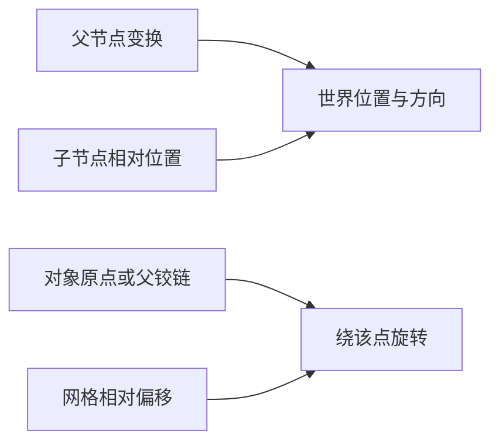

---
{
  "id": "C06",
  "prerequisites": [
    "C05"
  ],
  "revisit": [
    "A07",
    "B06"
  ],
  "memory": [
    "KN04",
    "KN07",
    "KN16",
    "TH03"
  ],
  "labs": [
    "practice/godot/labs/interaction_lab.tscn",
    "practice/godot/labs/platform_lab.tscn"
  ]
}
---
# C06｜门与移动平台：复用已会的空间和状态

**今天做什么：** 设计一扇可重复触发的门，识别移动平台的额外验收项。

**从哪里开始：** 先在门实验观察靠近与开门；需要平台变式时，打开平台实验比较站立跟随和起跳离开。

**现成材料：** [interaction_lab.tscn](../../practice/godot/labs/interaction_lab.tscn)、[platform_lab.tscn](../../practice/godot/labs/platform_lab.tscn)

**材料边界：** 门与平台均已可交互；平台是实际独立CharacterBody与AnimatableBody，完整机关阻挡/关卡集成仍需实际项目验证。

先观察或猜一猜，动手试一项，再说说为什么。完全陌生可以先看一个小示范；做完当前小步就可以暂停。

### 开始对话

```text
我在学C06《门与移动平台：复用已会的空间和状态》，请按这份教案带我自学。
一次只推进一个有意义的小步，先用现成材料，不先替我作判断。
我可以查菜单/API、看示范或请AI实现；学到的因果关系要由我说明。
课程里的备用题按需选，不要全部变作业；伙伴分享一次就够了。
```

<details data-audience="reference">
<summary>需要时看：解释、对照与候选练习</summary>

## 学到这里就够了

**M｜需要会判断和应用：**
- `C06.M1` 组合支点、条件和状态，避免重复触发冲突。
- `C06.M2` 检查站上、离开、阻挡和恢复等边界。

**K｜知道用途，用到再查：**
- `C06.K1` AnimatableBody3D等物理类型按实际运动方式查。

**停止线：** 本课门为主任务；平台作为给定示例验收，不写通用平台物理系统。

**前置：** [C05](C05.md)

## 必要解释

门的支点、运动和是否可通过是相互关联但不同的事情。开门动画播了不等于碰撞已正确让路。

移动平台需要考虑角色站在上面和离开时的运动；只看平台来回动不算完成。先列需要检查的情况再让AI实现。



这是因果／职责示意，不是实际运行截图；不能显示Mermaid时用等价方框图。

## 在现成实验里试

**初始条件：** 侧边支点门、closed/opening/open状态卡；另有可选平台示意。
**可比较的条件：** 开门、重复按、角度0到90、持续时间0.3到2秒、恢复；平台站上/离开卡。

下面说明要比较的关系；实际从上面的现成文件与首步进入，不为匹配教学控件名重新搭建。

1. 预测opening期间再次触发应如何处理。
2. 播放、重复触发、检查可通过时机。
3. 用平台情境卡补站立、边缘离开和重开检查。

**观察：** 门角、状态、可通过标记分别显示；平台动态为示意不做物理性能保证。
**不符时先查：** 故障：重复触发叠加Tween导致门越转越远；改为绝对目标和状态约束。
**恢复：** 门角、状态和碰撞一致回到关闭；平台回起点。

只比较一个条件，恢复后再试下一个。课堂模拟应标清示意，真实软件行为需要实际观察；缺文件如实说明，不让学员临时重造系统。

### 软件入口与亲调

- 常用：支点Transform、时间、状态条件。
- 会定位：碰撞、动画轨道与物理体类型。
- 按需查：平台速度继承与复杂物理API。

|选中哪里／参数|只改什么|看什么|
|---|---|---|
|机关行程或开门角（自定义）|先小行程核对，再调目标角度或距离|碰撞与可见外观是否一起运动|
|机关持续时间（自定义）|固定行程，单独改时长|角色可否安全通过，重触发是否堆叠|

运行中临时改动不等于已保存；要留下设计选择，请在自己的副本中写回场景／资源，保存并重新打开检查。

## 我负责什么，AI帮什么

**我的判断：** 先选门或平台之一，定义重复输入和恢复规则，平台只在所选路线验。
**可交给AI：** 把既有支点、状态和运动接成一个最小机制，提供绝对终点与回退。
**检查重点：** 检查AI是否只移动Visual、每次进入都新建一个Tween，或通过禁用碰撞掩盖穿插。

结果不符：说清预期、实际与复现步骤；先提出一个可推翻的原因，再做最小验证。修改前留基线，不删需求或测试来消除报错。

## 怎样知道这一小步做到了

- 对所选机制画出状态和固定目标位置/角度，重复请求不会无限叠加。
- 门：通过、阻挡与重开；平台路线另测站上、离开、恢复，不要求两条全做。

**恢复后再检查：** 原玩家起跳、墙碰撞、星星收集和重开不退化。

有提示也是学习进展；没有实际观察就不宣称已经验证。一个对照和解释可以覆盖多个要点，不要求填写评分表。

## 候选问题

先自己判断，再按需看反馈。P是预测、D是诊断、T是迁移、K是用途；按本次需要选一题，不要求全部完成。教学情境不是实测日志。

### C06-P1

门动画播完就能证明玩家能通过吗？

### C06-D2

【教学构造情境，不是真实测量或某模型故障统计】门正常一次到90度，连按三次到270度；AI提出把每次旋转改为30度。原约定是开门中忽略新请求。该修目标、状态还是按键次数？用什么顺序复测？

### C06-T3

升降机需要增加什么验收？

### C06-K4

为什么查专用运动物理体？

</details>

## 这一课要记在脑海里

- 重复输入必测。
- 动画和通行分别检查。
- 平台要带着角色验收。

**记忆清单：** [KN04](../memory.md#kn04) · [KN07](../memory.md#kn07) · [KN16](../memory.md#kn16) · [TH03](../memory.md#th03)。先遮住解释，用自己的话说，再举例；不是照抄定义。

## 讲给爸爸听

在今天的关键地方或结束时，选一次和爸爸分享。用自己的话讲讲：交互条件、运动、角色关系。

**给他演示：** 做机关设计师：先用门轴说明预期轨迹，再在自己的最小机关中验证。

**你们一起问：** 机关自己动得正确，就代表角色使用它也没有问题吗？

爸爸还有问题就接着问，你也可以问爸爸。一起看、一起试，不必背稿、打分或填表。爸爸暂时不在就稍后分享，不影响继续自学。

<details data-purpose="project">
<summary>需要改自己的作品时再看</summary>

**生产阶段：** P2/P7

**想得到的结果：** 选定一个小机关，在重触发、站立/离开和重开时可解释。
**必须保留：** 玩家控制与原收集循环保持；不同时增加机关系统和敌人系统。

先读取自己的工作副本。以下是可选局部实现，不是打开现成实验的前置，也不要求再做一整轮：

- 从门或平台中只选一个；先列允许状态和实际运动的对象，不同时做两种机关。
- 对已选机制检查重复触发、离开或恢复；通过后才讨论另一种机制，不强制实现。

**采用依据：** 选门时开关位置正确；选平台时站上能按预期运动；当前只验所选机制。
**换一个场景想想：** 门变为抬起的栅栏，解释哪个空间规则改变、哪个状态规则保留。

参考工程的通过结论不自动覆盖你改过的版本；相关路线实际走一遍，必要时恢复。

</details>

## 下次怎样想起来

前面已学过的复现入口：[A07](A07.md)、[B06](B06.md)。
隔一段时间不看答案，再解释本课的一项关键关系；换一个对象或条件应用。记住词也要会用，API和菜单位置可以查。疑问笔记可选，没有笔记也仍有公共必记清单。

## 依据

- [Godot Node3D：变换与父空间](https://docs.godotengine.org/en/stable/classes/class_node3d.html)
- [Godot CharacterBody3D：速度、落地与移动](https://docs.godotengine.org/en/stable/classes/class_characterbody3d.html)
- [Godot AnimationTree：动画组织](https://docs.godotengine.org/en/stable/tutorials/animation/animation_tree.html)
- [Godot运行检查与可见碰撞工具](https://docs.godotengine.org/en/stable/tutorials/scripting/debug/overview_of_debugging_tools.html)

技术来源支持概念边界；课程顺序与任务是本项目设计，不代表已经证明学习效果。
