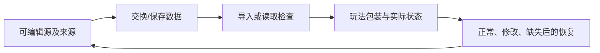

---
{
  "id": "C07",
  "prerequisites": [
    "C05",
    "B05"
  ],
  "revisit": [
    "B05",
    "B02"
  ],
  "memory": [
    "KN14",
    "KN22",
    "TH03"
  ],
  "labs": [
    "practice/blender/uv_material_lab.blend",
    "practice/blender/kitbash_style_lab.blend"
  ]
}
---
# C07｜模块拼接与简单UV：统一尺度和纹理密度

**先从这里开始：** 给两块相邻墙面找一处你觉得不协调的地方：接缝，或表面的棋盘格。先选其中一项查，不需要整套UV知识才能开始。

**今天做什么：** 把三块墙拼齐，并让棋盘格在它们表面大小接近。

**从哪里开始：** 打开UV样本，上排几何和光照相同，先观察棋盘格；只调整中间板的UV，不改几何尺寸。

**现成材料：** [uv_material_lab.blend](../../practice/blender/uv_material_lab.blend)、[kitbash_style_lab.blend](../../practice/blender/kitbash_style_lab.blend)

**材料边界：** 纹理已打包，正常/拉伸/密度样本现成；模块连接用小屋部件，复杂角色UV不列入当前必修。

先试当前这一小步。可以说“给我线索”“示范一小步”或“直接解释”；也可以指认、画图或演示，不必长篇回答。可以暂停，不必先答对才求助。

### 开始对话

```text
我在学C07《模块拼接与简单UV：统一尺度和纹理密度》，请按这份教案带我自学。
先用“先从这里开始”进入当前任务，一次只推进一小步；等我回应后再展开提示或解释。
我可以查菜单/API、看示范或请AI实现；学到的因果关系要由我说明。
课程里的备用题按需选，不要全部变作业；伙伴分享一次就够了。
```

<details data-audience="reference">
<summary>需要时看：解释、对照与候选练习</summary>

**带学提醒（按当前需要使用）：** 先提供一块正常参照，再定位一处差异。UV操作不熟可以示范；不要一边改尺寸一边改纹理而失去比较条件。

## 学到这里就够了

**M｜需要会判断和应用：**
- `C07.M1` 按统一尺寸和原点对齐模块。
- `C07.M2` 用棋盘格识别拉伸与密度问题，修一个简单UV。

**K｜知道用途，用到再查：**
- `C07.K1` Texel Density、Trim Sheet、Decal只认识适用问题。

**停止线：** 不展开复杂人物UV，不做完整贴图绘制课程。

**前置：** [C05](C05.md)、[B05](B05.md)

## 必要解释

模块化依赖尺度、原点和连接规则一致。几何拼齐后，纹理仍可能因UV分配不同而大小不一致。

棋盘格用于检查映射：拉长的格子提示拉伸，格子尺寸不同提示密度不一致。升高贴图分辨率不能替代修正映射。

模块化套件就是环境Kitbash的基础：直墙、转角、门窗、屋顶等接口统一后，可以通过组合和少量变体快速生成自己的场景，而不是逐栋从零建模。



这是因果／职责示意，不是实际运行截图；不能显示Mermaid时用等价方框图。

## 在现成实验里试

**初始条件：** 三块2米墙，两块UV一致，一块横向拉伸；原点标在底边角。
**可比较的条件：** 吸附步长0.5/1、模块旋转90度、UV宽度0.5到2、棋盘格/成品切换。

下面说明要比较的关系；实际从上面的现成文件与首步进入，不为匹配教学控件名重新搭建。

1. 先拼几何，确认无缝隙后再看纹理。
2. 只改变错误墙的UV比例，检查格子接近正方形。
3. 转一块墙构成角落，检查接缝和图案方向。

**观察：** 显示世界尺度和UV比例两个独立信息；网页映射仅示意，真机复核另列。
**不符时先查：** 故障：墙纹理拉伸，AI仅把图片升4K；指出原因未修。
**恢复：** 恢复墙位置、UV和检查材质，保留一张对照。

只比较一个条件，恢复后再试下一个。课堂模拟应标清示意，真实软件行为需要实际观察；缺文件如实说明，不让学员临时重造系统。

### 软件入口与亲调

- Blender：UV Editor、缩放简单UV岛、棋盘格预览。
- 会定位：吸附、对象Dimensions、图像贴图。
- 按需查：自动展开、复杂接缝、Trim Sheet流程。

|选中哪里／参数|只改什么|看什么|
|---|---|---|
|Transform/吸附步长（内置）|按约定宽度摆模块，先核对接缝|外观和功能空间是否都对齐|
|Blender UV Editor缩放/位置（内置）|用格子图只调整一块简单面UV|格子是否接近相同尺度，有无拉长|

运行中临时改动不等于已保存；要留下设计选择，请在自己的副本中写回场景／资源，保存并重新打开检查。

## 我负责什么，AI帮什么

**我的判断：** 先选择拼接尺寸/原点规则，再用格子判断拉伸还是纹理密度问题。
**可交给AI：** 准备三块可编辑墙及棋盘格，指出局部UV入口而非重做整套纹理。
**检查重点：** 检查AI是否不同模块使用不同单位、随意移动原点或只升纹理分辨率。

结果不符时，先指出预期与实际的一处差别。有解释就试着验证；没有解释可请AI定位入口、给线索或示范。只改可恢复副本，不删需求或测试来掩盖错误。

## 怎样知道这一小步做到了

- 按共同尺寸和连接点拼直段/转角，检查真实接缝。
- 固定几何修一个简单UV比例或密度，比较格子形状和世界尺寸。

**恢复后再检查：** 人能通过原路线，镜头不过度被接缝遮挡；重导入仍保留包装。

有提示也是学习进展；没有实际观察就不宣称已经验证。一个对照和解释可以覆盖多个要点，不要求填写评分表。

## 候选问题

先自己判断，再按需看反馈。P是预测、D是诊断、T是迁移、K是用途；按本次需要选一题，不要求全部完成。教学情境不是实测日志。

### C07-P1

同一张贴图用在三堵墙上，清晰程度一定相同吗？

### C07-D2

【教学构造情境，不是真实测量或某模型故障统计】三堵墙几何尺寸相同，A/B格子正方，C格子横向拉长；同一贴图。AI要把图从1K升4K。你先动图像还是C的UV？如何证明没有通过拉伸墙几何来伪装修好？

### C07-T3

做直墙和转角套件应统一什么？

### C07-K4

Trim Sheet适合什么思路？

<details>
<summary>可选补充题：替换本次练习，不叠加作业</summary>

### KN14-P｜预测

棋盘格被拉成长条，先提高贴图分辨率吗？

### KN14-T｜迁移

两面墙贴图尺寸相同但清晰度不同，选择一个可对照的原因并验证。

### KN22-P｜预测

每片墙长度不同却要求无缝Grid拼接，先检查什么？

### KN22-T｜迁移

转90°后出现缝隙，只靠随意放大一块墙是否合适？

</details>

</details>

## 这一课要记在脑海里

- 先拼几何，再看表面。
- 清晰度不只看分辨率。
- 棋盘格是诊断工具。

**记忆清单：** [KN14](../memory.md#kn14) · [KN22](../memory.md#kn22) · [TH03](../memory.md#th03)。用到时先想一项；想不起可看例子，再换个条件。不要求逐字背诵。

## 讲给爸爸听

想分享时，可以先展示今天的一处选择、发现或仍没想通的问题，不要求完整讲课。用自己的话讲讲：模块尺寸、接缝、纹理。

**给他演示：** 做拼装工程师：先拼两块模块检查连接，再观察纹理是否出现明显问题。

**你们一起问：** 远处看不到接缝，玩家走近后发现错位，应该用哪个距离验收？

爸爸还有问题就接着问，你也可以问爸爸。一起看、一起试，不必背稿、打分或填表。爸爸暂时不在就稍后分享，不影响继续自学。

<details data-purpose="project">
<summary>需要改自己的作品时再看</summary>

**生产阶段：** P6

**想得到的结果：** 两三段模块按统一接口拼接，简单UV问题可定位修复。
**必须保留：** 已有通行宽度与碰撞职责保持；不拿高分辨率贴图掩盖UV错误。

先读取自己的工作副本。以下是可选局部实现，不是打开现成实验的前置，也不要求再做一整轮：

- 先只拼两块同尺寸模块，检查原点和接缝，不先做整条街。
- 再用棋盘格检查一处简单UV拉伸，修正而不是盲升贴图分辨率。

**采用依据：** 边界能对齐，角色实际可通过，没有看不见的缝隙。
**换一个场景想想：** 换成屋顶或地板模块，沿用接口检查但重新判断贴图比例。

参考工程的通过结论不自动覆盖你改过的版本；相关路线实际走一遍，必要时恢复。

</details>

## 下次怎样想起来

前面已学过的复现入口：[B05](B05.md)、[B02](B02.md)。
下次碰到相似问题时，可先回想一项关系，再查需要的解释；想不起就补一个小例子，不重学整课。暂停时愿意就留“下次从哪里接着试”，没有笔记也能继续，API和菜单仍可查。

## 依据

- [Blender glTF 2.0管线参考（4.0文档，具体新版选项另查）](https://docs.blender.org/manual/en/4.0/addons/import_export/scene_gltf2.html)
- [Blender官方手册：按实际版本查询工具](https://docs.blender.org/manual/en/latest/)
- [Godot运行检查与可见碰撞工具](https://docs.godotengine.org/en/stable/tutorials/scripting/debug/overview_of_debugging_tools.html)

技术来源支持概念边界；课程顺序与任务是本项目设计，不代表已经证明学习效果。
