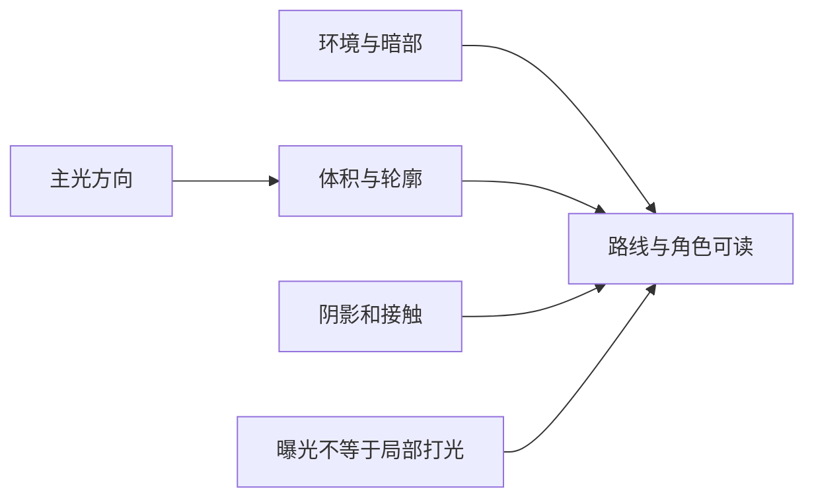

---
{
  "id": "C08",
  "prerequisites": [
    "C07",
    "B09"
  ],
  "revisit": [
    "B09",
    "B11"
  ],
  "memory": [
    "KN25",
    "TH03"
  ],
  "labs": [
    "practice/godot/labs/effects_lab.tscn"
  ]
}
---
# C08｜风格化光照方案：效果必须能进游戏

**今天做什么：** 在两种照明方案中选一个适合动态角色和目标设备的方案。

**从哪里开始：** 全关基线开始，一次开Fog、Glow或景深；观察实际渲染器和对应参数。

**现成材料：** [effects_lab.tscn](../../practice/godot/labs/effects_lab.tscn)

**材料边界：** 普通雾/辉光已实现；景深需Forward+或Mobile，Compatibility明确禁用；不冒充体积雾。

先观察或猜一猜，动手试一项，再说说为什么。完全陌生可以先看一个小示范；做完当前小步就可以暂停。

### 开始对话

```text
我在学C08《风格化光照方案：效果必须能进游戏》，请按这份教案带我自学。
一次只推进一个有意义的小步，先用现成材料，不先替我作判断。
我可以查菜单/API、看示范或请AI实现；学到的因果关系要由我说明。
课程里的备用题按需选，不要全部变作业；伙伴分享一次就够了。
```

<details data-audience="reference">
<summary>需要时看：解释、对照与候选练习</summary>

## 学到这里就够了

**M｜需要会判断和应用：**
- `C08.M1` 比较方案的表现、动态支持和成本。
- `C08.M2` 核对Blender展示与Godot实际渲染的差异。

**K｜知道用途，用到再查：**
- `C08.K1` Lightmap/GI/反射探针知道用途即可。
- `C08.K2` Tonemapping/Exposure、Color Adjustments、Glow、Fog、SSAO、DOF与自定义后处理知道各自解决什么；先核对渲染器支持，不要求全开。

**停止线：** 不要求搭建所有GI技术，不学习光传输推导。

**前置：** [C07](C07.md)、[B09](B09.md)

## 必要解释

展示渲染和实时游戏的约束不同。静态背景可采用的光照方法不必同样适用于移动角色。

选择一种最简单可行方案，固定相机与材质比较。缺阴影、色彩管理或环境不同都可能改变观感，不该用无穷加灯掩盖。

固定视角风格化游戏常见的“先试低成本、再按需加”渲染工具：①Tonemapping/Exposure控制整体亮度与高光压缩；②Color Adjustments或LUT思路统一色调；③Glow/Bloom让星星、魔法和灯有柔和光晕；④Fog/高度雾分离前中后景；⑤SSAO/接触阴影帮助物体贴地；⑥DOF在微缩/静态构图中突出焦点；⑦描边/Rim Light增强卡通轮廓；⑧粒子、Trail和局部Emission负责事件效果。不要一次全开，先按“画面问题→一种工具→同机位对照”验证。

渲染器能力不同：Fog、Tonemapping、Glow和颜色调整较普遍；Volumetric Fog、SSR、SSIL等更依赖具体渲染器，SSAO也并非所有目标都支持。课程因此不把某个高级效果当必修；先确定目标设备与渲染器，再让AI核对当前版本支持并提供可回退方案。屏幕空间效果还会受“画面外/被遮挡信息不可见”等限制，不能只凭一张截图判断稳定。

对本项目推荐的优先顺序是：先相机与构图→主光/环境→色盘/材质→Tonemapping/Exposure→少量Glow/Fog→需要时再试AO、DOF、描边或自定义后处理。漂亮不是“特效越多”，而是焦点、层次、配色和玩法可读性一起成立。



这是因果／职责示意，不是实际运行截图；不能显示Mermaid时用等价方框图。

## 在现成实验里试

**初始条件：** 固定童话小屋场景；A简易实时主光，B带静态烘焙背景的方案卡；角色可移动。
**可比较的条件：** A/B切换、移动角色、昼夜改变开关、成本记录标签。

下面说明要比较的关系；实际从上面的现成文件与首步进入，不为匹配教学控件名重新搭建。

1. 先列动态需求和目标设备，再选候选。
2. 检查角色经过阴影和亮区时是否合理。
3. 记录与Blender参考的差异，按材质/环境/灯光分类。

**观察：** 未真实测量的耗时只标教学估算；不把方案卡数值写成性能结论。
**不符时先查：** 故障：把静态烘焙结果当可任意移动的实时光，变化后照明不对应；重新匹配需求。
**恢复：** 恢复同一机位、材质和角色位置。

只比较一个条件，恢复后再试下一个。课堂模拟应标清示意，真实软件行为需要实际观察；缺文件如实说明，不让学员临时重造系统。

### 软件入口与亲调

- Godot：环境与灯光基础设置、目标渲染器。
- 会定位：Lightmap/GI开关及支持范围。
- 按需查：烘焙参数、反射更新、阴影过滤。

|选中哪里／参数|只改什么|看什么|
|---|---|---|
|主光/环境强度（内置）|在已选方案下先调少量原生参数|角色暗部与路径是否可读|
|阴影开关/距离等（内置，具体入口按版本查）|只改变一项，再回到同一路线|阴影收益、动态物体一致性和实际成本|

运行中临时改动不等于已保存；要留下设计选择，请在自己的副本中写回场景／资源，保存并重新打开检查。

## 我负责什么，AI帮什么

**我的判断：** 从实际动态角色和目标设备需求选择一种可行方案，不追最复杂GI。
**可交给AI：** 核对所用版本/渲染器支持，准备同条件最小静态与动态样本。
**检查重点：** 检查AI是否混淆渲染器支持、烘焙结果与动态照明，或把多加灯当唯一办法。

结果不符：说清预期、实际与复现步骤；先提出一个可推翻的原因，再做最小验证。修改前留基线，不删需求或测试来消除报错。

## 怎样知道这一小步做到了

- 说明选择方案的表现、动态限制和实际成本证据。
- 角色跨亮暗区及移动对象实测，并分类Blender/Godot观感差异。

**恢复后再检查：** 移动角色经过暗区、门开启、物品拾取时表现合理，旧玩法仍通过。

有提示也是学习进展；没有实际观察就不宣称已经验证。一个对照和解释可以覆盖多个要点，不要求填写评分表。

## 候选问题

先自己判断，再按需看反馈。P是预测、D是诊断、T是迁移、K是用途；按本次需要选一题，不要求全部完成。教学情境不是实测日志。

### C08-P1

背景看起来完美能说明移动角色也合适吗？

### C08-D2

【教学构造情境，不是真实测量或某模型故障统计】烘焙背景截图很美，后来移动装饰箱，旧位置仍有阴影。AI说换更高分辨率烘焙就会自动跟随。先确认哪项静态假设？怎样验收新动态需求？

### C08-T3

加入可移动太阳后原方案要补什么验证？

### C08-K4

Lightmap大致是什么？

<details>
<summary>可选补充题：替换本次练习，不叠加作业</summary>

### KN25-T｜迁移

烘焙后移动灯或建筑却没有预期更新，选择光照方案时应考虑什么？

</details>

</details>

## 这一课要记在脑海里

- 展示渲染不等于游戏渲染。
- 动态物体单独验收。
- 先选可行方案，不把技术全用上。

**记忆清单：** [KN25](../memory.md#kn25) · [TH03](../memory.md#th03)。先遮住解释，用自己的话说，再举例；不是照抄定义。

## 讲给爸爸听

在今天的关键地方或结束时，选一次和爸爸分享。用自己的话讲讲：渲染条件、效果开关、画面代价。

**给他演示：** 做效果评审员：先保留无效果基线，再只加一个所需效果并准备关闭方案。

**你们一起问：** 效果在一台设备很好看，另一台却不可用，怎样决定保留方式？

爸爸还有问题就接着问，你也可以问爸爸。一起看、一起试，不必背稿、打分或填表。爸爸暂时不在就稍后分享，不影响继续自学。

<details data-purpose="project">
<summary>需要改自己的作品时再看</summary>

**生产阶段：** P4/P9

**想得到的结果：** 选择一个可实现的光照方案，明确静态和动态对象的限制。
**必须保留：** 同机位、同资产、同路线，比较时不偷偷改曝光与材质。

先读取自己的工作副本。以下是可选局部实现，不是打开现成实验的前置，也不要求再做一整轮：

- 先明确动态对象与目标设备，用同一场景列两种可行光照方案，不把所有GI都打开。
- 只实现一个最小对照区域，检查角色经过明暗区域的表现和旧功能。

**采用依据：** 能说明选定方案的适用条件及待测试成本。
**换一个场景想想：** 把一个静态道具改为会移动，重新检查当前方案是否适用。

参考工程的通过结论不自动覆盖你改过的版本；相关路线实际走一遍，必要时恢复。

</details>

## 下次怎样想起来

前面已学过的复现入口：[B09](B09.md)、[B11](B11.md)。
隔一段时间不看答案，再解释本课的一项关键关系；换一个对象或条件应用。记住词也要会用，API和菜单位置可以查。疑问笔记可选，没有笔记也仍有公共必记清单。

## 依据

- [Godot General optimization：测量与取舍](https://docs.godotengine.org/en/stable/tutorials/performance/general_optimization.html)
- [Blender glTF 2.0管线参考（4.0文档，具体新版选项另查）](https://docs.blender.org/manual/en/4.0/addons/import_export/scene_gltf2.html)
- [Godot运行检查与可见碰撞工具](https://docs.godotengine.org/en/stable/tutorials/scripting/debug/overview_of_debugging_tools.html)
- [Godot Environment 与后处理](https://docs.godotengine.org/en/stable/tutorials/3d/environment_and_post_processing.html)
- [Godot 渲染器功能差异](https://docs.godotengine.org/en/stable/tutorials/rendering/renderers.html)

技术来源支持概念边界；课程顺序与任务是本项目设计，不代表已经证明学习效果。
