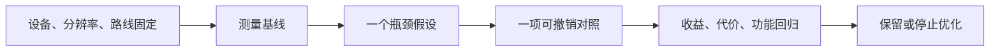

---
{
  "id": "C09",
  "prerequisites": [
    "C08"
  ],
  "revisit": [
    "B11"
  ],
  "memory": [
    "KN19",
    "KN29",
    "KN30",
    "TH06"
  ],
  "labs": [
    "practice/godot/scenes/main.tscn"
  ]
}
---
# C09｜优化入口：知道什么时候该停

**先从这里开始：** 现在最值得查的是哪一次卡顿？也可以先确认已经足够流畅。选一个真实现象，不为使用高级工具而找问题。

**今天做什么：** 从一个症状提出可检验的瓶颈假设，避免无差别优化。

**从哪里开始：** 对同一构建/机位选择一项真实测量，不改多种设置。

**现成材料：** [main.tscn](../../practice/godot/scenes/main.tscn)

**材料边界：** 基准由目标设备提供，headless不代表GPU画面性能。

先试当前这一小步。可以说“给我线索”“示范一小步”或“直接解释”；也可以指认、画图或演示，不必长篇回答。可以暂停，不必先答对才求助。

### 开始对话

```text
我在学C09《优化入口：知道什么时候该停》，请按这份教案带我自学。
先用“先从这里开始”进入当前任务，一次只推进一小步；等我回应后再展开提示或解释。
我可以查菜单/API、看示范或请AI实现；学到的因果关系要由我说明。
课程里的备用题按需选，不要全部变作业；伙伴分享一次就够了。
```

<details data-audience="reference">
<summary>需要时看：解释、对照与候选练习</summary>

**带学提醒（按当前需要使用）：** 没有显著收益也让学员保留诚实结论。测量条件不齐先补条件；达到当前目标就停，不让优化成为永无完成感的任务。

## 学到这里就够了

**M｜需要会判断和应用：**
- `C09.M1` 区分测量条件、症状、假设和结论。
- `C09.M2` 在满足目标时停止不必要的优化。

**K｜知道用途，用到再查：**
- `C09.K1` MultiMesh/LOD/剔除/资源驻留用来选择下一份文档。

**停止线：** 中级不实现完整大世界流送；高级专项按需再做。

**前置：** [C08](C08.md)

## 必要解释

慢可能来自脚本、物理、绘制、加载或资源驻留。只知道面多不够，要用对应开关和记录缩小问题。

一个优化可能减少绘制次数却增加其他约束；成功要看目标帧时间与可读性，不只看一个指标下降。



这是因果／职责示意，不是实际运行截图；不能显示Mermaid时用等价方框图。

## 在现成实验里试

**初始条件：** 三组明确标示合成的案例：大量对象、首次加载尖峰、透明叠加；每组含帧时间和行为标签。
**可比较的条件：** 隐藏一组对象、预热与首次运行比较、固定相机路径、A/B记录。

下面说明要比较的关系；实际从上面的现成文件与首步进入，不为匹配教学控件名重新搭建。

1. 先指出数据能支持什么，不能支持什么。
2. 挑一个最小改变验证原因，避免同时改资源和画质。
3. 目标达标后写停止理由或下一实验。

**观察：** 不展示虚构硬件测试；所有成本样本标示意。
**不符时先查：** 故障：只因Draw Call高就改成全场一个批量对象，却不再有效剔除；讨论测量而不是口号。
**恢复：** 恢复原样本与条件。

只比较一个条件，恢复后再试下一个。课堂模拟应标清示意，真实软件行为需要实际观察；缺文件如实说明，不让学员临时重造系统。

### 软件入口与亲调

- 常用：Profiler/Monitors、效果或对象组开关。
- 会定位：CPU/GPU相关记录与加载日志。
- 按需查：MultiMesh、LOD、剔除和异步加载API。

|选中哪里／参数|只改什么|看什么|
|---|---|---|
|Profiler与监视器（入口）|看指定慢帧区间并重复采样|问题是否稳定，是否可能来自其他系统|
|一个被怀疑的装饰组开关（实验自定义）|只切换目标组，不同时调多个质量选项|变化是否支持假设，以及失去什么画面内容|

运行中临时改动不等于已保存；要留下设计选择，请在自己的副本中写回场景／资源，保存并重新打开检查。

## 我负责什么，AI帮什么

**我的判断：** 判断当前证据是否足够和是否已经达标，不把更低指标自动视为更好。
**可交给AI：** 整理首次/预热样本并提出一项低成本排除试验，不预报收益百分比。
**检查重点：** 检查AI是否把平均FPS提升当成卡顿已消除，或给未测优化收益百分比。

结果不符时，先指出预期与实际的一处差别。有解释就试着验证；没有解释可请AI定位入口、给线索或示范。只改可恢复副本，不删需求或测试来掩盖错误。

## 怎样知道这一小步做到了

- 把条件、症状、假设和结论分开写，提出可区分原因的实验。
- 据真实目标选择继续、撤回或停止，保留画面/功能检查。

**恢复后再检查：** 没有优化掉交互对象或碰撞；同路线玩法和可读性保持。

有提示也是学习进展；没有实际观察就不宣称已经验证。一个对照和解释可以覆盖多个要点，不要求填写评分表。

## 候选问题

先自己判断，再按需看反馈。P是预测、D是诊断、T是迁移、K是用途；按本次需要选一题，不要求全部完成。教学情境不是实测日志。

### C09-P1

三角形少就一定快吗？

### C09-D2

【教学构造情境，不是真实测量或某模型故障统计】关卡每次冷启动首次转弯卡顿，之后同路线正常。AI要全面降模型面数。你先比较哪些运行条件？什么结果会让你暂不支持持续绘制过重的假设？

### C09-T3

只有第一次进入场景卡，先做什么对照？

### C09-K4

MultiMesh适合什么方向？

<details>
<summary>可选补充题：替换本次练习，不叠加作业</summary>

### K05｜用途

几千个重复物体可能有提交开销，要查批量绘制还是重写所有玩法？先确认什么？

### K12｜用途

看不见某区域就一定不占内存吗？资源加载/卸载是否值得查？

</details>

</details>

## 这一课要记在脑海里

- 先找症状再选工具。
- 优化要看副作用。
- 达标可以停止。

**记忆清单：** [KN19](../memory.md#kn19) · [KN29](../memory.md#kn29) · [KN30](../memory.md#kn30) · [TH06](../memory.md#th06)。用到时先想一项；想不起可看例子，再换个条件。不要求逐字背诵。

## 讲给爸爸听

想分享时，可以先展示今天的一处选择、发现或仍没想通的问题，不要求完整讲课。用自己的话讲讲：对照条件、瓶颈、收益。

**给他演示：** 做优化实验员：固定设备和构建，只改变一个可能影响性能的因素。

**你们一起问：** 看起来顺了一点，但没有同条件测量，可以说优化已证明成功吗？

爸爸还有问题就接着问，你也可以问爸爸。一起看、一起试，不必背稿、打分或填表。爸爸暂时不在就稍后分享，不影响继续自学。

<details data-purpose="project">
<summary>需要改自己的作品时再看</summary>

**生产阶段：** P7/P11

**想得到的结果：** 对一个瓶颈假设有数据支持，达到目标后可以停止。
**必须保留：** 同设备、版本、分辨率和玩法验收条件保持。

先读取自己的工作副本。以下是可选局部实现，不是打开现成实验的前置，也不要求再做一整轮：

- 先根据已有数据提出一个瓶颈假设；若无证据就标待测，不执行大重构。
- 只采用一种最小改动，再比较功能、画面和慢帧，收益不够就停止。

**采用依据：** 假设有一项能支持或推翻它的测量。
**换一个场景想想：** 目标设备变弱时重新设约束，不能直接照搬上次达标结论。

参考工程的通过结论不自动覆盖你改过的版本；相关路线实际走一遍，必要时恢复。

</details>

## 下次怎样想起来

前面已学过的复现入口：[B11](B11.md)。
下次碰到相似问题时，可先回想一项关系，再查需要的解释；想不起就补一个小例子，不重学整课。暂停时愿意就留“下次从哪里接着试”，没有笔记也能继续，API和菜单仍可查。

## 依据

- [Godot General optimization：测量与取舍](https://docs.godotengine.org/en/stable/tutorials/performance/general_optimization.html)
- [Godot运行检查与可见碰撞工具](https://docs.godotengine.org/en/stable/tutorials/scripting/debug/overview_of_debugging_tools.html)

技术来源支持概念边界；课程顺序与任务是本项目设计，不代表已经证明学习效果。
