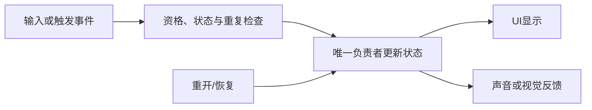

---
{
  "id": "C10",
  "prerequisites": [
    "C06"
  ],
  "revisit": [
    "B06",
    "C05",
    "B08"
  ],
  "memory": [
    "KN16",
    "KN17",
    "TH04"
  ],
  "labs": [
    "practice/godot/labs/interaction_lab.tscn",
    "practice/godot/world/exploration.tscn"
  ]
}
---
# C10｜可交互对象：提示、条件和结果

**今天做什么：** 让一个开关或门可理解地交互，并拒绝距离外操作。

**从哪里开始：** 先用隔离实验区分靠近、允许和结果，再在林路拿钥匙、到门前按E。

**现成材料：** [interaction_lab.tscn](../../practice/godot/labs/interaction_lab.tscn)、[exploration.tscn](../../practice/godot/world/exploration.tscn)

**材料边界：** 门和钥匙已接入主游戏；实验文件与主游戏存档完全隔离。

先观察或猜一猜，动手试一项，再说说为什么。完全陌生可以先看一个小示范；做完当前小步就可以暂停。

### 开始对话

```text
我在学C10《可交互对象：提示、条件和结果》，请按这份教案带我自学。
一次只推进一个有意义的小步，先用现成材料，不先替我作判断。
请把“这次多看一层”融入当前任务，替换重复讲解或备用题，不新增一轮作业。
我可以查菜单/API、看示范或请AI实现；学到的因果关系要由我说明。
课程里的备用题按需选，不要全部变作业；伙伴分享一次就够了。
```

## 这次多看一层

**不只找相同，也判断哪里不能照搬。** 先用现成门完成一次失败和一次成功的交互；把同一请求前后的条件、对象状态和提示对应起来，沿实际状态更新入口追踪，不另做一套实验。

随后把原C10-T3与本课已有告示牌迁移放在一起比较：目标分别是“一只宝箱只领一次奖励”和“同一告示牌可以反复阅读”。先说各自期望，再判断B06的哪些经验可复用、哪些限制不能直接照搬。没有相应实物时只作明示推演，不把讨论说成两个新系统已经运行。

**把好坏说具体：** 先看结果是否违反已选规则；两个方案都符合规则时，再按目标、改动范围和验证成本选择。不要按模块多、类名长或使用ECS评高低。只选一个当前需要的变化接到自己的副本；未选择的保持讨论，不为了完整架构扩充背包或治疗系统。

**给AI的引导：** 先让学习者提出差异，再据当前课与原题反馈帮助比较；不要把一次性模板暗示成所有交互的答案。复盘时联系B08的原因链和C05的状态归属。能指出一个“这次不能照抄的地方”并解释预期，就是有价值的证据；需要提示则继续学习，不新增评分表。

<details data-audience="reference">
<summary>需要时看：解释、对照与候选练习</summary>

## 学到这里就够了

**M｜需要会判断和应用：**
- `C10.M1` 把目标提示、可交互条件和状态结果对应起来。
- `C10.M2` 复用一条交互链而不让对象乱改全局UI。

**K｜知道用途，用到再查：**
- `C10.K1` 射线检测是一种选择目标的方法。

**停止线：** 不要求通用背包，亦不依赖导航选修。

**前置：** [C06](C06.md)

## 必要解释

提示告诉玩家现在能做什么，条件决定是否真的能做。提示出现但按键无效，或远处也能触发，都破坏可理解性。

对象报告交互结果，UI呈现提示；状态归属要明确。钥匙需求可以先用布尔条件模拟，不因此展开完整物品系统。



这是因果／职责示意，不是实际运行截图；不能显示Mermaid时用等价方框图。

## 在现成实验里试

**初始条件：** 门与按钮两个目标，距离与视线标签；一次只允许一个当前目标。
**可比较的条件：** 距离1到5、视线遮挡、交互键、locked条件、提示开关。

下面说明要比较的关系；实际从上面的现成文件与首步进入，不为匹配教学控件名重新搭建。

1. 先预测距离外或被遮挡时的结果。
2. 比较提示与实际触发；改变目标确保旧提示消失。
3. 把按钮换成宝箱，复用条件链而改变结果。

**观察：** 每次失败有可理解原因，但不泄露不该显示的游戏信息；日志与状态对应。
**不符时先查：** 故障：目标已离开但旧提示仍在，按键修改旧对象；清理当前目标与UI。
**恢复：** 清空目标、提示和对象状态。

只比较一个条件，恢复后再试下一个。课堂模拟应标清示意，真实软件行为需要实际观察；缺文件如实说明，不让学员临时重造系统。

### 软件入口与亲调

- Godot：检测距离、对象组、提示文本和状态条件。
- 会定位：RayCast3D结果和信号。
- 按需查：完整交互框架。

|选中哪里／参数|只改什么|看什么|
|---|---|---|
|交互距离（自定义或射线长度）|固定视角，改变允许距离|提示出现范围与真正可执行范围是否一致|
|提示位置/字体（Control内置）|固定目标再调整视觉位置|是否挡住门或与收集提示混淆|

运行中临时改动不等于已保存；要留下设计选择，请在自己的副本中写回场景／资源，保存并重新打开检查。

## 我负责什么，AI帮什么

**我的判断：** 规定交互目标、距离、遮挡和状态条件，验收提示与实际作用对象一致。
**可交给AI：** 生成当前目标/提示/接受事件日志及有限交互链，不新增背包。
**检查重点：** 检查AI是否只检查距离不检查目标、每个对象直接改全局UI，或提示和行为范围不一致。

结果不符：说清预期、实际与复现步骤；先提出一个可推翻的原因，再做最小验证。修改前留基线，不删需求或测试来消除报错。

## 怎样知道这一小步做到了

- 在范围内外和遮挡条件下核对提示及允许结果。
- 在两个目标间切换后只操作当前对象，状态和显示各自归属清楚。

**恢复后再检查：** 原自动拾取继续正常；UI不残留上一扇门提示。

有提示也是学习进展；没有实际观察就不宣称已经验证。一个对照和解释可以覆盖多个要点，不要求填写评分表。

## 候选问题

先自己判断，再按需看反馈。P是预测、D是诊断、T是迁移、K是用途；按本次需要选一题，不要求全部完成。教学情境不是实测日志。

### C10-P1

显示按E是否就表示条件有效？

### C10-D2

【教学构造情境，不是真实测量或某模型故障统计】先靠近门A出现提示，离开再靠近按钮B，提示已写B，但按键仍开A。AI只改提示颜色。你先查哪个引用/条件，怎样避免把显示正确当目标正确？

### C10-T3

按钮改成一次性宝箱，增加什么检查？

### C10-K4

射线在交互中有什么用途？

</details>

## 这一课要记在脑海里

- 提示与可操作条件一致。
- 目标过期要清理。
- 对象状态不藏在UI。

**记忆清单：** [KN16](../memory.md#kn16) · [KN17](../memory.md#kn17) · [TH04](../memory.md#th04)。先遮住解释，用自己的话说，再举例；不是照抄定义。

## 讲给爸爸听

在今天的关键地方或结束时，选一次和爸爸分享。用自己的话讲讲：检测、允许条件、交互结果。

**给他演示：** 做互动设计师：把靠近、允许操作和结果分成三个判断，并用一个对象说明。

**你们一起问：** 角色靠近门了，但还没有钥匙，检测成功是否等于可以开门？

爸爸还有问题就接着问，你也可以问爸爸。一起看、一起试，不必背稿、打分或填表。爸爸暂时不在就稍后分享，不影响继续自学。

<details data-purpose="project">
<summary>需要改自己的作品时再看</summary>

**生产阶段：** P2/P7

**想得到的结果：** 提示、条件、目标和动作结果明确归属，交互只作用当前目标。
**必须保留：** 拾取自动检测和门的交互按键不混合；全局计数与玩家运动不变。

先读取自己的工作副本。以下是可选局部实现，不是打开现成实验的前置，也不要求再做一整轮：

- 先只给一扇门或一个物体添加目标提示和触发条件，状态仍由正确对象管理。
- 重复切换目标和输入，确认对象不直接乱改其他对象UI。

**采用依据：** 不满足条件时无结果，满足时有正确提示与一次变化。
**换一个场景想想：** 把门换成可读告示牌，保留检测思路但更换结果职责。

参考工程的通过结论不自动覆盖你改过的版本；相关路线实际走一遍，必要时恢复。

</details>

## 下次怎样想起来

前面已学过的复现入口：[B06](B06.md)、[C05](C05.md)、[B08](B08.md)。
隔一段时间不看答案，再解释本课的一项关键关系；换一个对象或条件应用。记住词也要会用，API和菜单位置可以查。疑问笔记可选，没有笔记也仍有公共必记清单。

## 依据

- [Godot Area3D：重叠检测与信号](https://docs.godotengine.org/en/stable/classes/class_area3d.html)
- [Godot Resources：共享和引用](https://docs.godotengine.org/en/stable/tutorials/scripting/resources.html)
- [Godot运行检查与可见碰撞工具](https://docs.godotengine.org/en/stable/tutorials/scripting/debug/overview_of_debugging_tools.html)

技术来源支持概念边界；课程顺序与任务是本项目设计，不代表已经证明学习效果。
