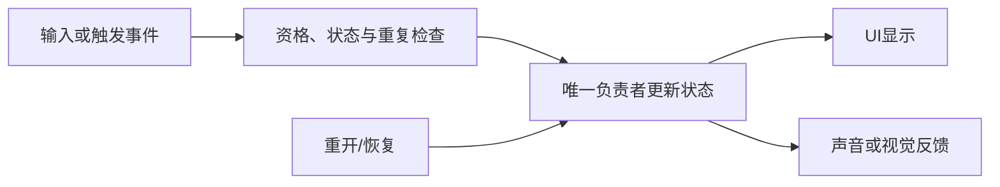

---
{
  "id": "C10",
  "prerequisites": ["C06"],
  "revisit": ["B06", "C05", "B08"],
  "memory": ["KN16", "KN17", "TH04"],
  "labs": ["practice/godot/labs/interaction_lab.tscn", "practice/godot/world/exploration.tscn"]
}
---
# C10｜可交互对象：提示、条件和结果

**今天做什么：** 让一个开关或门可理解地交互，并拒绝距离外操作。

**从哪里开始：** 先用隔离门实验，只改变距离或钥匙中的一个条件，再在林路拿钥匙、到门前按E。

**现成材料：** [interaction_lab.tscn](../../practice/godot/labs/interaction_lab.tscn)、[exploration.tscn](../../practice/godot/world/exploration.tscn)

**材料边界：** 现成Lab有一扇门、实际接近检测、钥匙条件、开门及独立存档。多目标、视线遮挡、宝箱和告示牌是课堂推演或作品变式，不声称都有现成开关；门和钥匙已接入主游戏，实验存档与它隔离。

先观察或猜一猜，动手试一项，再说说为什么。完全陌生可以先看一个小示范；做完当前小步就可以暂停。

### 开始对话

```text
我在学C10《可交互对象：提示、条件和结果》，请按这份教案带我自学。
一次只推进一个有意义的小步，先用现成材料，不先替我作判断。
请把“这次多看一层”融入当前任务，替换重复讲解或备用题，不新增一轮作业。
先听我的预测或疑问，再按需要给线索；我完全不熟悉时可以先看小示范。
我可以查菜单/API、看示范或请AI实现；学到的因果关系要由我说明。
课程里的备用题按需选，不要全部变作业；伙伴分享一次就够了。
```

## 这次多看一层

**先留一个问题：** “门没有打开，只凭这个结果就能知道原因吗？你想怎样查清？”使用现成实验的已知设置，不暗中改故障。界面已经给出条件或原因时可以利用，不假装那些线索不存在。

**你来选一个验证：** 在第一次开门尝试前，先预测并说明准备只改什么、保持什么。比较距离和钥匙时，先选一个；不要同时改变后把原因归给其中一项。操作入口可以请AI定位，原因与验证选择先由你说。运行后把实际接近、条件、门的状态和提示对应起来。

**试过再解释：** 沿当前门的关键判断看一次“什么情况下允许，成功后改变了哪里”，不只看动画。再将原C10-T3与已有告示牌迁移配对：宝箱目标是只领一次奖励，告示牌目标是能够反复阅读。先由学员说期望和差异，再说明B06哪些经验可以复用、哪些限制不应照搬。未实施的变式明确标为推演。

**把发现带走：** 由学员选择一个当前真正需要的交互变化，提出怎样证明它符合目标；仅讨论也可以。若接入自己的副本，只实施这一项并验证旧拾取仍正常。能指出一次“看起来相同，规则却不一样”的地方，并用它作出新选择，比复述模型名字更有价值。

**给AI的引导：** 首次只给问题和已有材料，先听预测，不提前给完整条件表。学员已有两个解释时，请他选能区分的一个操作；没有基础就示范一次，不无限追问。按原题反馈点明共同关系和适用边界，联系B08、C05。先判断是否违反已选规则，再讨论两种合理方案的目标和成本；不按ECS或模块数量排高低。只做一条比较，不新增背包、治疗系统或一轮考试。学员可以表达“早就知道”或“还不确定”，不用制造惊讶证明学习。

<details data-audience="reference">
<summary>需要时看：解释、对照与候选练习</summary>

## 学到这里就够了

**M｜需要会判断和应用：**
- `C10.M1` 把目标提示、可交互条件和状态结果对应起来。
- `C10.M2` 复用一条交互链而不让对象乱改全局UI。

**K｜知道用途，用到再查：**
- `C10.K1` 射线检测是一种选择目标的方法。

**停止线：** 不要求通用背包，亦不依赖导航选修。

**前置：** [C06](C06.md)

## 必要解释

提示告诉玩家现在能做什么，条件决定是否真的能做。提示出现但按键无效，或远处也能触发，都破坏可理解性。

对象报告交互结果，UI呈现提示；状态归属要明确。钥匙需求可以先用布尔条件模拟，不因此展开完整物品系统。



这是因果／职责示意，不是实际运行截图；不能显示Mermaid时用等价方框图。先有具体对照，再将观察对应到图。

## 在现成实验里试

**初始条件：** 一扇关闭的门、可调角色位置和钥匙条件，使用实际Area重叠判断接近；明确当前设置再作预测。
**可比较的条件：** 只改角色位置或钥匙条件；按开门按钮，观察门和碰撞是否变化，成功后再试重复请求。

复用“这次多看一层”的原对照，不要求重做。多目标切换、视线遮挡或按钮变宝箱只在已经有相应材料的副本中实测，否则保留为原题推演。

**观察：** 将失败／成功结果与当前条件对应；不要从“能检测到”直接跳到“允许执行”。提示内容不应泄露游戏设计中本应隐藏的信息。
**不符时先查：** C10-D2是目标引用过期的构造故障，不声称一扇门Lab已经提供两个目标。先辨认显示与实际作用对象，不能靠改提示颜色修复状态错误。
**恢复：** 用“恢复本实验全部初值”恢复场景；本实验专用磁盘存档仍保留，不通过删档重置学习现场。

只比较一个条件，恢复后再试下一个。课堂模拟应标清示意，真实软件行为需要实际观察；缺文件如实说明，不让学员临时重造系统。

### 软件入口与亲调

- Godot：检测距离、对象组、提示文本和状态条件。
- 会定位：当前Lab的实际Area条件与开门入口；选用射线的作品再查看RayCast3D结果。
- 按需查：完整交互框架。

|选中哪里／参数|只改什么|看什么|
|---|---|---|
|Lab角色位置或实际交互距离|固定另一条件，只改一项|检测、提示与真正可执行是否一致|
|提示位置/字体（Control内置）|固定目标再调整视觉位置|是否挡住门或与收集提示混淆|

运行中临时改动不等于已保存；要留下设计选择，请在自己的副本中写回场景／资源，保存并重新打开检查。

## 我负责什么，AI帮什么

**我的判断：** 规定交互目标、距离和状态条件，按需决定是否考虑遮挡，选择能分清原因的验证。
**可交给AI：** 定位当前目标／提示／状态的实际处理位置，协助有限交互链，不新增背包。
**检查重点：** 检查AI是否只检查距离不检查目标、每个对象直接改全局UI，或提示和行为范围不一致。

结果不符：说清预期、实际与复现步骤；先提出一个可推翻的原因，再做最小验证。修改前留基线，不删需求或测试来消除报错。

## 怎样知道这一小步做到了

- 在已选的范围内外及钥匙条件下核对提示与结果；只有作品选择了遮挡才实测遮挡规则。
- 解释对象状态与UI分工；作品有两个目标时核对切换后只操作当前对象，没有相应材料则把这一项保留为推演或待验证。

**恢复后再检查：** 原自动拾取继续正常；UI不残留上一扇门提示。

有提示也是学习进展；没有实际观察就不宣称已经验证。一个对照和解释可以覆盖多个要点，不要求填写评分表。

## 候选问题

先自己判断，再按需看反馈。P是预测、D是诊断、T是迁移、K是用途；按本次需要选一题，不要求全部完成。教学情境不是实测日志。

### C10-P1

显示按E是否就表示条件有效？

### C10-D2

【教学构造情境，不是真实测量或某模型故障统计】先靠近门A出现提示，离开再靠近按钮B，提示已写B，但按键仍开A。AI只改提示颜色。你先查哪个引用/条件，怎样避免把显示正确当目标正确？

### C10-T3

按钮改成一次性宝箱，增加什么检查？

### C10-K4

射线在交互中有什么用途？

</details>

## 这一课要记在脑海里

- 提示与可操作条件一致。
- 目标过期要清理。
- 对象状态不藏在UI。

**记忆清单：** [KN16](../memory.md#kn16) · [KN17](../memory.md#kn17) · [TH04](../memory.md#th04)。先遮住解释，用自己的话说，再举例；不是照抄定义。

## 讲给爸爸听

在今天的关键地方或结束时，选一次和爸爸分享。用自己的话讲讲：检测、允许条件、交互结果。

**给他演示：** 选你已经做过的一次失败与成功，说出保持了什么、改变了什么；也可以请爸爸先提出一个解释。

**你们一起问：** 为什么你选的操作能分清原因？换成能反复阅读的告示牌，哪条限制不能照搬？

爸爸还有问题就接着问，你也可以问爸爸。一起看、一起试，不必背稿、打分或填表。爸爸暂时不在就稍后分享，不影响继续自学。

<details data-purpose="project">
<summary>需要改自己的作品时再看</summary>

**生产阶段：** P2/P7

**想得到的结果：** 提示、条件、目标和动作结果明确归属，交互只作用当前目标。
**必须保留：** 拾取自动检测和门的交互按键不混合；全局计数与玩家运动不变。

先读取自己的工作副本。以下是可选局部实现，不是打开现成实验的前置，也不要求再做一整轮：

- 先只给一扇门或一个物体添加目标提示和触发条件，状态仍由正确对象管理。
- 作品已存在多个目标时，重复切换目标和输入，确认对象不直接乱改其他对象UI；没有多目标不为课堂重建框架。

**采用依据：** 不满足条件时无结果，满足时有正确提示与一次变化。
**换一个场景想想：** 把门换成可读告示牌，保留检测思路但更换结果职责。

参考工程的通过结论不自动覆盖你改过的版本；相关路线实际走一遍，必要时恢复。

</details>

## 下次怎样想起来

前面已学过的复现入口：[B06](B06.md)、[C05](C05.md)、[B08](B08.md)。
隔一段时间不看答案，再解释本课的一项关键关系；换一个对象或条件应用。记住词也要会用，API和菜单位置可以查。疑问笔记可选，没有笔记也仍有公共必记清单。

## 依据

- [Godot Area3D：重叠检测与信号](https://docs.godotengine.org/en/stable/classes/class_area3d.html)
- [Godot Resources：共享和引用](https://docs.godotengine.org/en/stable/tutorials/scripting/resources.html)
- [Godot运行检查与可见碰撞工具](https://docs.godotengine.org/en/stable/tutorials/scripting/debug/overview_of_debugging_tools.html)

技术来源支持概念边界；课程顺序与任务是本项目设计，不代表已经证明学习效果。
