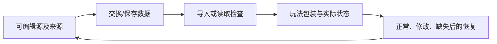

---
{
  "id": "C11",
  "prerequisites": [
    "C10"
  ],
  "revisit": [
    "B08",
    "B12"
  ],
  "memory": [
    "KN24",
    "TH04"
  ],
  "labs": [
    "practice/godot/labs/interaction_lab.tscn",
    "practice/godot/world/exploration.tscn"
  ]
}
---
# C11｜存档与设置：能恢复比能写入更重要

**先从这里开始：** 退出以后，你最希望游戏记住什么？先用实验专用存档做一次正常保存和读取，再选一种异常看看怎样保护原来的进度。

**今天做什么：** 定义最小保存内容，并用三份给定数据检查恢复。

**从哪里开始：** 先在实验专用文件完成正常保存与读取，再逐项试缺失、旧版或损坏；最后在主游戏自己的副本保存并继续。

**现成材料：** [interaction_lab.tscn](../../practice/godot/labs/interaction_lab.tscn)、[exploration.tscn](../../practice/godot/world/exploration.tscn)

**材料边界：** 主游戏有独立版本存档和备份；恢复到安全检查点，不保存攻击中间帧；不承诺抗所有断电故障。

先试当前这一小步。可以说“给我线索”“示范一小步”或“直接解释”；也可以指认、画图或演示，不必长篇回答。可以暂停，不必先答对才求助。

### 开始对话

```text
我在学C11《存档与设置：能恢复比能写入更重要》，请按这份教案带我自学。
先用“先从这里开始”进入当前任务，一次只推进一小步；等我回应后再展开提示或解释。
我可以查菜单/API、看示范或请AI实现；学到的因果关系要由我说明。
课程里的备用题按需选，不要全部变作业；伙伴分享一次就够了。
```

<details data-audience="reference">
<summary>需要时看：解释、对照与候选练习</summary>

**带学提醒（按当前需要使用）：** 先建立能恢复的安全感，再看坏档或旧档。明确只操作实验文件；不要用孩子唯一作品制造挫折，也不要把恢复失败当思考不够。

## 学到这里就够了

**M｜需要会判断和应用：**
- `C11.M1` 区分持久进度、偏好设置和临时状态。
- `C11.M2` 测试缺失/旧版/损坏数据的恢复策略。

**K｜知道用途，用到再查：**
- `C11.K1` 版本迁移、原子写入是避免破坏保存数据的思路。

**停止线：** 不做数据库、云同步或安全加密课程。

**前置：** [C10](C10.md)

## 必要解释

保存不是把所有节点照相。最小进度与设置应明确，例如已完成目标ID、音量和输入偏好；临时粒子和鼠标位置通常不是必须存。

读取失败时要有可解释退路，不静默覆盖用户原文件。旧数据要按版本判断，复杂迁移可交AI写但测试由人定义。



这是因果／职责示意，不是实际运行截图；不能显示Mermaid时用等价方框图。

## 在现成实验里试

**初始条件：** 三张教学JSON数据卡：正常、缺字段、无效内容；只在沙盒模拟，不读取真实用户文件。
**可比较的条件：** 选择数据、加载、默认值、保留原件、改变音量、重开。

下面说明要比较的关系；实际从上面的现成文件与首步进入，不为匹配教学控件名重新搭建。

1. 先分类哪些需要持久保存。
2. 加载三种数据，记录提示与恢复状态。
3. 修改一个设置后重开，检查与进度互不误伤。

**观察：** 显示解析结果、采取的策略及是否覆盖原件；失败不可伪装成功。
**不符时先查：** 故障：损坏档加载失败后立刻写空档覆盖；要求保留原件并提供恢复路径。
**恢复：** 只清沙盒数据，保留模拟备份和错误记录。

只比较一个条件，恢复后再试下一个。课堂模拟应标清示意，真实软件行为需要实际观察；缺文件如实说明，不让学员临时重造系统。

### 软件入口与亲调

- Godot：设置参数、模拟加载按钮、错误输出。
- 会定位：user://数据位置概念、配置与进度文件。
- 按需查：序列化API、迁移和原子写入实现。

|选中哪里／参数|只改什么|看什么|
|---|---|---|
|设置界面音量/输入映射（项目界面）|修改一个设置后重启|持久化结果与当前界面是否一致|
|给定存档样例选择（教学控件，不是内置按钮）|分别载入正常/缺失/旧版/损坏副本|默认回退、错误提示、原文件保留|

运行中临时改动不等于已保存；要留下设计选择，请在自己的副本中写回场景／资源，保存并重新打开检查。

## 我负责什么，AI帮什么

**我的判断：** 决定保存最小内容、失败策略及可覆盖范围；不让AI自动清空唯一数据。
**可交给AI：** 只在沙盒副本生成正常/旧版/损坏数据测试并解释读写策略。
**检查重点：** 检查AI是否只测试保存成功、不验证加载，或静默覆盖损坏原档。

结果不符时，先指出预期与实际的一处差别。有解释就试着验证；没有解释可请AI定位入口、给线索或示范。只改可恢复副本，不删需求或测试来掩盖错误。

## 怎样知道这一小步做到了

- 区分持久进度、偏好和临时表现，给出恢复需求。
- 在副本测试缺失/旧/损坏数据，保留原件且能重开恢复设置。

**恢复后再检查：** 加载后收集、完成、重开仍一致；恢复不会重复发奖励。

有提示也是学习进展；没有实际观察就不宣称已经验证。一个对照和解释可以覆盖多个要点，不要求填写评分表。

## 候选问题

先自己判断，再按需看反馈。P是预测、D是诊断、T是迁移、K是用途；按本次需要选一题，不要求全部完成。教学情境不是实测日志。

### C11-P1

粒子当前播放时间一定要保存吗？

### C11-D2

【教学构造情境，不是真实测量或某模型故障统计】旧档少一个新字段。AI把任何异常都当首次运行，并立即用默认值覆盖原档；游戏能启动。你能接受什么、必须阻止什么？给一个不接触唯一原件的测试。

### C11-T3

游戏新增字段，旧档怎么验收？

### C11-K4

数据版本号的用途？

<details>
<summary>可选补充题：替换本次练习，不叠加作业</summary>

### KN24-P｜预测

旧存档没有新字段，应该直接崩溃吗？

### KN24-T｜迁移

换电脑后存档读取失败，如何区分文件不存在与数据不兼容？

</details>

</details>

## 这一课要记在脑海里

- 先定义需要恢复什么。
- 失败不要覆盖唯一原件。
- 读档边界与写档同样重要。

**记忆清单：** [KN24](../memory.md#kn24) · [TH04](../memory.md#th04)。用到时先想一项；想不起可看例子，再换个条件。不要求逐字背诵。

## 讲给爸爸听

想分享时，可以先展示今天的一处选择、发现或仍没想通的问题，不要求完整讲课。用自己的话讲讲：保存状态、恢复、异常。

**给他演示：** 做存档检查员：先列要记住的状态，再用最小副本检查保存、读取和异常。

**你们一起问：** 没有存档文件时程序应该怎样表现，才能让玩家继续使用？

爸爸还有问题就接着问，你也可以问爸爸。一起看、一起试，不必背稿、打分或填表。爸爸暂时不在就稍后分享，不影响继续自学。

<details data-purpose="project">
<summary>需要改自己的作品时再看</summary>

**生产阶段：** P2/P11

**想得到的结果：** 正常、缺失、旧版和损坏样例都有可说明的恢复策略。
**必须保留：** 用户原存档与未授权目录不动；测试数据和正式数据分离。

先读取自己的工作副本。以下是可选局部实现，不是打开现成实验的前置，也不要求再做一整轮：

- 先定义最少保存字段，并用临时测试数据做保存与读取，不读取无关文件或覆盖原档。
- 用提供的缺失/旧版/损坏样例验证回退，只测试副本，保留原档。

**采用依据：** 正常数据恢复为期望状态，关卡原始文件没有被当存档写入。
**换一个场景想想：** 增加一个新设置字段，检查旧档不含它时是否安全。

参考工程的通过结论不自动覆盖你改过的版本；相关路线实际走一遍，必要时恢复。

</details>

## 下次怎样想起来

前面已学过的复现入口：[B08](B08.md)、[B12](B12.md)。
下次碰到相似问题时，可先回想一项关系，再查需要的解释；想不起就补一个小例子，不重学整课。暂停时愿意就留“下次从哪里接着试”，没有笔记也能继续，API和菜单仍可查。

## 依据

- [Godot Resources：共享和引用](https://docs.godotengine.org/en/stable/tutorials/scripting/resources.html)
- [Godot运行检查与可见碰撞工具](https://docs.godotengine.org/en/stable/tutorials/scripting/debug/overview_of_debugging_tools.html)

技术来源支持概念边界；课程顺序与任务是本项目设计，不代表已经证明学习效果。
