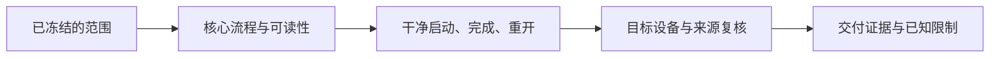

---
{
  "id": "C12",
  "prerequisites": [
    "C11",
    "C09"
  ],
  "revisit": [
    "B05",
    "B11",
    "C11"
  ],
  "memory": [
    "KN20",
    "KN24",
    "KN26",
    "TH03"
  ],
  "labs": [
    "practice/godot/world/exploration.tscn"
  ]
}
---
# C12｜交付：别人电脑上第一次运行

**先从这里开始：** 想把这一版交给别人玩，最希望他顺利完成哪段体验？先选一个目标平台验证，不需要今天学完所有发布规则。

**今天做什么：** 写出选定平台的首次启动与完成路径验收单。

**从哪里开始：** 先运行完整三段主线和暂停菜单，再按自己的目标平台实际导出验收。

**现成材料：** [exploration.tscn](../../practice/godot/world/exploration.tscn)

**材料边界：** 源码与自动测试不是全部设备体验认证；发布包仍须目标设备检查。

先试当前这一小步。可以说“给我线索”“示范一小步”或“直接解释”；也可以指认、画图或演示，不必长篇回答。可以暂停，不必先答对才求助。

### 开始对话

```text
我在学C12《交付：别人电脑上第一次运行》，请按这份教案带我自学。
先用“先从这里开始”进入当前任务，一次只推进一小步；等我回应后再展开提示或解释。
我可以查菜单/API、看示范或请AI实现；学到的因果关系要由我说明。
课程里的备用题按需选，不要全部变作业；伙伴分享一次就够了。
```

<details data-audience="reference">
<summary>需要时看：解释、对照与候选练习</summary>

**带学提醒（按当前需要使用）：** 把首次启动到完成拆成一段可观察路线。权限、账户、来源与费用由成人协助；未验证明确说出，不把发布或赚钱变成孩子的责任。

## 学到这里就够了

**M｜需要会判断和应用：**
- `C12.M1` 在干净环境检查依赖、输入、资源与结束路径。
- `C12.M2` 核对来源、可分发范围和已知限制。

**K｜知道用途，用到再查：**
- `C12.K1` Debug/Release、导出模板和平台签名知道入口即可。

**停止线：** 只选一个目标平台，不学全部商店运营和签名体系。

**前置：** [C11](C11.md)、[C09](C09.md)

## 必要解释

编辑器里能玩不等于导出包能玩。干净用户数据、资源路径大小写、导出包含范围和输入设备可能暴露遗漏。

课程公开仓库与游戏发布包的授权需求也可能不同。可在游戏使用不必然可在源码仓库再分发源资产，按具体许可核对。



这是因果／职责示意，不是实际运行截图；不能显示Mermaid时用等价方框图。

## 在现成实验里试

**初始条件：** 两张包清单：只含游戏包与误包含本地绝对路径的包；首次启动/老用户两种场景。
**可比较的条件：** 干净/已有存档、目标平台、资源包含勾选、完成/退出步骤。

下面说明要比较的关系；实际从上面的现成文件与首步进入，不为匹配教学控件名重新搭建。

1. 画一次从打开到完成再退出的路径。
2. 用清单查缺失依赖和硬编码路径。
3. 核对每份资源的来源、修改和再分发记录。

**观察：** 明确课堂不真的导出或验证某平台，输出待执行验收单。
**不符时先查：** 故障：仅作者电脑有的一张贴图被漏打包；修导出依赖而非让用户手工复制私人目录。
**恢复：** 还原包清单与测试数据，不修改真实系统。

只比较一个条件，恢复后再试下一个。课堂模拟应标清示意，真实软件行为需要实际观察；缺文件如实说明，不让学员临时重造系统。

### 软件入口与亲调

- Godot：Export目标、资源包含范围、Release/Debug用途。
- 会定位：首次启动日志、数据目录。
- 按需查：安装签名、平台权限和商店要求。

|选中哪里／参数|只改什么|看什么|
|---|---|---|
|Godot Export Preset（内置入口）|核对单一目标与所需导出资源|是否误漏资源或包含开发秘密|
|游戏画面/音量设置（项目界面）|在干净用户数据下确认首次默认值|首次进入能否看清、操作并完成|

运行中临时改动不等于已保存；要留下设计选择，请在自己的副本中写回场景／资源，保存并重新打开检查。

## 我负责什么，AI帮什么

**我的判断：** 选一个目标平台，确认首次启动与资源分发范围，不把许可证猜测当结论。
**可交给AI：** 准备导出依赖清单和干净数据测试步骤，标出许可信息缺口。
**检查重点：** 检查AI是否把导出命令成功当可玩验收，或漏掉资源授权和秘密文件。

结果不符时，先指出预期与实际的一处差别。有解释就试着验证；没有解释可请AI定位入口、给线索或示范。只改可恢复副本，不删需求或测试来掩盖错误。

## 怎样知道这一小步做到了

- 实际目标包在干净数据条件走完启动、控制、收齐、重开/退出路径。
- 逐项核对来源和所选发布物范围，明确未授权源资产不能直接公开。

**恢复后再检查：** 导出版本而非编辑器内重走核心循环，记录实际设备与版本。

有提示也是学习进展；没有实际观察就不宣称已经验证。一个对照和解释可以覆盖多个要点，不要求填写评分表。

## 候选问题

先自己判断，再按需看反馈。P是预测、D是诊断、T是迁移、K是用途；按本次需要选一题，不要求全部完成。教学情境不是实测日志。

### C12-P1

本机编辑器跑通等于发布包通过吗？

### C12-D2

【教学构造情境，不是真实测量或某模型故障统计】作者电脑导出包正常，另一台缺贴图。AI给出作者私人磁盘的绝对路径，声称修复。怎样检查依赖和打包范围？课程仓库与游戏包中的素材应分别核对什么？

### C12-T3

教程仓库准备公开，资源已可商用就都能上传吗？

### C12-K4

Release与Debug为何区分？

</details>

## 这一课要记在脑海里

- 测试别人第一次运行。
- 导出包才是交付对象。
- 使用权和源资产再分发分开核对。

**记忆清单：** [KN20](../memory.md#kn20) · [KN24](../memory.md#kn24) · [KN26](../memory.md#kn26) · [TH03](../memory.md#th03)。用到时先想一项；想不起可看例子，再换个条件。不要求逐字背诵。

## 讲给爸爸听

想分享时，可以先展示今天的一处选择、发现或仍没想通的问题，不要求完整讲课。用自己的话讲讲：目标平台、导出包、真实运行。

**给他演示：** 做发布测试员：在目标平台运行自己的导出包，检查开始、游玩、重开和退出。

**你们一起问：** 编辑器里正常，是否足以证明发给爸爸的包也正常？

爸爸还有问题就接着问，你也可以问爸爸。一起看、一起试，不必背稿、打分或填表。爸爸暂时不在就稍后分享，不影响继续自学。

<details data-purpose="project">
<summary>需要改自己的作品时再看</summary>

**生产阶段：** P11

**想得到的结果：** 选定平台有可启动、可完成、可恢复的交付记录。
**必须保留：** 源项目、唯一存档和第三方原资源不被清理；不扩成多平台商店发布。

先读取自己的工作副本。以下是可选局部实现，不是打开现成实验的前置，也不要求再做一整轮：

- 先确认唯一目标平台、输入和资源来源；导出一个测试包而非同时支持全部平台。
- 沿固定路线检查完成、重开、声音与设置；增强版还测关闭训练角。

**采用依据：** 在干净数据条件下首次启动能到可玩场景。
**换一个场景想想：** 换另一个干净用户目录再测，不要求新增第二个平台。

参考工程的通过结论不自动覆盖你改过的版本；相关路线实际走一遍，必要时恢复。

</details>

## 下次怎样想起来

前面已学过的复现入口：[B05](B05.md)、[B11](B11.md)、[C11](C11.md)。
下次碰到相似问题时，可先回想一项关系，再查需要的解释；想不起就补一个小例子，不重学整课。暂停时愿意就留“下次从哪里接着试”，没有笔记也能继续，API和菜单仍可查。

## 依据

- [Kenney Support：资产用途与许可说明](https://kenney.nl/support)
- [Adobe Mixamo FAQ：角色、动作及使用条件](https://helpx.adobe.com/creative-cloud/faq/mixamo-faq.html)
- [Godot General optimization：测量与取舍](https://docs.godotengine.org/en/stable/tutorials/performance/general_optimization.html)
- [Godot运行检查与可见碰撞工具](https://docs.godotengine.org/en/stable/tutorials/scripting/debug/overview_of_debugging_tools.html)

技术来源支持概念边界；课程顺序与任务是本项目设计，不代表已经证明学习效果。
