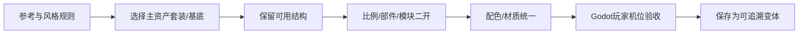

---
{
  "id": "D01",
  "prerequisites": [
    "C07",
    "B10"
  ],
  "revisit": [
    "B02",
    "B01",
    "C07"
  ],
  "memory": [
    "ART02",
    "ART03",
    "KN11",
    "KN15",
    "TH03"
  ],
  "labs": [
    "practice/blender/kitbash_style_lab.blend"
  ]
}
---
# D01｜资产套装二开：从基底拼装成自己的道具

**先从这里开始：** 让现成小屋多一点自己的味道：挑屋顶比例或一个部件，先改其中一项。原版保留着，可以比较，也可以撤回。

**今天做什么：** 从风格接近的可编辑套装中选择基底，通过比例、模块替换和有限细修做出属于当前项目的变体。

**从哪里开始：** 先另存副本，选Variant_Roof只改一项比例，比较Base。

**现成材料：** [kitbash_style_lab.blend](../../practice/blender/kitbash_style_lab.blend)

**材料边界：** 原创几何二开样例，不是已购买的完整资产套装。

先试当前这一小步。可以说“给我线索”“示范一小步”或“直接解释”；也可以指认、画图或演示，不必长篇回答。可以暂停，不必先答对才求助。

### 开始对话

```text
我在学D01《资产套装二开：从基底拼装成自己的道具》，请按这份教案带我自学。
先用“先从这里开始”进入当前任务，一次只推进一小步；等我回应后再展开提示或解释。
我可以查菜单/API、看示范或请AI实现；学到的因果关系要由我说明。
课程里的备用题按需选，不要全部变作业；伙伴分享一次就够了。
```

<details data-audience="reference">
<summary>需要时看：解释、对照与候选练习</summary>

**带学提醒（按当前需要使用）：** 先指出学员选择带来的具体变化。只有轮廓可见的部分值得细修；不把从Cube做起当认真，也不代替孩子选最后的样子。

## 学到这里就够了

**M｜需要会判断和应用：**
- `D01.M1` 选择适合改造的基底并保持非破坏性工作流。
- `D01.M2` 只打磨游戏镜头能感知的比例、边缘和细节。

**K｜知道用途，用到再查：**
- `D01.K1` Modifier Stack、拓扑和法线修复知道影响及查找入口。

**停止线：** 不做全套雕刻、复杂角色重拓扑或从Cube重造整件资产；只改玩家镜头真正看得到且能提升统一性的部分。

**前置：** [C07](C07.md)、[B10](B10.md)

## 必要解释

合适基底应有可用授权、可编辑结构、合理尺度，并接近目标风格。若差距主要在整体比例、形体节奏与材质，常可从基底改造；若必须重做全部结构，换基底更省时间。

三轮顺序：先轮廓比例，再开口厚度/连接关系等中形，最后有限倒角与装饰。每轮在统一游戏机位看一遍；保留源版本和可回退修改器。

把资产包当乐高积木：先保留它优秀的视觉基因，再改最影响身份的大形、比例和部件组合。可以换屋顶/门窗/招牌/附件，或把多个兼容模块Kitbash成新道具；不需要为“原创”把已合格结构全部重做。



这是因果／职责示意，不是实际运行截图；不能显示Mermaid时用等价方框图。

## 在现成实验里试

**初始条件：** 许可明确的简单木箱教学基底；目标是圆润绘本风而非写实旧箱。提供近景与游戏距离预览。
**可比较的条件：** 宽高比0.8到1.3、边缘倒角小/中/大、装饰0/2/6处、平滑对照、修改栈开关。

下面说明要比较的关系；实际从上面的现成文件与首步进入，不为匹配教学控件名重新搭建。

1. 对照风格卡，只圈三处最重要变化。
2. 按大形→结构→细节顺序逐轮A/B，不能一开始刻全部木纹。
3. 关闭修改器看基底仍可恢复，检查原点、尺度和模型表面。

**观察：** 显示每轮投入与实际可见收益；高面数不自动加分。对比必须使用相同灯光和机位。
**不符时先查：** 反例：为修表面黑斑不断加细分；应先查法线、重叠面等原因，再决定是否要增面。
**恢复：** 恢复原始基底副本和修改栈，保留三轮取舍记录。

只比较一个条件，恢复后再试下一个。课堂模拟应标清示意，真实软件行为需要实际观察；缺文件如实说明，不让学员临时重造系统。

### 软件入口与亲调

- Blender常用：Object/Edit Mode、选局部、Move/Scale、简单Extrude/Bevel、修改器启停。
- 会定位：法线/面朝向、合并重复点、Mirror和Apply影响。
- 按需查：复杂拓扑、雕刻笔刷、自动重拓扑。

|选中哪里／参数|只改什么|看什么|
|---|---|---|
|Blender对象/编辑模式（内置）|先小幅改主次比例，再检查厚度与开口|游戏距离下大形收益、连接位置是否合理|
|Bevel修改器宽度与段数（内置）|少量调宽度，段数只加到可见需求|轮廓、高光和变形，不以参数越大越高级|

运行中临时改动不等于已保存；要留下设计选择，请在自己的副本中写回场景／资源，保存并重新打开检查。

## 我负责什么，AI帮什么

**我的判断：** 比较基底差距/编辑成本，保留可回退源，在玩家距离选择改造重点。
**可交给AI：** 列少量局部改造与可撤销修改器方案，复杂坏基底允许推荐换用。
**检查重点：** 检查AI是否为了“原创”重做整件模型、破坏接口/原点，或把看不到的小细节当质量核心。

结果不符时，先指出预期与实际的一处差别。有解释就试着验证；没有解释可请AI定位入口、给线索或示范。只改可恢复副本，不删需求或测试来掩盖错误。

## 怎样知道这一小步做到了

- 按目标、来源和可编辑性选基底，能回到原始版本。
- 依次打磨大形、结构与有限细节，在固定游戏机位展示收益。

**恢复后再检查：** 导出后尺寸、原点、材质引用仍可用；相邻模块与功能包装未坏。

有提示也是学习进展；没有实际观察就不宣称已经验证。一个对照和解释可以覆盖多个要点，不要求填写评分表。

## 候选问题

先自己判断，再按需看反馈。P是预测、D是诊断、T是迁移、K是用途；按本次需要选一题，不要求全部完成。教学情境不是实测日志。

### D01-P1

有基底就一定比重做快吗？

### D01-D2

【教学构造情境，不是真实测量或某模型故障统计】箱子局部有黑斑。AI连续增加Subdivision层级，面数上升但黑斑仍在；目标只要圆润绘本道具。接下来先检查哪类原因，怎样避免把未知故障当细节不足？

### D01-T3

木箱改造规则复用到门，哪些可共享？

### D01-K4

非破坏性修改为何重要？

</details>

## 这一课要记在脑海里

- 先选合适基底再改。
- 三轮打磨，先大后小。
- 游戏距离看不到的细节先省。

**记忆清单：** [ART02](../memory.md#art02) · [ART03](../memory.md#art03) · [KN11](../memory.md#kn11) · [KN15](../memory.md#kn15) · [TH03](../memory.md#th03)。用到时先想一项；想不起可看例子，再换个条件。不要求逐字背诵。

## 讲给爸爸听

想分享时，可以先展示今天的一处选择、发现或仍没想通的问题，不要求完整讲课。用自己的话讲讲：套装部件、比例二开、可复用性。

**给他演示：** 做小屋改装师：在副本只改一个大比例，保留基线，检查与其他部件是否合适。

**你们一起问：** 屋顶改得很漂亮，却不能和墙体连接，怎样调整而不是重做全部？

爸爸还有问题就接着问，你也可以问爸爸。一起看、一起试，不必背稿、打分或填表。爸爸暂时不在就稍后分享，不影响继续自学。

<details data-purpose="project">
<summary>需要改自己的作品时再看</summary>

**生产阶段：** P6

**想得到的结果：** 保留优秀基底，用比例、部件组合和有限表面修改形成项目变体，可回退也可复用。
**必须保留：** 用途、接口、原点约定和通行空间保持；本课不要求职业级重拓扑。

先读取自己的工作副本。以下是可选局部实现，不是打开现成实验的前置，也不要求再做一整轮：

- 先选一件套装基底，写保留/修改/不做三栏；只改大比例或替换一组部件，不先雕细节。
- 再加一处有限倒角、厚度或附件；收益不明显就停止，不从零重做。

**采用依据：** 固定玩家机位能看出它已更符合风格，同时原点/接口/用途仍可用。
**换一个场景想想：** 换成灯基底，只复用改造方法，不机械套同一倒角和比例。

参考工程的通过结论不自动覆盖你改过的版本；相关路线实际走一遍，必要时恢复。

</details>

## 下次怎样想起来

前面已学过的复现入口：[B02](B02.md)、[B01](B01.md)、[C07](C07.md)。
下次碰到相似问题时，可先回想一项关系，再查需要的解释；想不起就补一个小例子，不重学整课。暂停时愿意就留“下次从哪里接着试”，没有笔记也能继续，API和菜单仍可查。

## 依据

- [Blender官方手册：按实际版本查询工具](https://docs.blender.org/manual/en/latest/)
- [Blender glTF 2.0管线参考（4.0文档，具体新版选项另查）](https://docs.blender.org/manual/en/4.0/addons/import_export/scene_gltf2.html)
- [Grant Abbitt：Blender造型与图形设计](https://www.gabbitt.co.uk/)
- [Godot运行检查与可见碰撞工具](https://docs.godotengine.org/en/stable/tutorials/scripting/debug/overview_of_debugging_tools.html)
- [Blender Asset Libraries：资产复用入口](https://docs.blender.org/manual/en/latest/files/asset_libraries/introduction.html)

技术来源支持概念边界；课程顺序与任务是本项目设计，不代表已经证明学习效果。
