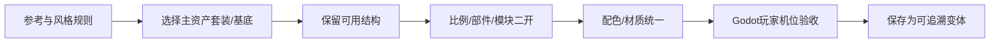

---
{
  "id": "D02",
  "prerequisites": [
    "D01",
    "C08"
  ],
  "revisit": [
    "B04",
    "C08",
    "B03"
  ],
  "memory": [
    "ART04",
    "ART07",
    "KN12",
    "KN13",
    "KN25",
    "TH03"
  ],
  "labs": [
    "practice/blender/kitbash_style_lab.blend",
    "practice/godot/labs/material_lab.tscn"
  ]
}
---
# D02｜风格统一：配色、材质、边缘与细节密度

**今天做什么：** 把两三件可能来自同套或不同套的资产，统一成同一个游戏的色彩与表面语言，并验证Godot实际画面。

**从哪里开始：** 固定光照，先统一一件变体色彩，再单独调粗糙度。

**现成材料：** [kitbash_style_lab.blend](../../practice/blender/kitbash_style_lab.blend)、[material_lab.tscn](../../practice/godot/labs/material_lab.tscn)

**材料边界：** 支持局部材质观察，不等于整库风格已经统一。

先观察或猜一猜，动手试一项，再说说为什么。完全陌生可以先看一个小示范；做完当前小步就可以暂停。

### 开始对话

```text
我在学D02《风格统一：配色、材质、边缘与细节密度》，请按这份教案带我自学。
一次只推进一个有意义的小步，先用现成材料，不先替我作判断。
我可以查菜单/API、看示范或请AI实现；学到的因果关系要由我说明。
课程里的备用题按需选，不要全部变作业；伙伴分享一次就够了。
```

<details data-audience="reference">
<summary>需要时看：解释、对照与候选练习</summary>

## 学到这里就够了

**M｜需要会判断和应用：**
- `D02.M1` 控制材质差异与统一性，避免所有对象同样油亮。
- `D02.M2` 固定展示条件比较细节，并识别仅在Blender成立的效果。

**K｜知道用途，用到再查：**
- `D02.K1` 手绘感、渐变、描边、烘焙是可选手段。
- `D02.K2` Look development用于在固定条件下建立和验证外观规则，不要求复杂Shader。

**停止线：** 不强制复杂材质网络和手绘贴图全集；任何新Shader先进入选修。

**前置：** [D01](D01.md)、[C08](C08.md)

## 必要解释

同风格不等于同材质：木头、布、金属可有不同粗糙感，却共用受控色盘和边缘处理。纹理噪声太多可能损害绘本感。

Look development是在固定条件下建立质感标准。柔和阴影、背景与展示机位用于比较；最终仍需检查游戏镜头和目标引擎，不以离线高质量渲染遮住问题。

风格统一优先改“关系”而不是改每个模型：有限色盘、相似的边缘语言、受控粗糙层级和一致细节密度，比让所有资产使用同一个材质数值更重要。不同套装先各取一件做小样，统一成功再批量。



这是因果／职责示意，不是实际运行截图；不能显示Mermaid时用等价方框图。

## 在现成实验里试

**初始条件：** 箱子、灯、布袋三件简单样本；同一白底/灰底与主光；目标风格卡可见。
**可比较的条件：** 三种材质预设、粗糙度0.2到0.9、纹理密度低/高、轮廓效果开关、展示/游戏距离。

下面说明要比较的关系；实际从上面的现成文件与首步进入，不为匹配教学控件名重新搭建。

1. 先描述三件物品共同规则和应保留差异。
2. 一次只改一个材质参数或纹理密度，比较统一性。
3. 标出需要引擎重建、可交换和暂时不做的效果，建立检查单。

**观察：** 不得宣称所有Blender节点可导出；每个效果标准备验证的实现路径。
**不符时先查：** 反例：用复杂程序节点在Blender做出好看材质，却没有引擎实现计划；缩成可交换核心或明确重建。
**恢复：** 恢复统一中性场景与三件原材质，保存风格标准。

只比较一个条件，恢复后再试下一个。课堂模拟应标清示意，真实软件行为需要实际观察；缺文件如实说明，不让学员临时重造系统。

### 软件入口与亲调

- 常用：基础材质参数、主光、背景、固定机位。
- 会定位：材质预览/实际渲染差异、色彩管理。
- 按需查：烘焙、复杂描边、渲染器专属节点。

|选中哪里／参数|只改什么|看什么|
|---|---|---|
|基础色/粗糙度（内置）|先统一主体材质区间，再保留一个功能性强调|道具是否属于同一世界，主目标是否更清楚|
|展示光方向/强度（内置）|材质确定后再单变量调光|好看是否只依赖展示台，回到游戏是否仍成立|

运行中临时改动不等于已保存；要留下设计选择，请在自己的副本中写回场景／资源，保存并重新打开检查。

## 我负责什么，AI帮什么

**我的判断：** 指定共同色盘/细节规则，同时保留布、木、金属的材料差异。
**可交给AI：** 准备固定展示条件和可交换/需重建效果清单，不把复杂节点导出说成必然无损。
**检查重点：** 检查AI是否用同一个Roughness/Metallic数值抹平所有材料，或同时改灯光和材质导致无法归因。

结果不符：说清预期、实际与复现步骤；先提出一个可推翻的原因，再做最小验证。修改前留基线，不删需求或测试来消除报错。

## 怎样知道这一小步做到了

- 为三件不同材质物体说明共同风格与合理响应差异，单变量比较。
- 在固定展示和真实游戏观察条件核对效果实现路径，无法执行明确待验。

**恢复后再检查：** 共享范围可解释；重导入后风格规则和功能包装仍保持。

有提示也是学习进展；没有实际观察就不宣称已经验证。一个对照和解释可以覆盖多个要点，不要求填写评分表。

## 候选问题

先自己判断，再按需看反馈。P是预测、D是诊断、T是迁移、K是用途；按本次需要选一题，不要求全部完成。教学情境不是实测日志。

### D02-P1

统一风格就让所有东西同一个Roughness吗？

### D02-D2

【教学构造情境，不是真实测量或某模型故障统计】箱子、灯罩、布袋都被设成同一种强金属反射。AI称数值一致就风格统一；Blender展示图还使用了未核对导出支持的节点。你接受哪些共性，分别改什么并怎样验收？

### D02-T3

从箱子扩展到布袋，怎样沿用风格？

### D02-K4

Look development的作用？

</details>

## 这一课要记在脑海里

- 同风格不等于同材质。
- 固定条件建立质感标准。
- 离线好看还要能进游戏。

**记忆清单：** [ART04](../memory.md#art04) · [ART07](../memory.md#art07) · [KN12](../memory.md#kn12) · [KN13](../memory.md#kn13) · [KN25](../memory.md#kn25) · [TH03](../memory.md#th03)。先遮住解释，用自己的话说，再举例；不是照抄定义。

## 讲给爸爸听

在今天的关键地方或结束时，选一次和爸爸分享。用自己的话讲讲：色盘、材质关系、风格一致。

**给他演示：** 做风格协调员：固定光照，先统一一件资产的颜色，再单独比较粗糙度。

**你们一起问：** 每件资产单看都漂亮，放到一起为什么仍然可能不协调？

爸爸还有问题就接着问，你也可以问爸爸。一起看、一起试，不必背稿、打分或填表。爸爸暂时不在就稍后分享，不影响继续自学。

<details data-purpose="project">
<summary>需要改自己的作品时再看</summary>

**生产阶段：** P6/P8

**想得到的结果：** 用同一风格卡统一色盘和表面层级，同时保留木/布/金属必要差异。
**必须保留：** 几何与镜头固定；材质比较时照明不变，照明比较时材质不变。

先读取自己的工作副本。以下是可选局部实现，不是打开现成实验的前置，也不要求再做一整轮：

- 先固定同一玩家机位/灯光，让两三件资产只做色盘归一，不改几何。
- 再只统一粗糙层级或细节密度一项；最后到Godot同机位确认，不以Blender展示图代替。

**采用依据：** 它们像来自同一世界，但不同材料仍能分辨。
**换一个场景想想：** 加入第四个来源不同的基底，优先修一项最高影响的差异。

参考工程的通过结论不自动覆盖你改过的版本；相关路线实际走一遍，必要时恢复。

</details>

## 下次怎样想起来

前面已学过的复现入口：[B04](B04.md)、[C08](C08.md)、[B03](B03.md)。
隔一段时间不看答案，再解释本课的一项关键关系；换一个对象或条件应用。记住词也要会用，API和菜单位置可以查。疑问笔记可选，没有笔记也仍有公共必记清单。

## 依据

- [Blender Principled BSDF：当前手册入口](https://docs.blender.org/manual/en/latest/render/shader_nodes/shader/principled.html)
- [Blender glTF 2.0管线参考（4.0文档，具体新版选项另查）](https://docs.blender.org/manual/en/4.0/addons/import_export/scene_gltf2.html)
- [Roman Klco / Polygon Runway：风格化3D作品与课程](https://polygonrunway.com/)
- [Godot运行检查与可见碰撞工具](https://docs.godotengine.org/en/stable/tutorials/scripting/debug/overview_of_debugging_tools.html)

技术来源支持概念边界；课程顺序与任务是本项目设计，不代表已经证明学习效果。
