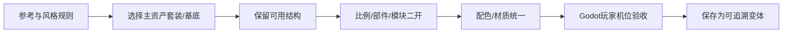

---
{
  "id": "D03",
  "prerequisites": [
    "D02",
    "C05"
  ],
  "revisit": [
    "C05",
    "D01",
    "B05"
  ],
  "memory": [
    "ART08",
    "KN17",
    "KN22",
    "KN26",
    "TH03"
  ],
  "labs": [
    "practice/blender/kitbash_style_lab.blend"
  ]
}
---
# D03｜长期资产库：主套装、基底、变体与组合规则

**今天做什么：** 设计一套能持续扩充、可追溯、可检索的风格化资产目录。

**从哪里开始：** 为一件变体记录源、用途、版本、引用和预览机位。

**现成材料：** [kitbash_style_lab.blend](../../practice/blender/kitbash_style_lab.blend)

**材料边界：** 样例不自带完整商业资产库，按本地实际资源建立。

先观察或猜一猜，动手试一项，再说说为什么。完全陌生可以先看一个小示范；做完当前小步就可以暂停。

### 开始对话

```text
我在学D03《长期资产库：主套装、基底、变体与组合规则》，请按这份教案带我自学。
一次只推进一个有意义的小步，先用现成材料，不先替我作判断。
我可以查菜单/API、看示范或请AI实现；学到的因果关系要由我说明。
课程里的备用题按需选，不要全部变作业；伙伴分享一次就够了。
```

<details data-audience="reference">
<summary>需要时看：解释、对照与候选练习</summary>

## 学到这里就够了

**M｜需要会判断和应用：**
- `D03.M1` 区分基底、变体、实例和展示图；控制共享范围。
- `D03.M2` 给资产填写足够使用的元数据与质量检查。

**K｜知道用途，用到再查：**
- `D03.K1` Asset Browser/Catalog、Append/Link是复用工具，用时查细节。

**停止线：** 不搭复杂资产管理服务器，不为了库而囤大量不一致模型。

**前置：** [D02](D02.md)、[C05](C05.md)

## 必要解释

先做一个小套件，如墙、门、窗、树、石头和灯，不追求几百件。每个资产记录来源许可、尺寸、原点、材质、预览、版本和已测状态。

保留原始来源和可编辑主资产，再做受控变体：颜色、比例、少量附加结构。真正共享的部分复用，独立变化不串改；退役和不合格资源要能看出来。

资产库重点保存“怎么继续二开”：主套装来源、基底、允许共享的材质、模块接口、推荐色盘、已验证镜头和可用变体。目标是下次直接拿来组装，不是囤几百个互不一致的模型。



这是因果／职责示意，不是实际运行截图；不能显示Mermaid时用等价方框图。

## 在现成实验里试

**初始条件：** 六张资产卡，三张缺元数据；一件主资产和两件变体的引用图。
**可比较的条件：** 筛选风格/用途/验证状态、编辑元数据、共享/独立材质、版本升级、退役标签。

下面说明要比较的关系；实际从上面的现成文件与首步进入，不为匹配教学控件名重新搭建。

1. 先找哪些卡不能安全快速使用，并补信息。
2. 从一件箱子做三种变体计划，列共享和独立部分。
3. 替换主材质版本，检查哪些变体会变化，记录迁移和回退。

**观察：** 缩略图不是源文件；可使用与可再分发标成独立许可字段；未经测试的卡不能标游戏就绪。
**不符时先查：** 反例：只有final_final2文件和截图，没有尺度、原点、来源；改命名和元数据，不靠记忆。
**恢复：** 回到上一版元数据与引用图；原始来源只读保留。

只比较一个条件，恢复后再试下一个。课堂模拟应标清示意，真实软件行为需要实际观察；缺文件如实说明，不让学员临时重造系统。

### 软件入口与亲调

- 常用：资产选择、命名、预览、库内检索、变体参数。
- 会定位：Blender Asset Browser/Catalog和Append/Link。
- 按需查：库路径、链接覆盖和批量迁移工具。

|选中哪里／参数|只改什么|看什么|
|---|---|---|
|目录/资产浏览入口（内容/工具入口）|按用途和基底关系找目标，不按临时文件名猜|能否从一件变体追到源和使用说明|
|变体颜色或比例（设计参数）|只改一个允许变化项|共用接口和风格是否保持|

运行中临时改动不等于已保存；要留下设计选择，请在自己的副本中写回场景／资源，保存并重新打开检查。

## 我负责什么，AI帮什么

**我的判断：** 确认基底、变体和共享依赖，选择什么可发布、什么尚待验证。
**可交给AI：** 整理最少可检索字段及引用清单，生成变体方案前先显示影响范围。
**检查重点：** 检查AI是否只改名不记录依赖、误删重复文件或把不明许可标成可随意分发。

结果不符：说清预期、实际与复现步骤；先提出一个可推翻的原因，再做最小验证。修改前留基线，不删需求或测试来消除报错。

## 怎样知道这一小步做到了

- 在一个主资产和两变体之间说明共享与独立，并做单件影响测试。
- 从另一场景按元数据找到并试用资产，能找到源文件、许可、尺寸、版本与验证状态。

**恢复后再检查：** 重新打开/导入已有样本，材质与功能引用没有因整理失效。

有提示也是学习进展；没有实际观察就不宣称已经验证。一个对照和解释可以覆盖多个要点，不要求填写评分表。

## 候选问题

先自己判断，再按需看反馈。P是预测、D是诊断、T是迁移、K是用途；按本次需要选一题，不要求全部完成。教学情境不是实测日志。

### D03-P1

一张漂亮预览图能证明资源可直接入游戏吗？

### D03-D2

【教学构造情境，不是真实测量或某模型故障统计】你更新主材质后已完成的两个庭院一起变色；库里只有final3名称，没有引用或版本记录。AI建议全库Make Unique。怎样先限定受影响对象，再保留有意共享并提供回退？

### D03-T3

新项目换了色盘，如何快速复用旧套件？

### D03-K4

Asset Browser主要解决什么？

</details>

## 这一课要记在脑海里

- 小套件先做可靠。
- 基底只读，变体可追溯。
- 好看、可用、可分发分别检查。

**记忆清单：** [ART08](../memory.md#art08) · [KN17](../memory.md#kn17) · [KN22](../memory.md#kn22) · [KN26](../memory.md#kn26) · [TH03](../memory.md#th03)。先遮住解释，用自己的话说，再举例；不是照抄定义。

## 讲给爸爸听

在今天的关键地方或结束时，选一次和爸爸分享。用自己的话讲讲：来源、版本、资源引用。

**给他演示：** 做资产图书管理员：为一件资产留下来源、用途、版本和固定机位预览。

**你们一起问：** 下次发现错误，怎样找到源文件，而不是继续修改导出的成品？

爸爸还有问题就接着问，你也可以问爸爸。一起看、一起试，不必背稿、打分或填表。爸爸暂时不在就稍后分享，不影响继续自学。

<details data-purpose="project">
<summary>需要改自己的作品时再看</summary>

**生产阶段：** P5/P7

**想得到的结果：** 小型资产套件有基底、变体、版本、来源、接口和验收状态。
**必须保留：** 原始来源文件只读保留；预览图不能冒充可编辑源。

先读取自己的工作副本。以下是可选局部实现，不是打开现成实验的前置，也不要求再做一整轮：

- 先登记一个主套装基底与一个二开变体：来源、尺度、接口、色盘/材质规则和验证状态。
- 再增加一个部件组合或配色变体，测试有意共享保留、个体变化不串改。

**采用依据：** 换一个场景仍能找到源文件，并知道改基底会影响哪些变体。
**换一个场景想想：** 隔次用同库拼一个新角落，先检索和复用，再决定真正缺什么。

参考工程的通过结论不自动覆盖你改过的版本；相关路线实际走一遍，必要时恢复。

</details>

## 下次怎样想起来

前面已学过的复现入口：[C05](C05.md)、[D01](D01.md)、[B05](B05.md)。
隔一段时间不看答案，再解释本课的一项关键关系；换一个对象或条件应用。记住词也要会用，API和菜单位置可以查。疑问笔记可选，没有笔记也仍有公共必记清单。

## 依据

- [Blender官方手册：按实际版本查询工具](https://docs.blender.org/manual/en/latest/)
- [Godot Resources：共享和引用](https://docs.godotengine.org/en/stable/tutorials/scripting/resources.html)
- [Kenney Support：资产用途与许可说明](https://kenney.nl/support)
- [Quaternius：基础角色、动作与风格化套件](https://quaternius.com/)
- [Godot运行检查与可见碰撞工具](https://docs.godotengine.org/en/stable/tutorials/scripting/debug/overview_of_debugging_tools.html)
- [Blender Asset Libraries：资产复用入口](https://docs.blender.org/manual/en/latest/files/asset_libraries/introduction.html)

技术来源支持概念边界；课程顺序与任务是本项目设计，不代表已经证明学习效果。
