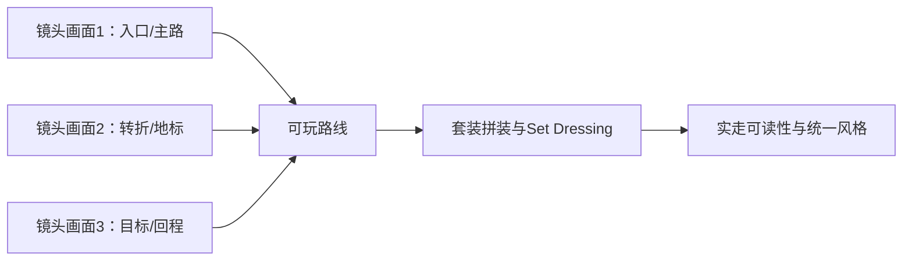

---
{
  "id": "D04",
  "prerequisites": [
    "D03"
  ],
  "revisit": [
    "A01",
    "B10",
    "D02",
    "D03"
  ],
  "memory": [
    "ART01",
    "ART03",
    "ART04",
    "ART06",
    "ART08",
    "TH03"
  ],
  "labs": [
    "practice/blender/kitbash_style_lab.blend",
    "practice/godot/world/exploration.tscn"
  ]
}
---
# D04｜美术结业：用套装二开拼出自己的童话场景

**今天做什么：** 用主资产套装和少量二开变体，完成一个固定视角下统一、可辨路、能说明取舍的小型童话场景。

**从哪里开始：** 用现成原创GLB库替换或调整一处，固定机位作前后对照，再走完整路线。

**现成材料：** [kitbash_style_lab.blend](../../practice/blender/kitbash_style_lab.blend)、[exploration.tscn](../../practice/godot/world/exploration.tscn)

**材料边界：** 三段原创生产参考已接入12类静态资产；不是已购买外部套装或最终美术签收。

先观察或猜一猜，动手试一项，再说说为什么。完全陌生可以先看一个小示范；做完当前小步就可以暂停。

### 开始对话

```text
我在学D04《美术结业：用套装二开拼出自己的童话场景》，请按这份教案带我自学。
一次只推进一个有意义的小步，先用现成材料，不先替我作判断。
我可以查菜单/API、看示范或请AI实现；学到的因果关系要由我说明。
课程里的备用题按需选，不要全部变作业；伙伴分享一次就够了。
```

<details data-audience="reference">
<summary>需要时看：解释、对照与候选练习</summary>

## 学到这里就够了

**M｜需要会判断和应用：**
- `D04.M1` 让轮廓、比例、色盘、灯光、细节密度形成一致表达。
- `D04.M2` 提交观察与改造过程，并说明可复用与仍需验证的部分。

**K｜知道用途，用到再查：**
- `D04.K1` 儿童偏好应按年龄、情境做实际观察，不存在保证所有孩子喜欢的配方。

**停止线：** 不要求制作原创角色动画或大型世界；不以追求大师同款细节拖延完成。

**前置：** [D03](D03.md)

## 必要解释

选一个主题，如暖色森林邮局。使用六件可靠基底，加少量风格化调整和统一材质；重点是整体关系，不是每件都雕得很复杂。

评价分两部分：客观可用性由尺度、来源、可读性和一致性检查；主观喜好要说明目标并观察反馈。儿童测试须由合适成人陪同，不采集不必要个人信息，不把喜欢当长期学习证明。

本课把小套件用在C02的世界美化规则中；已有三段关卡者在同一关卡替换，无需重新造大地图。未做扩图者先用一个转角样板，不能声称已经完成整图。最终按玩家距离看剪影、风格和可辨性，再决定细节是否值得。

结业不要求六件资产全部原创。重点是你能选择主套装、建立统一规则、做少量有身份的Hero变体，并在固定玩家机位把它们组合成一个完整视觉世界。



这是因果／职责示意，不是实际运行截图；不能显示Mermaid时用等价方框图。

## 在现成实验里试

**初始条件：** 六件道具的缩略卡、一个固定场景构图和风格卡；两版候选只在少数变量不同。
**可比较的条件：** 摆放主次、色盘A/B、细节组开关、游戏距离、隐藏参考、3秒观察任务。

下面说明要比较的关系；实际从上面的现成文件与首步进入，不为匹配教学控件名重新搭建。

1. 先写主题与排除项，选择六件资产及来源。
2. 比较A/B构图，让另一位观察者指出第一目标和路径。
3. 隐藏参考换一个道具，保持风格；列入资源库并写下一轮只改什么。

**观察：** 评分不以某艺术家相似度为标准；观察者喜好与功能判断分别记录。
**不符时先查：** 反例：每件单独好看但全场比例/质感不一致；先改最影响整体的一项，不重做全部。
**恢复：** 回到最近的风格基线，保留前后方案和观察记录。

只比较一个条件，恢复后再试下一个。课堂模拟应标清示意，真实软件行为需要实际观察；缺文件如实说明，不让学员临时重造系统。

### 软件入口与亲调

- 复用D01-D03已学参数；不增加新的必修界面。
- 会定位：游戏镜头、资产版本与来源。
- 按需查：个别造型技巧。

|选中哪里／参数|只改什么|看什么|
|---|---|---|
|主次比例/摆放（内置/设计）|在原游戏机位做一个构图调整|路径和互动目标是否仍优先|
|材质或主光（内置）|固定其余项微调一次并记录|气氛与可读性是否同时改善|

运行中临时改动不等于已保存；要留下设计选择，请在自己的副本中写回场景／资源，保存并重新打开检查。

## 我负责什么，AI帮什么

**我的判断：** 选择一项最影响整体的偏差，按实际玩家观察和来源证据判断成品。
**可交给AI：** 按风格卡提出少量局部变体及样板到套件清单，不重做整张世界。
**检查重点：** 检查AI是否为了显得高级把每件资产都重做、把场景填满，或让背景细节抢走玩法焦点。

结果不符：说清预期、实际与复现步骤；先提出一个可推翻的原因，再做最小验证。修改前留基线，不删需求或测试来消除报错。

## 怎样知道这一小步做到了

- 六件套件在同一游戏机位形成一致比例/光色/细节层级并保持目标可辨。
- 交实际观察、改造前后、来源及可复用边界；换道具后规则仍可说明。

**恢复后再检查：** 启动、探索、收齐、完成、重开；再检查既有性能目标。

有提示也是学习进展；没有实际观察就不宣称已经验证。一个对照和解释可以覆盖多个要点，不要求填写评分表。

## 候选问题

先自己判断，再按需看反馈。P是预测、D是诊断、T是迁移、K是用途；按本次需要选一题，不要求全部完成。教学情境不是实测日志。

### D04-P1

六件单独精美是否保证整体好看？

### D04-D2

【教学构造情境，不是真实测量或某模型故障统计】六件道具各自预览很漂亮，合进庭院后路灯比房屋还高，反射强弱杂乱。AI要增加粒子和雾。先选哪一个整体关系问题，如何局部修改并证明没挡住主路？

### D04-T3

同一套件扩为雨天场景，哪些需重验？

### D04-K4

能保证一种画风所有孩子都喜欢吗？

<details data-purpose="project">
<summary>S3｜把新道具加入你的风格套件</summary>

前置：D04已完成，或已完成同等三轮基底改造。为既有套件补一个用途不同的小道具，使用可编辑且许可适用的基底。先写哪些规则沿用，哪一处必须因新用途改变。

在同机位和游戏距离比较，决定最值得做的一项改造，不要求新增复杂节点。说明修改影响了哪些资源，原套件未被意外改变，来源与可编辑版本能找回。没有实物/图片不伪造观察结论。

改得更多不自动更高分。合理换基底、放弃看不见的小细节，或保留原材质但调整比例，都可以成为有证据的决定。

</details>

</details>

## 这一课要记在脑海里

- 整体关系比单件复杂度重要。
- 临摹原则，形成自己的变式。
- 可复用资产要留标准和来源。

**记忆清单：** [ART01](../memory.md#art01) · [ART03](../memory.md#art03) · [ART04](../memory.md#art04) · [ART06](../memory.md#art06) · [ART08](../memory.md#art08) · [TH03](../memory.md#th03)。先遮住解释，用自己的话说，再举例；不是照抄定义。

## 讲给爸爸听

在今天的关键地方或结束时，选一次和爸爸分享。用自己的话讲讲：模块组合、焦点、场景验收。

**给他演示：** 做场景导演：只精修一个小区域，固定机位删减细节，再让爸爸走一遍主路。

**你们一起问：** 静态截图很好看，实际走动时角色被遮住，这个区域该怎样验收？

爸爸还有问题就接着问，你也可以问爸爸。一起看、一起试，不必背稿、打分或填表。爸爸暂时不在就稍后分享，不影响继续自学。

<details data-purpose="project">
<summary>需要改自己的作品时再看</summary>

**生产阶段：** P8

**想得到的结果：** 少量自有变体形成统一小场景，保留完整收集体验和来源记录。
**必须保留：** 主路、交互净空、固定镜头和来源记录保持；不以原创网格比例作为质量分。

先读取自己的工作副本。以下是可选局部实现，不是打开现成实验的前置，也不要求再做一整轮：

- 先在固定玩家机位摆主套装的六件以内资产，只解决整体比例、主次和留白；暂不精修单件。
- 只选择一两件Hero做明显二开，其余靠组合、配色和材质统一；最后隐藏参考换一个道具检验规则。

**采用依据：** 一眼能读出主路/焦点，资产像同一个世界而不是素材展台。
**换一个场景想想：** 用同套件布置另一角落，保留原则而不复制原构图。

参考工程的通过结论不自动覆盖你改过的版本；相关路线实际走一遍，必要时恢复。

</details>

## 下次怎样想起来

前面已学过的复现入口：[A01](A01.md)、[B10](B10.md)、[D02](D02.md)、[D03](D03.md)。
隔一段时间不看答案，再解释本课的一项关键关系；换一个对象或条件应用。记住词也要会用，API和菜单位置可以查。疑问笔记可选，没有笔记也仍有公共必记清单。

## 依据

- [Roman Klco / Polygon Runway：风格化3D作品与课程](https://polygonrunway.com/)
- [Grant Abbitt：Blender造型与图形设计](https://www.gabbitt.co.uk/)
- [Eyvind Earle官方作品入口（仅链接，保留版权）](https://eyvindearle.com/)
- [Godot运行检查与可见碰撞工具](https://docs.godotengine.org/en/stable/tutorials/scripting/debug/overview_of_debugging_tools.html)

技术来源支持概念边界；课程顺序与任务是本项目设计，不代表已经证明学习效果。
