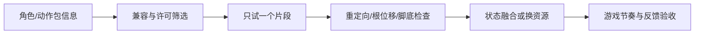

---
{
  "id": "D05",
  "prerequisites": [
    "C04"
  ],
  "revisit": [
    "C03",
    "C04",
    "B05"
  ],
  "memory": [
    "KN21",
    "KN26",
    "TH03"
  ],
  "labs": [
    "practice/blender/animation_fixture.blend",
    "practice/godot/labs/animation_lab.tscn"
  ]
}
---
# D05｜动作资源复用：动作包兼容、重定向与融合

**今天做什么：** 筛选可复用动作包，明确导入、重定向与授权检查。

**从哪里开始：** 先直接播放原创角色的三段现成片段，观察骨骼/网格关系，再到Godot比较导入和融合。

**现成材料：** [animation_fixture.blend](../../practice/blender/animation_fixture.blend)、[animation_lab.tscn](../../practice/godot/labs/animation_lab.tscn)

**材料边界：** 有真实骨架、蒙皮与动作；不是外部动作库或通用重定向，新角色仍先做一段兼容小试。

先观察或猜一猜，动手试一项，再说说为什么。完全陌生可以先看一个小示范；做完当前小步就可以暂停。

### 开始对话

```text
我在学D05《动作资源复用：动作包兼容、重定向与融合》，请按这份教案带我自学。
一次只推进一个有意义的小步，先用现成材料，不先替我作判断。
我可以查菜单/API、看示范或请AI实现；学到的因果关系要由我说明。
课程里的备用题按需选，不要全部变作业；伙伴分享一次就够了。
```

<details data-audience="reference">
<summary>需要时看：解释、对照与候选练习</summary>

## 学到这里就够了

**M｜需要会判断和应用：**
- `D05.M1` 区分动作片段、骨架、蒙皮及根位移来源。
- `D05.M2` 先试一段动作，再决定批量复用是否值得。

**K｜知道用途，用到再查：**
- `D05.K1` Retarget、In-place、Root Motion、IK知道用途。

**停止线：** 不从零做武打动画，不重造重定向算法；可购买/使用资源不等于可公开再分发原文件。

**前置：** [C04](C04.md)

## 必要解释

复用不是把任意动画拖到任意人物上。骨架映射、静止姿态、比例和根位移会影响结果；先试最小动作，再扩大。

优先选择来源清楚、目标骨架明确的资源。Mixamo及其他服务的可用账号、地区和许可需按使用时官方条件核对；本课不依赖必须访问某一个服务，也不使用游戏提取资源。

动作包也是“套装”：优先选择骨架/参考姿态/根位移说明清楚的一组，先试待机或单次动作，再决定是否批量融合。复杂坏动作可以换资源，不把手工清理每帧作为程序员主线能力。



这是因果／职责示意，不是实际运行截图；不能显示Mermaid时用等价方框图。

## 在现成实验里试

**初始条件：** 三个动作资源说明卡：同骨架、可重定向、无来源；简化关节预览，不附第三方动作文件。
**可比较的条件：** 选择资源、A/T参考姿态、根位移开关、循环预览、观察脚底。

下面说明要比较的关系；实际从上面的现成文件与首步进入，不为匹配教学控件名重新搭建。

1. 先按授权和兼容筛掉高风险包。
2. 试待机和一步行走或单次动作，检查脚滑、骨骼方向和位移。
3. 写少量适配/换资源的决策，并保存来源与测试状态。

**观察：** 显示原数据与适配结果对照；动作能播放不自动等于碰撞和玩法正确。
**不符时先查：** 故障：脚本移动与动画根位移同时生效导致双倍移动；先明确一个位移来源。
**恢复：** 回到原角色与静止姿态，保留原动画文件只读。

只比较一个条件，恢复后再试下一个。课堂模拟应标清示意，真实软件行为需要实际观察；缺文件如实说明，不让学员临时重造系统。

### 软件入口与亲调

- Godot：动画预览、速度、片段与骨架映射检查。
- Blender会定位：Dope Sheet/Action、NLA；只为预览和少量调整。
- 按需查：Retarget/BoneMap、根位移提取、IK修正。

|选中哪里／参数|只改什么|看什么|
|---|---|---|
|动画预览/片段范围（内置入口）|只截取需要部分，保留原片段|起止姿态和循环接缝是否可用|
|播放速度与根位移选型（内置/方案）|先调速度；根位移问题先确认驱动来源|脚滑、角色漂移以及与控制器是否双重驱动|

运行中临时改动不等于已保存；要留下设计选择，请在自己的副本中写回场景／资源，保存并重新打开检查。

## 我负责什么，AI帮什么

**我的判断：** 先选兼容且许可明确的一段动作，确定根位移由谁驱动，再决定扩用。
**可交给AI：** 列骨架/参考姿态/片段信息，做最小适配和脚底/位移对照。
**检查重点：** 检查AI是否忽略参考姿态、缩放或根位移，声称已看过未提供的动画文件。

结果不符：说清预期、实际与复现步骤；先提出一个可推翻的原因，再做最小验证。修改前留基线，不删需求或测试来消除报错。

## 怎样知道这一小步做到了

- 说明骨架、网格和片段职责，明确控制器或动画的根位移来源。
- 先试一段并检查接触、变形、位移及授权，再决定批量或换资源。

**恢复后再检查：** 回到原待机走跑跳测试；不采用的动作可完整移除。

有提示也是学习进展；没有实际观察就不宣称已经验证。一个对照和解释可以覆盖多个要点，不要求填写评分表。

## 候选问题

先自己判断，再按需看反馈。P是预测、D是诊断、T是迁移、K是用途；按本次需要选一题，不要求全部完成。教学情境不是实测日志。

### D05-P1

动画能播就说明适合当前角色吗？

### D05-D2

【教学构造情境，不是真实测量或某模型故障统计】新行走片段单播会向前移动；接入现有控制器后同样输入速度像翻倍。AI建议把控制速度减半。怎样分别关闭一个位移来源作对照，避免只对这一段碰巧补偿正确？

### D05-T3

动作换到更矮的卡通人物要复测什么？

### D05-K4

In-place大致是什么意思？

</details>

## 这一课要记在脑海里

- 先试一段再导整包。
- 明确谁控制根位移。
- 来源、使用和再分发逐项核对。

**记忆清单：** [KN21](../memory.md#kn21) · [KN26](../memory.md#kn26) · [TH03](../memory.md#th03)。先遮住解释，用自己的话说，再举例；不是照抄定义。

## 讲给爸爸听

在今天的关键地方或结束时，选一次和爸爸分享。用自己的话讲讲：动作来源、骨架兼容、片段试验。

**给他演示：** 做动作选型员：只用已许可的一段动作和一个角色，先验证兼容再扩充。

**你们一起问：** 预览里的动作很流畅，为什么不能直接认定在我们的角色上也合格？

爸爸还有问题就接着问，你也可以问爸爸。一起看、一起试，不必背稿、打分或填表。爸爸暂时不在就稍后分享，不影响继续自学。

<details data-purpose="project">
<summary>需要改自己的作品时再看</summary>

**生产阶段：** P4/P10

**想得到的结果：** 先通过一个兼容样本，再决定采用、轻改还是换资源。
**必须保留：** 主控制器与原角色源保持；在副本测试，不下载或再分发未知许可文件。

先读取自己的工作副本。以下是可选局部实现，不是打开现成实验的前置，也不要求再做一整轮：

- 先比较两份动作资源说明，只选来源与骨架/姿态/根位移信息更清楚的一段做最小试用。
- 再加第二片段做最小融合；若适配成本高于换包，就记录理由并换资源。

**采用依据：** 动作可播、脚底/位移来源可解释，且我知道为什么保留或淘汰另一份。
**换一个场景想想：** 换第二个同类型片段，复用验收清单而非假定同库全兼容。

参考工程的通过结论不自动覆盖你改过的版本；相关路线实际走一遍，必要时恢复。

</details>

## 下次怎样想起来

前面已学过的复现入口：[C03](C03.md)、[C04](C04.md)、[B05](B05.md)。
隔一段时间不看答案，再解释本课的一项关键关系；换一个对象或条件应用。记住词也要会用，API和菜单位置可以查。疑问笔记可选，没有笔记也仍有公共必记清单。

## 依据

- [Godot Retargeting 3D Skeletons](https://docs.godotengine.org/en/stable/tutorials/assets_pipeline/retargeting_3d_skeletons.html)
- [Adobe Mixamo FAQ：角色、动作及使用条件](https://helpx.adobe.com/creative-cloud/faq/mixamo-faq.html)
- [Quaternius：基础角色、动作与风格化套件](https://quaternius.com/)
- [Godot运行检查与可见碰撞工具](https://docs.godotengine.org/en/stable/tutorials/scripting/debug/overview_of_debugging_tools.html)

技术来源支持概念边界；课程顺序与任务是本项目设计，不代表已经证明学习效果。
