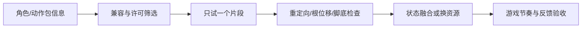

---
{
  "id": "D06",
  "prerequisites": [
    "D05",
    "B06",
    "B07",
    "C06"
  ],
  "revisit": [
    "A04",
    "B06",
    "C04",
    "D05"
  ],
  "memory": [
    "KN06",
    "KN07",
    "KN16",
    "KN18",
    "KN21",
    "ART09",
    "TH03"
  ],
  "labs": [
    "practice/godot/labs/animation_lab.tscn",
    "practice/godot/world/exploration.tscn"
  ]
}
---
# D06｜轻战斗融入：现成攻击动作与可重复训练木桩

**今天做什么：** 先完成单次攻击→有效命中→木桩反馈→恢复，再作为可绕过的训练角接入原收集关卡。

**从哪里开始：** 先看隔离命中窗口，再在主游戏面对木桩按J；比较远处/背对/关闭训练。

**现成材料：** [animation_lab.tscn](../../practice/godot/labs/animation_lab.tscn)、[exploration.tscn](../../practice/godot/world/exploration.tscn)

**材料边界：** 动作、命中、恢复控制已整合；训练可关闭且不影响十星，不是完整敌人/战斗系统。

先观察或猜一猜，动手试一项，再说说为什么。完全陌生可以先看一个小示范；做完当前小步就可以暂停。

### 开始对话

```text
我在学D06《轻战斗融入：现成攻击动作与可重复训练木桩》，请按这份教案带我自学。
一次只推进一个有意义的小步，先用现成材料，不先替我作判断。
我可以查菜单/API、看示范或请AI实现；学到的因果关系要由我说明。
课程里的备用题按需选，不要全部变作业；伙伴分享一次就够了。
```

<details data-audience="reference">
<summary>需要时看：解释、对照与候选练习</summary>

## 学到这里就够了

**M｜需要会判断和应用：**
- `D06.M1` 借助AI接入一段兼容攻击动作，区分动画表现、有效窗口和命中规则。
- `D06.M2` 亲测空挥、命中、防重复及结束/中断后的恢复，并验证不影响收集主线。

**K｜知道用途，用到再查：**
- `D06.K1` Hitbox/Hurtbox、方法事件轨道、Hit stop和Root Motion知道用途，不要求全部采用。
- `D06.K2` Hit flash、Impact particles、Trail、目标反应、短促Camera impulse/Shake，以及透视FOV Pulse或正交Size Pulse是可组合的打击感层；不要求每层都上。

**停止线：** 只用一个角色、一段原地单次攻击和一个木桩；不做连招、玩家受伤、敌人追踪、技能树、锁定或联网。

**前置：** [D05](D05.md)、[B06](B06.md)、[B07](B07.md)、[C06](C06.md)

## 必要解释

本课选择单次、原地、兼容现成角色的动作。先只验证片段能播放且能返回待机，再加入玩法；没有许可清楚的片段时只能完成时间线模拟，不能宣称动作已经接入。参考资源不能因为买到就上传公开仓库。

攻击至少有准备、有效、恢复三个阶段。只在有效阶段、目标符合范围与对象规则、且本次攻击尚未计过该目标时记录一次命中。视觉武器碰上木桩不是自动的玩法判定；空挥应播放动作但不增加命中。下一次攻击需重新开始自己的去重记录，不把木桩永久标成已拾取。

初版规则明确为攻击期间暂停水平移动和新跳跃，但镜头可转；收势、取消、重开均恢复控制并关闭攻击有效状态。它是训练角的设计取舍，不是所有动作游戏的规则。把该取舍告诉AI，防止它顺便重写整个控制器。

方法事件轨道可以把回调对齐动画时间，但编辑器预览不执行这些事件，需要运行游戏验证。Area3D重叠信息按物理步更新；窗口开启前已经站在范围内的木桩也要检测，不能只等新进入信号。具体查询/事件实现可以由AI提供，学员检查结果与边界，不背API。

教学归一化时间线示例：0到0.35准备、0.35到0.55有效、0.55到1恢复。真片段按实际接触姿态标窗口，数字不是配方。改变动画速度后复测窗口、反馈和退出，不让固定墙钟Timer与动作时间各走各的。

轻战斗仍沿用资源复用原则：现成动作负责表演，玩法命中和反馈由游戏规则负责。只需把一个兼容攻击片段“套进”已有角色和木桩测试，不为证明能力从零做武打动画。

固定视角的打击感可以非常强，不需要自由相机。建议按层叠加而不是只靠震屏：第一层是玩法命中真的成立；第二层是目标反应（姿态、轻微后坐/位移、Squash等）；第三层是Hit flash、冲击粒子、武器Trail与声音；第四层才是很短的Hit stop、Camera impulse/Shake；透视镜头可选轻微FOV Pulse，正交镜头可用Size Pulse或极小镜头位移。每次只加一层做A/B。

“强震屏”不是禁用，而是不该成为所有攻击的默认。普通攻击可主要靠Hit stop、目标反应、粒子/Trail和声音；重击/Boss事件才提高镜头冲击。为容易晕3D的玩家保留低运动版本：关闭或降低Shake和FOV/Size Pulse后，命中仍应靠目标闪光、粒子、声音和动作停顿被清楚感知。



这是因果／职责示意，不是实际运行截图；不能显示Mermaid时用等价方框图。

## 在现成实验里试

**初始条件：** 原有控制与收集基线；独立TrainingCorner，一个木桩和一段待提供的兼容动作。课堂用原创形状与时间线，明确模拟不是引擎运行。
**可比较的条件：** 单击Attack、目标近/远、时间线单步、播放速度0.8到1.2、有效窗口标记、命中日志、取消、重置。项目变量是教学控件而非内置Godot属性。

下面说明要比较的关系；实际从上面的现成文件与首步进入，不为匹配教学控件名重新搭建。

1. 先复用片段，只检查攻击结束能回待机；不同时接判定和特效。
2. 增加有效窗口及本次攻击对每目标一次的规则，分别做空挥、命中、站在范围内连续两次攻击。
3. 增加一个短木桩反应和稳定计数，测中断/重开/连续输入后恢复；并入可绕过训练角后再跑十星路线。

**观察：** 显示攻击序号、阶段、目标序号与本次是否已命中；反馈只随有效事件触发。暂停播放便于看接触点，实际行为最终需真机验证。
**不符时先查：** 故障库每次选一处：动画开始就命中；站在区域内第二次打不到；连续物理帧重复记分；中断后控制一直锁住。不得同时注入全部错误。
**恢复：** 取消当前攻击、关闭有效状态、清本轮去重、恢复控制与木桩、清演示计数；不触碰主线十星进度。

只比较一个条件，恢复后再试下一个。课堂模拟应标清示意，真实软件行为需要实际观察；缺文件如实说明，不让学员临时重造系统。

### 软件入口与亲调

- 常用亲调：AnimationPlayer/Tree片段预览和过渡；攻击窗口与调速以实际实现暴露的参数为准。
- 会定位：攻击条件、木桩检测对象、方法事件轨道、控制恢复入口和命中日志。
- 按需查：重定向、IK和动作曲线；不要求原创武打或通用战斗框架。

|选中哪里／参数|只改什么|看什么|
|---|---|---|
|实际片段预览/速度/过渡（内置或已暴露参数）|固定命中规则，小幅调整一项再回放|准备、接触、恢复是否清晰，脚底是否漂移|
|有效窗口与命中范围（本项目自定义）|依据真片段接触姿态改一项并在运行中验证|空挥不记分，同一次只一次，下次还能命中|

运行中临时改动不等于已保存；要留下设计选择，请在自己的副本中写回场景／资源，保存并重新打开检查。

## 我负责什么，AI帮什么

**我的判断：** 定义准备/有效/恢复与每次攻击去重规则，核对动作、命中、反馈而非一帧截图。
**可交给AI：** 复用一段已核对动作，提供攻击编号/窗口/目标记录，最小命中与恢复测试。
**检查重点：** 检查AI是否用更大攻击距离、持续强Shake或大幅动态FOV掩盖命中时序问题；也检查镜头效果结束后是否恢复基线，低运动设置下反馈是否仍清楚。

结果不符：说清预期、实际与复现步骤；先提出一个可推翻的原因，再做最小验证。修改前留基线，不删需求或测试来消除报错。

## 怎样知道这一小步做到了

- 动作能播且规则明确，在运行中把接触姿态与有效窗口对照。
- 空挥不命中、同击同目标一次、原地第二击可再中、中断恢复；禁用训练角主线仍可通。

**恢复后再检查：** 镜头、走跑跳、收集、完成、重开和禁用训练角的基础版均不退化。

有提示也是学习进展；没有实际观察就不宣称已经验证。一个对照和解释可以覆盖多个要点，不要求填写评分表。

## 候选问题

先自己判断，再按需看反馈。P是预测、D是诊断、T是迁移、K是用途；按本次需要选一题，不要求全部完成。教学情境不是实测日志。

### D06-P1

播放攻击时木桩自动加一次计数，算完成了吗？

### D06-D2

【教学构造情境，不是真实测量或某模型故障统计】角色一直站在木桩范围内。第一击计1，恢复后第二击计0；走出再进入又能计1。AI要把攻击距离翻倍。应区分“只等进入事件”和“每次攻击去重未清”哪类问题，最小需要哪些日志？

### D06-T3

把动画调快后，哪些证据要重做？

### D06-K4

编辑器预览看到动作，能证明方法事件已执行吗？

<details data-purpose="project">
<summary>S4｜训练角换一个条件后仍然可靠吗</summary>

前置：D06真实应用已完成；没有选择增强版就跳过。只改变已学的一项条件，例如片段速度、木桩摆放或目标外形。由你选该改什么、保持什么，以及至少一个能暴露退化的测试。

单次攻击在本项目规则下可命中且能恢复；空挥不计，连续攻击不会把旧状态带进下一轮；训练角可禁用，原收集路线保持。别先让AI列出所有可能根因，先提出自己的验证。

没有实际动作和执行记录时，只评时序/测试设计。不得用一张攻击姿势图证明重复命中和中断恢复。

</details>

</details>

## 这一课要记在脑海里

- 动作、命中、反馈分别验收。
- 每次攻击的去重不能阻止下一次攻击。
- 结束、中断、重开都恢复控制。

**记忆清单：** [KN06](../memory.md#kn06) · [KN07](../memory.md#kn07) · [KN16](../memory.md#kn16) · [KN18](../memory.md#kn18) · [KN21](../memory.md#kn21) · [ART09](../memory.md#art09) · [TH03](../memory.md#th03)。先遮住解释，用自己的话说，再举例；不是照抄定义。

## 讲给爸爸听

在今天的关键地方或结束时，选一次和爸爸分享。用自己的话讲讲：命中规则、反馈层、恢复控制。

**给他演示：** 做训练角裁判：先验证一次有效命中和恢复移动，再选择一层反馈。

**你们一起问：** 震屏很强但重复扣分，应该先调整效果还是修正命中规则？

爸爸还有问题就接着问，你也可以问爸爸。一起看、一起试，不必背稿、打分或填表。爸爸暂时不在就稍后分享，不影响继续自学。

<details data-purpose="project">
<summary>需要改自己的作品时再看</summary>

**生产阶段：** P10

**想得到的结果：** 原地攻击只在有效范围与时间命中木桩一次，反馈清楚，结束/取消后恢复，主线可绕过。
**必须保留：** 原走跑跳和镜头在非攻击时保持；攻击中暂停水平移动和新跳跃但允许镜头，结束或中断恢复。训练命中不改星星数，训练角不成为通关门槛。

先读取自己的工作副本。以下是可选局部实现，不是打开现成实验的前置，也不要求再做一整轮：

- 先用D05已验证的一段原地攻击，只确认动作能回到待机；不先加连招或敌人AI。
- 再接一个有效窗口和木桩命中；空挥、同击一次、原地第二击与中断分别验证。

**采用依据：** 动作播放后控制能恢复，主线移动/收集仍正常。
**换一个场景想想：** 更换一段兼容攻击或调整播放速度，只复测时间、范围、防重与恢复，不引入第二种技能。

参考工程的通过结论不自动覆盖你改过的版本；相关路线实际走一遍，必要时恢复。

</details>

## 下次怎样想起来

前面已学过的复现入口：[A04](A04.md)、[B06](B06.md)、[C04](C04.md)、[D05](D05.md)。
隔一段时间不看答案，再解释本课的一项关键关系；换一个对象或条件应用。记住词也要会用，API和菜单位置可以查。疑问笔记可选，没有笔记也仍有公共必记清单。

## 依据

- [Godot Retargeting 3D Skeletons](https://docs.godotengine.org/en/stable/tutorials/assets_pipeline/retargeting_3d_skeletons.html)
- [Godot动画轨道：方法事件不在编辑器预览执行](https://docs.godotengine.org/en/stable/tutorials/animation/animation_track_types.html)
- [Godot Area3D：监测、重叠和物理步更新](https://docs.godotengine.org/en/stable/classes/class_area3d.html)
- [Godot运行检查与可见碰撞工具](https://docs.godotengine.org/en/stable/tutorials/scripting/debug/overview_of_debugging_tools.html)
- [Godot Area3D：重叠列表的物理更新时机](https://docs.godotengine.org/en/stable/classes/class_area3d.html)
- [Godot动画事件轨道：编辑器预览与运行不同](https://docs.godotengine.org/en/stable/tutorials/animation/animation_track_types.html)

技术来源支持概念边界；课程顺序与任务是本项目设计，不代表已经证明学习效果。
