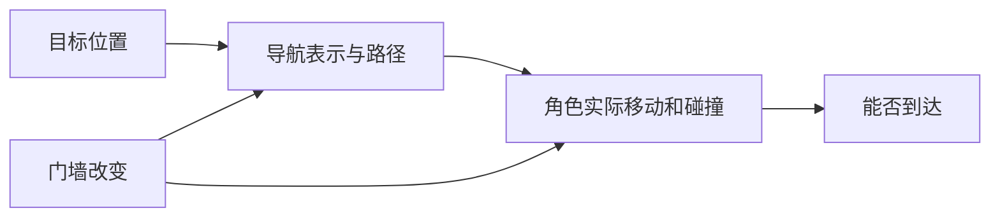

---
{
  "id": "E01",
  "prerequisites": [
    "C09"
  ],
  "revisit": [
    "A04",
    "C09"
  ],
  "memory": [
    "KN23",
    "TH03"
  ],
  "labs": [
    "practice/godot/labs/navigation_lab.tscn"
  ]
}
---
# E01｜导航选修：画得出路径还要走得到

**先从这里开始：** 你的游戏现在真的需要自动找路吗？需要时再到窄门样本试一次：画得出路径的角色，实际走起来会怎样？

**今天做什么：** 判断导航路径与物理通行是否一致。

**从哪里开始：** 保持导航半径，调大真实碰撞球；先猜路径存在是否等于能过窄门。

**现成材料：** [navigation_lab.tscn](../../practice/godot/labs/navigation_lab.tscn)

**材料边界：** 使用真实NavigationServer与碰撞；网格是预制规则生成，非自动烘焙或动态避障系统。

先试当前这一小步。可以说“给我线索”“示范一小步”或“直接解释”；也可以指认、画图或演示，不必长篇回答。可以暂停，不必先答对才求助。

### 开始对话

```text
我在学E01《导航选修：画得出路径还要走得到》，请按这份教案带我自学。
先用“先从这里开始”进入当前任务，一次只推进一小步；等我回应后再展开提示或解释。
我可以查菜单/API、看示范或请AI实现；学到的因果关系要由我说明。
课程里的备用题按需选，不要全部变作业；伙伴分享一次就够了。
```

<details data-audience="reference">
<summary>需要时看：解释、对照与候选练习</summary>

**带学提醒（按当前需要使用）：** 选择暂不需要导航也是合理结果。使用现成实验，只比较导航与物理的一处差异；不把这次观察扩成敌人AI必修。

## 学到这里就够了

**M｜需要会判断和应用：**
- `E01.M1` 选择本项目是否需要导航。
- `E01.M2` 选择后，检查巡逻追踪的实际可达性。

**K｜知道用途，用到再查：**
- `E01.K1` NavMesh、避障、寻路各有不同职责。

**停止线：** 纯机关路线可跳过；不实现A*和复杂敌人AI。

**前置：** [C09](C09.md)

## 必要解释

导航描述可以规划的空间，碰撞负责真实阻挡，两者不自动一致。看见路径线不等于角色能通过。

动态门、角色体积和窄通道都可能让计划与执行不一致。先做简单巡逻或追踪，再考虑战斗。



这是因果／职责示意，不是实际运行截图；不能显示Mermaid时用等价方框图。

## 在现成实验里试

**初始条件：** 平面地图、有墙和一扇门；规划线、实际轨迹两种显示。
**可比较的条件：** 门开/关、通道宽度、角色半径、目标点、重规划。

下面说明要比较的关系；实际从上面的现成文件与首步进入，不为匹配教学控件名重新搭建。

1. 先预测窄通道是否能过。
2. 比较规划线和实际轨迹，改变门状态再测试。
3. 确定纯机关项目是否可以跳过本专题。

**观察：** 标出规划失败/移动受阻而非一律敌人AI坏了；简化2D足够，不强制3D。
**不符时先查：** 故障：导航区域穿墙而物理墙存在；修两者一致性，不删墙。
**恢复：** 恢复地图、半径、门和起终点。

只比较一个条件，恢复后再试下一个。课堂模拟应标清示意，真实软件行为需要实际观察；缺文件如实说明，不让学员临时重造系统。

### 软件入口与亲调

- Godot：导航预览、目标点、角色体积和碰撞。
- 会定位：NavigationRegion3D/NavigationAgent3D。
- 按需查：网格烘焙、避障参数。

|选中哪里／参数|只改什么|看什么|
|---|---|---|
|导航代理/导航网格相关半径（内置入口，核对实际属性）|按角色体积检查窄门可达性|路径是否容得下实体，而不仅看细线|
|巡逻速度（自定义）|只改速度，门宽不变|转角实际运动和卡住现象|

运行中临时改动不等于已保存；要留下设计选择，请在自己的副本中写回场景／资源，保存并重新打开检查。

## 我负责什么，AI帮什么

**我的判断：** 先决定是否需要巡逻对象；选了才比较规划和实体可达性。
**可交给AI：** 准备简单路线与物理形状并排预览，不重写寻路算法。
**检查重点：** 检查AI是否只演示路径可视化、不执行实际移动，或把避障当作物理防穿墙。

结果不符时，先指出预期与实际的一处差别。有解释就试着验证；没有解释可请AI定位入口、给线索或示范。只改可恢复副本，不删需求或测试来掩盖错误。

## 怎样知道这一小步做到了

- 结合本项目机关/巡逻选择明确要不要导航，未选可结束。
- 选导航时在门开闭及窄通道中实走，比较路径线和实体结果。

**恢复后再检查：** 巡逻不会推坏主玩家或改变星星奖励；可完整移除选修对象。

有提示也是学习进展；没有实际观察就不宣称已经验证。一个对照和解释可以覆盖多个要点，不要求填写评分表。

## 候选问题

先自己判断，再按需看反馈。P是预测、D是诊断、T是迁移、K是用途；按本次需要选一题，不要求全部完成。教学情境不是实测日志。

### E01-P1

路径线穿过门能保证走过吗？

### E01-D2

【教学构造情境，不是真实测量或某模型故障统计】已选巡逻路线。路径线穿过门，但实体每次卡在门框；空旷区能正常走。AI建议删除门碰撞。先如何区分导航通道容积与实体宽度不匹配，怎样保留真实门？

### E01-T3

通道变窄后要重新验收什么？

### E01-K4

避障与寻路是否同一件事？

<details>
<summary>可选补充题：替换本次练习，不叠加作业</summary>

### KN23-P｜预测

有路径线却过不去，导航一定坏了吗？

### KN23-T｜迁移

门开关后原路径不再适用，应如何描述期望行为和测试给AI？

</details>

</details>

## 这一课要记在脑海里

- 路径线不是通行证。
- 导航与碰撞要一致。
- 无敌人需求可以跳过。

**记忆清单：** [KN23](../memory.md#kn23) · [TH03](../memory.md#th03)。用到时先想一项；想不起可看例子，再换个条件。不要求逐字背诵。

## 讲给爸爸听

想分享时，可以先展示今天的一处选择、发现或仍没想通的问题，不要求完整讲课。用自己的话讲讲：路径规划、通行条件。

**给他演示：** 做路线顾问：只在确有需要时比较画出的路径与角色真正能走过的路线。

**你们一起问：** 路线图显示可走，但角色过不了窄门，应该检查什么关系？

爸爸还有问题就接着问，你也可以问爸爸。一起看、一起试，不必背稿、打分或填表。爸爸暂时不在就稍后分享，不影响继续自学。

<details data-purpose="project">
<summary>需要改自己的作品时再看</summary>

**生产阶段：** 按需专项

**想得到的结果：** 一个简单巡逻对象与真实可走区域一致；纯机关路线可跳过。
**必须保留：** 主玩家和主线收集循环不动；先在副本验证。

先读取自己的工作副本。以下是可选局部实现，不是打开现成实验的前置，也不要求再做一整轮：

- 先确认选择导航路线；只做一个角色去一个静止目标，不接战斗或复杂行为树。
- 再改变一个门的状态，检查实际可达性和失败时的恢复。

**采用依据：** 路径线与真实移动都能绕过一堵墙。
**换一个场景想想：** 关上一条通道后重新观察路径与实际结果，不只重新画路径线。

参考工程的通过结论不自动覆盖你改过的版本；相关路线实际走一遍，必要时恢复。

</details>

## 下次怎样想起来

前面已学过的复现入口：[A04](A04.md)、[C09](C09.md)。
下次碰到相似问题时，可先回想一项关系，再查需要的解释；想不起就补一个小例子，不重学整课。暂停时愿意就留“下次从哪里接着试”，没有笔记也能继续，API和菜单仍可查。

## 依据

- [Godot CharacterBody3D：速度、落地与移动](https://docs.godotengine.org/en/stable/classes/class_characterbody3d.html)
- [Godot General optimization：测量与取舍](https://docs.godotengine.org/en/stable/tutorials/performance/general_optimization.html)
- [Godot运行检查与可见碰撞工具](https://docs.godotengine.org/en/stable/tutorials/scripting/debug/overview_of_debugging_tools.html)

技术来源支持概念边界；课程顺序与任务是本项目设计，不代表已经证明学习效果。
