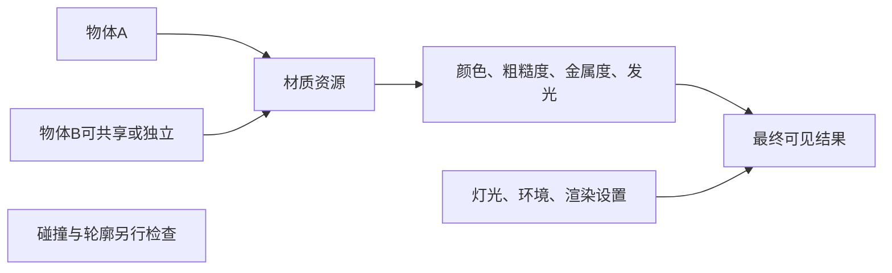

---
{
  "id": "E03",
  "prerequisites": [
    "C08"
  ],
  "revisit": [
    "B04",
    "C08"
  ],
  "memory": [
    "KN27",
    "KN12",
    "KN13",
    "TH03"
  ],
  "labs": [
    "practice/godot/labs/shader_lab.tscn"
  ]
}
---
# E03｜Shader选修：能控制效果，不必重造渲染器

**先从这里开始：** 从现有效果里选一个想用的样子，先比较开与关。若它不能改善当前画面，保留原样也可以，不必为了会Shader而使用它。

**今天做什么：** 定义一个可调卡通明暗或描边效果，并检查边界与成本。

**从哪里开始：** 先保持左侧参考不变，只在右侧启用条纹、边缘强调或风摆一项。

**现成材料：** [shader_lab.tscn](../../practice/godot/labs/shader_lab.tscn)

**材料边界：** 真实空间Shader含关闭与冻结；不是完整Shader效果库或材质自动转换。

先试当前这一小步。可以说“给我线索”“示范一小步”或“直接解释”；也可以指认、画图或演示，不必长篇回答。可以暂停，不必先答对才求助。

### 开始对话

```text
我在学E03《Shader选修：能控制效果，不必重造渲染器》，请按这份教案带我自学。
先用“先从这里开始”进入当前任务，一次只推进一小步；等我回应后再展开提示或解释。
我可以查菜单/API、看示范或请AI实现；学到的因果关系要由我说明。
课程里的备用题按需选，不要全部变作业；伙伴分享一次就够了。
```

<details data-audience="reference">
<summary>需要时看：解释、对照与候选练习</summary>

**带学提醒（按当前需要使用）：** 先让效果可观察且能关闭，再读相关参数。陌生术语按当前一项解释；渲染器不支持不是孩子失败，也不临时加整套渲染课。

## 学到这里就够了

**M｜需要会判断和应用：**
- `E03.M1` 选择一个效果，规定参数、默认值和异常边界。
- `E03.M2` 验收远近、透明、遮挡及目标渲染模式。

**K｜知道用途，用到再查：**
- `E03.K1` Shader、法线和渲染阶段知道对应问题。

**停止线：** 选修；不把Shader写作变成所有学员毕业门槛，不保证Blender节点原样导入。

**前置：** [C08](C08.md)

## 必要解释

卡通明暗分级、描边、手绘贴图不是同一种技术。先明确想改变轮廓、光影还是表面纹理，再决定效果。

AI可写着色器，人要检查参数极值、不同距离和透明交叠；好看的静止样张不代表运动中稳定。



这是因果／职责示意，不是实际运行截图；不能显示Mermaid时用等价方框图。

## 在现成实验里试

**初始条件：** 同一模型普通材质与拟议卡通效果对照；用示意着色而非宣称目标引擎已实现。
**可比较的条件：** 明暗层级2/3/4、描边宽0到3像素示意、观察距离、效果开关。

下面说明要比较的关系；实际从上面的现成文件与首步进入，不为匹配教学控件名重新搭建。

1. 选一种效果并写不可改变的功能。
2. 从近景切到游戏距离，比较识别与闪烁风险。
3. 把参数调到边界并定义合理限制。

**观察：** 标明像素宽或世界宽的定义；效果开关不得改变碰撞。
**不符时先查：** 故障：描边把远处细物体淹没；要求距离和线宽策略，不单纯提高强度。
**恢复：** 恢复普通材质、机位和参数。

只比较一个条件，恢复后再试下一个。课堂模拟应标清示意，真实软件行为需要实际观察；缺文件如实说明，不让学员临时重造系统。

### 软件入口与亲调

- 常用：暴露的效果参数与对照开关。
- 会定位：ShaderMaterial和渲染器支持。
- 按需查：Shader语法、渲染阶段、屏幕纹理。

|选中哪里／参数|只改什么|看什么|
|---|---|---|
|Shader uniform强度/宽度（自定义）|记录正常值，再测试零值和合理边界|遮挡、闪烁及远处是否仍可辨|
|效果开关与同机位预览（项目入口）|做开/关对照后再测运行成本|收益是否值得，不以技术复杂度得分|

运行中临时改动不等于已保存；要留下设计选择，请在自己的副本中写回场景／资源，保存并重新打开检查。

## 我负责什么，AI帮什么

**我的判断：** 只选一个视觉效果，先定单位、正常值与边界及是否值得进入游戏。
**可交给AI：** 实现最小可控Shader并暴露参数，说明目标渲染器限制和测试入口。
**检查重点：** 检查AI是否使用不存在的uniform/API、渲染器不支持的功能或把着色变化说成碰撞变化。

结果不符时，先指出预期与实际的一处差别。有解释就试着验证；没有解释可请AI定位入口、给线索或示范。只改可恢复副本，不删需求或测试来掩盖错误。

## 怎样知道这一小步做到了

- 选择效果并说明参数单位、默认及极值下应怎样表现。
- 近远/运动/遮挡及目标渲染模式实际对照，效果不改碰撞。

**恢复后再检查：** 原星星仍可拾取、辨认，禁用后完整回到基线。

有提示也是学习进展；没有实际观察就不宣称已经验证。一个对照和解释可以覆盖多个要点，不要求填写评分表。

## 候选问题

先自己判断，再按需看反馈。P是预测、D是诊断、T是迁移、K是用途；按本次需要选一题，不要求全部完成。教学情境不是实测日志。

### E03-P1

要做细描边，AI却给了卡通明暗分级。它们都叫卡通能算同一目标吗？你要先指定轮廓还是表面明暗，以及什么观察条件？

### E03-D2

【教学构造情境，不是真实测量或某模型故障统计】描边在近景清楚，远处细路牌变成黑块。AI要将所有纹理升4K。先核对线宽单位与观察距离的什么关系？给一个只改效果参数的最小测试。

### E03-T3

手机渲染模式不支持原效果时怎样取舍？

### E03-K4

Shader到底解决哪类问题？

<details>
<summary>可选补充题：替换本次练习，不叠加作业</summary>

### KN27-P｜预测

草在Shader中摇摆，物理形状必然同步吗？

### KN27-T｜迁移

透明叠层效果变慢，如何用可控实验检验原因？

### K09｜用途

Shader做视觉变化，会自动为物理碰撞生成同样变化吗？

</details>

</details>

## 这一课要记在脑海里

- 先说视觉目标再选技术。
- 效果必须在游戏距离验证。
- AI写代码，人定边界。

**记忆清单：** [KN27](../memory.md#kn27) · [KN12](../memory.md#kn12) · [KN13](../memory.md#kn13) · [TH03](../memory.md#th03)。用到时先想一项；想不起可看例子，再换个条件。不要求逐字背诵。

## 讲给爸爸听

想分享时，可以先展示今天的一处选择、发现或仍没想通的问题，不要求完整讲课。用自己的话讲讲：视觉目标、单效果、可关闭方案。

**给他演示：** 做效果顾问：先说清普通材质为什么不够，再用隔离样例比较一个效果。

**你们一起问：** 新效果很复杂却没有改善目标，是否应该保留？

爸爸还有问题就接着问，你也可以问爸爸。一起看、一起试，不必背稿、打分或填表。爸爸暂时不在就稍后分享，不影响继续自学。

<details data-purpose="project">
<summary>需要改自己的作品时再看</summary>

**生产阶段：** P9

**想得到的结果：** 只保留一种可控风格化效果，能解释参数、限制和是否值得接入。
**必须保留：** 模型轮廓、物理碰撞、拾取逻辑和主项目材质基线保持。

先读取自己的工作副本。以下是可选局部实现，不是打开现成实验的前置，也不要求再做一整轮：

- 先选一个已有需求的Shader效果，让AI只暴露两项左右参数，不重造渲染器。
- 测试极值、不同距离和关闭效果，确认可读性与成本。

**采用依据：** 默认值下效果符合目标且不冒充物理几何变化。
**换一个场景想想：** 换到大石头表面，重新检查是否适用而不全场套同一效果。

参考工程的通过结论不自动覆盖你改过的版本；相关路线实际走一遍，必要时恢复。

</details>

## 下次怎样想起来

前面已学过的复现入口：[B04](B04.md)、[C08](C08.md)。
下次碰到相似问题时，可先回想一项关系，再查需要的解释；想不起就补一个小例子，不重学整课。暂停时愿意就留“下次从哪里接着试”，没有笔记也能继续，API和菜单仍可查。

## 依据

- [Blender glTF 2.0管线参考（4.0文档，具体新版选项另查）](https://docs.blender.org/manual/en/4.0/addons/import_export/scene_gltf2.html)
- [Blender Principled BSDF：当前手册入口](https://docs.blender.org/manual/en/latest/render/shader_nodes/shader/principled.html)
- [Godot General optimization：测量与取舍](https://docs.godotengine.org/en/stable/tutorials/performance/general_optimization.html)
- [Godot运行检查与可见碰撞工具](https://docs.godotengine.org/en/stable/tutorials/scripting/debug/overview_of_debugging_tools.html)

技术来源支持概念边界；课程顺序与任务是本项目设计，不代表已经证明学习效果。
