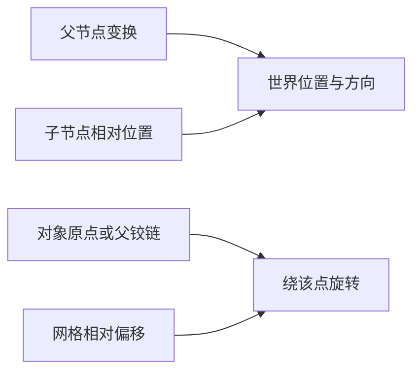

---
{
  "id": "E04",
  "prerequisites": [
    "C06",
    "A07"
  ],
  "revisit": [
    "A07"
  ],
  "memory": [
    "KN28",
    "KN03",
    "TH03"
  ],
  "labs": [
    "practice/godot/scenes/lab.tscn"
  ]
}
---
# E04｜复杂旋转选修：轨迹对，比公式背得熟重要

**今天做什么：** 识别跨角度边界和父级旋转的错误插值。

**从哪里开始：** 先用现有门轴说明预期轨迹，再定义复杂旋转问题。

**现成材料：** [lab.tscn](../../practice/godot/scenes/lab.tscn)

**材料边界：** 基础Lab不能代替复杂旋转专项验证。

先观察或猜一猜，动手试一项，再说说为什么。完全陌生可以先看一个小示范；做完当前小步就可以暂停。

### 开始对话

```text
我在学E04《复杂旋转选修：轨迹对，比公式背得熟重要》，请按这份教案带我自学。
一次只推进一个有意义的小步，先用现成材料，不先替我作判断。
我可以查菜单/API、看示范或请AI实现；学到的因果关系要由我说明。
课程里的备用题按需选，不要全部变作业；伙伴分享一次就够了。
```

<details data-audience="reference">
<summary>需要时看：解释、对照与候选练习</summary>

## 学到这里就够了

**M｜需要会判断和应用：**
- `E04.M1` 规定旋转方向、路径和终态。
- `E04.M2` 检查跨±180度与父级变化下的结果。

**K｜知道用途，用到再查：**
- `E04.K1` Quaternion/Basis是旋转表示工具，API按需查。

**停止线：** 不考展开式、矩阵乘法和插值算法实现。

**前置：** [C06](C06.md)、[A07](A07.md)

## 必要解释

角度数值接近边界时，直接线性插值可能沿意外长路径走。最短路径也不是所有艺术需求：风车可能希望持续同方向转。

先定义期望路径和参考空间，AI再选表示和实现。可视化坐标与轨迹比背公式更能帮助验收。



这是因果／职责示意，不是实际运行截图；不能显示Mermaid时用等价方框图。

## 在现成实验里试

**初始条件：** 箭头姿态从170到-170度；父节点0/90度；固定步长播放。
**可比较的条件：** 直接角度/短路径示意、父转角、持续同向需求、单步播放。

下面说明要比较的关系；实际从上面的现成文件与首步进入，不为匹配教学控件名重新搭建。

1. 先画箭头预期怎么走。
2. 对照长短路径，判断哪个符合给定需求。
3. 改变父级后再测，分别报告本地与世界效果。

**观察：** 每步显示方向与参考轴；不得把所有旋转错误归咎于四元数。
**不符时先查：** 故障：镜头过边界绕大圈；先检查路径约定与表示。
**恢复：** 恢复起点与父变换，清空轨迹。

只比较一个条件，恢复后再试下一个。课堂模拟应标清示意，真实软件行为需要实际观察；缺文件如实说明，不让学员临时重造系统。

### 软件入口与亲调

- 常用：关键姿态、轨迹与播放速度。
- 会定位：旋转模式和父级关系。
- 按需查：slerp、Quaternion和Basis接口。

|选中哪里／参数|只改什么|看什么|
|---|---|---|
|起终旋转与时长（内置/自定义）|先测普通角度，再测边界，单独改变一项|是否绕远路或突然翻转|
|插值方案选择（教学控件）|同端点比较轨迹，注明不是内置通用按钮|轨迹是否符合实际运动目标|

运行中临时改动不等于已保存；要留下设计选择，请在自己的副本中写回场景／资源，保存并重新打开检查。

## 我负责什么，AI帮什么

**我的判断：** 指定持续同向还是短路径、参考空间与终态，不盲目认为最短就是对。
**可交给AI：** 准备逐步轨迹和父级开关，再选择适合表示与接口。
**检查重点：** 检查AI是否混用度/弧度、只验证终点或把Euler某一数值直接当完整姿态。

结果不符：说清预期、实际与复现步骤；先提出一个可推翻的原因，再做最小验证。修改前留基线，不删需求或测试来消除报错。

## 怎样知道这一小步做到了

- 为两个用途说明旋转方向、过程与终态，允许图示而非公式。
- 跨角度边界及父级变化时回放轨迹，核对参照空间。

**恢复后再检查：** 原门轴和镜头逻辑不变；未选此专项不影响主线结业。

有提示也是学习进展；没有实际观察就不宣称已经验证。一个对照和解释可以覆盖多个要点，不要求填写评分表。

## 候选问题

先自己判断，再按需看反馈。P是预测、D是诊断、T是迁移、K是用途；按本次需要选一题，不要求全部完成。教学情境不是实测日志。

### E04-P1

170到-170数值差很大就必须转340度吗？

### E04-D2

【教学构造情境，不是真实测量或某模型故障统计】指示牌170度转到-170度却绕大圈；风车需要连续同向转，AI提议两者都固定用最短路径。你怎样分别描述两个需求，哪些过程证据不能由最终截图替代？

### E04-T3

风车要一直顺转，能总用最短路径吗？

### E04-K4

四元数现在要背吗？

<details>
<summary>可选补充题：替换本次练习，不叠加作业</summary>

### KN28-P｜预测

为什么方向接近的两个朝向也可能沿很长轨迹插值？

### KN28-T｜迁移

修复相机翻转能否只靠随意交换XYZ顺序？应测试哪些边界？

### K10｜用途

复杂朝向插值有问题时，可以查Quaternion吗？这是否要求背展开式？

</details>

</details>

## 这一课要记在脑海里

- 终点对不代表过程对。
- 最短路径也要符合需求。
- 先说明参考空间。

**记忆清单：** [KN28](../memory.md#kn28) · [KN03](../memory.md#kn03) · [TH03](../memory.md#th03)。先遮住解释，用自己的话说，再举例；不是照抄定义。

## 讲给爸爸听

在今天的关键地方或结束时，选一次和爸爸分享。用自己的话讲讲：旋转目标、支点、复杂变换。

**给他演示：** 做旋转顾问：先画出想要的轨迹，再判断基础方法是否已经足够。

**你们一起问：** 能用简单支点解决的问题，为什么不急着引入复杂旋转方案？

爸爸还有问题就接着问，你也可以问爸爸。一起看、一起试，不必背稿、打分或填表。爸爸暂时不在就稍后分享，不影响继续自学。

<details data-purpose="project">
<summary>需要改自己的作品时再看</summary>

**生产阶段：** 按需专项

**想得到的结果：** 能用边界样例验收旋转轨迹，而不用背四元数公式。
**必须保留：** 支点、端点要求和观察机位固定；不把数学推导设为验收门槛。

先读取自己的工作副本。以下是可选局部实现，不是打开现成实验的前置，也不要求再做一整轮：

- 先只提供一组跨角度边界的旋转对照，保留父子关系，不推公式。
- 换父旋转或起终姿态复测，AI实现可查但我要选对验收轨迹。

**采用依据：** 我能从轨迹判断是否走错方向或经过不希望的姿态。
**换一个场景想想：** 把门换成朝目标转动的路牌，用新父级条件验证。

参考工程的通过结论不自动覆盖你改过的版本；相关路线实际走一遍，必要时恢复。

</details>

## 下次怎样想起来

前面已学过的复现入口：[A07](A07.md)。
隔一段时间不看答案，再解释本课的一项关键关系；换一个对象或条件应用。记住词也要会用，API和菜单位置可以查。疑问笔记可选，没有笔记也仍有公共必记清单。

## 依据

- [Godot Node3D：变换与父空间](https://docs.godotengine.org/en/stable/classes/class_node3d.html)
- [Godot AnimationTree：动画组织](https://docs.godotengine.org/en/stable/tutorials/animation/animation_tree.html)
- [Godot运行检查与可见碰撞工具](https://docs.godotengine.org/en/stable/tutorials/scripting/debug/overview_of_debugging_tools.html)

技术来源支持概念边界；课程顺序与任务是本项目设计，不代表已经证明学习效果。
