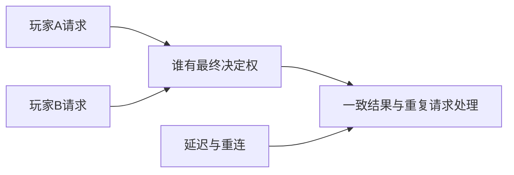

---
{
  "id": "E06",
  "prerequisites": [
    "D07"
  ],
  "revisit": [
    "B06"
  ],
  "memory": [
    "KN31"
  ],
  "labs": []
}
---
# E06｜多人认识专题：先知道为什么会复杂

**今天做什么：** 用事件时间线认识权威、延迟和重连；不开展网络实作。

**从哪里开始：** 只解释联网增加了哪类协调问题，以及本项目是否需要。

**现成材料：** 本课讨论，无需新建工程。

**材料边界：** 全K，只理解用途，不要求实操或背诵。

先观察或猜一猜，动手试一项，再说说为什么。完全陌生可以先看一个小示范；做完当前小步就可以暂停。

### 开始对话

```text
我在学E06《多人认识专题：先知道为什么会复杂》，请按这份教案带我自学。
一次只推进一个有意义的小步，先用现成材料，不先替我作判断。
我可以查菜单/API、看示范或请AI实现；学到的因果关系要由我说明。
课程里的备用题按需选，不要全部变作业；伙伴分享一次就够了。
```

<details data-audience="reference">
<summary>需要时看：解释、对照与候选练习</summary>

## 学到这里就够了

**M：** 无。本课全K选修，只聊用途。

**K｜知道用途，用到再查：**
- `E06.K1` 权威决定谁能确认结果。
- `E06.K2` 延迟、预测、重连会影响不同客户端看到的状态。

**停止线：** 本课为全K选修，不计入单机毕业条件，不要求服务器和同步代码。

**前置：** [D07](D07.md)

## 必要解释

两个人同时拾取同一件物品时，两个屏幕都显示成功不意味着系统可以发两份奖励。需要明确结果由谁确认。

网络消息有延迟和顺序问题，重连还要恢复一致状态。这与本地一次性事件有关，但不能简单复制本地脚本就保证正确。



这是因果／职责示意，不是实际运行截图；不能显示Mermaid时用等价方框图。

## 在现成实验里试

**初始条件：** 客户端A/B与权威节点三条时间线，两个同时拾取请求；数值仅教学示意。
**可比较的条件：** 延迟0/100/300毫秒示意、重复请求、断线重连；没有真实网络连接。

下面说明要比较的关系；实际从上面的现成文件与首步进入，不为匹配教学控件名重新搭建。

1. 观察两人同时请求时可能出现的冲突。
2. 选择谁确认最终结果并说明用途。
3. 回答本项目现在是否需要多人，给出暂缓理由。

**观察：** 只要求用途解释，演示可由老师操控；不考编程和详细故障修复。
**不符时先查：** 反例讨论：每个客户端自行增加奖励会出现什么不一致；不要求排错实操。
**恢复：** 清空消息时间线与最终奖励。

只比较一个条件，恢复后再试下一个。课堂模拟应标清示意，真实软件行为需要实际观察；缺文件如实说明，不让学员临时重造系统。

### 软件入口与亲调

- 无必会实操界面。
- 知道网络调试信息的用途。
- 需要网络项目时再查RPC与网络API。

|选中哪里／参数|只改什么|看什么|
|---|---|---|
|事件卡片排序（讨论材料）|比较两端请求的先后关系|为什么同一星的奖励需要一致判定|

运行中临时改动不等于已保存；要留下设计选择，请在自己的副本中写回场景／资源，保存并重新打开检查。

## 我负责什么，AI帮什么

**我的判断：** 只判断本项目是否需要联网，以及多人结果由谁确认；不实施网络。
**可交给AI：** 给明确标示的两人请求时间线，等待用途解释，不生成服务器代码。
**检查重点：** 检查AI是否承诺低延迟或无冲突而无测试，把K认识课变成部署课程。

结果不符：说清预期、实际与复现步骤；先提出一个可推翻的原因，再做最小验证。修改前留基线，不删需求或测试来消除报错。

## 怎样知道这一小步做到了


**恢复后再检查：** 只确认没有因认识此概念而新增主线实现要求。

有提示也是学习进展；没有实际观察就不宣称已经验证。一个对照和解释可以覆盖多个要点，不要求填写评分表。

## 候选问题

先自己判断，再按需看反馈。P是预测、D是诊断、T是迁移、K是用途；按本次需要选一题，不要求全部完成。教学情境不是实测日志。

### E06-K1

谁应确认同一物品最终归属？

### E06-K2

为什么延迟值得考虑？

### E06-K3

重连为什么不是重新显示画面就够？

### E06-K4

现在做单机收集游戏需要实现这些吗？

<details>
<summary>可选补充题：替换本次练习，不叠加作业</summary>

### KN31-P｜用途讨论（保留旧题号，不要求实现）

两人同时报告拾取，谁决定唯一结果？

### KN31-T｜用途讨论（保留旧题号，不要求实现）

断线重连后重复发请求，为什么需要考虑重复领取？不用写网络代码。

### K11｜用途

两人同时报告拾到同一物体，为什么需要明确谁裁定结果？

</details>

</details>

## 这一课要记在脑海里

- 多人先问谁确认结果。
- 认识风险不等于现在实现。

**记忆清单：** [KN31](../memory.md#kn31)。先遮住解释，用自己的话说，再举例；不是照抄定义。

## 讲给爸爸听

在今天的关键地方或结束时，选一次和爸爸分享。用自己的话讲讲：联网的用途与额外协调。

**给他演示：** 聊一聊：我们的单机庭院目前是否需要联网？说一个用途或不采用的理由即可。

**你们一起问：** 两个人各自看到的收集状态不同，联网系统需要额外协调什么？只说用途，不考实现。

爸爸还有问题就接着问，你也可以问爸爸。一起看、一起试，不必背稿、打分或填表。爸爸暂时不在就稍后分享，不影响继续自学。

全K：没有网络项目和代码任务，不进入强制记忆练习；单机主线不因此受阻。

## 下次怎样想起来

前面已学过的复现入口：[B06](B06.md)。
隔一段时间不看答案，再解释本课的一项关键关系；换一个对象或条件应用。记住词也要会用，API和菜单位置可以查。疑问笔记可选，没有笔记也仍有公共必记清单。

## 依据

- [Godot Resources：共享和引用](https://docs.godotengine.org/en/stable/tutorials/scripting/resources.html)

技术来源支持概念边界；课程顺序与任务是本项目设计，不代表已经证明学习效果。
