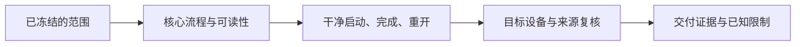

---
{
  "id": "E07",
  "prerequisites": [
    "D07"
  ],
  "revisit": [
    "B12",
    "D07"
  ],
  "memory": [
    "KN20",
    "KN26",
    "KN32",
    "TH03"
  ],
  "labs": []
}
---
# E07｜高级专项结业：一个问题，一份可信决策

**今天做什么：** 只选一个真实专项，提交取舍、证据和回退方式。

**从哪里开始：** 选一个真实专项问题，整理已测、未测和采用理由。

**现成材料：** 本课讨论，无需新建工程。

**材料边界：** 用自己的专项证据，不凭目录存在宣布通过。

先观察或猜一猜，动手试一项，再说说为什么。完全陌生可以先看一个小示范；做完当前小步就可以暂停。

### 开始对话

```text
我在学E07《高级专项结业：一个问题，一份可信决策》，请按这份教案带我自学。
一次只推进一个有意义的小步，先用现成材料，不先替我作判断。
我可以查菜单/API、看示范或请AI实现；学到的因果关系要由我说明。
课程里的备用题按需选，不要全部变作业；伙伴分享一次就够了。
```

<details data-audience="reference">
<summary>需要时看：解释、对照与候选练习</summary>

## 学到这里就够了

**M｜需要会判断和应用：**
- `E07.M1` 定义所选专项的成功条件和不做范围。
- `E07.M2` 用实验证据与回归决定保留或放弃方案。

**K｜知道用途，用到再查：**
- `E07.K1` 未选专项只认识名称，不参加细考。

**停止线：** 没有高级需求可不选；不以会写Shader、联网、流送当通用能力标准。

**前置：** [D07](D07.md)

## 必要解释

高级学习围绕具体限制展开。选择Shader、复杂旋转、性能或大场景其中一个，并补齐该专项前置，不能靠堆功能证明高级。

放弃不合适方案也是有效产出，只要有证据说明成本、限制和替代方向。结业记录应让别人能复现，而非只有漂亮截图。



这是因果／职责示意，不是实际运行截图；不能显示Mermaid时用等价方框图。

## 在现成实验里试

**初始条件：** 四张问题卡与一张无需高级技术卡；每张有目标约束但不提供标准方案。
**可比较的条件：** 选择专项、填写成功条件、比较候选、证据自检。

下面说明要比较的关系；实际从上面的现成文件与首步进入，不为匹配教学控件名重新搭建。

1. 判断是否真的需要高级工具。
2. 选择对应前置课并只验证一个问题。
3. 检查收益、副作用和回退路径，说明保留/放弃原因。

**观察：** 对未选专项不出深题；证据缺失明确标待完成。
**不符时先查：** 故障：选了最多功能的方案却没有目标或测试；退回问题定义。
**恢复：** 恢复问题卡，不清除已留存证据。

只比较一个条件，恢复后再试下一个。课堂模拟应标清示意，真实软件行为需要实际观察；缺文件如实说明，不让学员临时重造系统。

### 软件入口与亲调

- 复用所选专项界面。
- 会定位：版本、测试与回退。
- 按需查：具体实现；不增加工具考试。

|选中哪里／参数|只改什么|看什么|
|---|---|---|
|所选专项的一个关键参数（当前实现）|用已定义的对照范围验证|是否解决原问题而非只改善无关指标|
|保留/撤销决策（设计内容）|根据同条件证据作决定|能否解释成本、限制和回退|

运行中临时改动不等于已保存；要留下设计选择，请在自己的副本中写回场景／资源，保存并重新打开检查。

## 我负责什么，AI帮什么

**我的判断：** 先决定是否值得开展专项，再按成功条件和成本选择保留或放弃。
**可交给AI：** 整理单项方案与真实证据缺口，给回退和可复用部分摘要。
**检查重点：** 检查AI是否把推荐当证据、用其他模型或旧环境的结果替代本项目实测。

结果不符：说清预期、实际与复现步骤；先提出一个可推翻的原因，再做最小验证。修改前留基线，不删需求或测试来消除报错。

## 怎样知道这一小步做到了

- 选一项真实问题，写成功条件、不做范围及所需前置；无需求可不参加。
- 用对应过程/测量与回归决定保留或放弃，保存可复现条件和恢复路径。

**恢复后再检查：** 接入前验证核心循环；不采用也要说明实验如何退出而不污染主项目。

有提示也是学习进展；没有实际观察就不宣称已经验证。一个对照和解释可以覆盖多个要点，不要求填写评分表。

## 候选问题

先自己判断，再按需看反馈。P是预测、D是诊断、T是迁移、K是用途；按本次需要选一题，不要求全部完成。教学情境不是实测日志。

### E07-P1

高级阶段必须四种专项全做吗？

### E07-D2

【教学构造情境，不是真实测量或某模型故障统计】目标是消除跑动时闪烁，AI提交一张无闪烁静态图和更复杂Shader。你如何判断证据缺口？失败时留下什么才有复用价值，而不是继续加功能？

### E07-T3

方案失败后如何留下长期价值？

### E07-K4

没选的技术要考实现吗？

</details>

## 这一课要记在脑海里

- 一个专项解决一个真实问题。
- 证据要匹配目标。
- 放弃方案可以是正确判断。

**记忆清单：** [KN20](../memory.md#kn20) · [KN26](../memory.md#kn26) · [KN32](../memory.md#kn32) · [TH03](../memory.md#th03)。先遮住解释，用自己的话说，再举例；不是照抄定义。

## 讲给爸爸听

在今天的关键地方或结束时，选一次和爸爸分享。用自己的话讲讲：专项问题、证据、采用理由。

**给他演示：** 做专项评审人：展示一个实际问题的解决证据，同时明确没有验证的部分。

**你们一起问：** 方案能演示一次，但无法稳定复现，应该怎样描述它的状态？

爸爸还有问题就接着问，你也可以问爸爸。一起看、一起试，不必背稿、打分或填表。爸爸暂时不在就稍后分享，不影响继续自学。

<details data-purpose="project">
<summary>需要改自己的作品时再看</summary>

**生产阶段：** 按需专项

**想得到的结果：** 一份针对所选问题的方案、实验、取舍和回退记录。
**必须保留：** 其余高级选修保持可跳过；没有专项证据不能伪称掌握。

先读取自己的工作副本。以下是可选局部实现，不是打开现成实验的前置，也不要求再做一整轮：

- 先选一个实际存在且已经试过的专项问题，把未验证部分单列；不增加新技术。
- 换一个约束检查结论是否还成立，决定接回主项目或留在实验中。

**采用依据：** 有一份目标、方案、对照、代价与回退记录，而非只有效果截图。
**换一个场景想想：** 给问题增加一个限制，说明哪些结论需要补测。

参考工程的通过结论不自动覆盖你改过的版本；相关路线实际走一遍，必要时恢复。

</details>

## 下次怎样想起来

前面已学过的复现入口：[B12](B12.md)、[D07](D07.md)。
隔一段时间不看答案，再解释本课的一项关键关系；换一个对象或条件应用。记住词也要会用，API和菜单位置可以查。疑问笔记可选，没有笔记也仍有公共必记清单。

## 依据

- [Godot General optimization：测量与取舍](https://docs.godotengine.org/en/stable/tutorials/performance/general_optimization.html)
- [Godot运行检查与可见碰撞工具](https://docs.godotengine.org/en/stable/tutorials/scripting/debug/overview_of_debugging_tools.html)

技术来源支持概念边界；课程顺序与任务是本项目设计，不代表已经证明学习效果。
