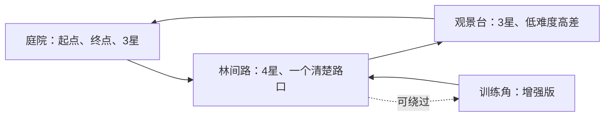

> 固定/有限镜头基线：最终Demo默认不要求玩家持续自由转镜头。每个区域按实际玩家画面验收；头晃、动态FOV、强震屏和运动模糊不是默认需求。美术优先套装拼装与二开，而不是从零重做全部网格。

# 精致Demo：一个小世界，两种清楚的交付范围

版本v6，2026-09-15。这是**目标设计和验收协议，不是已发布游戏的功能表**。项目名暂用「星光小庭院」。不以面积、模型数或效果数量判断精致。

## 1. 基础版与增强版

**基础版**：三段连续小地图、一个可走跑跳的角色、可用第三人称镜头、十颗星、完成/重开、明确路径和统一的温暖卡通视觉；选定一个目标平台交付。

**增强版**：在同一地图旁路增加一个可绕过、可禁用的训练角，复用一段兼容攻击动作；只做一次攻击、命中木桩、反馈和恢复。训练命中不改变星星数、不阻止主线通关。

主地图先保持十颗星。面积以移动节奏决定，不承诺固定平方米带来好体验。具体游玩时长是试学/试玩的结果，不是课程字数决定的指标。

图是原创布局概念，不是引擎截图、精确坐标图或已实现关卡。3/4/3是初稿分布，可在保持总数和可达性的前提下调整。

## 2. 成长阶段与验收门

|阶段|只增加什么|必须留下的证据|禁止顺手增加|
|---|---|---|---|
|P00方向|一页风格卡和目标设备|能指出参考中借鉴/不借鉴的特征|大型世界观、固定艺术家复制配方|
|P01灰盒|庭院地面、墙、低台|整体/外观选择正确、尺度合理|精细场景包|
|P02探索|走跑跳与镜头|墙角、空中输入、镜头方向、恢复|复杂爬楼梯、飞行|
|P03收集|静态资产往返与一次性拾取|正确/错误对象、防重、共享范围|背包和事件总线|
|P04闭环|UI、反馈、完成、重开|最后一颗、静音、完整重开|任务树|
|P05初级精修|基础光色、可靠性与测量|同机位对照、同路线回归|大规模GPU工程|
|P06a扩图|庭院+林路+观景台回路|十颗星实走、回程、路口视线|开放世界和流送|
|P06b美化|先一处样板，再整图一致|三处观察点和一次完整路线|满场灯、装饰堵路|
|P06c交付|正式角色、必要设置/恢复、一个小机制|干净启动、完成重开、目标设备|全平台和云存档|
|P07可选增强|原地攻击与木桩|空挥、命中、原地下一次攻击、取消恢复|连招、伤害体系和敌人AI|

各课以小实验先看清因果，再把选定结果接回已有版本。参考工程不是要求新手第一天读完的作业。新增知识可以改善视觉/可靠性，不必都表现为新系统。

## 3. 什么算精致：六个不能互相替代的维度

|维度|验收方式|不接受的替代|
|---|---|---|
|可玩闭环|从启动收齐十星并重开，过程可复现|只看完成页面截图|
|空间与镜头|主路、回程、低平台实际可达；墙角能观察|只看俯视路线图|
|风格与层级|同色盘/比例/细节规则；目标从背景可辨|每个模型单独都漂亮|
|反馈与舒适|静音仍可辨，提示不遮挡，鼠标可释放|增加强闪烁或抖屏|
|稳定与成本|固定设备/分辨率/路线重复观察；目标由项目先约定|没有设备记录却宣称稳定60FPS|
|资产可靠性|来源、可编辑源、版本、导入/修改影响范围明确|把可购买等同于可再分发|

以问题列表决定最后一轮修整。先修卡住玩家、迷路、无反馈和不可恢复，再调最显眼的视觉偏差，最后才加小细节。不要用更多内容掩盖核心问题。

## 4. 增强版木桩的最小行为表

|动作/情境|期望结果|
|---|---|
|按一次攻击、目标在范围外|动作播放，不记命中|
|准备/恢复阶段接触木桩|不记本轮有效命中|
|有效阶段面对范围内木桩|本次对该目标只记一次|
|一直站在范围内，等恢复后再攻击|新攻击可以再记一次，不要求重新走进区域|
|快速重复按键|遵守本版“恢复前忽略新攻击”的规则，不无限重启片段|
|取消、中断、重开|关闭窗口、清本轮记录，恢复控制，不残留锁定|
|禁用训练角|原十星循环完整通过|

本版初稿为攻击中暂停水平移动和新跳跃、镜头可转；结束和中断必须恢复。若将来改变规则，先更新协议再改代码。动作与事件使用一致时间基准，不能只凭编辑器动画预览判事件通过。

技术依据：[动画方法事件](https://docs.godotengine.org/en/stable/tutorials/animation/animation_track_types.html)、[Area3D](https://docs.godotengine.org/en/stable/classes/class_area3d.html)。具体规则是教学项目设计，不是Godot自动赠送的战斗系统。

## 5. 视觉参考和成品证据怎么准备

先定三处机位：入口第一眼、林路关键路口、观景台回望。每处保留灰盒、AI初稿、人工微调后同条件对照。角色镜头和命中要有短过程或日志，不能只用静图。

课件已有概念/布局结构图；后续真实截图、原创美术对照和动作片段要标来源、版本与状态。没有图不能伪称已拍。大师作品的观看链接不是把原图上传公共仓库的授权。

**参考图使用提示**：在图上指出借鉴的是轮廓、配色还是光感，并说不要复制什么。AI先给局部候选；人选方向，接近目标后手调一项。最终拿玩家机位判断，不以离线渲染图代替游戏效果。

## 6. 每课怎样继续

[索引](lesson-index.md)每课都有「跟AI继续」。首框包含范围、M/K和不能改的部分；后续明确预期观察和下一步。暂停时将进度卡自己保存，换AI也能接续。新课堂/配套尚未验证的状态见[交付进度](delivery-status.md)。
