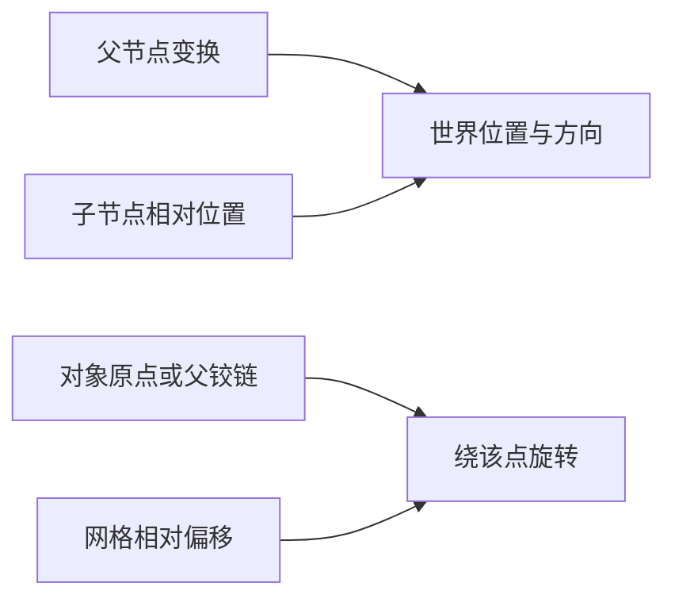

# A-04｜跟AI一步步做：相对谁：父空间、自身方向和门轴

状态：对话脚本已编写，不代表课堂或软件已经执行。

## 0. 开始前：只准备本课需要的东西

**本次起点：** 可选中的父子物体、门板与支点；比较时有同一关闭位置和不变的尺度。
**缺材料时：** 先用课内模拟辨清概念。缺起始场景时仅准备最小搭建清单；不要让新手为了上本课先生成整款游戏，真机应用保持待验证。
**当前配套：** 仓库已有 `game/scenes/lab.tscn`。已有空间/门轴参考；真实导出原点仍另验。

**今天的最小任务：** 预测三个移动方向，并把门的旋转中心改到铰链。
**怎样读：** 先看两项M和概念图，再复制对话1。启动框已带首步、继续条件和结束证据；之后用自己的话回复即可，不必把六框逐一重发。
**怎样停：** 完成当前小步可以暂停，记录下次起点；只有本课两项M都有相应证据才标本课应用通过。暂停不是失败，模拟完成不是软件通过。
**先学再验：** 初次允许AI示范一小步，你再换一个值/对象作选择；需要检查独立判断时换未讲过的变式，不要求从零手写代码。

## 2A. 场景、概念图与逐步AI对话

**实际位置：** P01/P02｜庭院门轴与镜头支点。

|操作前的问题|本课希望得到的结果|
|---|---|
|门绕中心转，或父节点转向后物体朝意外方向移动。|门围绕侧边开合；能区分父相对位置、自身方向、世界方向。|

这是目标对照，不是已完成的游戏截图。概念图为职责/因果示意，不是继承图或完整运行证明。

OpenMAIC不能渲染Mermaid时画等价方框图；无3D或真实连接时仅标课堂模拟，不伪造软件运行。

### 本课人和AI分别负责什么

|责任|这课具体做什么|
|---|---|
|我必须作出的判断|指定参照空间与应固定的门边，不把临时工具Pivot当资产原点。|
|可以交给AI的制作|搭好中心轴和侧轴的同位置门板，并画父子关系；不要求学员推矩阵。|
|我检查AI交付物|看修改对象/前后差异、实际执行记录及未验证项；先核对是否保留本课约束，再决定是否接入。|

**不是手工熟练考试：** 重复劳动与代码可委托；常用可见参数适合亲调时先调一项，无障碍需要可由AI按已选值执行。必须能说明选择、观察和恢复，不要求机械地拖每个滑杆。

**两种模式：** 练习时可问根因、看示范；独立验收时先由我提出选择/假设，AI只协助执行与记录。已透露本题根因或目标值，就记录“有提示”，再换未揭示答案的变式。

### 复制第1框开始；以后每次只发当前一步

**学员用法：** 无需一次读完所有提示。将当前框发给你使用的AI；做完后回“完成＋观察”，结果不符回“不符＋现象”，报错回“报错＋原文”，需要停下回“暂停”。自然语言也可以。不要一口气把六步当成自动执行授权。

### 对话1｜建立本课上下文

```text
请做我这节课的协作教练：A-04（兼容课号B01B）《相对谁：父空间、自身方向和门轴》。
我们逐步制作同一个「星光小庭院」，当前只解决：门绕中心转，或父节点转向后物体朝意外方向移动。
目标：门围绕侧边开合；能区分父相对位置、自身方向、世界方向。
必须掌握：区分父相对位置、物体自身方向和世界方向；保持关闭时门板位置不变，只改变支点比较旋转。理解即可：Origin是对象原点；工具Pivot可临时选择别处，二者不必一致
停止线：不手算旋转矩阵，不讲骨骼绑定；不把Local一词笼统当成所有局部含义。
必须保持：门板大小、关门位置和开门角相同；不引入角色绑定。
本课由我负责：指定参照空间与应固定的门边，不把临时工具Pivot当资产原点。
可以交给你：搭好中心轴和侧轴的同位置门板，并画父子关系；不要求学员推矩阵。
请标明建议/已执行/已验证的区别。练习可提示；验收先等我作判断，已提示根因则如实记有提示。
先读取我已提供的进度和材料，只问真正缺失的一项。需要软件操作时核对实际版本、当前截图或场景树、可访问的工具；不要求我发密钥或整个电脑。
本课入场材料：可选中的父子物体、门板与支点；比较时有同一关闭位置和不变的尺度。
材料不足的处理：先用课内模拟辨清概念。缺起始场景时仅准备最小搭建清单；不要让新手为了上本课先生成整款游戏，真机应用保持待验证。
以下是本课连续推进卡，不是一次性执行授权；收到我的观察后每轮最多推进一个有意义的小步。
首步：先只比较一块门板在中心轴和侧边轴旋转，关闭时门板位置保持一致。
继续条件：我能指出侧边铰链固定在哪里，不用手算矩阵。
随后一步：再引入有朝向的物体和旋转父节点，分别比较世界、父相对与自身方向。
结束证据：在单位缩放、不同父子朝向下分别试世界、父、自身方向，说明区别。；两门关闭时重合，打开后标出铰链边保持不动，并解释原点与工具支点的区别。
相关回归：门框没有移动；原有相机和场景整体变换不受影响。
这些是待执行要求，不是我的已完成进度。不要凭课号推断前置已通过；只复用我已提供的实际材料和证据。
对话1之后我可直接回复完成/不符/报错/暂停，无需重贴整课；你应沿这张推进卡继续，不临时增加系统。
先给一个预测问题并等我回答，再给一个最小步骤。不跳课、不自动做整款游戏。能执行才说已执行，否则给明确操作单或脚本，并标未执行。
后续每轮用四项回应：现在是哪一步；只改什么/怎样恢复；我应观察什么；目前还缺什么证据。没有证据不要替我勾通过。
```

**AI此时应做：** 确认当前场景与学习范围，不直接输出几十个文件。已经提供过的版本、素材和约束应复用，不重复问。

### 对话2｜先理解一个因果关系

```text
先问我：父节点先转90度，子物体有非零偏移，自身又转45度且缩放为1。沿世界、父、自身的+X操作时方向应全相同吗？只用轴箭头预测，不计算坐标。
等我写预测和理由后，再指出一个证据缺口，只给一个提示，不先公布完整答案。用词不专业时先确认意思，再补术语。
```

**转入下一步：** 有自己的预测即可；预测错可以用实验纠正，不要求先背定义。

### 对话3｜AI只完成第一小步

```text
沿用已确认的版本、材料和修改边界。现在只做：先只比较一块门板在中心轴和侧边轴旋转，关闭时门板位置保持一致。
先列影响对象和原值，再提供一个可撤销初稿。没有实际软件连接时给我可执行的局部操作单/脚本，不说已经修改。做完先停下。
```

**预计看到／拿到：** 我能指出侧边铰链固定在哪里，不用手算矩阵。
**不是自动保证：** 这是验收目标，取决于实际模型、工具和输入；结果不同就走下方“不符”分支。

### 对话4｜人观察与亲调，再继续第二小步

```text
这是我刚才的实际结果：我会附一张当前图、短演示或必要日志，并用一句话描述差异。
先检查是否满足：我能指出侧边铰链固定在哪里，不用手算矩阵。
本课可用的微调项：
入口：Godot Node3D父子Transform（内置）；操作：改支点位置，同时调整门板相对位置；观察：关门外观是否不变、开门时铰链侧是否固定
入口：Blender Origin与工具Pivot（概念/入口）；操作：分别确认对象原点与本次操作支点；观察：是否只改变工具操作方式，却没有改变导出后的门轴
若满足，先指导我选择其中一项亲调；我回报观察后才继续：再引入有朝向的物体和旋转父节点，分别比较世界、父相对与自身方向。
一次只动一项可见参数。方向接近就手调；结构有误才给局部修复，不能不断重生成整个场景。
```

|选中哪里与参数性质|这次亲自试什么|观察与停手依据|
|---|---|---|
|Godot Node3D父子Transform（内置）|改支点位置，同时调整门板相对位置|关门外观是否不变、开门时铰链侧是否固定|
|Blender Origin与工具Pivot（概念/入口）|分别确认对象原点与本次操作支点|是否只改变工具操作方式，却没有改变导出后的门轴|

**保存与恢复：** 先记录原值和实际对象。优先在安全副本试；运行中Remote Inspector的变化不要当成已保存的设计值，确认后将选定值写回本地场景/资源或配置并重新运行。菜单路径随版本核对，自定义变量不冒充内置属性。
**采用哪种沟通：** 大方向偏了，用参考图圈出要借鉴的轮廓/色彩/光感，并指出不要照搬什么；单个视觉值接近了，先拖或输入数值；原因不明，固定条件做一次对照。参考图不是可自动反推所有参数的答案。

### 对话5｜成功验收，或失败时只修一处

**达到目标时发送：**
```text
请只根据我提供的证据检查：
- 在单位缩放、不同父子朝向下分别试世界、父、自身方向，说明区别。
- 两门关闭时重合，打开后标出铰链边保持不动，并解释原点与工具支点的区别。
旧功能回归：门框没有移动；原有相机和场景整体变换不受影响。
缺少过程证据就标待验证；不得用一张截图证明走跳或一次性事件。不要新增需求或把所有候选题变成作业。
```

**结果不符或报错时发送：**
```text
不符/报错：我会提供触发步骤、预期、实际现象和必要原始日志。
保留：门板大小、关门位置和开门角相同；不引入角色绑定。
本课优先风险：检查AI是否把Inspector的局部position说成物体自身轴，或把临时Pivot等同导出原点。
先提出一个可推翻的假设和一个最小验证；不要同时改多个系统。若两次验证仍无进展，回到基线并列出缺失证据，不反复抽卡。不要删除测试、关闭需求或扩大权限来假装修好。
```

**AI评分边界：** 代码和初稿可以由AI提供；判断、亲调与证据解释由学员完成。得到根因提示记为有提示，不因此重复考试所有概念。

### 对话6｜存进度，下一次接着做

```text
请总结本课A-04（B01B）的进度卡，不把预测当已完成。
记录：真实软件版本/渲染器；当前场景与变更对象；选定参数和原值；我做的判断；实际证据；通过/待验证；使用过的提示；恢复方法；下一步唯一任务。
只有实际验证才标通过，没有生成或真机执行就明确写模拟/待验证。给我一段可以复制到新AI对话的摘要，不假称你已持久保存。
先核对下一课前置和我的已选路线，未完成就停在当前步骤，不催着扩范围。
```

**学员保存：** 把进度卡存本地或私人笔记；下次粘贴进度卡和下一课第1框。不要公开API Key、账户、本地私密路径或个人录像。

### 当前风险与长期责任

**本课风险检查：** 检查AI是否把Inspector的局部position说成物体自身轴，或把临时Pivot等同导出原点。
这是需要在当前工具版本下核验的风险，不是所有AI必然失败的排行榜，也不预测何时改善。长期保留需求、参考选择、影响范围、结果认可与取舍责任；测量、批量设置和重复验证可以由AI协助。
**不把学习变成额外六次考试：** 六个对话阶段共享本课原有M/K证据；只在薄弱关键能力上追加一处故障或变式。没有实际材料时先做课堂模拟，真机状态单独记录。

下一建议：[B-04](../dialogues/B06.md)。先检查前置；选修未选可以跳过。
