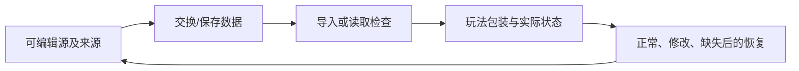

# B05｜跟AI一步步做：资产往返：源文件改了，游戏别被改坏

状态：对话脚本已编写，不代表课堂或软件已经执行。

**学习分组：** B组；**本课编号：** B05；**路线：** 主线。

## 0. 开始前：只准备本课需要的东西

**本次起点：** 可编辑静态源文件、交换文件和当前已有的Godot包装；只验现有尺寸、材质与功能标记，不提前要求拾取和重开。
**缺材料时：** 先用说明卡判断来源、结构和改造范围。缺可编辑源或适用许可时停止导入/修改，不自动购买、下载或替换成不明资源。
**当前配套：** 见0A的真实文件、首步与覆盖边界；文件存在不表示本课所有M已有完整配套。

**今天的最小任务：** 画出静态资产的来源、导出、导入和包装关系，并排查一次重导入问题。
**怎样读：** 先看两项M和概念图，再复制对话1。启动框已带首步、继续条件和结束证据；之后用自己的话回复即可，不必把六框逐一重发。
**怎样停：** 完成当前小步可以暂停，记录下次起点；只有本课两项M都有相应证据才标本课应用通过。暂停不是失败，模拟完成不是软件通过。
**先学再验：** 初次允许AI示范一小步，你再换一个值/对象作选择；需要检查独立判断时换未讲过的变式，不要求从零手写代码。

## 0A. 这课怎样学、怎样查缺口

**学习顺序：** 短示范或预测 → 课堂随练 → 软件概念对照 → 自己解释 → 只补薄弱项。

**实际配套：** [kitbash_style_lab.blend](../../blender/labs/kitbash_style_lab.blend)、[main.tscn](../../game/scenes/main.tscn)

**练习首步：** 在副本中选一个静态部件导出，再接到自己的游戏视觉包装。

**配套局限：** 给出源样本与参考工程；学员GLB往返、原点与功能保持仍须实际做。

**正式项目落点：** P4/P7。实验只为理解；进入相应生产阶段再迁移。

**回忆与检查：** [本课记忆规则](../../print/memory-by-lesson.md#b05) · [单元检查](../../assessments/unit-checkpoints.md) · [AI追问与弱项诊断](../../assessments/ai-diagnostic-review.md)。

**记录分开：** 回忆/解释/软件应用/换情境；没有证据写待验证。菜单/API可查；得到根因提示记有提示。

## 2A. 场景、概念图与逐步AI对话

**实际位置：** P03｜更新静态外观并保留当前包装职责。

|操作前的问题|本课希望得到的结果|
|---|---|
|源模型更新后，碰撞、脚本或手改材质被覆盖。|源资产可反复导出，游戏功能包装稳定保留。|

这是目标对照，不是已完成的游戏截图。概念图为职责/因果示意，不是继承图或完整运行证明。

OpenMAIC不能渲染Mermaid时画等价方框图；无3D或真实连接时仅标课堂模拟，不伪造软件运行。

### 本课人和AI分别负责什么

|责任|这课具体做什么|
|---|---|
|我必须作出的判断|确定可编辑源与导入边界，只验当前已存在的包装和空间职责。|
|可以交给AI的制作|列源文件、交换文件、导入视觉和包装关系，做一次可恢复重导入。|
|我检查AI交付物|看修改对象/前后差异、实际执行记录及未验证项；先核对是否保留本课约束，再决定是否接入。|

**不是手工熟练考试：** 重复劳动与代码可委托；常用可见参数适合亲调时先调一项，无障碍需要可由AI按已选值执行。必须能说明选择、观察和恢复，不要求机械地拖每个滑杆。

**两种模式：** 练习时可问根因、看示范；独立验收时先由我提出选择/假设，AI只协助执行与记录。已透露本题根因或目标值，就记录“有提示”，再换未揭示答案的变式。

### 复制第1框开始；以后每次只发当前一步

**学员用法：** 无需一次读完所有提示。将当前框发给你使用的AI；做完后回“完成＋观察”，结果不符回“不符＋现象”，报错回“报错＋原文”，需要停下回“暂停”。自然语言也可以。不要一口气把六步当成自动执行授权。

### 对话1｜建立本课上下文

```text
请做我这节课的协作教练：B05《资产往返：源文件改了，游戏别被改坏》。
我们逐步制作同一个「星光小庭院」，当前只解决：源模型更新后，碰撞、脚本或手改材质被覆盖。
目标：源资产可反复导出，游戏功能包装稳定保留。
必须掌握：区分源文件、交换文件、引擎导入数据和游戏包装场景；修改静态资产后检查尺寸、材质与功能是否保留。理解即可：UV映射、glTF/GLB是按需理解的资源概念
停止线：不背glTF JSON，不强制复杂UV展开，不处理绑定角色的变换烘焙。
必须保持：已有尺度、包装层、形状与标记保留；未实现的拾取/计数/重开不属于本次验收。
本课由我负责：确定可编辑源与导入边界，只验当前已存在的包装和空间职责。
可以交给你：列源文件、交换文件、导入视觉和包装关系，做一次可恢复重导入。
请标明建议/已执行/已验证的区别。练习可提示；验收先等我作判断，已提示根因则如实记有提示。
概念配套：blender/labs/kitbash_style_lab.blend、game/scenes/main.tscn
练习首步：在副本中选一个静态部件导出，再接到自己的游戏视觉包装。
覆盖边界：给出源样本与参考工程；学员GLB往返、原点与功能保持仍须实际做。
对应生产阶段：P4/P7；达到当前阶段才迁移，不把实验完成当成项目通过。
先复用上述现有样本，不重新生成同一个Lab。练习可提示；检查先只读快照，不一边改答案一边评分。
先读取我已提供的进度和材料，只问真正缺失的一项。需要软件操作时核对实际版本、当前截图或场景树、可访问的工具；不要求我发密钥或整个电脑。
本课入场材料：可编辑静态源文件、交换文件和当前已有的Godot包装；只验现有尺寸、材质与功能标记，不提前要求拾取和重开。
材料不足的处理：先用说明卡判断来源、结构和改造范围。缺可编辑源或适用许可时停止导入/修改，不自动购买、下载或替换成不明资源。
以下是本课连续推进卡，不是一次性执行授权；收到我的观察后每轮最多推进一个有意义的小步。
首步：先列出源模型、交换文件、Godot导入资产和玩法包装各自职责，不马上修改缓存。
继续条件：我知道下一次美术修改应保存在哪里。
随后一步：只改源资产一个外观细节再重导，核对已有包装、形状和标记仍保留；拾取和重开到相应课实现后再测。
结束证据：给出四层来源关系，指出视觉源与游戏包装各自的编辑入口。；修改源颜色/形状并重导入，检查尺寸、材质、已有形状和包装未丢；后面再接拾取回归。
相关回归：重导入前后核对当前已有外观、尺寸、包装和形状；到B06/B08再补拾取/重开回归。
这些是待执行要求，不是我的已完成进度。不要凭课号推断前置已通过；只复用我已提供的实际材料和证据。
对话1之后我可直接回复完成/不符/报错/暂停，无需重贴整课；你应沿这张推进卡继续，不临时增加系统。
先给一个预测问题并等我回答，再给一个最小步骤。不跳课、不自动做整款游戏。能执行才说已执行，否则给明确操作单或脚本，并标未执行。
后续每轮用四项回应：现在是哪一步；只改什么/怎样恢复；我应观察什么；目前还缺什么证据。没有证据不要替我勾通过。
```

**AI此时应做：** 确认当前场景与学习范围，不直接输出几十个文件。已经提供过的版本、素材和约束应复用，不重复问。

### 对话2｜先理解一个因果关系

```text
先问我：只改引擎自动生成数据，下一次重导入一定保留吗？
等我写预测和理由后，再指出一个证据缺口，只给一个提示，不先公布完整答案。用词不专业时先确认意思，再补术语。
```

**转入下一步：** 有自己的预测即可；预测错可以用实验纠正，不要求先背定义。

### 对话3｜AI只完成第一小步

```text
沿用已确认的版本、材料和修改边界。现在只做：先列出源模型、交换文件、Godot导入资产和玩法包装各自职责，不马上修改缓存。
先列影响对象和原值，再提供一个可撤销初稿。没有实际软件连接时给我可执行的局部操作单/脚本，不说已经修改。做完先停下。
```

**预计看到／拿到：** 我知道下一次美术修改应保存在哪里。
**不是自动保证：** 这是验收目标，取决于实际模型、工具和输入；结果不同就走下方“不符”分支。

### 对话4｜人观察与亲调，再继续第二小步

```text
这是我刚才的实际结果：我会附一张当前图、短演示或必要日志，并用一句话描述差异。
先检查是否满足：我知道下一次美术修改应保存在哪里。
本课可用的微调项：
入口：Blender导出所选对象（入口）；操作：核对所选静态对象与尺寸基线；观察：是否误导出整场景或漏掉目标
入口：Godot Import/包装实例（入口）；操作：重导入后核对视觉资源引用和朝向；观察：功能节点是否仍属于包装而非可覆盖缓存
若满足，先指导我选择其中一项亲调；我回报观察后才继续：只改源资产一个外观细节再重导，核对已有包装、形状和标记仍保留；拾取和重开到相应课实现后再测。
一次只动一项可见参数。方向接近就手调；结构有误才给局部修复，不能不断重生成整个场景。
```

|选中哪里与参数性质|这次亲自试什么|观察与停手依据|
|---|---|---|
|Blender导出所选对象（入口）|核对所选静态对象与尺寸基线|是否误导出整场景或漏掉目标|
|Godot Import/包装实例（入口）|重导入后核对视觉资源引用和朝向|功能节点是否仍属于包装而非可覆盖缓存|

**保存与恢复：** 先记录原值和实际对象。优先在安全副本试；运行中Remote Inspector的变化不要当成已保存的设计值，确认后将选定值写回本地场景/资源或配置并重新运行。菜单路径随版本核对，自定义变量不冒充内置属性。
**采用哪种沟通：** 大方向偏了，用参考图圈出要借鉴的轮廓/色彩/光感，并指出不要照搬什么；单个视觉值接近了，先拖或输入数值；原因不明，固定条件做一次对照。参考图不是可自动反推所有参数的答案。

### 对话5｜成功验收，或失败时只修一处

**达到目标时发送：**
```text
请只根据我提供的证据检查：
- 给出四层来源关系，指出视觉源与游戏包装各自的编辑入口。
- 修改源颜色/形状并重导入，检查尺寸、材质、已有形状和包装未丢；后面再接拾取回归。
旧功能回归：重导入前后核对当前已有外观、尺寸、包装和形状；到B06/B08再补拾取/重开回归。
缺少过程证据就标待验证；不得用一张截图证明走跳或一次性事件。不要新增需求或把所有候选题变成作业。
```

**结果不符或报错时发送：**
```text
不符/报错：我会提供触发步骤、预期、实际现象和必要原始日志。
保留：已有尺度、包装层、形状与标记保留；未实现的拾取/计数/重开不属于本次验收。
本课优先风险：检查AI是否在缓存文件上修复，或把不支持的复杂材质当作可原样导出。
先提出一个可推翻的假设和一个最小验证；不要同时改多个系统。若两次验证仍无进展，回到基线并列出缺失证据，不反复抽卡。不要删除测试、关闭需求或扩大权限来假装修好。
```

**AI评分边界：** 代码和初稿可以由AI提供；判断、亲调与证据解释由学员完成。得到根因提示记为有提示，不因此重复考试所有概念。

### 对话6｜存进度，下一次接着做

```text
请总结本课B05（B05）的进度卡，不把预测当已完成。
记录：真实软件版本/渲染器；当前场景与变更对象；选定参数和原值；我做的判断；实际证据；通过/待验证；使用过的提示；恢复方法；下一步唯一任务。
只有实际验证才标通过，没有生成或真机执行就明确写模拟/待验证。给我一段可以复制到新AI对话的摘要，不假称你已持久保存。
先核对下一课前置和我的已选路线，未完成就停在当前步骤，不催着扩范围。
```

**学员保存：** 把进度卡存本地或私人笔记；下次粘贴进度卡和下一课第1框。不要公开API Key、账户、本地私密路径或个人录像。

### 当前风险与长期责任

**本课风险检查：** 检查AI是否在缓存文件上修复，或把不支持的复杂材质当作可原样导出。
这是需要在当前工具版本下核验的风险，不是所有AI必然失败的排行榜，也不预测何时改善。长期保留需求、参考选择、影响范围、结果认可与取舍责任；测量、批量设置和重复验证可以由AI协助。
**不把学习变成额外六次考试：** 六个对话阶段共享本课原有M/K证据；只在薄弱关键能力上追加一处故障或变式。没有实际材料时先做课堂模拟，真机状态单独记录。

下一建议：[B06](../dialogues/B06.md)。先检查前置；选修未选可以跳过。
