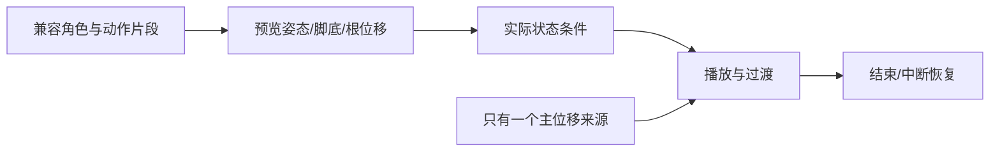

# C03｜跟AI一步步做：接入现成角色：会选、会替换、会验收

状态：对话脚本已编写，不代表课堂或软件已经执行。

**学习分组：** C组；**本课编号：** C03；**路线：** 主线。

## 0. 开始前：只准备本课需要的东西

**本次起点：** 直接打开：game/labs/animation_lab.tscn、blender/labs/animation_fixture.blend、game/scenes/main.tscn
**缺材料时：** 先用说明卡判断来源、结构和改造范围。缺可编辑源或适用许可时停止导入/修改，不自动购买、下载或替换成不明资源。
**当前配套：** 见0A的真实文件、首步与覆盖边界；文件存在不表示本课所有M已有完整配套。

**今天的最小任务：** 判断两份角色资产哪份更适合当前原型，并制定替换验收单。
**怎样读：** 先看两项M和概念图，再复制对话1。启动框已带首步、继续条件和结束证据；之后用自己的话回复即可，不必把六框逐一重发。
**怎样停：** 完成当前小步可以暂停，记录下次起点；只有本课两项M都有相应证据才标本课应用通过。暂停不是失败，模拟完成不是软件通过。
**先学再验：** 初次允许AI示范一小步，你再换一个值/对象作选择；需要检查独立判断时换未讲过的变式，不要求从零手写代码。

## 0A. 这课怎样学、怎样查缺口

**学习顺序：** 短示范或预测 → 课堂随练 → 软件概念对照 → 自己解释 → 只补薄弱项。

**实际配套：** [animation_lab.tscn](../../game/labs/animation_lab.tscn)、[animation_fixture.blend](../../blender/labs/animation_fixture.blend)、[main.tscn](../../game/scenes/main.tscn)

**练习首步：** 先打开原创动作样本查看骨架、蒙皮、三段片段，再比较角色大小与控制器职责。

**配套局限：** 原创教学角色与实际动画现成可用；不是正式美术选型或通用骨架兼容保证，替换自己的角色还需验证。

**正式项目落点：** P4/P10。实验只为理解；进入相应生产阶段再迁移。

**打开方式与分工：** [现成实验入口](../../LABS-START.md)。Godot打开当前场景按F6；Blender直接打开已有文件，先另存副本。默认先体验，不为上课重新搭建。

**回忆与检查：** [本课记忆规则](../../print/memory-by-lesson.md#c03) · [单元检查](../../assessments/unit-checkpoints.md) · [AI追问与弱项诊断](../../assessments/ai-diagnostic-review.md)。

**记录分开：** 回忆/解释/软件应用/换情境；没有证据写待验证。菜单/API可查；得到根因提示记有提示。

## 2A. 场景、概念图与逐步AI对话

**实际位置：** P06｜把胶囊外观换成现成角色。

|操作前的问题|本课希望得到的结果|
|---|---|
|角色看起来站好了，但比例、前向或骨架与控制器不匹配。|新角色可用，原碰撞和控制保持；不合适资源有明确淘汰理由。|

这是目标对照，不是已完成的游戏截图。概念图为职责/因果示意，不是继承图或完整运行证明。

OpenMAIC不能渲染Mermaid时画等价方框图；无3D或真实连接时仅标课堂模拟，不伪造软件运行。

### 本课人和AI分别负责什么

|责任|这课具体做什么|
|---|---|
|我必须作出的判断|按用途、许可、兼容和修复成本选角色，决定哪些视觉变化可接受。|
|可以交给AI的制作|列包内容和兼容风险，先接入一段已授权动画，只改视觉包装。|
|我检查AI交付物|看修改对象/前后差异、实际执行记录及未验证项；先核对是否保留本课约束，再决定是否接入。|

**不是手工熟练考试：** 重复劳动与代码可委托；常用可见参数适合亲调时先调一项，无障碍需要可由AI按已选值执行。必须能说明选择、观察和恢复，不要求机械地拖每个滑杆。

**两种模式：** 练习时可问根因、看示范；独立验收时先由我提出选择/假设，AI只协助执行与记录。已透露本题根因或目标值，就记录“有提示”，再换未揭示答案的变式。

### 复制第1框开始；以后每次只发当前一步

**学员用法：** 无需一次读完所有提示。将当前框发给你使用的AI；做完后回“完成＋观察”，结果不符回“不符＋现象”，报错回“报错＋原文”，需要停下回“暂停”。自然语言也可以。不要一口气把六步当成自动执行授权。

### 对话1｜建立本课上下文

```text
请做我这节课的协作教练：C03《接入现成角色：会选、会替换、会验收》。
我们逐步制作同一个「星光小庭院」，当前只解决：角色看起来站好了，但比例、前向或骨架与控制器不匹配。
目标：新角色可用，原碰撞和控制保持；不合适资源有明确淘汰理由。
必须掌握：核对比例、朝向、骨骼与动作兼容，选择可用资产；替换视觉角色而保持控制与碰撞职责。理解即可：Armature/Skeleton、Skin/Weights分别是骨架、蒙皮与影响权重
停止线：不从零绑定和全面刷权重；复杂坏资产允许合理弃用。
必须保持：角色控制根、碰撞形状、相机和原输入保持；不要求手工重绑。
本课由我负责：按用途、许可、兼容和修复成本选角色，决定哪些视觉变化可接受。
可以交给你：列包内容和兼容风险，先接入一段已授权动画，只改视觉包装。
请标明建议/已执行/已验证的区别。练习可提示；验收先等我作判断，已提示根因则如实记有提示。
概念配套：game/labs/animation_lab.tscn、blender/labs/animation_fixture.blend、game/scenes/main.tscn
练习首步：先打开原创动作样本查看骨架、蒙皮、三段片段，再比较角色大小与控制器职责。
覆盖边界：原创教学角色与实际动画现成可用；不是正式美术选型或通用骨架兼容保证，替换自己的角色还需验证。
对应生产阶段：P4/P10；达到当前阶段才迁移，不把实验完成当成项目通过。
默认先用现成实验体验；下方连接/实现任务属于之后的项目迁移，不作为打开本实验的前置。OpenMAIC已提供同等概念证据时不重复刷题，但真实资源/物理/导出等软件证据不可由模拟代替。
先复用上述现有样本，不重新生成同一个Lab。练习可提示；检查先只读快照，不一边改答案一边评分。
先读取我已提供的进度和材料，只问真正缺失的一项。需要软件操作时核对实际版本、当前截图或场景树、可访问的工具；不要求我发密钥或整个电脑。
本课入场材料：直接使用：game/labs/animation_lab.tscn、blender/labs/animation_fixture.blend、game/scenes/main.tscn
材料不足的处理：没有真实文件就说明缺失；先作明示模拟，不布置重建工程作业。
当前目的：体验模式。只有明确说我要改自己的作品，才切换到作品模式。
以下是本课连续推进卡，不是一次性执行授权；收到我的观察后每轮最多推进一个有意义的小步。
首步：先打开原创动作样本查看骨架、蒙皮、三段片段，再比较角色大小与控制器职责。
继续条件：先作预测，再提供一项实际对照和解释；未覆盖的能力留待验证。
随后一步：在现成材料覆盖范围内选择一个参数或条件作变式，再恢复；不为了凑题重造系统。
结束证据：比较两份资产的比例、朝向、骨架和最小片段，说明选择或淘汰理由。；校准视觉脚底与前向，原控制/碰撞/镜头及拾取保持。
相关回归：原走跑跳与拾取路径继续通过；材质替换不改变奖励逻辑。
这些是待执行要求，不是我的已完成进度。不要凭课号推断前置已通过；只复用我已提供的实际材料和证据。
对话1之后我可直接回复完成/不符/报错/暂停，无需重贴整课；你应沿这张推进卡继续，不临时增加系统。
先给一个预测问题并等我回答，再给一个最小步骤。不跳课、不自动做整款游戏。能执行才说已执行，否则给明确操作单或脚本，并标未执行。
后续每轮用四项回应：现在是哪一步；只改什么/怎样恢复；我应观察什么；目前还缺什么证据。没有证据不要替我勾通过。
```

**AI此时应做：** 确认默认体验模式和现成文件；不要先输出脚本或建场景。已经提供过的版本、素材和约束应复用，不重复问。

### 对话2｜先理解一个因果关系

```text
先问我：一个漂亮模型没有骨架，是否一定更适合先做走路角色？
等我写预测和理由后，再指出一个证据缺口，只给一个提示，不先公布完整答案。用词不专业时先确认意思，再补术语。
```

**转入下一步：** 有自己的预测即可；预测错可以用实验纠正，不要求先背定义。

### 对话3｜在现成材料里完成第一项对照

```text
沿用已确认的版本、材料和修改边界。现在只做：先打开原创动作样本查看骨架、蒙皮、三段片段，再比较角色大小与控制器职责。
只找现成控件并记录原值，不创建节点、不写初始化脚本；缺文件就说明缺失，不让学员临时搭场景。软件执行必须有实际观察。做完先停下。
```

**预计看到／拿到：** 先作预测，再提供一项实际对照和解释；未覆盖的能力留待验证。
**不是自动保证：** 这是验收目标，取决于实际模型、工具和输入；结果不同就走下方“不符”分支。

### 对话4｜观察与亲调，不追加一轮搭建

```text
这是我刚才的实际结果：我会附一张当前图、短演示或必要日志，并用一句话描述差异。
先检查是否满足：先作预测，再提供一项实际对照和解释；未覆盖的能力留待验证。
本课可用的微调项（引擎属性供定位；体验先用现成控件，不为匹配表格重建场景）：
入口：视觉包装Node3D Transform（内置）；操作：只在独立视觉包装校准位置/朝向与比例；观察：脚是否落地、脸是否朝向运动；不缩放物理根来救外观
入口：Godot动画列表/预览（入口）；操作：先只播放一段待机；观察：骨架是否变形、是否异常位移
若满足，先指导我选择其中一项亲调；我回报观察后才继续：在现成材料覆盖范围内选择一个参数或条件作变式，再恢复；不为了凑题重造系统。
一次只动一项可见参数。方向接近就手调；结构有误才给局部修复，不能不断重生成整个场景。
```

|选中哪里与参数性质|这次亲自试什么|观察与停手依据|
|---|---|---|
|视觉包装Node3D Transform（内置）|只在独立视觉包装校准位置/朝向与比例|脚是否落地、脸是否朝向运动；不缩放物理根来救外观|
|Godot动画列表/预览（入口）|先只播放一段待机|骨架是否变形、是否异常位移|

**保存与恢复：** 先记录原值和实际对象。优先在安全副本试；运行中Remote Inspector的变化不要当成已保存的设计值，确认后将选定值写回本地场景/资源或配置并重新运行。菜单路径随版本核对，自定义变量不冒充内置属性。
**采用哪种沟通：** 大方向偏了，用参考图圈出要借鉴的轮廓/色彩/光感，并指出不要照搬什么；单个视觉值接近了，先拖或输入数值；原因不明，固定条件做一次对照。参考图不是可自动反推所有参数的答案。

### 对话5｜成功验收，或失败时只修一处

**达到目标时发送：**
```text
请只根据我提供的证据检查：
- 比较两份资产的比例、朝向、骨架和最小片段，说明选择或淘汰理由。
- 校准视觉脚底与前向，原控制/碰撞/镜头及拾取保持。
旧功能回归：原走跑跳与拾取路径继续通过；材质替换不改变奖励逻辑。
缺少过程证据就标待验证；不得用一张截图证明走跳或一次性事件。不要新增需求或把所有候选题变成作业。
```

**结果不符或报错时发送：**
```text
不符/报错：我会提供触发步骤、预期、实际现象和必要原始日志。
保留：角色控制根、碰撞形状、相机和原输入保持；不要求手工重绑。
本课优先风险：检查AI是否缩放整个控制器、修改绑定姿态或把缺失动画误报为兼容。
先提出一个可推翻的假设和一个最小验证；不要同时改多个系统。若两次验证仍无进展，回到基线并列出缺失证据，不反复抽卡。不要删除测试、关闭需求或扩大权限来假装修好。
```

**AI评分边界：** 代码和初稿可以由AI提供；判断、亲调与证据解释由学员完成。得到根因提示记为有提示，不因此重复考试所有概念。

### 对话6｜存进度，下一次接着做

```text
请总结本课C03（C03）的进度卡，不把预测当已完成。
记录：真实软件版本/渲染器；当前场景与变更对象；选定参数和原值；我做的判断；实际证据；通过/待验证；使用过的提示；恢复方法；下一步唯一任务。
只有实际验证才标通过，没有生成或真机执行就明确写模拟/待验证。给我一段可以复制到新AI对话的摘要，不假称你已持久保存。
先核对下一课前置和我的已选路线，未完成就停在当前步骤，不催着扩范围。
```

**学员保存：** 把进度卡存本地或私人笔记；下次粘贴进度卡和下一课第1框。不要公开API Key、账户、本地私密路径或个人录像。

<details data-purpose="project">
<summary>作品模式：明确要改自己的工作副本时才展开</summary>

当前默认是体验模式，以下任务不自动执行。只有学员明确说“我要改自己的作品”，并提供工作副本与本次验收，才一次选一项。不要复制第二套作业。

**作品实现候选一：** 先核对一个角色资源的来源、尺度和动画兼容，只在副本替换Visual，不动控制器。

**作品实现候选二：** 预览待机和走路，检查脚底/比例/朝向；复杂坏资产允许更换。

先核对已有对象；能局部修改就不重新创建。实现可交给AI，目标、保持项和验收由学员提出。

</details>


### 当前风险与长期责任

**本课风险检查：** 检查AI是否缩放整个控制器、修改绑定姿态或把缺失动画误报为兼容。
这是需要在当前工具版本下核验的风险，不是所有AI必然失败的排行榜，也不预测何时改善。长期保留需求、参考选择、影响范围、结果认可与取舍责任；测量、批量设置和重复验证可以由AI协助。
**不把学习变成额外六次考试：** 六个对话阶段共享本课原有M/K证据；只在薄弱关键能力上追加一处故障或变式。没有实际材料时先做课堂模拟，真机状态单独记录。

下一建议：[C04](../dialogues/C04.md)。先检查前置；选修未选可以跳过。
